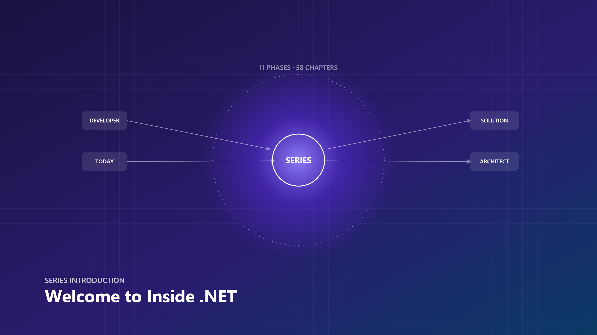
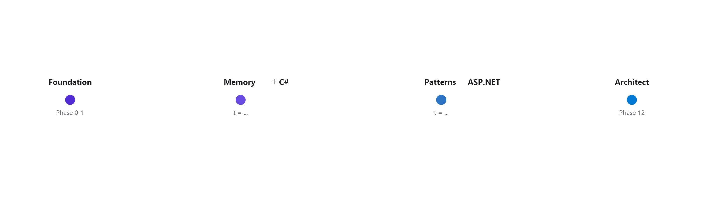
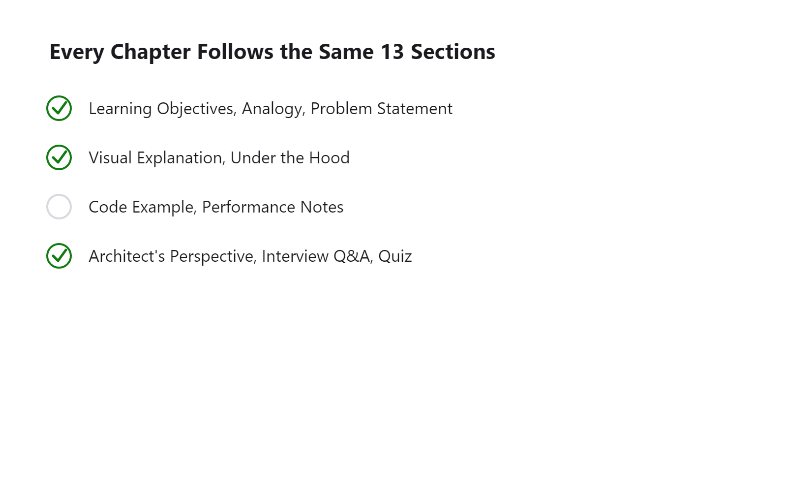

# Inside .NET — Episode 0
## Welcome to Inside .NET

> *Understanding What Really Happens Under the Hood*

*Cover and hero images exported via `scripts/Svg2Png` from `diagrams/svg/000-cover.svg` and `diagrams/svg/000-hero.svg`.*

---

### Learning Objectives

By the end of this chapter, you will be able to:

- Explain the difference between *using* .NET and *understanding* .NET, and why that gap matters in production.
- Describe the eleven-part structure this series follows and where any given topic (memory, DI, EF Core, architecture) sits in that progression.
- Recognize the 13-section template every chapter uses, so you know where to find any given kind of content without re-reading the whole chapter.
- Identify at least two production failure modes (memory leaks, DI misconfiguration, thread-pool starvation) that "internals knowledge" directly prevents.
- Decide, for your own role and current priorities, when investing time in runtime internals pays off and when it doesn't.

---

### Real-world Analogy

Think about driving a car. Millions of people can operate one skillfully — accelerate, brake, merge, park — without knowing what a camshaft does. That's fine, until the car behaves unexpectedly: it stutters on a hill, overheats in traffic, or refuses to start in the cold. At that point, "I know how to drive" isn't enough. You need to understand what's happening between the pedal and the wheels.

.NET developers are in the same position. You know how to *drive* the framework — write the controller, wire up the DI container, call `SaveChangesAsync`. This series is about the engine: the CLR, the GC, the thread pool, the JIT — the machinery that turns your C# into a running, scaling, occasionally misbehaving production system.

The analogy holds up under pressure, too. A driver who understands the engine doesn't necessarily become a mechanic — but they know *when* to pull over, *what* a warning light means, and *which* symptoms are cosmetic versus which ones will strand them on the highway. That's exactly the judgment this series is trying to build for .NET: not turning every reader into a CLR contributor, but giving every reader the diagnostic instinct that comes from knowing what's under the hood.

---

### Problem Statement

Most .NET content falls into one of two camps:

- **Tutorials** — "here's how to build a Todo API" — that teach you *what to type* but not *why it works*.
- **Official docs** — technically accurate, but written as reference material, not as a learning journey with a narrative arc.

What's missing is the middle layer: a structured, visual, progressively-building explanation of the *internals* — the CLR, memory, concurrency, and the architectural patterns built on top of them — connected back to real production code and real interview questions.

This is also **why** this series exists at all (the first of the eight questions every chapter in this series answers): without that middle layer, developers hit a ceiling. They can ship features reliably but can't explain *why* a service leaks memory in production at 2 AM, why a "simple" DI misconfiguration causes a shared `DbContext` to corrupt data across concurrent requests, or why a hot path GCs itself into double-digit latency. Closing that gap — not by teaching syntax, but by opening the hood — is the problem this series exists to solve.

---

### Visual Explanation

This chapter is the series' roadmap, not a technical deep-dive, so its visuals are about the journey rather than a runtime mechanism.

The table below is the same idea in text: the shape of the whole series at a glance.

| Part | Focus |
|---|---|
| I — The Foundation | CLR, compilation pipeline, assemblies, application startup |
| II — Memory | Stack, heap, GC, boxing, LOH, memory leaks |
| III — C# & Clean Code | OOP fundamentals, SOLID, DRY/KISS/YAGNI |
| IV — Design Patterns | Creational, structural, behavioral, repository/UoW |
| V — Dependency Injection | Lifetimes, container internals, common mistakes |
| VI — ASP.NET Core | Request pipeline, middleware, routing, filters |
| VII — Concurrency | Threads, tasks, async/await, sync context |
| VIII — Entity Framework Core | DbContext lifecycle, change tracking, LINQ, performance |
| IX — Architecture | Clean/Onion/Hexagonal, CQRS, DDD, microservices |
| X — Cloud & Production | Containers, observability, caching, messaging, security |
| XI — Becoming an Architect | Scalability, HA, system design, case studies |

The full, evolving Table of Contents lives in [`book.json`](../../book.json) at the repository root. Starting with [Episode 2](../001-execution-flow/article.md), every chapter's Visual Explanation section carries 3–5 original Mermaid/SVG diagrams per [IMAGE_GUIDE.md](../../IMAGE_GUIDE.md) — this chapter is the deliberate exception, since a diagram of "a table of contents" would add nothing a table doesn't already say more clearly.

---

### Under the Hood

Even this introduction sits on a real technical foundation — this is the **what happens internally** question, answered at the altitude appropriate for a roadmap chapter rather than a specific API.

Everything in this series ultimately traces back to one execution model: your C# is compiled to Intermediate Language (IL), the Common Language Runtime (CLR) loads and JIT-compiles that IL to native code, and the runtime's services — garbage collection, exception handling, security, threading — operate underneath it for the lifetime of the process. That single model is the trunk every later chapter's branch grows from:

- Memory chapters (Part II) go deeper into *where* the GC puts your objects and *when* it reclaims them.
- Concurrency chapters (Part VII) go deeper into *how* the CLR schedules your `async` continuations onto the thread pool.
- EF Core and ASP.NET Core chapters go deeper into *how frameworks built on the CLR* make their own internal trade-offs, using the same mechanics.

[Episode 2](../001-execution-flow/article.md) opens that execution model up in full, end to end, from `dotnet run` to your first line of code executing. Every later topic in this series is a more detailed view of some piece of that same diagram — which is also why the series is ordered the way it is: Foundation has to come first, because it's the thing everything else is a detail of.

---

### Code Example

This chapter has no code sample — it's the series roadmap, and forcing a toy snippet in here just to satisfy a template would violate this project's own [STYLE_GUIDE.md](../../STYLE_GUIDE.md) rule against "toy shortcuts that wouldn't survive code review." [Episode 2](../001-execution-flow/article.md) is where the four-tier code progression (Example → Advanced → Performance → Production) begins, once there's an actual runtime mechanism to demonstrate.

---

### Performance Notes

Not applicable to this chapter directly — there is no mechanism here to benchmark. What *is* relevant, and worth stating explicitly, is a series-wide policy: performance isn't bolted on as a single late chapter — it's a lens applied to every chapter from here forward. When the series covers GC (Part II), it measures allocation pressure. When it covers async/await (Part VII), it measures thread-pool starvation. When it covers EF Core (Part VIII), it measures query plans and N+1s. Understanding *why* a mechanism behaves the way it does is what makes "how to make it fast" make sense instead of being a checklist copied from a blog post.

---

### Common Mistakes / Anti-Patterns

This series exists specifically to prevent a recurring set of mistakes — patterns that show up in real code review, not textbook trivia:

- **Treating framework behavior as "magic"** instead of a set of documented, learnable mechanics. "It just works" is fine until it doesn't, and then you have no mental model to debug from.
- **Learning a design pattern's *name* without learning the failure mode it prevents.** Knowing you *can* apply Repository or CQRS isn't the same as knowing *when the underlying problem those patterns solve actually exists* in your system.
- **Copying architecture patterns** (CQRS, Clean Architecture, microservices) without understanding the cost they trade against the problem they solve — the classic "we adopted microservices and now we have a distributed monolith with extra latency."
- **Debugging production incidents** — memory leaks, thread-pool starvation, N+1 queries — without a mental model of *why* they happen, which turns every incident into trial-and-error instead of targeted diagnosis.

---

### Architect's Perspective

**Developer Perspective**

This is where the **How?** question — how do you use this correctly, day to day — gets a concrete answer for a chapter that has no API surface: read the series in order, at least through Part I and Part II, and treat every chapter's Interview Questions and Quiz as a checkpoint, not an optional extra. Skipping straight to "Architecture" or "Design Patterns" because that's what your current ticket touches will leave you pattern-matching on vocabulary instead of understanding mechanism — you'll know CQRS separates reads from writes without knowing *why* that separation ever pays for its complexity. Treat Foundation and Memory as load-bearing, not optional.

**Senior Perspective**

This is where the "when should I / when shouldn't I" trade-off (two more of the eight questions) actually lives. Investing time in runtime internals pays off when you're the person a team turns to during an incident, when you're reviewing designs before they ship, or when you're mentoring developers who keep hitting the same class of bug. It pays off *less* when you're deep in a deadline-driven feature sprint and the immediate need is "make this ticket work," not "understand the CLR's GC generations." A senior engineer's judgment call is knowing which mode you're in — and not pretending the second mode is the first just because internals knowledge feels more prestigious.

**Architect Perspective**

At the architect altitude, this series' internals-first approach mirrors how Microsoft itself organizes its own runtime engineering: the `dotnet/runtime` repository separates the CLR, the GC, the JIT, and the BCL into distinct, independently-evolving components with their own design documents and performance budgets — because at that scale, an architectural decision in one layer (e.g., how the GC scans stacks) has measurable consequences several layers up (e.g., server GC vs. workstation GC changing container sizing decisions). The same discipline applies to *your* systems: a decision made at the Foundation/Memory level (how objects are allocated, how DI lifetimes are scoped) propagates all the way up to how the system scales under load, how new team members onboard, and how expensive a future migration will be. An architect's job is to see that propagation before it becomes an incident report — which is the whole reason this series is structured bottom-up instead of starting at "system design."

---

### Interview Questions

**Q1: What's the difference between knowing how to use a framework and understanding it internally? Give an example of when that difference matters in production.**
A: Using a framework means knowing its API surface — how to call it correctly. Understanding it internally means knowing *why* it behaves the way it does under load, failure, or edge cases. Example: a developer who knows DI syntax can register a `DbContext` as a singleton and have it compile and even work in dev. A developer who understands the DI container's lifetime model knows that's a production-breaking mistake because `DbContext` is not thread-safe and a singleton is shared across concurrent requests.

**Q2: Why do senior engineering interviews frequently ask about GC, the CLR, or thread pool internals instead of just asking candidates to write code?**
A: Because writing correct code under a spec is a mid-level skill; diagnosing *why* correct-looking code misbehaves in production (memory growth, latency spikes, deadlocks) requires a mental model of the runtime. Interviewers use these questions as a proxy for "can this person operate independently when something goes wrong in a system they didn't build."

**Q3: How would you explain the value of "internals knowledge" to a junior developer who just wants to ship features?**
A: Frame it as leverage, not homework: understanding the runtime doesn't slow feature delivery, it shortens debugging time, prevents entire classes of production incidents, and is exactly what separates a developer who ships features from an architect who's trusted to make system-level decisions.

**Q4: This series is ordered Foundation → Memory → C# → Patterns → DI → ASP.NET Core → Concurrency → EF Core → Architecture → Cloud → Architect. Why that order, and not, say, Architecture first?**
A: Because every later part is a more detailed view of a mechanism introduced earlier — DI lifetimes only make sense once you understand object allocation and the GC; ASP.NET Core's request pipeline only makes sense once you understand the thread pool. Starting with Architecture would mean naming patterns without the mechanical vocabulary to explain *why* they work, which produces exactly the "knows the term, not the mechanism" gap this series is designed to close.

**Q5: How would you decide, as a team lead, whether it's worth having your team invest time in this kind of internals-focused learning versus just continuing to ship features?**
A: Look at the incident and code-review history: if the same classes of bugs (memory growth, N+1 queries, DI lifetime mistakes) keep recurring, that's a signal the team is missing a shared mental model, not just making one-off mistakes — and structured internals learning is a better fix than repeatedly patching symptoms. If the team's actual failure mode is delivery speed rather than production quality, that's a different problem this kind of investment won't solve.

**Q6: Microsoft ships `dotnet/runtime` as an open-source project with its own architecture. How does knowing that change how you approach an unfamiliar .NET behavior in production?**
A: It turns "the framework is doing something weird" into a debuggable problem instead of a mystery — you can go read the actual GC, JIT, or BCL source and its design notes instead of guessing from blog posts. That habit (checking the source, not just the docs, when something doesn't behave as expected) is one of the concrete practices this series tries to instill from Episode 2 onward.

---

### Quiz

This chapter's self-check quiz lives in [`quiz.md`](quiz.md) — five questions with collapsible answers, covering the series structure, the chapter template, and this chapter's own internals content.

---

### Summary & Next Chapter

- This series is about the *internals* of .NET — the "why," not just the "how" — and it exists to close the gap between using the framework and understanding it.
- It progresses deliberately: Foundation → Memory → C# → Patterns → DI → ASP.NET Core → Concurrency → EF Core → Architecture → Cloud → Architect — each part a more detailed view of the mechanism introduced in Foundation.
- Every chapter from Episode 2 onward follows the same 13-section template: cover, learning objectives, analogy, problem, diagrams, internals, code, performance, mistakes, architect's perspective, interview questions, quiz, summary.
- Investing in this material is a judgment call, not a mandate — it pays off most when you're the person diagnosing incidents, reviewing designs, or mentoring others; it pays off less mid-sprint under a hard deadline.
- The goal is a durable reference — a book, not a stream of disconnected posts.

**Next:** [Episode 2 — What Really Happens When You Run a .NET Application?](../001-execution-flow/article.md) opens the hood on the CLR, IL, JIT compilation, and the full source-to-CPU execution pipeline — the mental model every later chapter builds on.
