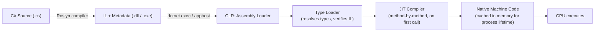
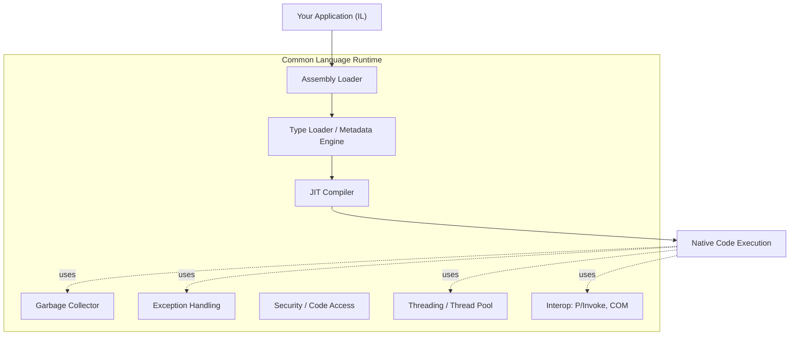
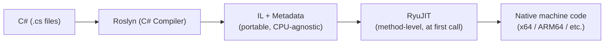
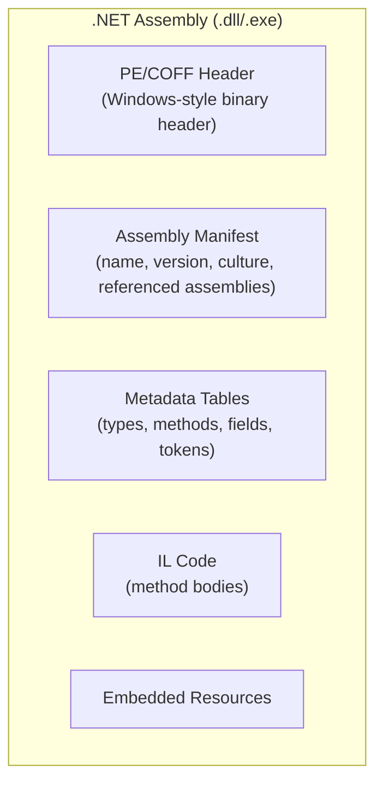
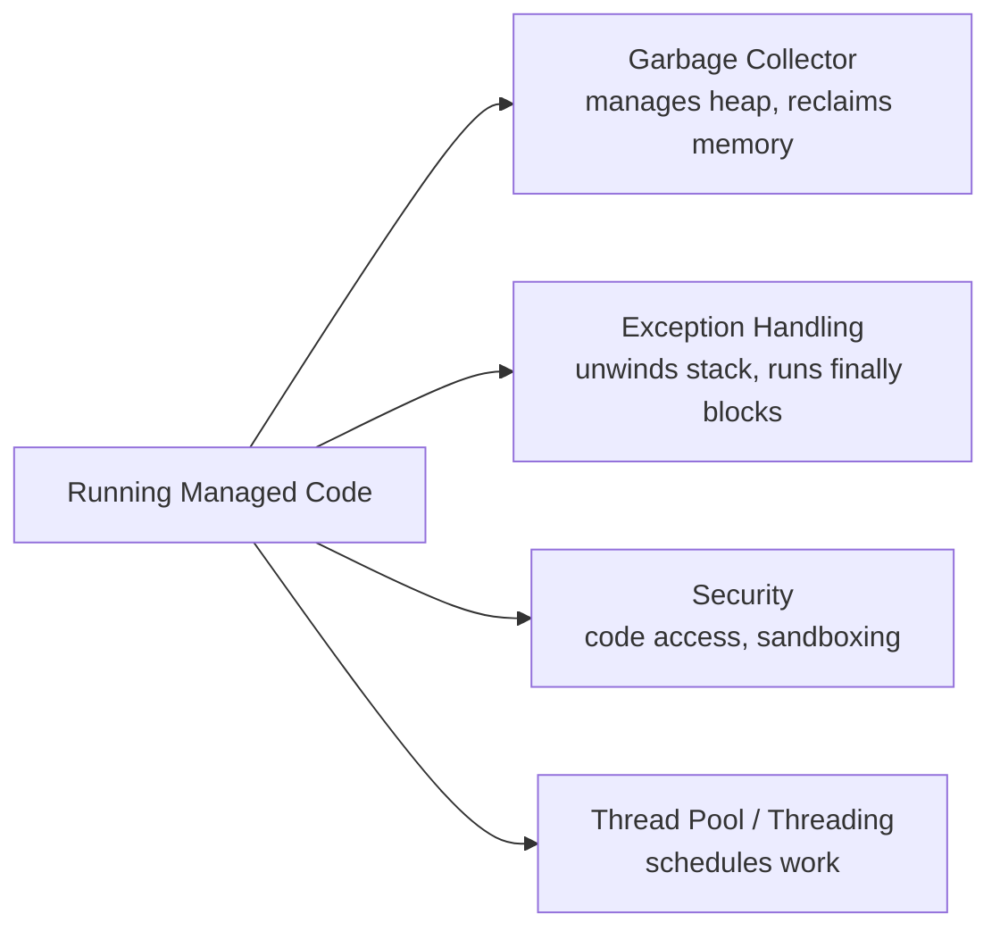
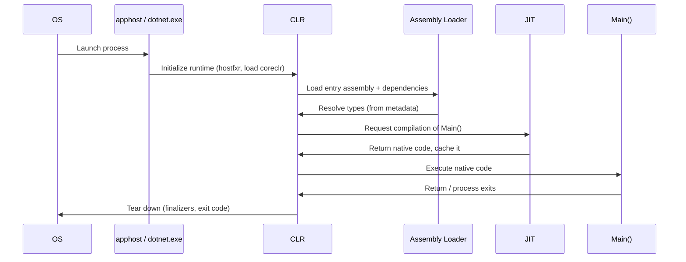
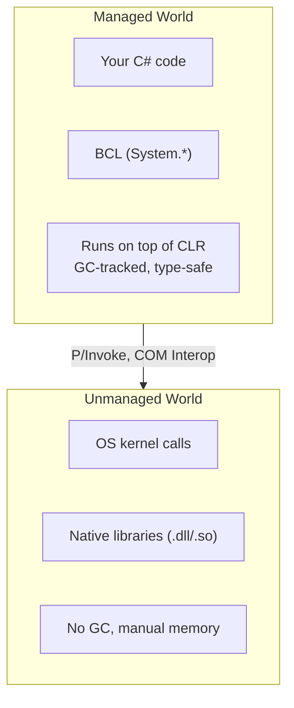

# Inside .NET — Episode 2
## What Really Happens When You Run a .NET Application?

> *Part I — The Foundation*

---

### Introduction

You type `dotnet run`. A second later, your console prints "Hello, World!" and exits. In that second, a lot happened: a process was created, an assembly was loaded, its metadata was parsed, a method was found and JIT-compiled to native machine code, a managed heap was set up, and a garbage collector was armed and ready before your `Main` method ever executed a single instruction.

This chapter builds the mental model that the rest of the series stands on. Every later topic — memory, GC, DI, async, EF Core, architecture — is a more detailed view of some piece of the pipeline described here.

### The real-world analogy

Imagine ordering a custom suit instead of buying one off the rack.

- You describe what you want in your own words (**your C# source code**).
- A pattern-maker translates your description into a standardized, language-neutral pattern (**the C# compiler produces IL** — Intermediate Language — not machine code).
- The pattern sits in a folder with your measurements, fabric choice, and tailor's notes (**assembly metadata**) — nobody cuts fabric yet.
- Only when you show up for the fitting does a tailor actually cut and sew *your* specific suit, sized exactly to you (**the JIT compiler turns IL into native machine code**, specific to the CPU it's running on).
- Once a piece is cut and sewn, the tailor doesn't redo it for you next time you walk in wearing the same body (**the JIT caches compiled code for reuse within the process**).

C# source code is the *description*, not the machine instructions. Nothing "off the rack" runs directly — everything is prepared as a portable, tailor-able intermediate form first.

### The problem being solved

Why not compile C# directly to machine code, the way C or C++ does? Because .NET's core value proposition depends on *not* doing that:

- **Portability** — the same compiled assembly (IL) runs on Windows, Linux, macOS, x64, or ARM64, because the CPU-specific translation happens at load/run time, not at build time.
- **Runtime services** — garbage collection, type safety, exception handling, and security all require the runtime to understand the *structure* of your code (types, methods, metadata), which a raw machine-code binary doesn't preserve.
- **Optimization opportunities at run time** — the JIT can make decisions based on the actual CPU it's running on (SIMD width, core count) that an ahead-of-time compiler targeting "any x64 CPU" cannot.

The cost of this design is a small amount of startup latency (compiling methods on first use) — which is precisely the tradeoff **Native AOT** (Episode 9 — Native AOT) exists to eliminate for scenarios that need instant startup.

### Original visual explanation

#### 1. Source-to-CPU execution flow



#### 2. CLR architecture overview



#### 3. Compilation pipeline



#### 4. Assembly structure



#### 5. Runtime services active during execution



#### 6. Application startup sequence



#### 7. Managed vs. unmanaged execution



#### 8. End-to-end execution timeline

```mermaid
gantt
    dateFormat X
    axisFormat %L ms
    title dotnet run timeline (illustrative, not to scale)
    section Process
    OS process start        :0, 10
    section Host
    hostfxr resolves runtime :10, 20
    coreclr.dll loaded       :20, 40
    section CLR
    Assembly + metadata load :40, 55
    Type loading / verify    :55, 65
    JIT compile Main()       :65, 85
    section Execution
    Main() runs natively     :85, 95
```



### Internal .NET mechanics

Walking through the diagrams above in the order execution actually happens:

1. **Compilation (build time, not runtime).** Roslyn compiles your `.cs` files into an assembly containing **IL (Common Intermediate Language)** — a CPU-agnostic, stack-based instruction set — plus **metadata**: tables describing every type, method, field, and their signatures, tokenized so they can be referenced compactly.

2. **Hosting and process start.** Running a `.dll` requires a host. `dotnet exec MyApp.dll` (or the generated native `apphost` executable) uses `hostfxr` to locate an installed .NET runtime matching the app's `runtimeconfig.json`, then loads `coreclr` (the actual CLR implementation) into the process.

3. **Assembly loading.** The CLR's assembly loader reads the PE header and manifest, resolves referenced assemblies (the BCL, NuGet dependencies), and prepares the metadata tables for lookup — but does **not** yet translate any IL to machine code.

4. **Type loading & verification.** When a type is first touched, the CLR's type loader builds an in-memory representation of it (method tables, vtables for virtual dispatch) from metadata, and — outside of trusted/AOT-verified scenarios — verifies the IL is type-safe.

5. **JIT compilation.** .NET does **not** compile your whole program to native code before running it. Each method is compiled by **RyuJIT** the first time it's *called*, and the resulting native code is cached in memory for the rest of the process's life — so a hot method pays the JIT cost exactly once. This is why the very first call into a code path is often slower than the 1000th ("JIT warm-up"), and it's precisely the cost **Native AOT** and **ReadyToRun (R2R)** exist to reduce or eliminate.

6. **Execution + runtime services.** Once native code is running, several CLR services operate continuously underneath it without you calling them directly: the **garbage collector** manages the heap, **structured exception handling** unwinds the stack on `throw` and guarantees `finally` blocks run, the **security system** enforces code-level restrictions where configured, and the **thread pool / threading subsystem** schedules concurrent and asynchronous work.

7. **Managed/unmanaged boundary.** Your code and the Base Class Library (`System.*`) run as *managed* code — the CLR knows their types and tracks their memory. Calls into the OS or native libraries (via P/Invoke or COM interop) cross into *unmanaged* territory, where the GC has no visibility and manual resource management rules (`IDisposable`, `SafeHandle`) apply — the subject of [Episode 12 — IDisposable & Finalizers](../012-idisposable-finalizers/article.md).

### C# implementation

You can observe several of these mechanics directly without any special tooling:

```csharp
// Program.cs — .NET 10 console app
using System.Reflection;

Console.WriteLine("=== Inside .NET: Episode 2 demo ===");

// 1. Prove we are running as *managed* code with a live CLR behind us.
Console.WriteLine($"CLR version   : {Environment.Version}");
Console.WriteLine($"OS description: {System.Runtime.InteropServices.RuntimeInformation.OSDescription}");

// 2. Inspect this assembly's metadata — the manifest the loader parsed at startup.
Assembly self = Assembly.GetExecutingAssembly();
Console.WriteLine($"Assembly      : {self.FullName}");
Console.WriteLine($"Location      : {self.Location}");

// 3. Observe JIT warm-up: the first call compiles the method, later calls reuse native code.
TimeSpan first = Time(() => Fibonacci(28));
TimeSpan second = Time(() => Fibonacci(28));
Console.WriteLine($"First call    : {first.TotalMilliseconds:F3} ms (includes JIT compile)");
Console.WriteLine($"Second call   : {second.TotalMilliseconds:F3} ms (native code already cached)");

static TimeSpan Time(Action action)
{
    var sw = System.Diagnostics.Stopwatch.StartNew();
    action();
    sw.Stop();
    return sw.Elapsed;
}

static long Fibonacci(int n) => n <= 1 ? n : Fibonacci(n - 1) + Fibonacci(n - 2);
```

Run it with `dotnet run` in [`code/`](code/) — on most machines the first `Fibonacci(28)` call is measurably slower than the second, purely due to JIT compilation cost, not algorithmic difference.

To see the *actual* IL your C# compiled to, install `ilspycmd` or use [sharplab.io](https://sharplab.io) and paste the `Fibonacci` method — you'll see IL opcodes like `ldarg.0`, `call`, `add` instead of any CPU-specific instruction, confirming the "pattern, not a cut suit" analogy from earlier.

### Common mistakes

- **Assuming .NET is "interpreted" like early Java myths suggested.** It's not — IL is JIT-*compiled* to real native machine code that executes directly on the CPU; it's just compiled later (at run time) instead of at build time.
- **Blaming "slow .NET startup" without knowing which cost you're paying.** Slow startup is usually JIT warm-up + assembly loading, not steady-state execution speed — and it's addressed differently (ReadyToRun, Native AOT, tiered compilation) depending on which one it actually is.
- **Confusing the compiler (Roslyn) with the runtime (CLR).** Roslyn's job ends at producing IL + metadata; everything from loading onward is the CLR's job. Bugs and behaviors at run time (a `NullReferenceException`, a GC pause) are CLR/BCL concerns, not compiler concerns.
- **Treating P/Invoke or unsafe interop calls as "free."** Crossing the managed/unmanaged boundary has real marshaling costs and removes GC visibility for that data — it's not a free escape hatch.

### Performance considerations

- **Tiered Compilation** (on by default since .NET Core 3.0): the JIT first emits a *quick, less-optimized* Tier 0 version of a method to minimize startup latency, then recompiles hot methods with full optimizations (Tier 1) once they're called enough times — a middle ground between "compile everything fully upfront" and "always pay full JIT cost."
- **ReadyToRun (R2R)** publishes assemblies with precompiled native code embedded alongside IL, so the JIT can skip compilation for those methods at startup — trading larger file size and (usually) slightly less runtime-specific optimization for faster startup.
- **Native AOT** removes the JIT and CLR loading step entirely — the whole app is compiled to a native binary at publish time. Startup is near-instant and memory footprint is smaller, at the cost of losing some dynamic features (reflection-heavy code, runtime codegen) that depend on IL being present at run time.
- **Measure, don't guess:** `dotnet-trace` and `dotnet-counters` (both part of the [.NET diagnostics tools](https://learn.microsoft.com/dotnet/core/diagnostics/)) can show you exactly how much time is spent in JIT compilation vs. GC vs. your own code for a real workload.

### Interview questions

**Q1: Is C# compiled or interpreted?**
A: Neither, purely. The C# compiler (Roslyn) compiles source to IL — an intermediate, CPU-agnostic bytecode — ahead of time. At run time, the JIT compiler compiles that IL to real native machine code, method by method, on first use, and that native code executes directly on the CPU. It's a two-stage compilation model, not interpretation (though .NET also *can* interpret IL in specific low-resource scenarios via the CLR's interpreter, which is the exception, not the rule).

**Q2: What's actually inside a compiled .dll?**
A: A PE/COFF header (borrowed from the Windows executable format, used cross-platform for .NET assemblies too), an assembly manifest (name, version, culture, referenced assemblies), metadata tables describing every type/method/field, the IL code for method bodies, and optionally embedded resources.

**Q3: Why is the first call to a method sometimes slower than subsequent calls, even with no caching logic in the code?**
A: Because the JIT compiles each method to native code on its first invocation and caches that native code for the process's lifetime. The first call pays a one-time JIT compilation cost; every subsequent call reuses the already-compiled native code.

**Q4: When would you choose Native AOT over the standard JIT-based deployment model?**
A: When startup latency and memory footprint are critical — CLI tools, serverless functions with cold-start penalties, containers scaled to zero — and the app doesn't rely heavily on runtime reflection or dynamic code generation, since Native AOT trims/precompiles ahead of time and can't JIT-compile code it didn't statically discover.

### Key takeaways

- C# source is compiled to IL + metadata by Roslyn at build time — not to machine code.
- The CLR loads assemblies, resolves types from metadata, and hands methods to the JIT compiler *on first use*.
- The JIT compiles IL to native machine code once per method per process, then caches it — explaining JIT warm-up behavior.
- Once running, the CLR provides continuous services underneath your code: GC, exception handling, security, threading.
- Native AOT and ReadyToRun exist specifically to move JIT cost from run time to build/publish time when startup latency matters.

### What's next

[Episode 3 — Understanding the CLR](../002-clr/article.md) goes one level deeper into the CLR itself: the type system (CTS/CLS), the method table and vtable mechanics behind virtual dispatch, and how the CLR actually resolves a method call at run time.
