# Inside .NET — Episode 2
## What Really Happens When You Run a .NET Application?

> *Part I — The Foundation*

---


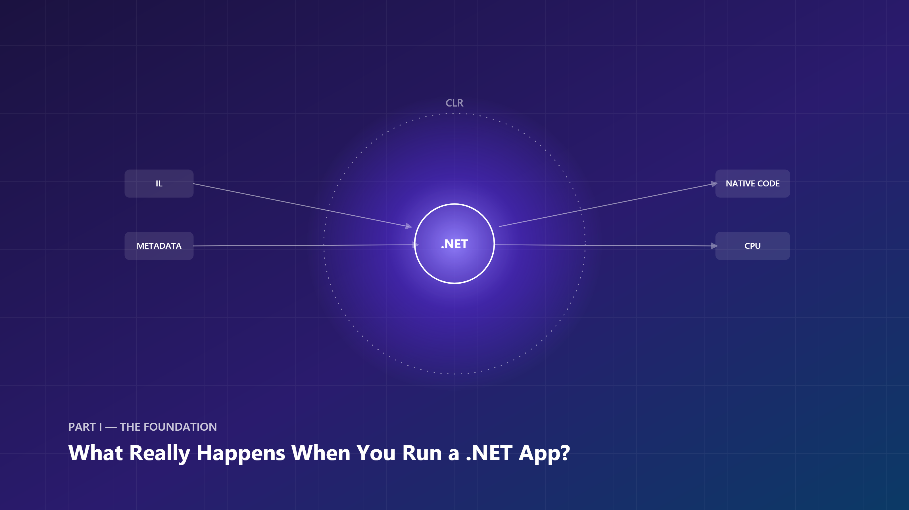

*Exported via `scripts/Svg2Png` from `diagrams/svg/001-cover.svg` and `diagrams/svg/001-hero.svg`.*

### Learning Objectives

By the end of this chapter, you will be able to:
- Explain why C# compiles to IL instead of directly to machine code, and what that buys .NET
- Trace the concrete sequence of steps between `dotnet run` and your `Main` method executing
- Distinguish the jobs of Roslyn, `hostfxr`/`coreclr`, the assembly loader, the type loader, and the JIT compiler
- Explain JIT warm-up and why a method's first call is often slower than its later calls
- Decide, for a given workload, whether Tiered Compilation, ReadyToRun, or Native AOT is the right lever to pull for startup cost

### Real-world Analogy

Imagine ordering a custom suit instead of buying one off the rack.

- You describe what you want in your own words (**your C# source code**).
- A pattern-maker translates your description into a standardized, language-neutral pattern (**the C# compiler produces IL** — Intermediate Language — not machine code).
- The pattern sits in a folder with your measurements, fabric choice, and tailor's notes (**assembly metadata**) — nobody cuts fabric yet.
- Only when you show up for the fitting does a tailor actually cut and sew *your* specific suit, sized exactly to you (**the JIT compiler turns IL into native machine code**, specific to the CPU it's running on).
- Once a piece is cut and sewn, the tailor doesn't redo it for you next time you walk in wearing the same body (**the JIT caches compiled code for reuse within the process**).

C# source code is the *description*, not the machine instructions. Nothing "off the rack" runs directly — everything is prepared as a portable, tailor-able intermediate form first.

### Problem Statement

Why not compile C# directly to machine code, the way C or C++ does? Because .NET's core value proposition depends on *not* doing that:

- **Portability** — the same compiled assembly (IL) runs on Windows, Linux, macOS, x64, or ARM64, because the CPU-specific translation happens at load/run time, not at build time.
- **Runtime services** — garbage collection, type safety, exception handling, and security all require the runtime to understand the *structure* of your code (types, methods, metadata), which a raw machine-code binary doesn't preserve.
- **Optimization opportunities at run time** — the JIT can make decisions based on the actual CPU it's running on (SIMD width, core count) that an ahead-of-time compiler targeting "any x64 CPU" cannot.

Without this two-stage model, .NET would have to ship a separately compiled binary per CPU architecture and OS, lose the ability to verify code safety at load time, and give up the ability to specialize native code to the exact machine running it. The cost of this design is a small amount of startup latency (compiling methods on first use) — which is precisely the tradeoff **Native AOT** (Episode 9 — Native AOT) exists to eliminate for scenarios that need instant startup.

### Visual Explanation

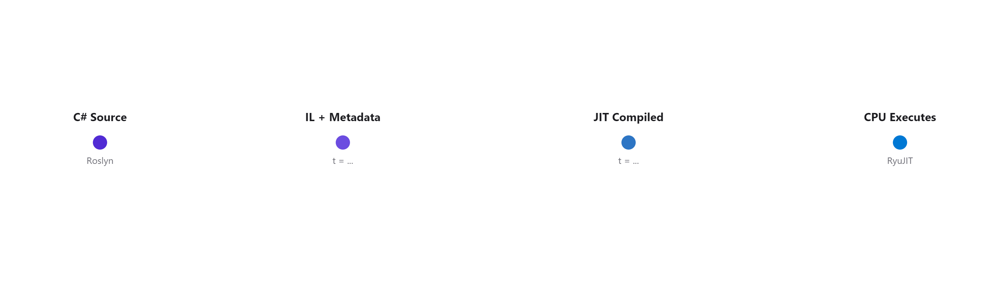

The diagrams below walk through the same pipeline at increasing levels of detail.

#### 1. Source-to-CPU execution flow

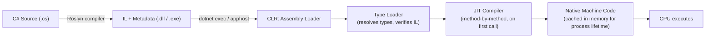

#### 2. CLR architecture overview

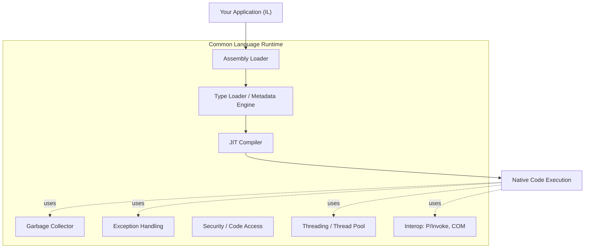

#### 3. Compilation pipeline

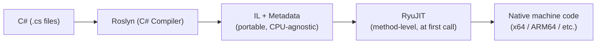

#### 4. Assembly structure

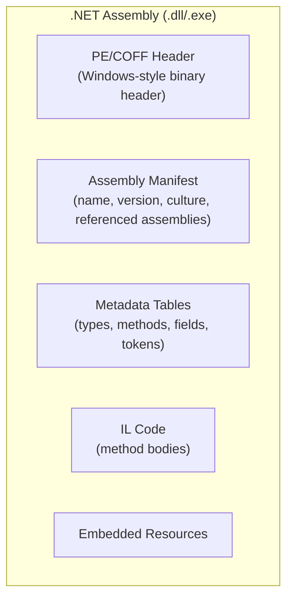

#### 5. Runtime services active during execution

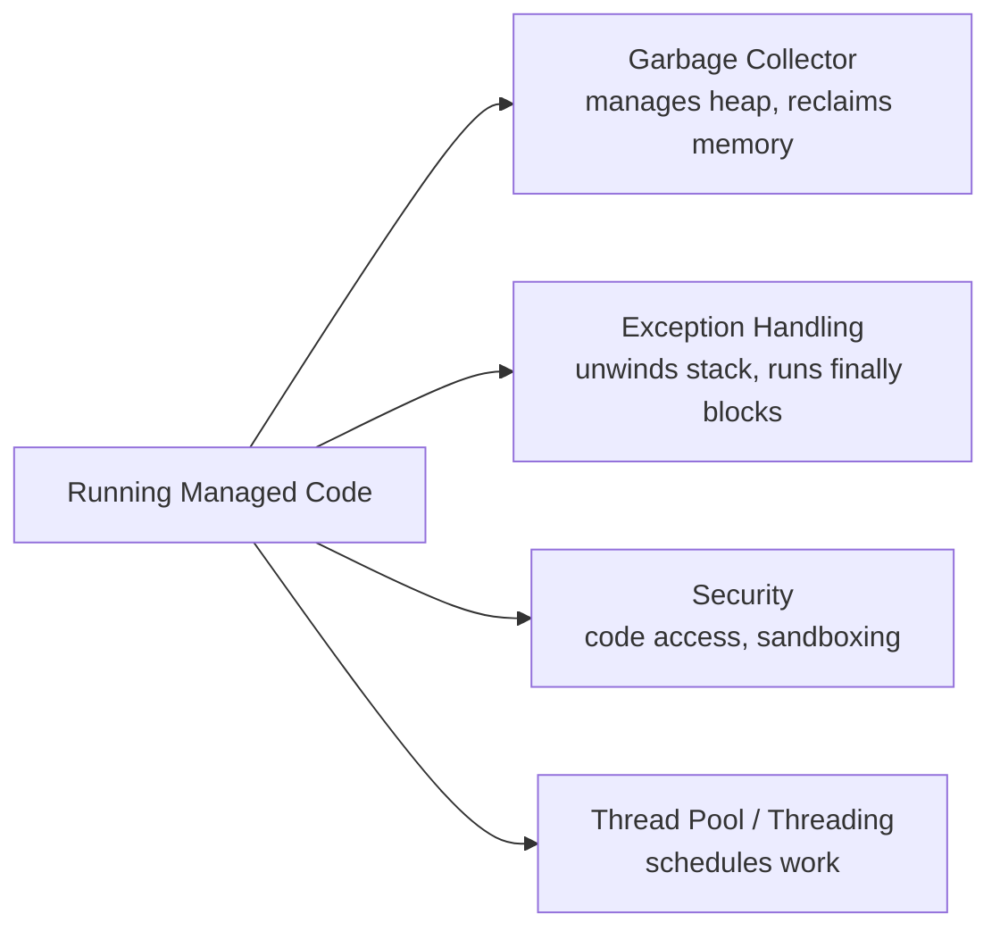

#### 6. Application startup sequence

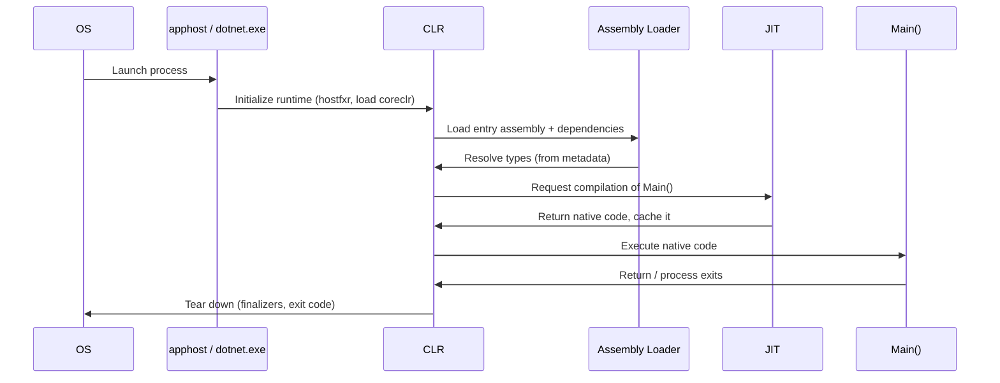

#### 7. Managed vs. unmanaged execution

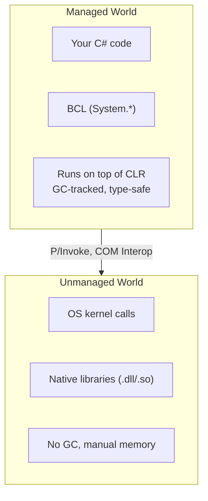

#### 8. End-to-end execution timeline

```mermaid
gantt
    dateFormat X
    axisFormat %L ms
    title dotnet run timeline (illustrative, not to scale)
    section Process
    OS process start        :0, 10
    section Host
    hostfxr resolves runtime :10, 20
    coreclr.dll loaded       :20, 40
    section CLR
    Assembly + metadata load :40, 55
    Type loading / verify    :55, 65
    JIT compile Main()       :65, 85
    section Execution
    Main() runs natively     :85, 95
```

### Under the Hood

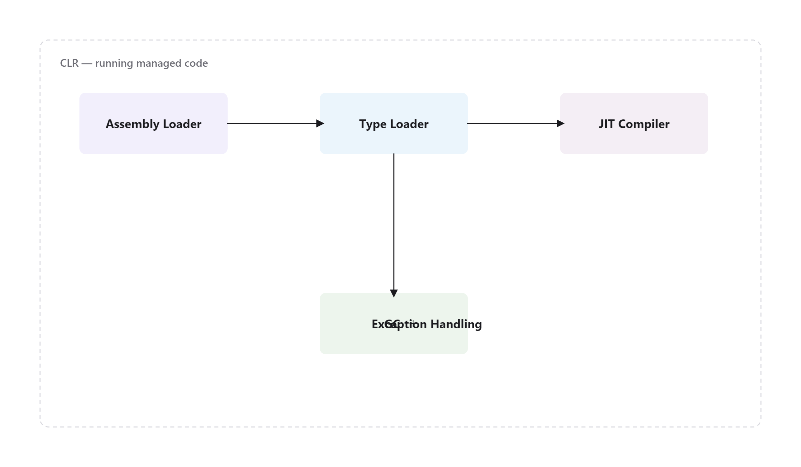

Walking through the diagrams above in the order execution actually happens:

1. **Compilation (build time, not runtime).** Roslyn compiles your `.cs` files into an assembly containing **IL (Common Intermediate Language)** — a CPU-agnostic, stack-based instruction set — plus **metadata**: tables describing every type, method, field, and their signatures, tokenized so they can be referenced compactly.

2. **Hosting and process start.** Running a `.dll` requires a host. `dotnet exec MyApp.dll` (or the generated native `apphost` executable) uses `hostfxr` to locate an installed .NET runtime matching the app's `runtimeconfig.json`, then loads `coreclr` (the actual CLR implementation) into the process.

3. **Assembly loading.** The CLR's assembly loader reads the PE header and manifest, resolves referenced assemblies (the BCL, NuGet dependencies), and prepares the metadata tables for lookup — but does **not** yet translate any IL to machine code.

4. **Type loading & verification.** When a type is first touched, the CLR's type loader builds an in-memory representation of it (method tables, vtables for virtual dispatch) from metadata, and — outside of trusted/AOT-verified scenarios — verifies the IL is type-safe.

5. **JIT compilation.** .NET does **not** compile your whole program to native code before running it. Each method is compiled by **RyuJIT** the first time it's *called*, and the resulting native code is cached in memory for the rest of the process's life — so a hot method pays the JIT cost exactly once. This is why the very first call into a code path is often slower than the 1000th ("JIT warm-up"), and it's precisely the cost **Native AOT** and **ReadyToRun (R2R)** exist to reduce or eliminate.

6. **Execution + runtime services.** Once native code is running, several CLR services operate continuously underneath it without you calling them directly: the **garbage collector** manages the heap, **structured exception handling** unwinds the stack on `throw` and guarantees `finally` blocks run, the **security system** enforces code-level restrictions where configured, and the **thread pool / threading subsystem** schedules concurrent and asynchronous work.

7. **Managed/unmanaged boundary.** Your code and the Base Class Library (`System.*`) run as *managed* code — the CLR knows their types and tracks their memory. Calls into the OS or native libraries (via P/Invoke or COM interop) cross into *unmanaged* territory, where the GC has no visibility and manual resource management rules (`IDisposable`, `SafeHandle`) apply — the subject of [Episode 12 — IDisposable & Finalizers](../012-idisposable-finalizers/article.md).

**How Microsoft implements this internally:** the loading and JIT pipeline described above is not a black box — it's the open-source `dotnet/runtime` repository. `hostfxr` and `coreclr` are real native components you can read (and debug) in that repo; RyuJIT's tiering logic lives in `src/coreclr/jit`, and the type loader / method table construction lives in `src/coreclr/vm`. When in doubt about "what does the CLR actually do here," the runtime source and its `docs/design` folder are the primary source, not folklore.

### Code Example

**Example tier.** The sample below is the simplest correct illustration of the concepts above — CLR/assembly introspection plus a direct, observable demonstration of JIT warm-up:

```csharp
// Program.cs — .NET 10 console app
using System.Reflection;

Console.WriteLine("=== Inside .NET: Episode 2 demo ===");

// 1. Prove we are running as *managed* code with a live CLR behind us.
Console.WriteLine($"CLR version   : {Environment.Version}");
Console.WriteLine($"OS description: {System.Runtime.InteropServices.RuntimeInformation.OSDescription}");

// 2. Inspect this assembly's metadata — the manifest the loader parsed at startup.
Assembly self = Assembly.GetExecutingAssembly();
Console.WriteLine($"Assembly      : {self.FullName}");
Console.WriteLine($"Location      : {self.Location}");

// 3. Observe JIT warm-up: the first call compiles the method, later calls reuse native code.
TimeSpan first = Time(() => Fibonacci(28));
TimeSpan second = Time(() => Fibonacci(28));
Console.WriteLine($"First call    : {first.TotalMilliseconds:F3} ms (includes JIT compile)");
Console.WriteLine($"Second call   : {second.TotalMilliseconds:F3} ms (native code already cached)");

static TimeSpan Time(Action action)
{
    var sw = System.Diagnostics.Stopwatch.StartNew();
    action();
    sw.Stop();
    return sw.Elapsed;
}

static long Fibonacci(int n) => n <= 1 ? n : Fibonacci(n - 1) + Fibonacci(n - 2);
```

Run it with `dotnet run` in [`code/`](code/) — on most machines the first `Fibonacci(28)` call is measurably slower than the second, purely due to JIT compilation cost, not algorithmic difference.

To see the *actual* IL your C# compiled to, install `ilspycmd` or use [sharplab.io](https://sharplab.io) and paste the `Fibonacci` method — you'll see IL opcodes like `ldarg.0`, `call`, `add` instead of any CPU-specific instruction, confirming the "pattern, not a cut suit" analogy from earlier.

A second code tier (a true **Performance Example** with statistically meaningful `BenchmarkDotNet` runs comparing cold vs. warm invocation across tiering levels) is deliberately deferred rather than bolted on here — see [Episode 9 — Native AOT](../009-native-aot/article.md) and the diagnostics-focused chapters later in Phase 1, where a benchmark harness earns its place instead of duplicating this chapter's single-Stopwatch demonstration for its own sake.

### Performance Notes

- **Tiered Compilation** (on by default since .NET Core 3.0): the JIT first emits a *quick, less-optimized* Tier 0 version of a method to minimize startup latency, then recompiles hot methods with full optimizations (Tier 1) once they're called enough times — a middle ground between "compile everything fully upfront" and "always pay full JIT cost."
- **ReadyToRun (R2R)** publishes assemblies with precompiled native code embedded alongside IL, so the JIT can skip compilation for those methods at startup — trading larger file size and (usually) slightly less runtime-specific optimization for faster startup.
- **Native AOT** removes the JIT and CLR loading step entirely — the whole app is compiled to a native binary at publish time. Startup is near-instant and memory footprint is smaller, at the cost of losing some dynamic features (reflection-heavy code, runtime codegen) that depend on IL being present at run time.
- **Measure, don't guess:** `dotnet-trace` and `dotnet-counters` (both part of the [.NET diagnostics tools](https://learn.microsoft.com/dotnet/core/diagnostics/)) can show you exactly how much time is spent in JIT compilation vs. GC vs. your own code for a real workload.
- **Order-of-magnitude expectation:** on a typical dev machine, JIT-compiling a small method costs low single-digit milliseconds the first time; a Native AOT-published equivalent of the same console app typically starts in tens of milliseconds versus low hundreds for the JIT-based apphost, almost entirely because the assembly-load + type-load + JIT sequence described in "Under the Hood" is skipped outright. Treat these as orders of magnitude to reason with, not numbers to cite — always confirm with `dotnet-trace` against your actual binary before making a deployment decision on the strength of them.

### Common Mistakes / Anti-Patterns

- **Assuming .NET is "interpreted" like early Java myths suggested.** It's not — IL is JIT-*compiled* to real native machine code that executes directly on the CPU; it's just compiled later (at run time) instead of at build time.
- **Blaming "slow .NET startup" without knowing which cost you're paying.** Slow startup is usually JIT warm-up + assembly loading, not steady-state execution speed — and it's addressed differently (ReadyToRun, Native AOT, tiered compilation) depending on which one it actually is.
- **Confusing the compiler (Roslyn) with the runtime (CLR).** Roslyn's job ends at producing IL + metadata; everything from loading onward is the CLR's job. Bugs and behaviors at run time (a `NullReferenceException`, a GC pause) are CLR/BCL concerns, not compiler concerns.
- **Treating P/Invoke or unsafe interop calls as "free."** Crossing the managed/unmanaged boundary has real marshaling costs and removes GC visibility for that data — it's not a free escape hatch.
- **Reaching for Native AOT as a default rather than a decision.** Migrating to Native AOT is a real engineering cost (auditing reflection use, trimming compatibility, rebuilding CI for platform-specific native binaries) — teams that adopt it because "faster startup sounds good" without a cold-start requirement that actually justifies it end up paying migration cost for a benefit nobody measured.

### Architect's Perspective

**Developer Perspective**

Day to day, this chapter's mechanics are invisible — you write C#, run `dotnet run`, and it works. What you should actually *do* with this knowledge: don't panic-optimize a method because "the first call was slow" in a microbenchmark or a unit test; that's JIT warm-up, not your algorithm. If you need to measure real steady-state performance, warm the code path up first (call it once, discard the timing, then measure) or use a proper benchmarking tool (`BenchmarkDotNet`) that already accounts for this.

**Senior Perspective**

This matters most in code review when someone proposes a "startup optimization" without diagnosing which of the three costs (assembly load, type load, JIT) they're actually paying — or when a colleague suggests P/Invoke-ing into a native library "for speed" without accounting for marshaling cost and lost GC visibility. It also matters when triaging a production incident: a GC pause, a slow first request after a deploy, and a genuine algorithmic regression all *look* like "the app is slow," but they have different root causes and different fixes. Knowing the pipeline in this chapter is what lets you tell them apart from a stack trace or a trace capture instead of guessing.

**Architect Perspective**

At the system level, this chapter's mechanics directly drive a real deployment decision: **JIT warm-up is why serverless functions and scale-to-zero containers pay a "cold start tax"** — every new instance repeats assembly load, type load, and JIT compilation from scratch, because none of that state survives past the process. Three levers exist, and they trade off differently depending on the system:

- **Tiered Compilation** (default) is free but doesn't eliminate the cost, only shapes it — Tier 0 reduces the *worst* of the first-call latency but the pipeline still runs in full.
- **ReadyToRun** reduces JIT cost at the price of a larger deployment artifact and slightly less machine-specific optimization — a reasonable default for containerized services that restart often but don't have to be instant.
- **Native AOT** is worth its migration cost specifically when cold-start latency is a *billed or SLA-relevant* cost — AWS Lambda / Azure Functions consumption plans charging per invocation including cold start, or Kubernetes deployments that scale aggressively to zero — and when an audit of the codebase confirms it doesn't lean on unbounded runtime reflection, dynamic assembly loading, or runtime codegen that Native AOT's trimmer can't see statically. That audit is real work; budget for it rather than assuming a "just add a publish flag" migration.

Microsoft's own internal usage is instructive here: ASP.NET Core's minimal APIs and much of the newer BCL surface were specifically redesigned to be Native-AOT-compatible (avoiding runtime reflection where source generators can do the same job at build time) because Microsoft's own Azure Functions and container tooling hit the same cold-start economics any other team does. That's a signal about where the platform is heading, not just an isolated feature.

### Interview Questions

**Q1: Is C# compiled or interpreted?**
A: Neither, purely. The C# compiler (Roslyn) compiles source to IL — an intermediate, CPU-agnostic bytecode — ahead of time. At run time, the JIT compiler compiles that IL to real native machine code, method by method, on first use, and that native code executes directly on the CPU. It's a two-stage compilation model, not interpretation (though .NET also *can* interpret IL in specific low-resource scenarios via the CLR's interpreter, which is the exception, not the rule).

**Q2: What's actually inside a compiled .dll?**
A: A PE/COFF header (borrowed from the Windows executable format, used cross-platform for .NET assemblies too), an assembly manifest (name, version, culture, referenced assemblies), metadata tables describing every type/method/field, the IL code for method bodies, and optionally embedded resources.

**Q3: Why is the first call to a method sometimes slower than subsequent calls, even with no caching logic in the code?**
A: Because the JIT compiles each method to native code on its first invocation and caches that native code for the process's lifetime. The first call pays a one-time JIT compilation cost; every subsequent call reuses the already-compiled native code.

**Q4: When would you choose Native AOT over the standard JIT-based deployment model?**
A: When startup latency and memory footprint are critical — CLI tools, serverless functions with cold-start penalties, containers scaled to zero — and the app doesn't rely heavily on runtime reflection or dynamic code generation, since Native AOT trims/precompiles ahead of time and can't JIT-compile code it didn't statically discover.

**Q5: How does Tiered Compilation differ from ReadyToRun, and why would a system use both?**
A: Tiered Compilation is a run-time JIT strategy — it still compiles at run time, just in two passes (fast/unoptimized, then optimized for hot methods). ReadyToRun is a publish-time strategy — it ships precompiled native code inside the assembly so the JIT can skip compiling those methods at all. They're complementary: an R2R-published app still uses Tiered Compilation for any method R2R didn't precompile (e.g. generic instantiations resolved only at run time), so most real ASP.NET Core deployments use both together.

**Q6: A teammate wants to migrate a service to Native AOT purely because "it'll be faster." How do you push back on that as an architect?**
A: Ask what's actually driving the requirement — is cold-start latency measured and on the critical path (serverless, scale-to-zero), or is this optimization without a measured problem? Then ask whether the codebase leans on unbounded reflection, `Type.GetType` on arbitrary strings, runtime codegen, or dynamic assembly loading — any of which Native AOT's trimmer can't see statically and will either fail to publish or fail at run time. If neither the requirement nor the codebase audit supports it, the migration cost (trimming compatibility, CI changes for platform-specific binaries, ongoing vigilance against reintroducing unsupported reflection) isn't justified by "it'll be faster" alone.

### Quiz

1. What does the C# compiler (Roslyn) actually produce — machine code or something else?
2. What triggers the JIT to compile a specific method?
3. What happens to a method's native code after it's compiled — is it recompiled on every call?
4. Name two runtime services the CLR provides continuously while your managed code runs.
5. What's the key tradeoff Native AOT makes compared to the standard JIT model?

<details>
<summary>Answers</summary>

1. IL (Intermediate Language) plus metadata — not machine code.
2. The method being called for the first time during that process's execution.
3. No — the JIT compiles it once, caches the native code in memory, and every subsequent call reuses that cached code for the life of the process.
4. Any two of: garbage collection, exception handling, security/code access, threading/thread pool scheduling.
5. Faster startup and smaller memory footprint, at the cost of losing runtime features that depend on IL still being present at run time (heavy reflection, runtime codegen).

</details>

### Key Takeaways

- C# source is compiled to IL + metadata by Roslyn at build time — not to machine code.
- The CLR loads assemblies, resolves types from metadata, and hands methods to the JIT compiler *on first use*.
- The JIT compiles IL to native machine code once per method per process, then caches it — explaining JIT warm-up behavior.
- Once running, the CLR provides continuous services underneath your code: GC, exception handling, security, threading.
- Native AOT and ReadyToRun exist specifically to move JIT cost from run time to build/publish time when startup latency matters — but that move has a real migration cost that should be justified by a measured cold-start requirement, not assumed.

### What's Next

[Episode 3 — Understanding the CLR](../002-clr/article.md) goes one level deeper into the CLR itself: the type system (CTS/CLS), the method table and vtable mechanics behind virtual dispatch, and how the CLR actually resolves a method call at run time.
