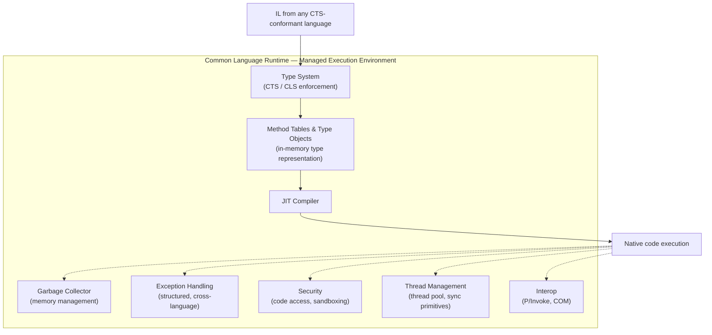
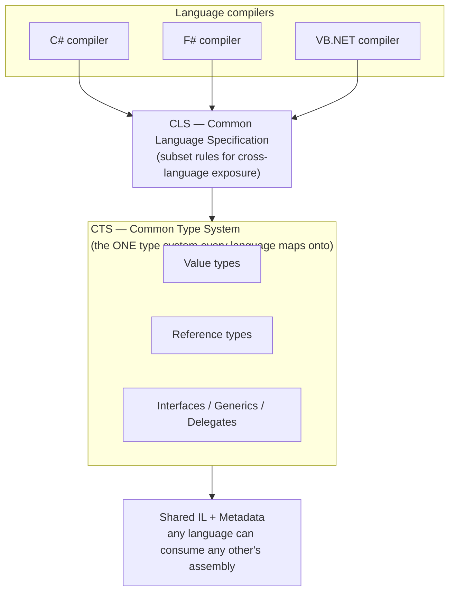
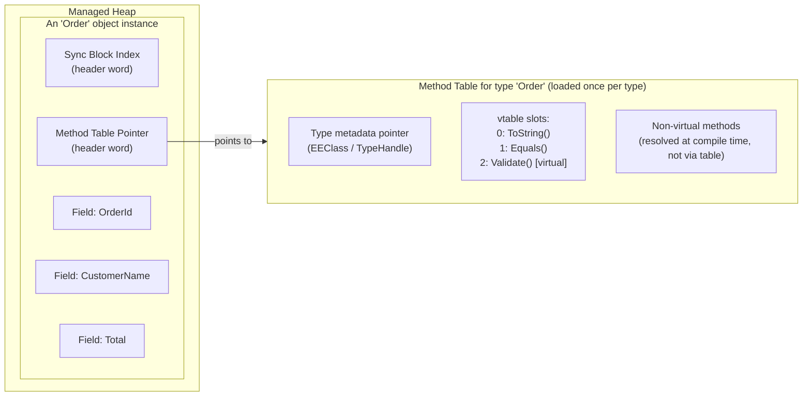
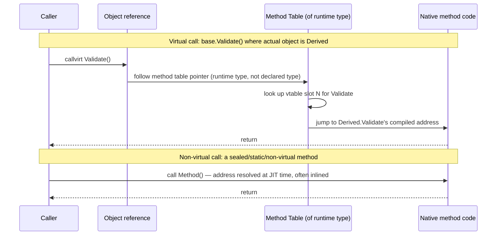
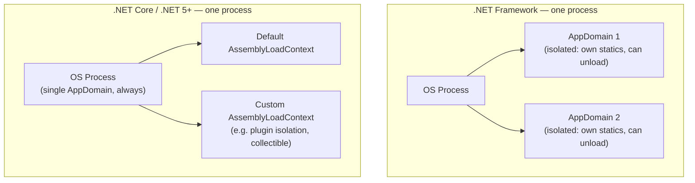

# Inside .NET — Episode 3
## Understanding the CLR

> *Part I — The Foundation*

---

### Introduction

Episode 2 walked through the pipeline at a high level: Roslyn produces IL, the CLR loads it, the JIT compiles it, and a handful of runtime services keep it running. That chapter treated "the CLR" as a black box that does useful things. This chapter opens that box.

The CLR (Common Language Runtime) is not a JIT compiler with some extra features bolted on — it's a full managed execution environment, closer in spirit to a virtual machine than to a traditional runtime library. It defines how every type is represented in memory, how a method call is resolved, how many languages can produce code that interoperates seamlessly, and what "safe" even means for a running program. Understanding these mechanics is what separates "I know C# runs on the CLR" from being able to explain why a virtual call costs more than a non-virtual one, or why F# and C# assemblies can call each other's code without any adapter layer.

### The real-world analogy

Think of the CLR as an airport's air traffic control system, not the planes themselves.

- Airlines (**C#, F#, VB.NET**) all file flight plans in the same standardized format (**CTS/CLS-conformant IL**) — a Boeing pilot and an Airbus pilot both speak the same air traffic language, regardless of which manufacturer built their aircraft.
- Every aircraft has a transponder broadcasting a standardized record — tail number, model, capabilities (**every object carries a method table pointer describing its type**).
- Air traffic control doesn't re-verify an aircraft's entire design on every radio call; it looks up the aircraft's known profile and knows exactly which procedures apply (**a vtable lookup resolves a virtual call to the correct override without re-inspecting the whole type**).
- ATC enforces the same safety rules — separation distances, runway rights — on every flight regardless of airline (**type safety, memory safety, and security checks apply uniformly to all managed code**).
- Historically, an airport could be entirely walled off into isolated terminals that could be evacuated independently without shutting down the whole airport (**AppDomains** provided isolation boundaries within one process) — modern airports instead use more granular, lighter-weight zone control (**AssemblyLoadContext** provides load isolation without a full AppDomain).

The CLR is the control tower: it doesn't fly the plane (that's your code, executing as native instructions), but nothing takes off, lands, or gets rerouted without going through it first.

### The problem being solved

Three distinct problems collapse into "why does .NET need a runtime like the CLR at all":

- **Cross-language interoperability.** Before the CLR/CTS, calling F# code from C#, or vice versa, meant hand-written interop shims, because each language had its own idea of what an "object," an "interface," or a "class hierarchy" even was. The CTS defines *one* type system that every .NET-targeting language's compiler must map onto, so a C# `interface`, an F# type, and a VB.NET class are the same kind of thing at the metadata level — the runtime doesn't know or care which language emitted the IL it's running.
- **Memory and type safety without manual bookkeeping.** A raw native binary has no concept of "this pointer refers to a live object of type `Order`." The CLR tracks every object's exact type and every live reference to it, which is what makes garbage collection, safe casts, and bounds-checked arrays possible — none of that is achievable by a runtime that only understands "here's a blob of bytes, jump to this address."
- **Uniform virtual dispatch across an open-ended type hierarchy.** When you call an overridden method through a base-class reference, something has to decide, at run time, which concrete implementation actually runs — and it has to do so fast, because this happens on every polymorphic call in the program. The method table / vtable design is the CLR's answer to "make dynamic dispatch both correct and cheap."

### Original visual explanation

#### 1. CLR as a managed execution environment



#### 2. CTS / CLS / language relationship



#### 3. Object layout and the method table pointer



#### 4. Virtual call vs. non-virtual call resolution



#### 5. AppDomain (legacy) vs. AssemblyLoadContext (modern)



### Internal .NET mechanics

**1. The CLR's actual job list.** Beyond "runs your code," the CLR is responsible for: enforcing type safety (you cannot treat an arbitrary bag of bytes as a `Customer` object without going through a legitimate cast or deserialization path that the runtime validates); memory management (every managed allocation and its lifetime is tracked so the GC can reclaim it); structured exception handling that works consistently *across* languages (an exception thrown by F# code can be caught by a C# `catch` block using the same protocol); a security model for code access (largely vestigial for local apps post-.NET Core, but still real for certain hosting scenarios); thread management (the CLR owns the thread pool and the primitives `Task`/`async` are built on); and interop marshaling at the managed/unmanaged boundary.

**2. CTS — the one type system.** The Common Type System is the actual rulebook: every type is either a *value type* (allocated inline, copied by value, derives from `System.ValueType`) or a *reference type* (heap-allocated, accessed by reference, derives ultimately from `System.Object`). It defines what a class, interface, delegate, enum, and generic parameter *are*, at a level below any specific language's syntax. A C# `class`, an F# reference type, and a VB.NET `Class` all compile down to the exact same CTS construct in metadata — there's no language tag on the type once it's compiled. This is why you can put a C# library and an F# library in the same solution and call between them with zero glue code: both are just CTS types to the CLR.

**3. CLS — the interop subset.** The CTS is broader than what every language can *consume*. C# supports unsigned integers as public API surface; some CLS-targeting languages historically didn't. The Common Language Specification is a narrower set of rules ("no unsigned types in public members," "no member names differing only by case," etc.) that, if you follow them, guarantee your public API is usable from *any* CLS-compliant language — not just the one you wrote it in. `[CLSCompliant(true)]` on an assembly asks the compiler to flag violations. This matters directly for anyone publishing a NuGet library intended for multi-language consumption.

**4. Method tables and type objects — how a loaded type actually looks in memory.** When the type loader resolves a type for the first time (Episode 2, step 4), it builds a **method table** (internally, an `MethodTable`/`EEClass` pair in the CLR's source) — a fixed, per-*type* (not per-instance) structure containing: a pointer back to the type's metadata, the type's size and layout, a pointer to its parent's method table, interface implementation maps, and a **vtable** — a slot array of function pointers for every virtual method, ordered so that a derived type's overridden slot occupies the *same index* as the base type's declared slot. Every object instance on the heap carries, as the first word(s) of its header, a pointer to *this* method table (plus a sync-block index word used for locking/hashing) — not a copy of the type's behavior, just a pointer to the one shared table. This is why polymorphism doesn't cost memory per instance: a million `Order` objects share one method table; each instance is just data plus a pointer.

**5. Virtual dispatch vs. non-virtual dispatch, mechanically.** A `callvirt` IL instruction on a virtual method does *not* know at compile time which override will run — the JIT emits code that: follows the object's method-table pointer (the *runtime* type, which may be a subclass of the *declared* reference type), indexes into that table's fixed vtable slot for the method being called, and jumps to whatever compiled address sits there. This indirection is what makes overriding work, and it's also why it's slightly more expensive than a direct call — one extra memory load and an indirect jump, which additionally defeats CPU branch prediction more often than a direct call and blocks inlining (the JIT can't inline through a jump it can't resolve until run time). A **non-virtual call** (a `static`, non-virtual instance method, or a method on a `sealed` class/type) is resolved directly at JIT time to a fixed address — no table lookup, and the JIT is free to inline it entirely, eliminating the call overhead altogether. The C# compiler also has a specific escape hatch here: calling a virtual method through a `sealed` override, or on a value type, can be devirtualized because the runtime type is provably fixed.

**6. AppDomains, historically, vs. AssemblyLoadContext today.** .NET Framework used **AppDomains** as an in-process isolation boundary: multiple AppDomains could exist in one OS process, each with its own static state, and — critically — each could be unloaded independently, which is how tools like ASP.NET (classic) or plugin hosts recycled code without restarting the whole process. .NET Core deliberately dropped multi-AppDomain support: modern .NET always runs a single, un-unloadable "default" AppDomain per process. In its place, **`AssemblyLoadContext` (ALC)** provides load isolation: you can load the same assembly (even different versions) into multiple ALCs without them colliding, and a *collectible* ALC can be unloaded, which is the modern mechanism behind plugin architectures (this is literally how `dotnet` extension/plugin systems, and tools like MSBuild task isolation, work today). ALCs are lighter-weight and don't provide the full security-boundary semantics AppDomains had, but they solve the "load and later unload code" problem that most real applications actually needed.

**7. CLR vs. BCL vs. FCL — precise terminology.** These three terms get conflated constantly, and precision matters in an interview: the **CLR** is the runtime engine itself — the native component (`coreclr`) that loads assemblies, JITs code, and runs the GC, threading, and exception machinery described above. The **BCL (Base Class Library)** is the minimal set of foundational managed types every .NET program needs — `System.Object`, `System.String`, collections, primitive wrappers, `System.IO` basics — the layer that's almost always present regardless of app type. The **FCL (Framework Class Library)** is the older, broader historical term (pre-dating .NET Core) for *everything* Microsoft shipped as managed libraries on top of the CLR — BCL plus ASP.NET, WinForms, WPF, etc. In modern usage, "BCL" is the term still in active use (and still exists as `System.Private.CoreLib` plus the `System.*` reference assemblies); "FCL" is largely a historical/legacy label you'll mostly encounter in older docs or interview trivia rather than current Microsoft documentation.

### C# implementation

```csharp
// Program.cs — .NET 10 console app
using System.Reflection;
using System.Runtime.Loader;

Console.WriteLine("=== Inside .NET: Episode 3 demo — CLR internals ===");

// 1. CTS in action: value type vs. reference type, from the SAME type system,
//    regardless of which keyword you used to declare them.
Console.WriteLine();
Console.WriteLine("-- CTS: value types vs. reference types --");
PrintTypeKind(typeof(int));      // value type -> System.ValueType
PrintTypeKind(typeof(OrderStruct)); // value type
PrintTypeKind(typeof(OrderClass));  // reference type -> System.Object

static void PrintTypeKind(Type t)
{
    Console.WriteLine($"{t.Name,-14} IsValueType={t.IsValueType,-6} BaseType={t.BaseType?.FullName}");
}

// 2. Method table identity: every instance of the same runtime type shares
//    the exact same type handle (the managed-code proxy for "method table pointer").
Console.WriteLine();
Console.WriteLine("-- Method table sharing across instances --");
var order1 = new OrderClass { OrderId = 1 };
var order2 = new OrderClass { OrderId = 2 };
RuntimeTypeHandle h1 = order1.GetType().TypeHandle;
RuntimeTypeHandle h2 = order2.GetType().TypeHandle;
Console.WriteLine($"order1 type handle == order2 type handle : {h1.Value == h2.Value}");
Console.WriteLine($"(Both instances point at the SAME method table; only field data differs.)");

// 3. Virtual dispatch resolves against the RUNTIME type, not the declared/static type.
Console.WriteLine();
Console.WriteLine("-- Virtual dispatch: declared type vs. runtime type --");
Base b = new Derived();               // declared type: Base, runtime type: Derived
Console.WriteLine($"Declared type: {typeof(Base).Name}, Runtime type: {b.GetType().Name}");
Console.WriteLine($"b.Describe() -> \"{b.Describe()}\"  (vtable slot resolves to Derived's override)");

NonVirtualBase nv = new Derived2();
Console.WriteLine($"nv.Describe() -> \"{nv.Describe()}\"  (non-virtual: always Base's method, no override possible)");

// 4. Timing difference between a megamorphic virtual call path and a
//    direct/non-virtual call path — illustrative, not a rigorous benchmark.
Console.WriteLine();
Console.WriteLine("-- Virtual vs non-virtual call cost (illustrative) --");
const int iterations = 200_000_000;
IShape[] shapes = { new Circle(), new Square(), new Circle(), new Square() };

var swVirtual = System.Diagnostics.Stopwatch.StartNew();
double totalVirtual = 0;
for (int i = 0; i < iterations; i++)
    totalVirtual += shapes[i & 3].Area(); // interface (virtual) dispatch every call
swVirtual.Stop();

var swDirect = System.Diagnostics.Stopwatch.StartNew();
double totalDirect = 0;
var square = new Square();
for (int i = 0; i < iterations; i++)
    totalDirect += square.DirectArea(); // sealed type, non-virtual, JIT can inline
swDirect.Stop();

Console.WriteLine($"Virtual (interface) dispatch : {swVirtual.ElapsedMilliseconds,6} ms  (sum={totalVirtual:F0})");
Console.WriteLine($"Non-virtual / inlinable call : {swDirect.ElapsedMilliseconds,6} ms  (sum={totalDirect:F0})");

// 5. AssemblyLoadContext: the modern replacement for AppDomain-based isolation.
Console.WriteLine();
Console.WriteLine("-- AssemblyLoadContext (modern AppDomain replacement) --");
AssemblyLoadContext defaultAlc = AssemblyLoadContext.Default;
Console.WriteLine($"Default ALC name     : {defaultAlc.Name}");
Console.WriteLine($"Is collectible        : {defaultAlc.IsCollectible}");
Console.WriteLine($"Loaded assemblies (first 5):");
foreach (var asm in defaultAlc.Assemblies.Take(5))
    Console.WriteLine($"  - {asm.GetName().Name}");

// ---- Supporting types ----

struct OrderStruct { public int OrderId; }
class OrderClass { public int OrderId; }

class Base
{
    public virtual string Describe() => "Base.Describe (should be overridden)";
}
class Derived : Base
{
    public override string Describe() => "Derived.Describe (vtable slot overridden)";
}

class NonVirtualBase
{
    public string Describe() => "NonVirtualBase.Describe (not virtual — no vtable involved)";
}
class Derived2 : NonVirtualBase { }

interface IShape { double Area(); }
sealed class Circle : IShape { public double Area() => Math.PI * 2 * 2; }
sealed class Square : IShape
{
    public double Area() => 4 * 4;
    public double DirectArea() => 4 * 4; // called directly on a concrete sealed type
}
```

Run it with `dotnet run` in [`code/`](code/). Section 3 (method-table sharing) and section 5 (`AssemblyLoadContext`) directly demonstrate the two most testable claims in this chapter: instances share one type representation, and the CLR's load-isolation model today is ALC-based, not AppDomain-based.

### Common mistakes

- **Treating "IL is portable" and "the CTS is optional" as related facts.** They're not — IL portability is a *consequence* of every language mapping onto the same CTS. A language that invented its own incompatible type system couldn't produce IL other .NET languages could consume, portable or not.
- **Assuming virtual calls are "basically free" on modern CPUs.** The indirection is small in absolute terms, but it's not zero, and — more importantly — it blocks inlining, which is often the larger cost in a hot loop than the indirect jump itself. Sealing classes/methods that don't need to be extended is a legitimate, low-risk optimization the JIT can act on.
- **Thinking AppDomains still exist as an isolation mechanism in modern .NET.** `AppDomain.CreateDomain` still compiles (for compatibility) but does not give you the isolation or unloadability .NET Framework code relied on — reaching for it in .NET Core/5+ code is close to a no-op for isolation purposes. `AssemblyLoadContext` is the actual mechanism now.
- **Confusing BCL and FCL, or using "FCL" in current documentation contexts.** BCL is the term in live use; describing the modern `System.*` surface as "the FCL" in a design doc or interview answer reads as dated and imprecise.
- **Believing CLS compliance is only a "VB.NET-era" concern.** It still matters the moment you publish a library as a public NuGet package intended for consumption by any .NET language, not just the one it was authored in.

### Performance considerations

- **Sealing types and methods enables devirtualization and inlining.** If a type or method can't be overridden, the JIT can skip the vtable lookup entirely and, if the method body is small, inline it — removing the call overhead altogether. This is a real, measurable win in hot paths with many small polymorphic calls (a common pattern in visitor-style or strategy-pattern code).
- **Guarded devirtualization.** Modern RyuJIT can speculatively devirtualize a virtual call at a call site that's observed to almost always target one concrete type, emitting a fast direct-call path with a type check guard and a slow-path fallback — you get most of the inlining benefit without giving up polymorphism. This happens automatically; you don't write code differently to get it, but it's worth knowing it exists before assuming "virtual == always slow."
- **Type loading cost is paid once per type per process, not per instance.** The method table build (metadata parsing, vtable construction, interface map resolution) happens the first time a type is touched, then every subsequent `new` of that type is just an allocation plus a pointer write — this is part of why the *first* use of a type-heavy code path (e.g., first request after startup) is measurably slower than the second, on top of JIT warm-up.
- **`AssemblyLoadContext` collectibility has a real cost/benefit tradeoff.** A collectible ALC lets you unload plugin code and reclaim memory, which is valuable for long-running hosts that load/unload plugins repeatedly — but collectible-context code runs with some JIT optimizations disabled or deferred, so it's not the right default for performance-critical, always-loaded code.

### Interview questions

**Q1: What, precisely, does the CLR do — beyond "it runs .NET code"?**
A: It's a managed execution environment providing: type safety enforcement, memory management (GC), structured cross-language exception handling, a code-access security model, thread/thread-pool management, and managed/unmanaged interop marshaling — on top of loading assemblies and JIT-compiling IL. "Runs the code" undersells it; it defines the rules under which that code is allowed to run at all.

**Q2: What's the difference between the CTS and the CLS, and why do both need to exist?**
A: The CTS (Common Type System) is the single, complete type system every .NET language's compiler maps its constructs onto — it's what makes a C# class and an F# type the same kind of thing at the metadata level. The CLS (Common Language Specification) is a narrower subset of CTS rules that, if a public API follows them, guarantees that API is consumable from *any* CLS-compliant language, not just the one that authored it. The CTS makes cross-language *execution* possible; the CLS makes cross-language *public API design* safe.

**Q3: How does the CLR resolve a virtual method call at run time, and why is a non-virtual call cheaper?**
A: Every object carries a pointer, in its header, to its type's method table — a structure built once per type containing a vtable: an array of function-pointer slots, one per virtual method, at a fixed index shared by every override in the hierarchy. A virtual call follows that pointer, indexes into the correct slot for the *runtime* type, and jumps to whatever address is there — decided at run time. A non-virtual call (static, sealed, or a method with no override possible) has its target address fixed at JIT time, so it's a direct call the JIT can also choose to inline — no indirection, and no barrier to inlining.

**Q4: Why did .NET Core drop multi-AppDomain support, and what replaced the functionality people actually used AppDomains for?**
A: Most real-world AppDomain usage boiled down to two needs: isolating static state between logically separate units of code, and being able to unload code without restarting the process. `AssemblyLoadContext` addresses both more cheaply — you can load isolated or even duplicate/differently-versioned assemblies into separate ALCs, and a *collectible* ALC can be unloaded — without carrying the heavier cross-domain marshaling and security-boundary machinery AppDomains required, most of which modern .NET's threat model doesn't rely on anyway.

**Q5: What's the actual difference between the BCL and the FCL, and which term should you use today?**
A: The BCL (Base Class Library) is the minimal, always-present set of foundational types — `System.Object`, `String`, core collections, `System.IO` basics. The FCL (Framework Class Library) was the older, broader term covering the BCL plus everything else Microsoft shipped on top of it (ASP.NET, WinForms, WPF) in the .NET Framework era. Current Microsoft documentation and the community use "BCL"; "FCL" is a legacy term you'll see in older material or hear as interview trivia, not in active current usage.

### Key takeaways

- The CLR is a full managed execution environment — type safety, memory management, exception handling, security, threading, and interop, not just "the thing that runs IL."
- The CTS is the single type system every .NET language compiles onto, which is *why* cross-language interop needs no adapter layer; the CLS is the narrower subset that guarantees a public API is safely consumable from any CLS-compliant language.
- Every object's header carries a pointer to a per-*type* method table containing a vtable; a virtual call follows that pointer and does an indexed lookup at run time, while a non-virtual call is resolved and potentially inlined at JIT time.
- AppDomains (isolation + unloadability, .NET Framework) have been replaced by `AssemblyLoadContext` (lighter-weight load isolation, with optional collectibility) in modern .NET.
- BCL is the current, correct term for the foundational `System.*` library; FCL is the older, broader historical term for BCL-plus-everything-else in .NET Framework.

### What's next

[Episode 4 — JIT Compilation Explained](../003-jit-compilation/article.md) goes inside RyuJIT itself: tiered compilation in detail, how IL is actually translated to machine code, inlining heuristics, and how to read the JIT's own diagnostic output for a method you wrote.
