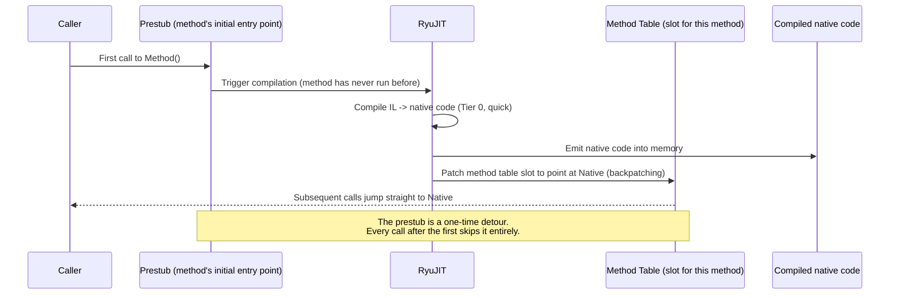
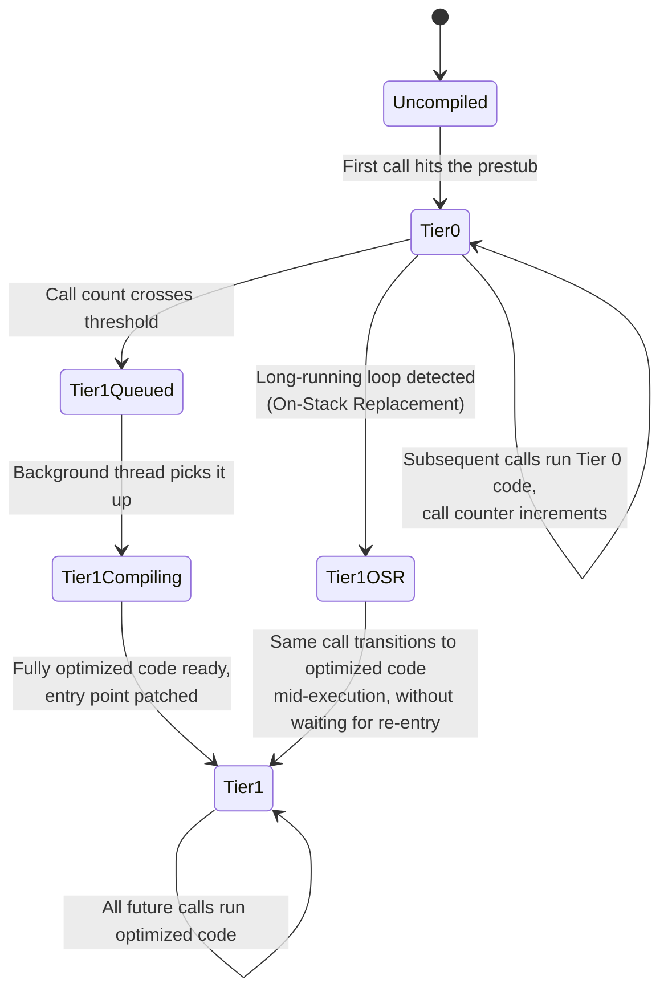
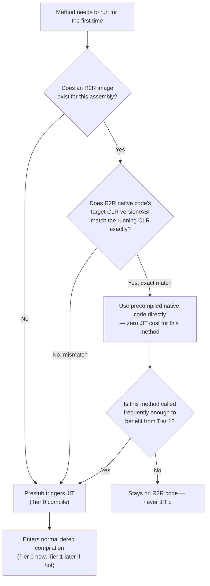
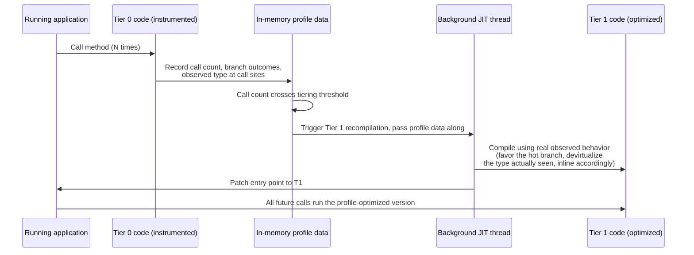
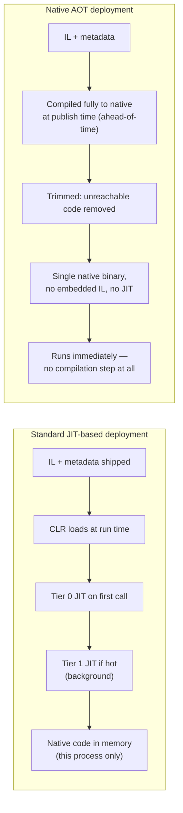

# Inside .NET — Episode 4
## JIT Compilation Explained

> *Part I — The Foundation*

---

### Introduction

Episode 3 opened the CLR as a managed execution environment — type system, method tables, vtables, load contexts. One phrase kept recurring without being unpacked: "the JIT compiles the method." Episode 2 established the fact of JIT compilation (IL → native code, lazily, on first call, cached for the process's life). This chapter is about the *mechanics* behind that one sentence, because "lazy compilation" undersells what RyuJIT actually does.

Modern .NET doesn't JIT a method once and call it done. It JITs a method *quickly* the first time, watches how often that method actually runs, and — if it's hot — throws it away and recompiles a fully optimized version in the background while the quick version keeps serving calls. It ships precompiled native code alongside IL for large chunks of the runtime and your own app (ReadyToRun), falling back to the JIT only when that precompiled code doesn't match the exact runtime it's running on. And in modern PGO, the "quick" first compilation isn't just cheap — it's instrumented, feeding real call-site and branch data into the decision of how to optimize the second compilation. None of this is optional add-on behavior; it's the default pipeline for every .NET application built since .NET Core 3.0, and understanding it is the difference between guessing at a startup-latency complaint and knowing exactly which tier, which cache, or which threshold to point at.

### The real-world analogy

Think of a chef working a dinner service, not a tailor cutting a suit (that one's taken — Episode 2).

- The very first ticket for a dish nobody's ordered tonight comes in. The chef doesn't stop to plate it perfectly — they get *something correct* onto the pass fast, because the table is waiting (**Tier 0: a quick, minimally optimized compile, prioritizing low latency over peak quality**).
- While cooking that first ticket, the chef is quietly counting: how many times has this exact dish been ordered tonight? Which garnish combination keeps coming up? (**Tier 0 code is instrumented — it records call counts and, under dynamic PGO, profile data like which branch is actually taken**.)
- Once that dish has been ordered enough times to justify it, the chef stops improvising per-ticket and works out the fully refined version — precise timing, ideal technique, ingredients prepped in the optimal order — and from then on serves *that* version, without disrupting service to do it (**Tier 1: full optimization, recompiled in the background using a separate thread, then the method's entry point is swapped over**).
- For dishes on the fixed menu that the kitchen *always* serves — the ones the head chef perfected and wrote into the prep book before service even opened — there's no improvisation step at all; the recipe card is already final (**ReadyToRun: precompiled native code shipped with the assembly, used as-is if it matches the exact kitchen — i.e., runtime version — it was written for**).
- And a food truck that only ever serves one exact, fixed menu, prepped and portioned entirely before the truck even opens for the day, needs no chef improvising anything at service time at all (**Native AOT: everything precompiled ahead of time, no JIT step at run time whatsoever**).

The chef never re-derives a dish they've already perfected from scratch on every ticket — that's the caching behavior from Episode 2. What's new here is that there isn't one compilation event per method; there's a *quick* one, optionally a *refined* one triggered by demand, and potentially none at all if someone already wrote the recipe card in advance.

### The problem being solved

Tiered compilation, R2R, and PGO exist because "just JIT everything fully on first call" and "just JIT everything minimally, always" are both wrong answers to different halves of the same question:

- **Startup latency vs. peak throughput is a real tradeoff, not a solved problem.** A method compiled with full optimization (aggressive inlining, loop unrolling, register allocation passes) takes measurably longer to *compile* than one compiled quickly — RyuJIT's optimizing passes are the expensive part, not the machine-code emission itself. For a method called once during startup and never again, that optimization cost is pure waste. For a method in a hot request-processing loop called millions of times, skipping optimization forever is *also* pure waste, just paid differently — every one of those millions of calls runs slower code. A single "always fully optimize" or "never optimize" policy loses on one side no matter which you pick.
- **You don't know which methods are hot until the program actually runs.** Static analysis at compile time can guess, but real branch behavior, real call frequency, and real data shapes only exist at run time. This is the entire premise of profile-guided optimization: the *best* optimization decisions are the ones informed by what the program actually does, not what it might do.
- **Precompiling everything ahead of time (R2R, Native AOT) solves startup cost only if the precompiled code is still valid for the machine it lands on.** A native code cache built for one exact CLR version, one exact set of JIT optimization behaviors, is not automatically safe to reuse if the running CLR differs — silently reusing mismatched native code would be a correctness and security problem, not just a performance one. So R2R's design has to include a fallback path, not just a fast path.

### Original visual explanation

#### 1. Prestub and first-call compilation



#### 2. Tiered compilation state machine



#### 3. ReadyToRun vs. JIT decision flow



#### 4. Dynamic PGO feedback loop



#### 5. Native AOT vs. JIT-based deployment, side by side



### Internal .NET mechanics

**1. The prestub — how a never-called method gets its first compile triggered.** When the type loader builds a method table (Episode 3), every method slot doesn't initially point at real code — it points at a small, shared piece of native code called the **prestub** (sometimes called the "pre-JIT stub" in CLR source). The prestub's entire job is: notice this method has never been compiled, ask the JIT to compile it now, and then **backpatch** the method table slot (and any call sites that had already been compiled to jump through that slot) so it points directly at the freshly compiled native code. Every call after the first bypasses the prestub entirely and jumps straight to native code — there is no "check if compiled" branch on the hot path; the redirection *is* the method table entry itself. This is the actual mechanism behind Episode 2's "first call pays a cost, later calls don't" — it's not a cache lookup, it's a one-time pointer rewrite.

**2. Tier 0 — quick JIT, deliberately.** Since .NET Core 3.0, tiered compilation is the default. The *first* real compilation of most methods (Quick JIT) skips RyuJIT's expensive optimization passes — minimal inlining, no loop optimizations, simpler register allocation — trading a slower runtime method for a much faster compile. Critically, Tier 0 code is also **instrumented**: it carries lightweight call-count hooks so the runtime knows how often each method actually executes without needing an external profiler attached. Loops are historically the one exception: a method with a loop that could run for a long time *before* ever getting recompiled was, for a long time, excluded from Quick JIT by default (`TC_QuickJitForLoops`, illustrative name — the underlying switch has existed under slightly different names/defaults across .NET versions) precisely because a slow Tier 0 version stuck in a long loop was worse than paying the optimizing-compile cost upfront. **On-Stack Replacement (OSR)** is the mechanism that eventually closed this gap properly: it lets a *currently executing* long-running loop transition to optimized code mid-flight, without waiting for the method to be re-entered from the top.

**3. Tier 1 — the background recompile.** Once a method's Tier 0 call counter crosses a threshold, the runtime queues a full, fully-optimized recompilation on a background thread — your application's calling threads are never blocked waiting for this. When the optimized version is ready, the same backpatching mechanism from step 1 redirects the method's entry point to it. From that point forward, every call runs the optimized native code; the Tier 0 version is discarded. This is why a long-running service (a web server, a background worker) tends to get measurably faster in its own steady state a few seconds to minutes after startup — it isn't caching effects or GC warm-up alone, it's methods graduating from Tier 0 to Tier 1 under real load.

**4. ReadyToRun — a versioned native code cache, not a magic skip.** R2R publishing embeds precompiled native code for (most of) an assembly's methods directly in the same file as its IL, produced by running the JIT ahead of time against a specific target runtime. At load time, if the running CLR's version and ABI expectations match exactly what the R2R image was compiled against, the CLR uses that native code directly — no JIT invocation for that method at all. If they don't match (a newer/older runtime, a different set of enabled CPU instruction-set extensions, certain configuration differences), the CLR **falls back to normal JIT compilation** for that method, transparently. This is the detail that's easy to get wrong: R2R is not "compiled once, run forever regardless of runtime" — it's a cache keyed by an exact runtime-version match, with JIT as the correctness-preserving fallback. It's also why R2R images are commonly *still* recompiled to Tier 1 later if a given R2R'd method turns out to be hot enough to benefit — R2R code typically starts at a quality level closer to Tier 0/minimally-optimized, not full Tier 1 optimization, so tiering can still promote it.

**5. Dynamic PGO — using Tier 0's instrumentation for something more than a counter.** Beyond plain call counts, modern .NET's dynamic PGO instruments Tier 0 (and, when enabled, R2R) code with lightweight profile counters: which branch of an `if` actually gets taken, what concrete type shows up at a polymorphic call site, which switch arm fires most. When the method is promoted to Tier 1, the optimizing JIT consumes that real profile data instead of guessing — favoring the observed hot branch in code layout, speculatively devirtualizing a call site that's seen one concrete type overwhelmingly often (with a guarded fallback for when it's wrong), and making inlining decisions based on what actually happens rather than static heuristics alone. This is strictly better information than a purely static optimizing compiler has, because it reflects *this program's actual runtime behavior*, not a generic assumption about typical code.

**6. Native AOT — removing the JIT step, not just deferring it further.** R2R still ships IL and still keeps the JIT available as a fallback. Native AOT is a different model entirely: the whole application (trimmed to only reachable code) is compiled to a single native binary at publish time, for one specific runtime identifier (RID) — there is no embedded IL for JIT fallback, no JIT compiler linked in, and no tiering, because there's nothing left to compile at run time. Garbage collection, exception handling, and the other CLR runtime services (Episode 3) are still present — they're statically linked into the binary — but the *compilation* half of the CLR's job is entirely gone. This is why Native AOT trades away specific dynamic capabilities: unbounded runtime reflection over arbitrary types, `Reflection.Emit`-style dynamic code generation, and anything that fundamentally assumes IL is still around to compile on demand, generally can't work (or need explicit compatibility annotations/trimming feature switches) under Native AOT — the runtime genuinely cannot fall back to JIT-compiling something it wasn't told about ahead of time.

### C# implementation

```csharp
// Program.cs — .NET 10 console app
using System.Diagnostics;
using System.Runtime.CompilerServices;

Console.WriteLine("=== Inside .NET: Episode 4 demo — Tiered Compilation in action ===");
Console.WriteLine();

// 1. Inspect runtime feature flags relevant to JIT behavior. These report what
//    THIS running CLR supports/has enabled — not universal constants.
Console.WriteLine("-- RuntimeFeature flags --");
Console.WriteLine($"IsDynamicCodeSupported : {RuntimeFeature.IsDynamicCodeSupported}");
Console.WriteLine($"IsDynamicCodeCompiled  : {RuntimeFeature.IsDynamicCodeCompiled}");
// Under Native AOT, IsDynamicCodeCompiled is false (nothing is JIT-compiled at run
// time); under the standard JIT-based model used here, it's true.

Console.WriteLine();
Console.WriteLine("-- Observing Tier 0 -> Tier 1 promotion via batch timing --");
Console.WriteLine("(A hot method starts on quick, minimally-optimized Tier 0 code.");
Console.WriteLine(" After enough calls, the background JIT swaps in a fully");
Console.WriteLine(" optimized Tier 1 version. We can't force this to happen at an");
Console.WriteLine(" exact call count, but running enough batches typically surfaces");
Console.WriteLine(" a clear drop and then a plateau in per-batch time.)");
Console.WriteLine();

const int batches = 12;
const int callsPerBatch = 2_000_000;

Console.WriteLine($"{"Batch",6} | {"Calls",10} | {"Elapsed (ms)",12} | {"ns/call",10}");
Console.WriteLine(new string('-', 46));

long total = 0;
for (int batch = 1; batch <= batches; batch++)
{
    var sw = Stopwatch.StartNew();
    for (int i = 0; i < callsPerBatch; i++)
    {
        total += HotMethod(i);
    }
    sw.Stop();

    double nsPerCall = sw.Elapsed.TotalMilliseconds * 1_000_000.0 / callsPerBatch;
    Console.WriteLine($"{batch,6} | {callsPerBatch,10} | {sw.Elapsed.TotalMilliseconds,12:F3} | {nsPerCall,10:F2}");
}

Console.WriteLine();
Console.WriteLine($"(checksum, to keep the JIT from eliminating the loop entirely: {total})");
Console.WriteLine();
Console.WriteLine("Expect the earliest batches to be slower and noisier (Tier 0,");
Console.WriteLine("still warming up / promoting) and later batches to settle into a");
Console.WriteLine("faster, more stable ns/call figure (Tier 1, fully optimized) —");
Console.WriteLine("exact batch numbers vary by machine, load, and CLR version.");

// A small, branch-containing, arithmetic-heavy method — deliberately simple so the
// *tiering effect* dominates the timing signal rather than algorithmic complexity.
[MethodImpl(MethodImplOptions.NoInlining)]
static long HotMethod(int n)
{
    long x = n;
    if ((n & 1) == 0)
    {
        x = x * 3 + 1;
    }
    else
    {
        x = x ^ (x << 2);
    }
    return x % 97;
}
```

`NoInlining` is deliberate: it forces every call to actually go through `HotMethod`'s own compiled entry point (Tier 0, then Tier 1) rather than letting the JIT fold it into the caller, which would defeat the point of observing tiering behavior at all. Run it with `dotnet run` in [`code/`](code/Chapter03.Demo/) — for a more authoritative view of *which tier a method is actually running in* at any point, set `DOTNET_TieredCompilation=0` as an environment variable before running and compare timings (with tiering fully disabled, every batch should look roughly like Tier-1-quality performance from the start, since everything JITs straight to full optimization).

### Common mistakes

- **Assuming R2R means "this method literally never gets JIT'd."** It means "this method's native code is *available* without JIT'ing it, if the running CLR matches exactly." A version mismatch silently falls back to JIT; a hot R2R'd method can still be promoted to Tier 1 by tiered compilation later. Treating R2R as an unconditional performance ceiling instead of a startup-time optimization leads to wrong conclusions about steady-state throughput.
- **Confusing "Quick JIT" with "the JIT is broken/buggy on this method."** Tier 0 code is *intentionally* less optimized — that's not a defect, it's the entire design. Benchmarking a method's very first few calls and concluding "JIT compilation makes this slow" without accounting for tiering conflates a one-time, by-design cost with the method's actual steady-state performance.
- **Disabling tiered compilation "for performance" without measuring.** `DOTNET_TieredCompilation=0` forces every method straight to fully-optimized code on first call — this can genuinely help a short-lived CLI tool with almost no hot loops, but it makes *startup* strictly slower for anything with many rarely-hot methods, which is the opposite of what most people reaching for this switch actually want. It's a diagnostic tool for understanding tiering, not a default production setting.
- **Writing microbenchmarks that don't account for tiering at all.** A naive "time this method once" benchmark, run in a normal `dotnet run` console app, is measuring some undefined mix of Tier 0 compile cost, Tier 0 execution, and possibly a mid-benchmark promotion to Tier 1 — not the method's real optimized performance. This is precisely why BenchmarkDotNet exists and does explicit warm-up iterations before recording measurements; hand-rolled `Stopwatch` loops without enough iterations reproduce this mistake constantly.
- **Assuming Native AOT is a strictly-better drop-in replacement.** It removes JIT overhead and shrinks memory/startup cost, but it also removes the safety net of "the runtime can JIT-compile whatever it's given at run time." Code that relies on unbounded reflection, dynamic assembly loading, or `Reflection.Emit` needs to be audited — and often reworked — before it behaves identically under Native AOT.

### Performance considerations

- **Tier 0 vs. Tier 1 is the startup-latency/throughput knob, and it's on by default for good reason.** For the overwhelming majority of applications, leaving tiered compilation enabled is correct: most methods in a typical app are called a handful of times and never need Tier 1 at all, while the genuinely hot paths get promoted automatically without any code change.
- **R2R is a startup-time win, most valuable for large, rarely-changing assemblies.** This is exactly why the shared framework (the BCL itself) ships R2R-compiled — the runtime team can guarantee the exact CLR version match, eliminating a huge amount of JIT work on every app's startup, for free, without every app author doing anything.
- **Dynamic PGO's benefit scales with how "surprising" real branch/type behavior is versus static heuristics.** Code with genuinely unpredictable static shape but stable *runtime* shape (a `switch` where one case dominates 95% of the time in production, but isn't obviously dominant from reading the code) is exactly where PGO earns its keep over a purely static optimizer.
- **Native AOT's win is concentrated in cold-start-sensitive deployment shapes** — CLI tools, containers scaled to zero, functions billed by wall-clock execution time — and comes with real costs: no shared-framework deduplication across processes (each AOT binary is self-contained and larger on disk), and per-RID publishing (a separate binary per OS/architecture combination, rather than one portable IL artifact).
- **Measure with the right tool for the right question.** `DOTNET_JitStdOutFile` / `DOTNET_JitDisasm` (illustrative env var names — check current `dotnet/runtime` docs for exact current spellings) dump actual JIT disassembly and tier information for a method; `dotnet-trace` can capture JIT events (including tier transitions) over a real run; a hand-rolled `Stopwatch` loop, absent careful warm-up handling, mostly measures tiering artifacts rather than the thing you meant to measure.

### Interview questions

**Q1: Walk me through exactly what happens the very first time a method is called, at the mechanism level.**
A: The method table slot for that method doesn't point at real code yet — it points at a shared "prestub." The prestub notices the method has never been compiled, invokes the JIT (Quick JIT / Tier 0 by default) to produce native code, and then backpatches the method table slot — and any already-compiled call sites — to point directly at that native code going forward. Every subsequent call bypasses the prestub entirely; there's no runtime "is this compiled?" check on the hot path, because the redirection is baked into the pointer itself.

**Q2: What's the actual difference between Tier 0 and Tier 1, and why keep both instead of always compiling fully optimized code?**
A: Tier 0 is a quick compile — reduced inlining, simpler register allocation, no loop optimization — that also instruments the method with call-count (and, under dynamic PGO, branch/type) hooks. Tier 1 is the fully optimized recompile, triggered once a method's call count crosses a threshold, compiled on a background thread so it never blocks the calling threads, and swapped in via the same backpatching mechanism as the original prestub redirect. Keeping both exists because compiling everything fully optimized upfront makes startup slower for methods that barely run, while never optimizing anything makes every hot path permanently slower — tiering gets close to the best of both without requiring the developer to identify hot methods manually.

**Q3: How does ReadyToRun actually work, and what happens if the R2R image doesn't match the running CLR?**
A: R2R publishing embeds precompiled native code for an assembly's methods alongside its IL, compiled ahead of time against a specific target runtime version/ABI. At load time, if the running CLR matches that target exactly, the precompiled native code is used directly with zero JIT invocation for that method. If it doesn't match — different runtime version, different enabled instruction-set extensions, etc. — the CLR falls back to normal JIT compilation for that method transparently. It's a versioned cache with a correctness-preserving fallback, not an unconditional bypass of the JIT.

**Q4: What does dynamic PGO add on top of plain tiered compilation?**
A: Plain tiered compilation only needs a call counter to decide when to promote a method to Tier 1. Dynamic PGO adds richer instrumentation to Tier 0 (and R2R) execution — which branch is actually taken, what concrete type shows up at a call site — so that when the method is promoted, the optimizing JIT can make decisions based on the program's real observed behavior: favoring the hot branch, speculatively devirtualizing a dominant call-site type with a guarded fallback, and inlining based on real frequency rather than static heuristics alone.

**Q5: If you needed the absolute fastest possible cold start for a small CLI tool, what would you reach for, and what would you give up?**
A: Native AOT — it removes the JIT step and CLR-loading-from-IL step entirely, compiling the whole trimmed application to one native binary ahead of time, which gets startup close to a native C/C++ binary's. The cost is losing scenarios that fundamentally depend on IL being present to compile on demand — unbounded reflection, runtime code generation (`Reflection.Emit`), certain plugin-loading patterns — plus needing a separate published binary per target OS/architecture instead of one portable IL artifact.

### Key takeaways

- A method's first call is redirected through a shared "prestub" that triggers JIT compilation and then backpatches the method's entry point to the compiled native code — there's no runtime dispatch check afterward, just a rewritten pointer.
- Tiered compilation (default since .NET Core 3.0) compiles most methods quickly and minimally-optimized first (Tier 0, instrumented with call-count hooks), then recompiles hot methods fully optimized in the background (Tier 1) once a call-count threshold is crossed.
- ReadyToRun ships precompiled native code alongside IL as a versioned cache keyed to an exact CLR match — used directly when it matches, falling back to normal JIT compilation transparently when it doesn't.
- Dynamic PGO extends Tier 0's instrumentation beyond call counts to real branch and call-site-type data, which Tier 1 recompilation uses to make optimization decisions based on actual observed behavior instead of static heuristics.
- Native AOT removes the JIT step from the equation entirely — full ahead-of-time compilation and trimming — trading dynamic-codegen/reflection flexibility and single-portable-binary convenience for near-instant startup and a smaller memory footprint.

### What's next

[Episode 5 — Assemblies, DLLs & Metadata](../004-assemblies-metadata/article.md) steps back from the JIT itself to the container it operates on: what's actually inside a compiled assembly's metadata tables, how strong naming and versioning work, and how the loader resolves a reference from one assembly to another before any of the compilation machinery in this chapter ever gets a chance to run.
