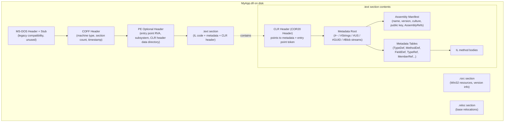
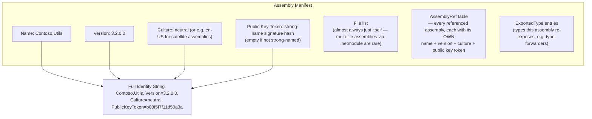
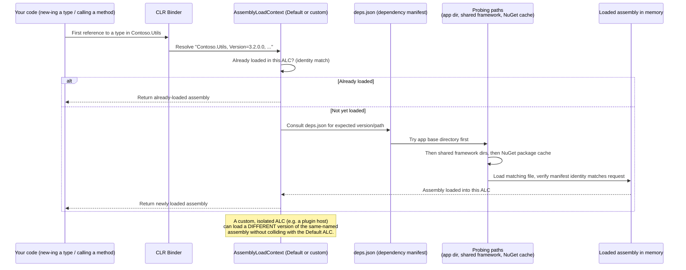
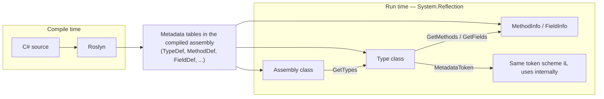

# Inside .NET — Episode 5
## Assemblies, DLLs & Metadata

> *Part I — The Foundation*

---

### Introduction

Episode 4 ended on a specific promise: step back from the JIT itself to the container it operates on. Every mechanism covered so far — the type loader building method tables (Episode 3), the prestub triggering compilation, R2R's versioned native-code cache (Episode 4) — reads metadata out of an assembly to do its job. None of it works if the assembly doesn't first answer three questions unambiguously: *what type is this, exactly?*, *which assembly does it come from, exactly?*, and *is the assembly I loaded the one the caller actually meant?*

Most developers treat a `.dll` as "the compiled version of my project" and leave it there. That's not wrong, but it skips the part that actually matters at the architecture level: an assembly is the CLR's unit of *versioning* and *type identity*, not merely a file extension. Two DLLs named `Contoso.Utils.dll`, byte-identical in every way except a version number embedded in one field of one metadata table, are — as far as the CLR is concerned — two completely unrelated identities. That distinction is the entire reason strong naming, `AssemblyLoadContext` isolation (Episode 3), and the "why do I have two versions of the same NuGet package loaded" bugs you've debugged at 2 a.m. all exist. This chapter opens the file up and shows exactly which bytes make that true.

### The real-world analogy

Think of a book's front matter and back matter, not the story itself.

- A book's **ISBN** is a globally unique identifier — no other book, not even a different edition of the *same* book, is allowed to reuse it (**an assembly's identity**: name + version + culture + public key token, together, not name alone).
- The **table of contents** lists every chapter and section *by name*, with page numbers you can jump to directly, instead of forcing a reader to scan the whole book to find "Chapter 7" (**metadata tables** — `TypeDef`, `MethodDef`, `FieldDef` — listing every type and member with a direct lookup handle instead of a linear text search).
- The **bibliography** lists every other book this one cites, by title, edition, and publisher — precisely enough that a librarian can go fetch the *exact* referenced edition, not just "something by that author" (**`AssemblyRef` entries and the assembly manifest's list of referenced assemblies**, each pinned to a specific version and public key token).
- A **footnote marker** in the body text — a small superscript number — doesn't repeat the full citation inline; it's a compact pointer into the bibliography that the reader (or the CLR) resolves on demand (**a metadata token embedded in IL**, resolved against a metadata table at JIT time instead of carrying a fully qualified name at every use site).
- A library **doesn't shelve two different books under the assumption their ISBNs might collide** — it treats ISBN collision as index corruption, not as "these must be the same book" (**why the CLR treats two assemblies with matching names but different versions/keys as distinct identities, never as interchangeable**).

The book doesn't just contain the story — it contains a self-describing index of itself and a precise list of everything it depends on. That's what an assembly is: your compiled code, plus a manifest and metadata that make the whole thing self-describing enough for the CLR to load, verify, and resolve without ever re-parsing your original source.

### The problem being solved

Why does .NET need this much ceremony — headers, manifests, metadata tables, tokens, strong names — around what could just be "a blob of compiled instructions"?

- **IL alone is not self-describing.** A pure instruction stream that says "call the method at offset X" only works if every consumer agrees on what's at offset X, forever, which breaks the moment code is compiled separately from its dependencies (which is *always*, in any real software). Metadata tables replace fragile offsets with named, typed, independently verifiable descriptions of every type and member — this is also *why* reflection (covered later in this chapter) is possible at all: the descriptions the loader consumes are the same descriptions your code can query at run time.
- **"Which version of this dependency am I actually running against?" cannot be a guess.** Without an explicit identity (name, version, culture, public key token) baked into both the producing assembly and every consumer's reference to it, "loads whatever `Contoso.Utils.dll` happens to be sitting in the folder" becomes the de facto resolution algorithm — which is exactly the DLL Hell that strong naming and the modern resolution algorithm (deps.json, probing paths) exist to eliminate.
- **Compact, verifiable cross-references are a hard requirement, not a nicety.** Every `call`, `newobj`, or field access in IL needs to reference a type or member defined possibly in a different assembly entirely. Embedding a fully qualified string name at every one of those thousands of call sites would be slow to parse, easy to corrupt, and impossible to verify cheaply. **Metadata tokens** — small integers that index directly into a metadata table — solve this the same way a footnote number solves "don't retype the whole citation every time you reference it."
- **Portability (Episode 2) needs a container format that isn't .NET-specific.** Reusing the Windows PE/COFF format — rather than inventing a new one — meant .NET assemblies could be loaded, inspected, and executed (as native apphosts) using decades of existing OS-level tooling and loader conventions, even on Linux and macOS where CoreCLR reimplements the equivalent loading semantics without literally being the Windows PE loader.

### Original visual explanation

#### 1. PE/COFF file layout of a .NET assembly



#### 2. From IL instruction to resolved member — the token resolution flow

```mermaid
sequenceDiagram
    participant IL as IL method body
    participant Token as Metadata token (e.g. 0x0A00001B)
    participant Tables as Metadata tables
    participant Resolver as CLR type/member resolver
    participant Target as Resolved MethodDesc / FieldDesc

    IL->>Token: call 0x0A00001B
    Note over Token: Top byte (0x0A) identifies the table<br/>(MemberRef); remaining bytes are the row index
    Token->>Tables: Look up row in MemberRef table
    Tables->>Tables: Row references a TypeRef (defining type)<br/>+ name + signature (via #Strings/#Blob streams)
    Tables->>Resolver: Hand resolver the (type, name, signature) triple
    Resolver->>Resolver: If type is external, resolve owning assembly<br/>via AssemblyRef, load it if not already loaded
    Resolver->>Target: Bind to concrete MethodDesc in target assembly
    Target-->>IL: JIT emits a direct call to the resolved native entry point
```

#### 3. Assembly manifest anatomy



#### 4. Assembly resolution and probing sequence



#### 5. Reflection's relationship to the metadata it reads



### Internal .NET mechanics

**1. PE/COFF is borrowed, not reinvented.** A .NET assembly is a valid Windows PE (Portable Executable) / COFF (Common Object File Format) binary — the same container format `.exe` and native `.dll` files on Windows use. This is deliberate: it lets OS-level tooling (loaders, signing tools, antivirus scanners) recognize the file's basic shape without knowing anything about .NET. What makes it a *.NET* assembly specifically is a **CLR header** (historically called the COR20 header) referenced from the PE optional header's data directories, pointing at the metadata root and, for executables, the managed entry point's metadata token. On non-Windows platforms, CoreCLR's loader parses this same PE/COFF structure directly — it doesn't rely on the OS's native PE loader, since Linux and macOS don't have one, but it reads the identical on-disk format for cross-platform consistency.

**2. The metadata root and its streams.** Inside the CLR header's target lives the metadata root, which fans out into several named streams: `#~` (or `#-` for edit-and-continue-generated assemblies) holds the actual metadata tables in compressed, indexed form; `#Strings` holds every identifier (type names, method names) as UTF-8; `#US` holds user string literals referenced by IL (`ldstr` targets); `#GUID` and `#Blob` hold binary data like signatures and custom attribute payloads. Tables reference strings and blobs by offset into these streams rather than embedding text inline, which is part of why metadata is so compact — a type used 200 times across a codebase stores its name once.

**3. Metadata tables — the actual index.** The `#~` stream contains a fixed set of table types, each a simple array of fixed-shape rows. The ones that matter most day-to-day:
   - **`TypeDef`** — one row per type *defined* in this assembly: name, namespace, base type, flags (visibility, whether it's an interface/abstract/sealed), and pointers to its first `MethodDef`/`FieldDef` rows.
   - **`MethodDef`** — one row per method defined in this assembly: name, signature (blob reference), IL code RVA (where the actual bytecode lives), flags (static/virtual/abstract).
   - **`FieldDef`** — same idea for fields: name, signature, flags.
   - **`TypeRef`** — one row per type *referenced* from this assembly but *defined elsewhere* (another assembly, or another module) — name plus a resolution scope pointing at which `AssemblyRef` (or module) owns it.
   - **`MemberRef`** — one row per method or field referenced from elsewhere, analogous to `TypeRef` but for members instead of types.
   - **`AssemblyRef`** — one row per assembly this one depends on, carrying that dependency's full identity (name, version, culture, public key token) — this table is the machine-readable half of "the bibliography" from the analogy.

**4. Metadata tokens — the compact reference mechanism.** Every `call`, `newobj`, `ldfld`, or type reference in IL doesn't embed a name — it embeds a 4-byte **metadata token**. The high byte identifies *which table* the token points into (`0x02` = `TypeDef`, `0x01` = `TypeRef`, `0x06` = `MethodDef`, `0x0A` = `MemberRef`, and so on — these values are fixed by the ECMA-335 spec), and the remaining three bytes are the 1-based row index into that table. Resolving a token is therefore an O(1) array index followed by a signature/name lookup — not a string search — which is exactly why IL can reference thousands of members across dozens of assemblies without a runtime name-resolution cost anywhere close to what a naive string-keyed lookup would impose. This is the literal mechanism behind `Type.MetadataToken` and `MethodBase.MetadataToken` in `System.Reflection` — reflection isn't inventing a parallel numbering scheme, it's surfacing the same tokens IL already uses.

**5. Strong naming and assembly identity.** An assembly's full identity is the 4-tuple: **simple name**, **version** (`Major.Minor.Build.Revision`), **culture** (`neutral`, or a specific locale for satellite resource assemblies), and **public key token** (an 8-byte hash of the full public key, present only if the assembly is strong-named). The CLR treats this whole tuple as the identity — not the simple name alone. Strong naming works by signing the assembly's metadata hash with a private key at build time and embedding the corresponding public key (or its token) in the manifest; this proves the assembly hasn't been tampered with since signing and lets two publishers safely ship assemblies with the same simple name (`Utils.dll`) without any identity collision, because their public keys differ. Two assemblies named `Contoso.Utils`, one at `1.0.0.0` and one at `2.0.0.0`, are — as far as the CLR's loader and type system are concerned — as unrelated as two entirely differently-named libraries; a `Contoso.Utils.Widget` type from one is not assignable to a `Contoso.Utils.Widget` type from the other, even though the source code is identical, because type identity in the CLR is `(assembly identity, type name)`, not type name alone.

**6. Assembly resolution — how a reference actually gets satisfied.** When your code first touches a type from a referenced assembly, the CLR binder asks the current `AssemblyLoadContext` (Episode 3) to resolve that assembly's identity. For a normal `dotnet run`/framework-dependent deployment, resolution consults `<app>.deps.json` — generated at build/publish time, listing every dependency's expected version and relative path — then probes, in order: the application's own base directory, the shared framework directories for the resolved runtime version, and the NuGet package cache (`~/.nuget/packages` or the configured global packages folder) for package-based dependencies. The first candidate whose on-disk manifest identity actually matches what was requested wins; a name match with a *different* version or public key token is not a match and does not satisfy the reference — it's either ignored or triggers a `FileNotFoundException`/`FileLoadException` depending on exactly what mismatched. `AssemblyLoadContext.Default` handles this algorithm for the ordinary case; a custom `AssemblyLoadContext` (used for plugin isolation) can override `Load`/resolution entirely, which is how a host process loads two different versions of the same-named plugin dependency side by side without collision — each version lives in its own ALC, and identity resolution never has to reconcile across ALC boundaries.

**7. Reflection is metadata, queried at run time instead of load time.** `System.Reflection`'s `Assembly`, `Type`, `MethodInfo`, `FieldInfo`, and friends are not a separate description of your code — they're a managed API surface over the exact same metadata tables the loader and JIT already consume. `Assembly.GetTypes()` walks the `TypeDef` table; `Type.GetMethods()` walks `MethodDef` rows scoped to that type; `Assembly.GetReferencedAssemblies()` reads the `AssemblyRef` table directly back out as `AssemblyName` objects. This is precisely why reflection can be slow relative to statically-known code paths — it's doing table lookups and signature parsing at run time that the JIT would otherwise have resolved once via a token and never revisited — and precisely why Native AOT (Episode 4) restricts unbounded reflection: if metadata for a type was trimmed away because static analysis couldn't prove it was reachable, there's no table left for `Type.GetType("SomeTypeName")` to find at run time.

### C# implementation

```csharp
// Program.cs — .NET 10 console app
using System.Reflection;

Console.WriteLine("=== Inside .NET: Episode 5 demo — Assembly manifest & metadata ===");
Console.WriteLine();

Assembly self = Assembly.GetExecutingAssembly();

// 1. Assembly identity — the 4-tuple the CLR actually treats as "this assembly."
AssemblyName name = self.GetName();
Console.WriteLine("-- Assembly identity (the manifest, decoded) --");
Console.WriteLine($"Simple name     : {name.Name}");
Console.WriteLine($"Version         : {name.Version}");
Console.WriteLine($"Culture         : {(string.IsNullOrEmpty(name.CultureName) ? "neutral" : name.CultureName)}");

byte[]? pkt = name.GetPublicKeyToken();
string pktDisplay = (pkt is { Length: > 0 })
    ? Convert.ToHexString(pkt).ToLowerInvariant()
    : "(none — not strong-named)";
Console.WriteLine($"Public key token: {pktDisplay}");
Console.WriteLine($"Full identity   : {self.FullName}");
Console.WriteLine($"On-disk location: {self.Location}");
Console.WriteLine();

// 2. AssemblyRef table — every assembly THIS one depends on, each with its own
//    identity. This is reading the manifest's dependency list directly.
Console.WriteLine("-- Referenced assemblies (AssemblyRef table) --");
AssemblyName[] refs = self.GetReferencedAssemblies();
foreach (AssemblyName r in refs.OrderBy(r => r.Name))
{
    Console.WriteLine($"  {r.Name,-30} v{r.Version}");
}
Console.WriteLine($"  ({refs.Length} referenced assemblies total)");
Console.WriteLine();

// 3. TypeDef table — every type actually defined in this assembly.
Console.WriteLine("-- Types defined in this assembly (TypeDef table) --");
Type[] types = self.GetTypes();
foreach (Type t in types)
{
    Console.WriteLine($"  {t.FullName}  [token: 0x{t.MetadataToken:X8}]");
}
Console.WriteLine();

// 4. MethodDef rows for one specific type, plus their metadata tokens — the exact
//    integers IL uses internally (call/newobj operands) instead of names.
Type demoType = typeof(MetadataDemo);
Console.WriteLine($"-- Methods on {demoType.Name} (MethodDef table), with tokens --");
MethodInfo[] methods = demoType.GetMethods(BindingFlags.Public | BindingFlags.Static | BindingFlags.DeclaredOnly);
foreach (MethodInfo m in methods)
{
    Console.WriteLine($"  {m.Name,-20} token=0x{m.MetadataToken:X8}  declaring type token=0x{m.DeclaringType!.MetadataToken:X8}");
}
Console.WriteLine();

// 5. Prove metadata tokens are stable, compact handles: resolving the SAME token
//    twice against this module returns the SAME MethodBase, no name lookup needed.
Module module = demoType.Module;
int firstToken = methods[0].MetadataToken;
MethodBase resolvedAgain = module.ResolveMethod(firstToken)
    ?? throw new InvalidOperationException("Token did not resolve — should be impossible for a token we just read.");
Console.WriteLine("-- Resolving a metadata token back to a member --");
Console.WriteLine($"Token 0x{firstToken:X8} resolves to: {resolvedAgain.Name}");
Console.WriteLine($"Same member as original lookup: {ReferenceEquals(methods[0].Name, resolvedAgain.Name) || methods[0].Name == resolvedAgain.Name}");

// A small type purely so the demo has something concrete to enumerate members of.
static class MetadataDemo
{
    public static int Add(int a, int b) => a + b;
    public static string Describe(object o) => o.ToString() ?? "(null)";
    public static void NoOp() { }
}
```

Run it with `dotnet run` in [`code/Chapter04.Demo/`](code/Chapter04.Demo/). The metadata tokens printed for `MetadataDemo`'s methods are the literal 4-byte values that would appear as `call` operands in any IL that invokes them — you can confirm this by pasting the same type into [sharplab.io](https://sharplab.io), switching the view to IL, and matching the token in a `call` instruction against what this program prints.

### Common mistakes

- **Treating an assembly's simple name as its identity.** `Newtonsoft.Json, Version=12.0.0.0` and `Newtonsoft.Json, Version=13.0.0.0` are different identities to the CLR — this is the root cause of most "it works in one project but throws `FileLoadException` / `MissingMethodException` in another" bugs: two dependency chains pinned different versions of the same simple name, and no amount of "but the DLL is named the same" changes that they're not interchangeable.
- **Assuming strong naming is a security boundary.** A public key token proves the assembly hasn't been altered since signing and disambiguates identity — it says nothing about whether the code inside is trustworthy or safe to run. Conflating strong naming with code signing/authenticode or with sandboxing is a common and incorrect leap.
- **Assuming multi-file assemblies (via `.netmodule`) are a thing you'll encounter.** The ECMA-335 spec permits an assembly to span multiple files, but the C# tooling ecosystem essentially never produces this in practice — in real-world .NET code, "one assembly" and "one PE file" are safe to treat as synonymous, and assuming otherwise (writing code that tries to handle multi-file assemblies generically) is solving a problem you won't actually hit.
- **Manually building fully-qualified type-name strings for `Type.GetType()` and getting the assembly-qualified name subtly wrong.** `Type.GetType("Contoso.Widget, Contoso.Utils")` requires the *exact* assembly identity string (or enough of it to be unambiguous) — a version or public key token mismatch fails silently-ish (returns `null` rather than throwing, by default) rather than loading "close enough."
- **Believing `deps.json` and probing paths are optional ceremony you can ignore until something breaks.** They're the actual resolution algorithm, not a fallback — self-contained deployments and framework-dependent deployments resolve dependencies through genuinely different paths, and "works with `dotnet run` but fails when published/containerized" is very often a probing-path or `deps.json`-content mismatch, not a code bug.

### Performance considerations

- **Metadata parsing at load time is cheap by design, not by accident.** Tables are fixed-width rows with offset-based string/blob references specifically so the loader can memory-map and index them without a parsing pass proportional to how much *code* the assembly contains — this is part of why assembly load time scales much better with metadata table size than with total IL size.
- **Reflection has a real, measurable cost relative to statically resolved calls.** `Type.GetMethod("Name")` performs a name-based scan and signature match against `MethodDef` rows at run time — orders of magnitude slower than a JIT-resolved direct or virtual call, which pays that resolution cost once, at compile/JIT time, via a token. Caching `MethodInfo`/`PropertyInfo` lookups (rather than re-resolving by name on every call) and preferring compiled delegates (`Delegate.CreateDelegate`) or source-generated alternatives (`System.Text.Json`'s source generator, for example) over repeated raw reflection in hot paths is the standard mitigation.
- **Large `AssemblyRef` graphs cost real startup time.** Every referenced assembly your app touches has to be resolved (probed, opened, manifest-verified) before its types can load — trimming unused package references and being deliberate about transitive dependency graphs is a legitimate startup-latency lever, not just a hygiene concern, especially in serverless/cold-start-sensitive deployments (Episode 4's Native AOT discussion is the extreme end of this same lever).
- **Strong-name signature verification has a (small, one-time) cost, and skip-verification settings exist for a reason.** Historically, full strong-name signature verification on every load was measurable enough that .NET introduced mechanisms to skip it for fully-trusted scenarios; in modern .NET, strong naming is primarily about identity/versioning rather than a security gate, so this cost is largely moot for typical application code today.

### Interview questions

**Q1: What, precisely, makes two assemblies "the same" to the CLR — and what doesn't?**
A: Identity is the 4-tuple: simple name, version, culture, and public key token (if strong-named). Two assemblies matching on simple name alone but differing in any of the other three are different identities — the CLR does not treat them as interchangeable, will not silently substitute one for the other, and a type from one is not assignable to the "same" type from the other. File path, file name, or byte-for-byte content similarity is irrelevant to identity.

**Q2: How does IL reference a method defined in another assembly without embedding its full name at every call site?**
A: Via a metadata token — a 4-byte value where the top byte identifies the metadata table (e.g., `MemberRef` for an externally-defined member) and the rest is a row index. That row references a `TypeRef` (which assembly/type it belongs to) plus a name and signature stored once in the `#Strings`/`#Blob` streams. Resolving the token is an indexed table lookup, not a string search, and the name/signature is stored exactly once regardless of how many call sites reference it.

**Q3: Walk through what happens when your code references an assembly that isn't loaded yet.**
A: The CLR binder asks the current `AssemblyLoadContext` to resolve the requested identity (name, version, culture, public key token). For the default framework-dependent case, it consults the app's `deps.json` for the expected version and path, then probes the app base directory, the shared framework directories, and the NuGet package cache in order. The first file whose actual on-disk manifest identity matches the request is loaded into that `AssemblyLoadContext`; a name match with a mismatched version/key does not satisfy the reference.

**Q4: Why would you deliberately load two different versions of the same-named assembly in one process, and how?**
A: Plugin-style hosting, where independently-built plugins may depend on different versions of a shared library and you can't force them to agree. You load each plugin (and its dependency closure) into its own custom `AssemblyLoadContext` instead of the shared `Default` context — each ALC resolves its own references independently, so two ALCs can each hold a different version of "the same" assembly name without the loader treating that as a conflict, because identity resolution is scoped per-ALC.

**Q5: Is strong naming a security feature?**
A: Not in the way people often assume. It proves the assembly's metadata hasn't changed since it was signed with a given private key, and it lets the public key token participate in identity so two publishers can use the same simple name without collision. It does not vouch for the trustworthiness of the code inside, isn't a sandboxing mechanism, and isn't equivalent to code-signing/Authenticode, which addresses a different trust question (who published this file) at the OS/publisher level rather than the CLR-identity level.

### Key takeaways

- An assembly is the CLR's unit of deployment, versioning, and type identity — not just a compiled-code file; identity is the 4-tuple (name, version, culture, public key token), not the simple name alone.
- The PE/COFF container (borrowed from Windows executables, parsed identically cross-platform by CoreCLR) holds a CLR header pointing at a metadata root, which fans out into streams (`#~`, `#Strings`, `#US`, `#Blob`, `#GUID`) backing the actual metadata tables.
- `TypeDef`/`MethodDef`/`FieldDef` describe what's defined in this assembly; `TypeRef`/`MemberRef`/`AssemblyRef` describe what's referenced from elsewhere — and IL never embeds full names at call sites, only compact metadata tokens indexing into these tables.
- Assembly resolution is a defined algorithm, not best-effort file-finding: `deps.json` plus ordered probing (app directory, shared framework, NuGet cache), scoped per-`AssemblyLoadContext`, is what actually decides which file satisfies a reference.
- `System.Reflection` (`Assembly`, `Type`, `MethodInfo`) is a run-time query surface over the exact same metadata tables the loader and JIT consume — not a separate description — which is why it's powerful, why it has a real performance cost relative to statically resolved code, and why Native AOT's trimming can remove the very tables it depends on.

### What's next

[Episode 6 — Stack vs Heap](../005-stack-vs-heap/article.md) leaves the assembly's static structure behind and moves into what happens the moment your code actually runs and starts allocating — opening Part II, Memory, with the foundational split every .NET memory topic after it builds on.
