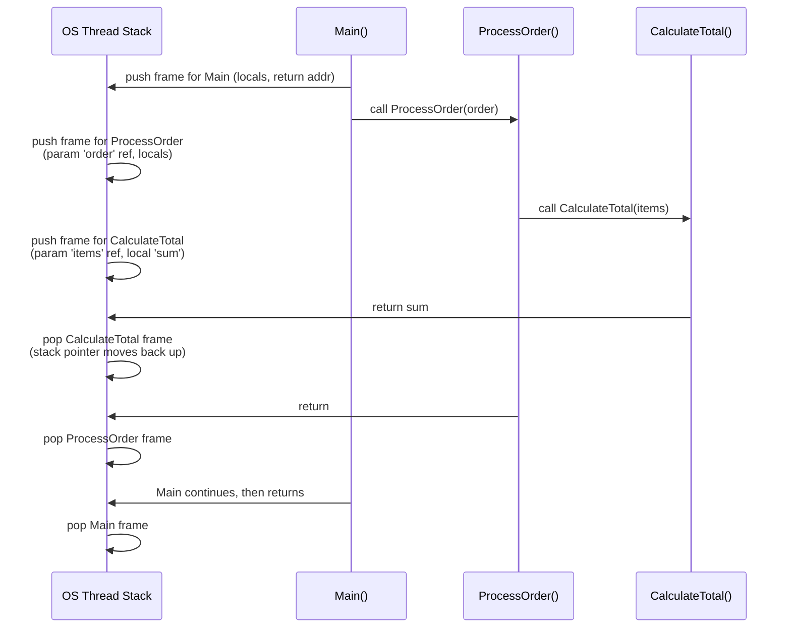
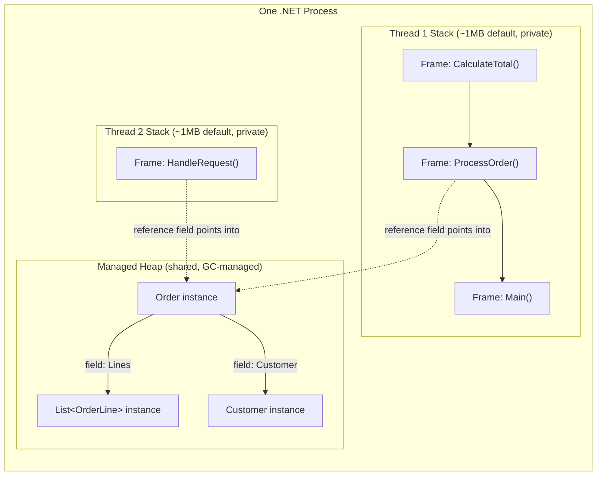
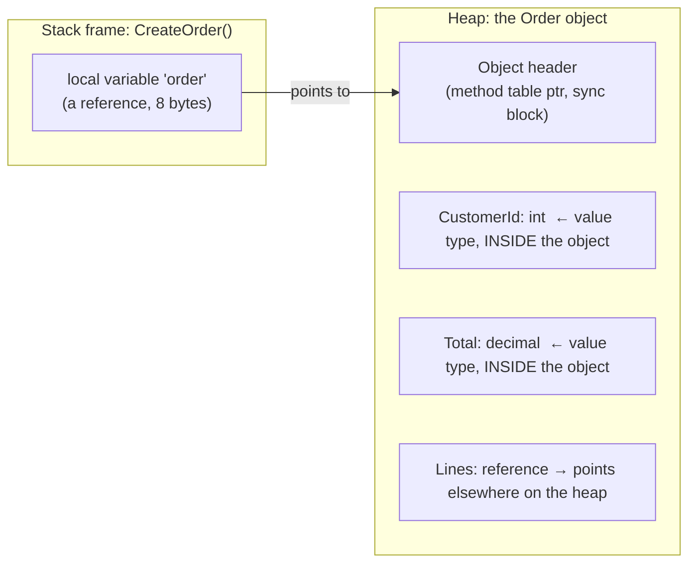
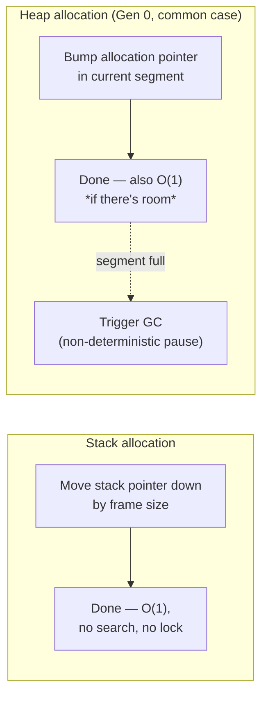
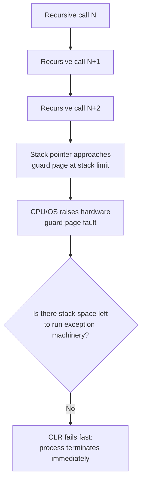

# Inside .NET — Episode 6
## Stack vs Heap: Where Your Data Actually Lives

> *Part II — Memory*

---

### Introduction

Part I traced how source code becomes running native instructions: Roslyn to IL, the CLR's loader and type system, the JIT turning IL into machine code, assemblies carrying that IL as portable metadata-tagged packages. That whole pipeline answers one question — *how does code get to execute?*

Part II asks a different question: once that code is executing, *where does the data it operates on actually live?* Every `int i = 5;`, every `new Order()`, every method call has to put its bits somewhere in memory, and .NET — like every other managed or unmanaged runtime — draws on exactly two categories of storage to do it: the **stack** and the **heap**. Nothing about DI containers, EF Core change tracking, GC generations, or async state machines makes sense without a precise mental model of this distinction first. This chapter builds that model, and — deliberately — spends real time correcting the popular oversimplification most developers carry around ("value types go on the stack, reference types go on the heap"), which is close enough to be dangerous and wrong often enough to bite you in production.

### The real-world analogy

Picture a professional kitchen.

Each line cook has their own **cutting board** at their station (**the stack** — per-thread, private). It's small, it's fast to work on, and there's a strict rule: whatever you put on it during an order gets cleared the instant that order is plated (**a stack frame is popped the instant its method returns**). You never have to clean someone else's board, and nobody reaches across the kitchen to use yours — it's local, exclusive, and disposable by nature. Grabbing space on your own board costs nothing more than sliding your hand over — you don't ask anyone's permission (**stack allocation is just moving a pointer**).

Now picture the **walk-in pantry** at the back (**the managed heap** — shared across the whole kitchen, i.e., the whole process). Any cook can walk in and grab shelf space for ingredients that need to outlive a single order — stock reductions started this morning that three different dishes will draw from tonight (**objects referenced from multiple places, or that need to outlive the method that created them**). Claiming a new shelf slot is still quick — you just take the next open spot (**heap allocation, in the common case, is also a pointer bump**). But *nobody* individually decides when a pantry item gets thrown out. That's the head chef's job, done on their own schedule, checking what's still referenced by an active ticket before clearing space (**the GC decides when to reclaim heap memory, non-deterministically, based on reachability**). You can't just walk in and un-use a shelf the moment you're done with it the way you clear your own cutting board.

That non-determinism is the whole story: fast, private, auto-cleared vs. shared, flexible, cleaned up on someone else's schedule.

### The problem being solved

A running program needs two fundamentally different memory lifetime patterns, and trying to serve both with one mechanism is a bad trade either way:

- **Deterministic, short-lived, strictly nested lifetimes** — a method's local variables and parameters exist for exactly the duration of that call, nested perfectly inside the caller's lifetime (call `B()` from `A()`, `B`'s locals are always gone before `A`'s). This pattern doesn't need a general-purpose allocator at all — a simple, contiguous, LIFO (last-in-first-out) region is enough, and it can be managed with nothing more than moving one pointer up on entry and back down on exit.
- **Shared, unpredictable, possibly long-lived lifetimes** — an object handed to another thread, stored in a collection, captured by a closure, or returned from a method and used long after that method has returned, doesn't fit a strict nesting pattern at all. Its lifetime is determined by *how many other things still reference it*, which can't be known at compile time or resolved by simple scope exit.

This isn't a C#-specific design choice — it's not even a .NET-specific one. **Every process on every mainstream OS gets a call stack from the hardware/OS** (the CPU has stack-pointer and base-pointer registers dedicated to it; `CALL`/`RET` instructions push/pop return addresses onto it) precisely because pattern #1 is universal to how functions call each other in any language, compiled or interpreted. What .NET adds on top of that OS-level primitive is the **second half**: a managed heap with a garbage collector that automates pattern #2's reclamation problem, so you get the flexibility of shared, unpredictable lifetimes without manually tracking every reference (the way C's `malloc`/`free` or C++'s `new`/`delete` force you to).

### Original visual explanation

#### 1. Stack frame push/pop across nested calls



Every frame is destroyed the instant its method returns, in strict reverse order of creation — that's the LIFO discipline that makes stack management a single pointer move instead of a search for free space.

#### 2. Stack vs. heap memory layout in a process



Two threads, two independent stacks — but one shared heap. Both threads can hold references to the *same* heap object simultaneously; only the heap needs a garbage collector, because only the heap has this many-to-one reachability problem.

#### 3. A value type living *inside* a heap object



This is the diagram that kills the myth: `CustomerId` and `Total` are value types (`int`, `decimal`), but they are **not on the stack**. They're laid out contiguously as part of the `Order` object's memory block on the heap, because that's where the object containing them lives. Only the *reference* to the whole object (`order`) sits on the stack.

#### 4. Allocation cost comparison



#### 5. StackOverflowException: why it can't be caught



By the time the guard page is hit, there is — by definition — no more room on that thread's stack. Running a `catch` handler, or even the CLR's own exception-dispatch bookkeeping, requires pushing *more* frames onto the very stack that just ran out. There's nowhere left to put them.

### Internal .NET mechanics

1. **The stack is an OS/hardware construct, not a CLR invention.** When Windows creates a thread, it reserves a contiguous region of virtual memory for that thread's stack — **1 MB by default for the main thread** on Windows (configurable via the linker/`ulimit`-equivalent or, for a CLR thread, via `Thread`'s constructor overload that takes `maxStackSize`). The CPU has dedicated registers for this — on x64, `RSP` (stack pointer) and `RBP`/frame pointer conventions — and the `CALL` instruction automatically pushes a return address before jumping; `RET` pops it back off. The CLR doesn't manage this region with a garbage collector; it just uses the mechanism the OS and CPU already provide.

2. **What's actually in a stack frame.** When a method is called, its frame typically contains: the **return address** (where execution resumes in the caller after this method returns), the **incoming parameters** (or references to them, depending on calling convention and JIT decisions), **local variables of value types** declared in the method body, and bookkeeping the JIT needs for exception handling regions (`try`/`catch` scope tables) and, in debug builds, frame pointers for debugger walkability. Reference-typed locals and parameters also live in the frame — but what's stored there is only the **reference** (a pointer-sized value), not the object itself.

3. **Frame teardown is just moving the pointer back.** On method return, the JIT-generated code doesn't zero out or individually "free" each local — it simply restores the stack pointer to where it was before the call, effectively saying "everything above this address is fair game to overwrite on the next call." This is why stack allocation/deallocation is essentially free: no allocator bookkeeping, no fragmentation, no search for free blocks.

4. **The managed heap is what the CLR adds on top.** At process start, the CLR reserves a set of memory segments for the managed heap (organized into GC generations — the subject of [Episode 11 — GC Generations & LOH](../010-gc-generations-loh/article.md)). When you `new` a reference type, the runtime doesn't scan for a free slot the way a general-purpose native allocator might — in the common case it does a **bump allocation**: check if the current generation-0 segment has enough contiguous free space, and if so, hand out the next address and move the "next free" pointer forward. That's why heap *allocation* is nearly as cheap as stack allocation in the fast path.

5. **Heap deallocation is where the two diverge completely.** There is no `RET`-equivalent that frees a heap object. An object becomes eligible for collection only when the GC determines, during a collection cycle, that nothing reachable from any thread's stack, static field, or GC handle still references it. *When* that determination happens is not tied to any line of your code — it's tied to allocation pressure, generation thresholds, and (rarely) explicit `GC.Collect()` calls. This is the deterministic-vs-non-deterministic split that defines the whole chapter.

6. **Object layout on the heap.** A heap object isn't just "your fields." It has an **object header** (a method table pointer used for virtual dispatch and type identity, plus a sync block index historically used for `lock`/`Monitor`), followed by its fields laid out contiguously — value-type fields inlined directly into that block, reference-type fields stored as pointers to *other* heap blocks. This is exactly what Diagram #3 shows, and it's the mechanical reason the "value types = stack" rule breaks down.

### C# implementation

```csharp
// Program.cs — .NET 10 console app
// Demonstrates: (1) a struct as a local vs. the same struct as a field of a
// class instance, observed via heap growth; (2) why unbounded recursion is
// not safely demoable (explained, not executed).

using System.Diagnostics;

Console.WriteLine("=== Inside .NET: Episode 6 — Stack vs Heap demo ===");

// ---------------------------------------------------------------------------
// Part 1: a struct (value type) as a LOCAL variable.
// 'point' lives in this method's stack frame. Copying it copies the whole
// 16 bytes right there on the stack — no heap allocation happens at all.
// ---------------------------------------------------------------------------
Point3D point = new Point3D(1, 2, 3);
Point3D copy = point; // full value copy, stack-to-stack, no heap involved
copy.X = 99;
Console.WriteLine($"\n[Local struct] point.X={point.X} (unchanged), copy.X={copy.X}");

long before = GC.GetTotalMemory(forceFullCollection: true);

// Allocating many *locals* of a struct: no heap growth, because each is
// either stack-resident or immediately discarded — nothing survives.
for (int i = 0; i < 1_000_000; i++)
{
    Point3D transient = new Point3D(i, i, i);
    _ = transient.X + transient.Y; // touch it so the JIT can't optimize it away entirely
}

long afterLocals = GC.GetTotalMemory(forceFullCollection: true);
Console.WriteLine($"[Struct locals]      heap before: {before,10:N0} bytes | after: {afterLocals,10:N0} bytes | delta: {afterLocals - before,10:N0} bytes");

// ---------------------------------------------------------------------------
// Part 2: the SAME struct as a FIELD of a class instance.
// Now each Point3D lives INSIDE a heap object (PointHolder). The struct
// itself didn't change — where it lives changed, because its container did.
// ---------------------------------------------------------------------------
var holders = new List<PointHolder>(capacity: 1_000_000);
long beforeHeap = GC.GetTotalMemory(forceFullCollection: true);

for (int i = 0; i < 1_000_000; i++)
{
    holders.Add(new PointHolder(new Point3D(i, i, i))); // PointHolder is a class -> heap
}

long afterHeap = GC.GetTotalMemory(forceFullCollection: true);
Console.WriteLine($"[Struct-in-class]     heap before: {beforeHeap,10:N0} bytes | after: {afterHeap,10:N0} bytes | delta: {afterHeap - beforeHeap,10:N0} bytes");
Console.WriteLine($"Held {holders.Count:N0} PointHolder instances, each carrying a Point3D field inline.");

// Keep 'holders' referenced until here so the GC can't collect it mid-measurement.
Console.WriteLine($"Sample check: holders[500000].Point.X = {holders[500_000].Point.X}");

// ---------------------------------------------------------------------------
// Part 3: boxing — a third way a value type ends up on the heap.
// ---------------------------------------------------------------------------
Point3D boxedSource = new Point3D(7, 8, 9);
object boxed = boxedSource; // boxing: allocates a heap object wrapping the struct
Console.WriteLine($"\n[Boxing] boxed object type: {boxed.GetType()} — this Point3D now lives on the heap, wrapped.");

// ---------------------------------------------------------------------------
// Part 4: StackOverflowException — explained, never triggered.
//
// Uncontrolled recursion exhausts the current thread's stack (default ~1MB
// on Windows for the main thread). When the CPU/OS detects the guard page
// at the end of the stack has been hit, the CLR cannot run a catch handler
// or even its own exception-dispatch code, because doing so requires MORE
// stack space than exists. The process is torn down immediately by the
// runtime (StackOverflowException cannot be caught by user code — see
// article.md for the full mechanism). Uncomment the two lines below ONLY
// in a disposable process/terminal if you want to see it happen for real —
// it WILL crash this process with no chance to catch anything.
// ---------------------------------------------------------------------------
// static void RecurseForever(int depth) => RecurseForever(depth + 1);
// RecurseForever(0);

Console.WriteLine("\nDone. (Uncontrolled recursion demo intentionally left disabled — see comment above.)");

// A value type: when declared as a local, it's stack-resident.
// When it's a field of a class, it becomes part of that class's heap layout.
struct Point3D
{
    public int X;
    public int Y;
    public int Z;

    public Point3D(int x, int y, int z)
    {
        X = x;
        Y = y;
        Z = z;
    }
}

// A reference type (class). Its Point3D field is laid out INLINE inside
// this object's heap block — it is not a separate heap allocation, and it
// is not "on the stack" just because it's a struct.
class PointHolder
{
    public Point3D Point;

    public PointHolder(Point3D point) => Point = point;
}
```

Run it with `dotnet run` in [`code/`](code/) — the struct-as-local loop shows little to no heap growth, while the struct-as-class-field loop shows clear, measurable heap growth for the exact same struct type and the exact same iteration count. The difference is entirely about the *container*, not the *field's type*.

### Common mistakes

- **"Value types go on the stack, reference types go on the heap."** This is the single most repeated — and most incomplete — statement about .NET memory, and this chapter exists partly to correct it precisely:
  - A value type declared as a **local variable in a method** typically lives on the stack (subject to JIT decisions — see "escape analysis" below).
  - A value type that is a **field of a class instance** lives wherever that class instance lives — which is the **heap**, laid out inline as part of the object (Diagram #3).
  - A value type that is **boxed** (assigned to an `object`/interface-typed variable, or passed where boxing is implicit) gets copied into a **new heap allocation** that wraps it — the subject of [Episode 8 — Boxing & Unboxing](../007-object-allocation/article.md)'s sibling chapter.
  - A value type **captured by a lambda or local function that becomes a closure** gets hoisted by the compiler into a compiler-generated **closure class instance on the heap**, because the delegate carrying it may outlive the method that declared it.
  - The correct rule is about **lifetime and reachability**, not about type category: something lives on the stack only if its lifetime is strictly bounded by, and nested inside, a method call's lifetime. Everything with unpredictable, shared, or outliving-the-frame lifetime ends up on the heap, value type or not.
- **Assuming every local variable that "looks stack-like" actually stays on the stack.** The JIT can, and does, decide to spill certain locals or promote them differently based on optimization and escape analysis; conversely, `stackalloc` and `Span<T>` let you *explicitly* request true stack memory for scenarios where you want to guarantee it — a deliberate, opt-in tool, not the default behavior of `struct`.
- **Believing you can `catch (StackOverflowException)` and recover.** You cannot, by design, since .NET 2.0's behavior change: the CLR terminates the process immediately rather than attempting to run user handler code with no stack left to run it safely.
- **Assuming a bigger stack "fixes" deep recursion algorithmically.** Increasing thread stack size (`new Thread(ThreadStart, maxStackSize)`) raises the ceiling, but unbounded or accidentally-infinite recursion (a missing base case, a cycle in recursive data) will still eventually overflow it — the fix is almost always converting to iteration or adding the missing termination condition, not allocating more stack.
- **Thinking heap allocation is "slow" and stack allocation is "fast" as an absolute, universal rule.** In the *common case* both are pointer bumps and comparably cheap; heap allocation becomes comparatively expensive only when it triggers a collection, when the object is large enough to go on the Large Object Heap, or under heavy allocation pressure across many threads contending for allocation contexts.

### Performance considerations

- **Stack allocation has effectively zero marginal cost** beyond the instructions to move the stack pointer — there's no allocator to call, nothing to search, no possibility of fragmentation. This is why hot-path code that avoids unnecessary heap allocations (using `struct`, `Span<T>`, `stackalloc`, or `readonly ref struct` types like `ReadOnlySpan<T>`) can meaningfully reduce GC pressure in allocation-sensitive code.
- **`stackalloc`** lets you explicitly allocate a buffer on the stack (typically wrapped in a `Span<T>`) for scenarios like parsing or formatting where you want a scratch buffer that never touches the GC — but it's bounded by available stack space, so it's for small, bounded buffers only, never unbounded-size data.
- **Heap allocation triggering a Gen 0 collection is the actual cost people mean when they say "GC is slow."** The allocation itself is fast; the pause that happens when a generation fills up and needs collecting is where latency shows up, and it scales with the number of *live* objects the GC has to trace, not the number of allocations made — which is why churn-heavy code (allocate-and-immediately-discard patterns) is a classic optimization target even though each individual allocation was "cheap."
- **Struct size matters for stack pressure too, not just heap pressure.** A large struct copied by value on every method call (parameters, returns) can itself become a performance problem — copying 200 bytes on every call adds up — which is why guidance on struct design (generally keep them small, ideally ≤ 16 bytes, or pass by `in`/`ref` when larger) exists independently of the stack/heap question.
- **Deep, unbounded recursion is a stack-*size* problem, not solvable by GC tuning** — it's the one memory exhaustion scenario entirely outside the garbage collector's domain, since the stack isn't GC-managed at all.

### Interview questions

**Q1: Is it true that value types always live on the stack? Give a concrete counterexample.**
A: No. A value type's storage location follows the lifetime of its *container*, not its own type category. A `struct` field on a `class` instance is laid out inline as part of that class instance's memory block, which lives on the heap — so if you have `class Order { public decimal Total; }`, every `Order` instance's `Total` field lives on the heap alongside the rest of that `Order` object, even though `decimal` is a value type. Boxing and closure capture are two more mechanisms that move a value type onto the heap.

**Q2: Why can't you catch a `StackOverflowException` in .NET?**
A: By the time the OS/CPU detects the thread has hit its stack limit (typically via a guard-page fault), there is no remaining stack space to execute anything — not a user `catch` block, and not even the CLR's own exception-dispatch machinery, both of which require pushing additional frames. Since .NET 2.0, the CLR's designed response is to terminate the process immediately rather than attempt unsafe recovery, which is why `catch (StackOverflowException)` is explicitly documented as ineffective.

**Q3: What's actually stored in a stack frame when a method is called?**
A: The return address the CPU jumps back to after the method finishes, the method's parameters (or references to them per calling convention), local variables of value types declared in the method body, and JIT/runtime bookkeeping for exception-handling regions. Reference-typed locals/parameters store only the reference (a pointer-sized value) in the frame — the referenced object itself is elsewhere, on the heap.

**Q4: Why is heap allocation in .NET often just as fast as stack allocation, contrary to popular belief?**
A: In the common case, allocating on the managed heap is a bump allocation — the allocator checks whether the current generation-0 segment has enough contiguous free space and, if so, hands out the next address and advances a pointer, exactly like moving the stack pointer. The *real* cost difference isn't allocation itself, it's that heap memory isn't deterministically reclaimed — collection happens on the GC's schedule when a generation fills up, which is where the actual latency and cost live, not in the allocation call.

**Q5: Is the stack a .NET-specific concept? What would exist without the CLR?**
A: No — the call stack is a CPU/OS-level mechanism that exists for every process on every mainstream platform, driven by hardware stack-pointer registers and `CALL`/`RET` semantics; C, C++, Rust, and Go programs all use a call stack the same way, with no runtime required. What the CLR specifically adds on top is the *managed heap plus garbage collector* — the automation of shared-lifetime memory reclamation that unmanaged languages otherwise leave to manual `malloc`/`free` or RAII-style destructors.

### Key takeaways

- The **stack** is per-thread, LIFO, and OS/CPU-provided — not a .NET invention. Its allocation and deallocation are essentially free because they're just pointer moves, and it holds call frames: locals, parameters, and return addresses.
- The **managed heap** is what .NET adds on top: shared across a process's threads, used for objects with unpredictable or outliving-the-frame lifetimes, allocated cheaply (bump allocation) but reclaimed *non-deterministically* by the GC.
- **"Value types on stack, reference types on heap" is an oversimplification.** A value type's location is determined by the lifetime and location of its container — a struct field in a class instance lives on the heap; a boxed struct lives on the heap; a struct captured by a closure lives on the heap.
- **`StackOverflowException` cannot be caught** because by the time it's detected, there's no stack space left to run any handler, including the CLR's own — the runtime terminates the process instead.
- This distinction isn't cosmetic trivia — it's the foundation for everything else in Part II: allocation cost (Episode 8), boxing (Episode 9), GC generations (Episode 11), and memory leaks (Episode 14) are all specific consequences of this stack/heap split.

### What's next

[Episode 7 — Value Types vs Reference Types](../006-value-vs-reference-types/article.md) builds directly on this foundation: now that you know *where* memory lives, the next question is *how* assignment, copying, and equality behave differently depending on whether you're holding a value or a reference to one.

---

**Previous:** [Episode 5 — Assemblies, DLLs & Metadata](../004-assemblies-metadata/article.md)
**Next:** [Episode 7 — Value Types vs Reference Types](../006-value-vs-reference-types/article.md)
