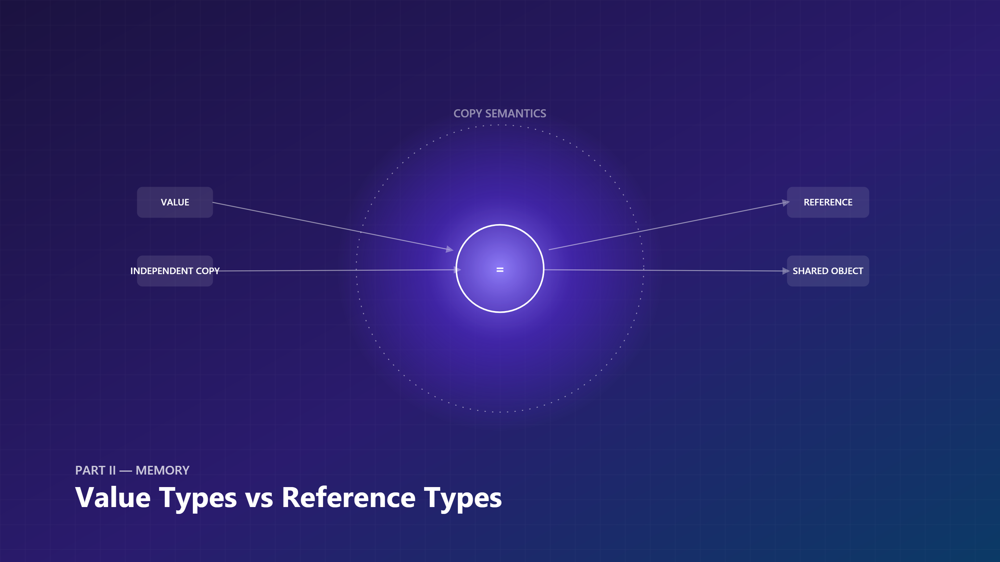
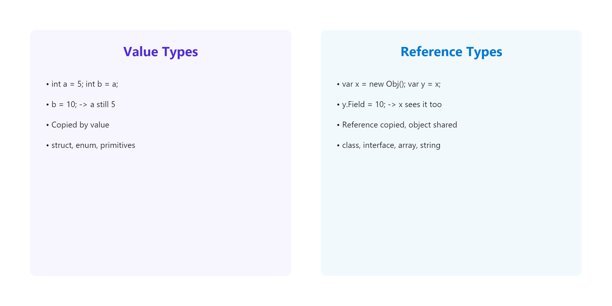
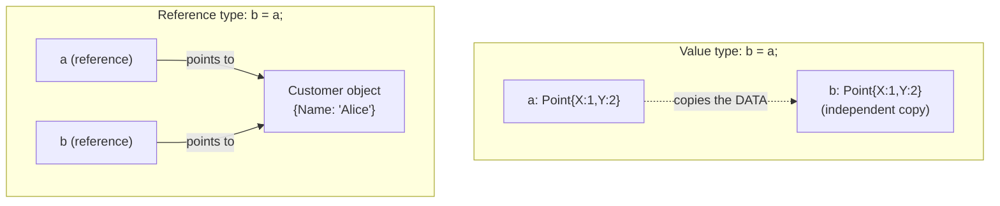
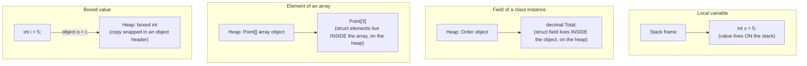
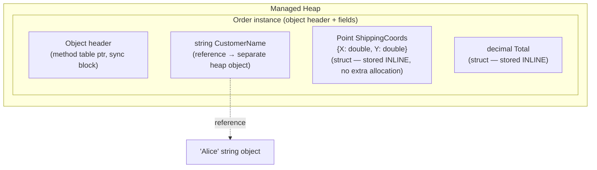
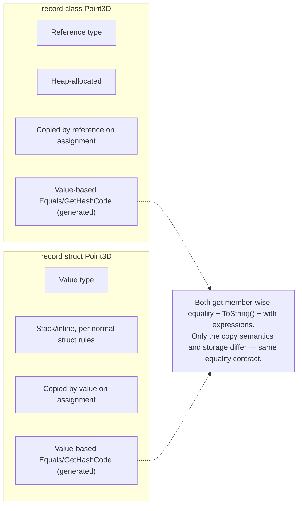
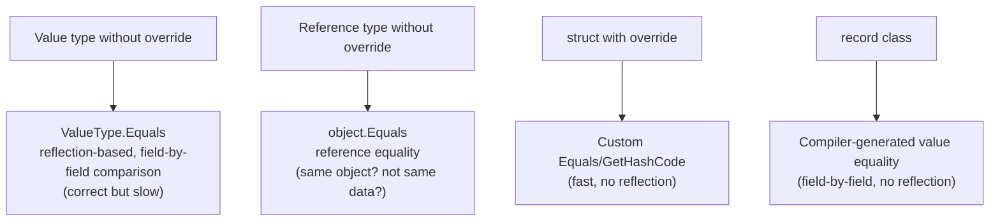
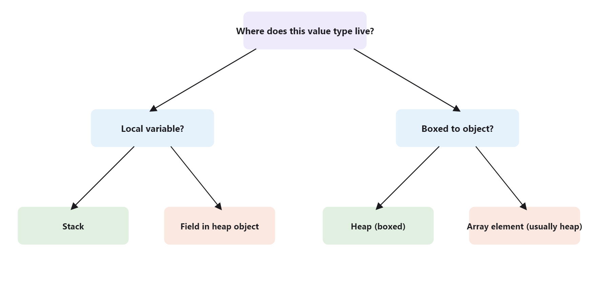

# Inside .NET — Episode 7
## Value Types vs Reference Types

> *Part II — Memory*

---

### Chapter cover




---

### Learning objectives

By the end of this chapter, you will be able to:

- Explain precisely what gets copied when you assign or pass a value type versus a reference type.
- Correctly predict where a given value type instance is physically stored — local, field, array element, or boxed — instead of defaulting to "structs are on the stack."
- Identify and fix the mutable-struct trap before it ships, in code review or in your own code.
- Choose between `class`, `struct`, `readonly struct`, and `ref struct` for a new type based on size, mutability, and sharing requirements, not habit.
- Explain the copy/storage distinction between `record class` and `record struct` and pick the right one for a domain value object.

### Real-world analogy

A shopping-cart service passes a `Total` field between three microservices during checkout. One team's struct-based `Money` type gets copied cleanly at every hop. Another team's mutable class gets "updated" in a discount-calculation step — and silently corrupts the *original* cart object still referenced by the payment step, because nobody copied it, they shared it. Same bug class, opposite root cause: one team over-trusted copying, the other under-trusted it. This chapter is the difference between those two failure modes.

**Value types are a photocopy. Reference types are a claim ticket to a shared locker.**

Hand a colleague a photocopy of a contract (a value type, copied by value): they can scribble annotations, cross out clauses, spill coffee on it — your original page is untouched, because they never had *your* page, only an independent copy of its content.

Now hand a colleague a claim ticket to a shared storage locker (a reference type, copied by reference): you both hold *tickets*, but there's only one locker. If they open it and rearrange what's inside, and you open your locker with your ticket five minutes later, you see the changes they made — because a ticket isn't the locker's contents, it's a pointer to one shared locker. Copying the ticket copies the pointer, not the locker.

That's the entire distinction. Assigning or passing a value type copies the *data*. Assigning or passing a reference type copies the *reference* — both variables end up pointing at the same underlying object.

### Problem statement

Why does C# even have two different assignment models instead of one consistent rule? Because each model optimizes for a different, legitimate need:

- **Value types** exist so small, self-contained pieces of data (`int`, `double`, `bool`, `DateTime`, your own `struct Point`) can be manipulated with zero aliasing risk and, in local/stack scenarios, zero heap allocation or GC pressure. You want `Vector3` math to be fast and to never worry that some other part of the program silently mutated a vector you thought was yours alone.
- **Reference types** exist so that large or genuinely shared objects (`class`, `string`, arrays, delegates) don't get copied wholesale every time they're passed around, and so that "this is the *same* logical entity, referenced from multiple places" can actually be expressed — a `Customer` object passed to three different methods should be the *same* customer, not three independent snapshots that drift out of sync.

A single unified model would force a bad tradeoff in one direction or the other: either everything is a cheap-to-copy-but-un-shareable value, or everything requires a heap allocation and reference indirection even for something as small as a `bool`. C# gives you both and expects you to pick deliberately — which means the cost of getting it wrong (an accidentally-mutable struct, or an accidentally-shared "copy") is a bug class of its own, covered later in this chapter.

Without this distinction, a language either loses the ability to model small, cheap, independent values efficiently, or loses the ability to model shared, mutable entities without constant defensive copying. Both failure modes show up as real bugs — the "why did my other variable change too" surprise, or the opposite "why didn't my change take effect" surprise — and both are symptoms of not knowing which family a given type belongs to.

### Visual explanation



#### 1. Assignment/copy semantics: value vs. reference



Mutating `b` after assignment in the value-type case never touches `a`. Mutating the object through `b` in the reference-type case is visible through `a` too — same object, two references.

#### 2. Where value types actually live



"Structs live on the stack" is the oversimplification. The precise rule: **a value type lives wherever its containing storage lives.** A local variable's storage is a stack slot (usually), so the value sits there. A field's storage is inside whatever object owns it — if that object is heap-allocated, the value type field is physically inside the heap-allocated block. An array is itself a heap object (arrays are reference types), so `Point[]` elements are stored inline inside that heap block, not scattered as separate boxed objects. Boxing is the one case that *creates* a new heap allocation specifically to give a value type an object identity.

#### 3. Struct field inside a heap-allocated class instance



`Point ShippingCoords` isn't a separate object with its own header somewhere else on the heap — it's laid out byte-for-byte inside `Order`'s own memory block. That's the actual performance argument for structs-as-fields: no extra allocation, no extra indirection, better cache locality, at the cost of `Order` itself being larger.

#### 4. `record class` vs `record struct`



#### 5. Default equality: value vs. reference types



Standalone Mermaid sources for all five diagrams live under [`diagrams/mermaid/`](diagrams/mermaid/), numbered `01`–`05` to match the order above.

### Under the hood



Tying the diagrams to actual CLR behavior:

1. **Value types derive from `System.ValueType`** (which itself derives from `object`), but the CLR special-cases them: a value type instance is never given an independent heap identity unless boxed. The type's fields are laid out inline wherever the variable, field, or array slot that holds it is laid out. There is no "value type object header" in the normal case — that's precisely why value types are cheap: no sync block, no method table pointer per instance, just raw field data.

2. **Assignment is a `memcpy` of the type's fields**, generated by the JIT as an inline copy (or `cpblk`/`ldobj`/`stobj` IL for larger structs). For a reference type, assignment copies a single machine-word-sized reference (a pointer, conceptually) — regardless of how large the referenced object is. This is the mechanical root of everything else in this chapter: a `struct` with 20 fields costs 20 fields' worth of copying on every assignment and every pass-by-value method call; a `class` with 20 fields costs one pointer copy no matter how large the object grows.

3. **Boxing bridges the two worlds.** When a value type needs to be treated as `object` (added to a non-generic collection, passed where `object` or an interface is expected, cast explicitly), the CLR allocates a new heap block, copies the value's data into it, and prefixes it with a normal object header (method table pointer + sync block) — producing something the GC and virtual dispatch machinery can treat like any other heap object. Unboxing does the reverse: it copies the data back out into a value-type variable. Every box is a new heap allocation and a full-field copy; every unbox is another full-field copy. This is only a bridge concept here — [Episode 8 — Object Allocation](../007-object-allocation/article.md) and the dedicated boxing chapter go into the allocation cost and the JIT-level unboxing (`unbox`/`unbox.any`) mechanics in depth.

4. **`readonly struct`** tells the compiler every instance field is immutable after construction. This isn't just documentation — it lets the compiler skip defensive copies it would otherwise insert when you call a member on a `readonly` field or `in` parameter of that struct type (because it can prove the call can't mutate it), which is a real, measurable JIT optimization, not a style preference.

5. **`ref struct`** (the category `Span<T>` and `ReadOnlySpan<T>` belong to) is enforced by the CLR/compiler to *never* exist on the heap: it cannot be boxed, cannot be a field of a non-`ref struct` class, cannot be captured in a lambda/async state machine, and cannot be a generic type argument. The enforcement exists because `ref struct` types are allowed to wrap a `ref` to stack memory (or pinned/native memory) — if an instance escaped to the heap and outlived its referent's stack frame, you'd have a dangling reference with no GC awareness. Stack-only-ness is the whole point, not an incidental restriction.

6. **Equality resolution order:** for a `struct` that doesn't override `Equals`, the CLR falls back to `ValueType.Equals`, which uses reflection to walk the fields and compare them one by one (with a bitwise-comparison fast path when the struct contains no reference-type fields and no padding). That reflection fallback is why custom structs used in hot paths (dictionary keys, equality-heavy comparisons) should override `Equals`/`GetHashCode` explicitly — it's a correctness no-op but a real performance win. For a `class` that doesn't override `Equals`, `object.Equals` performs reference equality — two variables are equal only if they point at the same object, regardless of field contents. `record class` and `record struct` opt out of both defaults: the compiler generates member-wise `Equals`/`GetHashCode`/`==` for you at compile time, with no reflection involved.

7. **Escape analysis — why the JIT doesn't just "figure this out" for you.** Some managed runtimes (notably the JVM's HotSpot) perform *escape analysis*: proving a heap-allocated object never outlives the method that created it, and never gets referenced from anywhere that survives the call, then allocating it on the stack instead — no code change required. RyuJIT does a narrow form of this (eliding some allocations it can fully prove are dead or trivially non-escaping, and it can stack-allocate a small class instance in a very limited set of provable cases), but it is far more conservative than "figure out every non-escaping object automatically." That's precisely *why* .NET gives you explicit, opt-in tools instead of relying on the JIT to infer it: `struct`, `readonly struct`, `stackalloc`, and `ref struct` (Episode 6) let *you* prove non-escaping-ness to the compiler at the type level, in a way the JIT doesn't have to (and mostly can't) discover on its own from arbitrary `class` code. Don't write a `class` and assume "the JIT will probably stack-allocate it if it doesn't escape" — assume it won't, and reach for the explicit value-type tools when that guarantee actually matters.

8. **This is also how Microsoft implements the BCL's own value types.** `System.Numerics.Vector2/3/4`, `System.Drawing.Point`, and every primitive numeric type are `readonly struct`s (or, for primitives, effectively immutable value types with no mutable public surface) precisely so they get the defensive-copy elision and immutability guarantees described above — the runtime team applies the same rule this chapter recommends to your own types.

### Code example

*Tier: Example.*

```csharp
// Value type: assignment copies the data.
struct Point
{
    public int X, Y;
    public Point(int x, int y) { X = x; Y = y; }
    public override string ToString() => $"({X}, {Y})";
}

Point a = new(1, 2);
Point b = a;      // full copy of X and Y into b
b.X = 99;
Console.WriteLine($"a={a}, b={b}");  // a=(1, 2), b=(99, 2) — a is untouched

// Reference type: assignment copies the reference.
class Customer
{
    public string Name = "";
}

Customer c1 = new() { Name = "Alice" };
Customer c2 = c1;  // c2 now points at the SAME object as c1
c2.Name = "Bob";
Console.WriteLine($"c1.Name={c1.Name}");  // c1.Name=Bob — same object, seen through both refs

// Pass-by-value cost mitigation for large structs.
readonly struct Matrix4x4Like
{
    public readonly double M11, M12, M13, M14,
                            M21, M22, M23, M24,
                            M31, M32, M33, M34,
                            M41, M42, M43, M44; // 16 doubles = 128 bytes

    public double Trace() => M11 + M22 + M33 + M44;
}

// Passing by value here copies all 128 bytes on every call.
static double SumTraceByValue(Matrix4x4Like m) => m.Trace();

// `in` passes a read-only reference instead — no copy, and the compiler
// enforces the callee can't mutate through it.
static double SumTraceByIn(in Matrix4x4Like m) => m.Trace();

// ref struct: compiler-enforced stack-only value type.
Span<int> span = stackalloc int[4] { 1, 2, 3, 4 };
// The following would NOT compile if uncommented — a ref struct cannot be boxed:
// object boxed = span;

// record class vs record struct.
record class PointRC(int X, int Y);   // reference type, value equality
record struct PointRS(int X, int Y);  // value type, value equality

PointRC rc1 = new(1, 2);
PointRC rc2 = new(1, 2);
Console.WriteLine(rc1 == rc2);        // True — value equality, but rc1 and rc2 are different objects
Console.WriteLine(ReferenceEquals(rc1, rc2)); // False

PointRS rs1 = new(1, 2);
PointRS rs2 = rs1; // full copy — rs1 and rs2 are independent value instances
Console.WriteLine(rs1 == rs2);        // True — value equality, and it's also a real independent copy
```

The full runnable version — including the mutable-struct foreach gotcha, `record class` vs `record struct` equality, and the `in`-parameter demo — lives in [`code/Chapter06.Demo/Program.cs`](code/Chapter06.Demo/Program.cs) and is verified to build and run with `dotnet run` (see the chapter [`README.md`](README.md) for the command).

### Performance notes

- **Struct size is the whole tradeoff.** A `struct` at or below roughly 16 bytes (a couple of `int`s/`double`s) copies cheaper than a reference indirection in most call patterns. Once a struct grows past a few fields, repeated copying (through method calls, LINQ operators, collection indexers) can outweigh the allocation/GC cost a `class` would have paid once.
- **`in` / `ref readonly` parameters** let you pass a large `readonly struct` by reference without giving the callee mutation rights — avoiding the copy while keeping the immutability guarantee that made the struct safe to reason about in the first place. Don't reach for `in` on small structs (`int`, `Point`); the indirection can cost more than the copy it avoids.
- **Boxing is the value-type performance cliff.** Storing an `int` in a non-generic `ArrayList`, passing a `struct` as an `object` parameter, or calling a non-overridden interface member on a struct through its interface type all trigger boxing — a heap allocation plus a full copy, on every single operation. Generic collections (`List<int>` vs `ArrayList`) exist specifically to avoid this.
- **`record struct` copy cost applies just like any struct.** A `record struct` with many positional properties has the same copy-per-assignment cost as an equivalent hand-written struct — the compiler-generated equality doesn't change the underlying value-type mechanics.
- **Equality overrides matter in hot paths.** Using a custom `struct` as a `Dictionary<TKey, TValue>` key without overriding `Equals`/`GetHashCode` means every lookup pays `ValueType.Equals`'s reflection-based comparison — override both (or use a `record struct`, which generates efficient versions for you) before that struct goes anywhere near a hash-based collection at scale.
- **How to measure it, not just assume it.** Before changing a hot-path type's storage category based on this chapter's guidance, confirm the cost with `BenchmarkDotNet` rather than intuition — struct-vs-class copy cost is sensitive to size, call depth, and whether the JIT can inline the call (inlined copies are often cheaper than the naive `memcpy` mental model suggests). The dedicated performance-measurement discipline is covered in depth in the [Phase on performance and security](../056-performance-security/article.md); treat the guidance here as the mechanism, not the full measurement methodology.

### Common mistakes / anti-patterns

- **Mutable structs.** A `struct` with public settable fields/properties is a trap. `list[i].X = 5` on a `List<T>` of a mutable struct *does not compile* (the indexer returns a copy, and the compiler refuses to let you mutate a temporary you can't see again) — but the equivalent through a property getter, or through `foreach`, silently compiles and silently does nothing useful: `foreach (var p in points) { p.X = 5; }` mutates the *iteration variable*, a copy, and is thrown away every loop iteration. The fix is either making the struct immutable (`readonly struct`) so the mistake can't compile at all, or making it a `class` if genuine shared mutation is the intent.
- **Mutating a struct returned by a property.** `myControl.Location.X = 10;` on a `Point Location { get; set; }` property compiles in some contexts and is a classic silent no-op in others (it flatly fails to compile on read-only properties, and on read-write ones it mutates a temporary returned by the getter, never the backing field) — the fix is `var loc = myControl.Location; loc.X = 10; myControl.Location = loc;`, i.e. treat the property as always returning an independent copy, because it is one.
- **"Structs are always faster" myth.** True only for *small* structs that avoid boxing and avoid repeated copying. A large struct passed by value through several method layers can cost *more* than a reference-type equivalent, because you're paying a full-field `memcpy` at every call boundary instead of a single pointer copy. Structs win when they're small, short-lived, and stay off the heap — not unconditionally.
- **Conflating "value type" with "stack-allocated."** As shown in diagram #2, a value type embedded in a class field or an array element lives on the heap, inside its containing object. Calling every struct "a stack thing" leads to wrong assumptions about GC pressure and object graph size.
- **Assuming `record` always means "value type."** `record` alone (or `record class`) is a *reference type* — only `record struct` is a value type. Both get generated value equality, which is the part people correctly remember; the storage/copy semantics are what gets conflated.

### Architect's perspective

**Developer Perspective**
*"Should this type be a struct or a class — and how do I know before it becomes a bug?"*

Day to day, the decision is local and mechanical: is this a small, self-contained piece of data with no identity of its own (a coordinate, a money amount, a date range)? Make it a `struct`, make it `readonly struct` by default, and only drop that default when you have a concrete reason a value needs to mutate in place. Is it an entity with identity, something multiple parts of the system need to observe the *same* instance of? Make it a `class`. When in doubt, default to `class` — the failure mode of an unnecessary reference type is a small allocation; the failure mode of an unnecessary mutable struct is a silent correctness bug that a debugger session, not a compiler error, will surface.

**Senior Perspective**
*"Is this struct actually immutable, or is it one property-getter away from a silent bug?"*

This choice matters most at code-review time, because the mutable-struct trap doesn't announce itself — it compiles, it runs, and it produces wrong output only under the specific access pattern (`foreach`, a property getter, certain indexer chains) that hands back a copy. A senior engineer reviewing a PR that introduces a new `struct` should be asking three questions reflexively: is it immutable (`readonly struct` or all `init`-only members)? Is it small enough that copying it repeatedly is actually cheap? And is anything in the codebase going to access it through a path that returns a copy and then try to mutate that copy expecting it to stick? The tradeoff against alternatives is rarely "value types are slower" in the abstract — it's "this specific struct is large enough, or mutated often enough in the wrong place, that a class would have been safer or cheaper here." Teams that don't converge on a `readonly struct`-by-default convention end up with a mix of mutable and immutable structs where the mutable ones are, disproportionately, the source of the "changed it and nothing happened" bug reports.

**Architect Perspective**
*"Does this codebase have an enforced convention for value objects, or does every developer guess?"*

At system scale, this stops being a per-type decision and becomes a convention question: does the team have a documented, enforced rule for when a domain value object is a `readonly struct`/`record struct` versus a `record class`/entity `class`? Domain-driven design's Value Object pattern maps directly onto `readonly struct`/`record struct` when the value is small and copy-heavy (a `Money`, a `DateRange`, a `GeoCoordinate`), and onto an immutable `record class` when the value is larger or its identity-independence matters more than copy cost (a `ShippingAddress` embedded in multiple aggregates). Getting this wrong at scale shows up as one of two failure patterns: a codebase full of large structs being copied through every layer of a call stack (a real, measurable throughput cost that shows up in profiler flame graphs as unexplained `memcpy`-shaped time), or a codebase full of reference-type "value objects" that get compared by identity instead of value in a `Dictionary` or `HashSet` and silently produce duplicate entries. A team-wide analyzer rule (`CA1051`/custom Roslyn analyzer flagging mutable public struct fields) enforced in CI is cheaper than relying on code review vigilance alone, and it's exactly the kind of convention that pays for itself once the team and codebase are large enough that no single reviewer sees every struct definition. This is also precisely how the .NET runtime team treats its own BCL types — `Vector2/3/4`, `TimeSpan`, `DateOnly`, and `Guid` are all `readonly struct`s, not because someone eyeballed each one, but because "small immutable value → `readonly struct`" is applied as a library-wide design guideline, documented in the [.NET class/struct design guidelines](https://learn.microsoft.com/dotnet/standard/design-guidelines/choosing-between-class-and-struct) referenced at the end of this chapter.

### Interview questions

**Q1: What's actually copied when you assign one variable to another — and does it depend on where the variable is stored?**
A: It depends on the *type*, not the storage location. Assigning a value type copies its field data (a `memcpy` of however many bytes the struct occupies). Assigning a reference type copies the reference itself — a single pointer-sized value — so both variables end up referring to the same underlying object. This is true whether the value type happens to live on the stack, inside a heap object's field, or inside an array element.

**Q2: Are value types always allocated on the stack?**
A: No — that's an oversimplification. A value type is stored wherever its *containing context* is stored. A local variable's value typically lives in a stack frame. A value type that's a field of a class lives inside that class instance, wherever that instance is (almost always the heap). A value type that's an array element lives inside the array's storage, and arrays are heap objects. A value type gets its own independent heap allocation only when it's boxed.

**Q3: Why are mutable structs considered dangerous, and what's the concrete failure mode?**
A: Because every "access" to a struct through anything other than the original variable — a property getter, a `foreach` iteration variable, an indexer return value in some contexts — hands you a *copy*, and mutating that copy is either a compile error (the good outcome) or a silent no-op that changes nothing the caller can observe (the dangerous outcome). `foreach (var p in points) p.X = 5;` compiles cleanly and mutates nothing real, because `p` is a fresh copy assigned each iteration and discarded at the end of it. The fix is to make structs immutable (`readonly struct`) wherever possible, so accidental mutation attempts fail to compile instead of failing silently. This is the single most important question in this chapter to be able to answer precisely — it's the failure mode that actually shows up in production code review, not a trivia detail.

**Q4: Is it true that structs are always faster than classes?**
A: No. Structs avoid heap allocation and GC pressure *when small and used correctly* (as locals, short-lived values, avoiding boxing), which is a real win. But every assignment, method parameter pass, and return copies the struct's full field data — a large struct copied repeatedly through several call layers can cost more in aggregate `memcpy` time than a class's single pointer-copy would have cost, even after accounting for the class's one-time allocation. The right choice depends on size, mutability needs, and how many times the value gets copied versus how many times a reference would get dereferenced.

**Q5: What's the difference between `readonly struct` and `ref struct`, and why does `Span<T>` need to be the latter?**
A: `readonly struct` is a correctness/optimization guarantee: every field is immutable, which lets the compiler skip defensive copies it would otherwise insert on member calls through `in` parameters or `readonly` fields. `ref struct` is a placement guarantee enforced by the runtime: instances can never be boxed, stored as a field of an ordinary class, captured by a lambda or async state machine, or used as a generic type argument — they must stay on the stack. `Span<T>` needs `ref struct` specifically because it can wrap a reference to stack-allocated or pinned memory; if a `Span<T>` instance could escape to the heap and outlive the memory it points at, dereferencing it would read invalid memory with no GC protection against it.

**Q6: How would you decide, for a new domain type in a large codebase, whether it should be a `readonly struct`, a `record struct`, a `class`, or a `record class`?**
A: Start with identity: does this type represent a value (interchangeable if the data matches) or an entity (identity matters even if the data matches)? Values with no identity are struct candidates; entities are class candidates. Then apply size and equality: if it's a small value that needs custom equality logic beyond member-wise comparison, `readonly struct` with hand-written `Equals`/`GetHashCode`; if member-wise equality is exactly what you want, `record struct` gives you that for free. If it's larger, or its copy cost through the call graph would be significant, prefer an immutable `record class` over a mutable `class` — you keep value-style equality without paying value-type copy cost on every pass. The wrong-but-common shortcut is picking based on "struct vs class" folklore about performance instead of this identity-and-size analysis; it's the question that separates someone who's memorized the difference from someone who can apply it under a real design decision.

### Quiz

1. When you assign one variable of a reference type to another (`b = a;`), what gets copied?
2. Is it accurate to say value types always live on the stack? If not, give one counter-example.
3. Why does `foreach (var p in points) { p.X = 5; }` compile without error but fail to actually change anything, when `points` is a `List<StructPoint>`?
4. What's the difference in storage/copy semantics between `record class` and `record struct`, given that both generate value-based equality?
5. What does a `struct` get for `Equals`/`GetHashCode` if you don't override them, and why might you override them anyway even though the default is already correct?

<details>
<summary>Answers</summary>

1. Only the reference itself (a pointer-sized value) — both variables end up pointing at the same underlying object; none of the object's data is duplicated.
2. No. A value type lives wherever its containing storage lives — e.g. a value type that's a field of a class lives inside that (usually heap-allocated) object, and a value type that's an array element lives inside the array's heap-allocated storage. Only local variables typically place a value type on the stack.
3. `p` is the `foreach` iteration variable — a fresh copy of each struct element assigned at the start of every loop iteration. Setting `p.X = 5` mutates that copy, which is discarded when the next iteration begins; the original elements inside `points` are never touched.
4. Both generate the same member-wise `Equals`/`GetHashCode`/`==`/`ToString()`/`with` support. The difference is the underlying type category: `record class` is a reference type (heap-allocated, copied by reference on assignment), while `record struct` is a value type (copied by value, stored per normal struct placement rules).
5. It falls back to `ValueType.Equals`, which uses reflection to compare fields one by one — correct, but measurably slower than a hand-written comparison. You'd override them anyway for performance in equality-heavy code paths, such as using the struct as a dictionary key or in a `HashSet<T>`.

</details>

### Summary & next chapter

- Value types copy their *data* on assignment/pass; reference types copy the *reference*, leaving both variables pointing at one shared object.
- "Value types live on the stack" is imprecise — they live wherever their containing storage lives: stack for locals, inside the object for class fields, inside the array for array elements, and only get their own heap block when boxed.
- Boxing/unboxing is the bridge that lets a value type be treated as `object` — a heap allocation plus a full copy each way; the deep dive is [Episode 8](../007-object-allocation/article.md) and beyond.
- `readonly struct` proves immutability to the compiler (enabling defensive-copy elision); `ref struct` is enforced stack-only storage, which is why `Span<T>` is one.
- `record class` is a reference type with generated value equality; `record struct` is a value type with the same generated equality — the equality contract is identical, the copy/storage semantics are not.
- Value types default to reflection-based member-wise equality (`ValueType.Equals`); reference types default to reference equality — override `Equals`/`GetHashCode` on hot-path structs instead of relying on the reflection fallback.
- Mutable structs are a bug magnet because so many access paths (property getters, `foreach`, some indexers) hand you a copy — mutate it and the change vanishes silently.
- At scale, this becomes a team convention question — `readonly struct`/`record struct` for small domain value objects, immutable `record class` for larger ones — not a per-file judgment call.

[Episode 8 — Object Allocation](../007-object-allocation/article.md) goes inside what actually happens when `new` allocates a reference type on the heap — object headers, method tables, allocation pointers, and why allocation in .NET is deliberately cheap so that garbage collection can do the expensive work instead.

---

**Where you are in the journey:**

```
    Episode 6 — Stack vs Heap
              ↓
  ▶ Episode 7 — Value Types vs Reference Types   ◀ you are here
              ↓
    Episode 8 — Object Allocation
```
