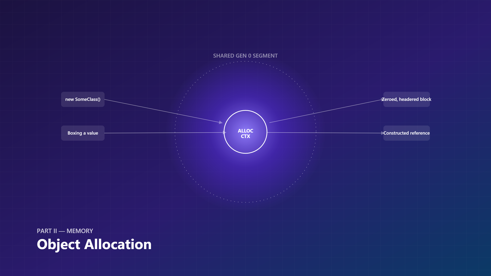
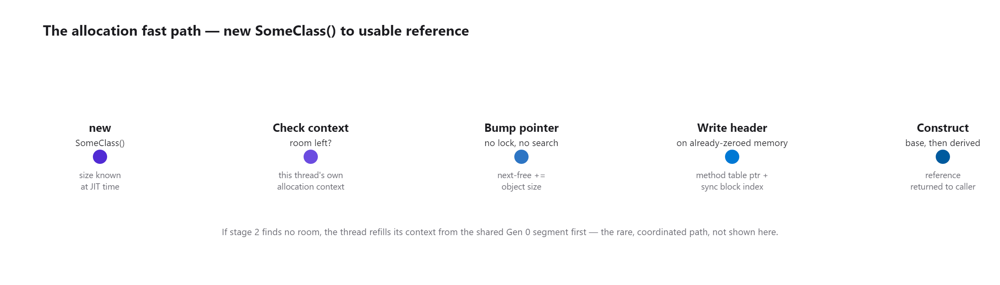
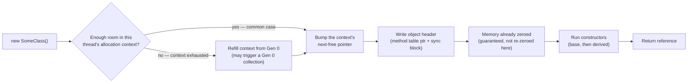
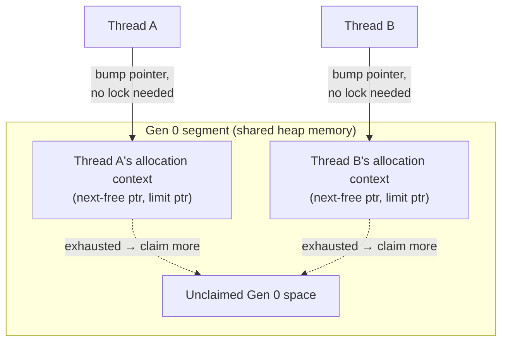
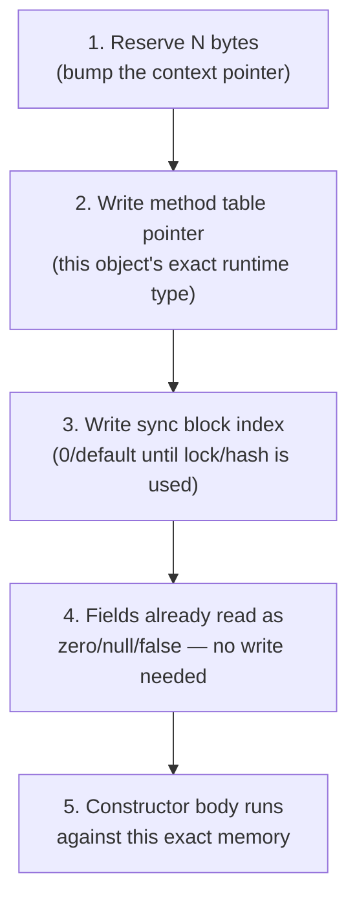
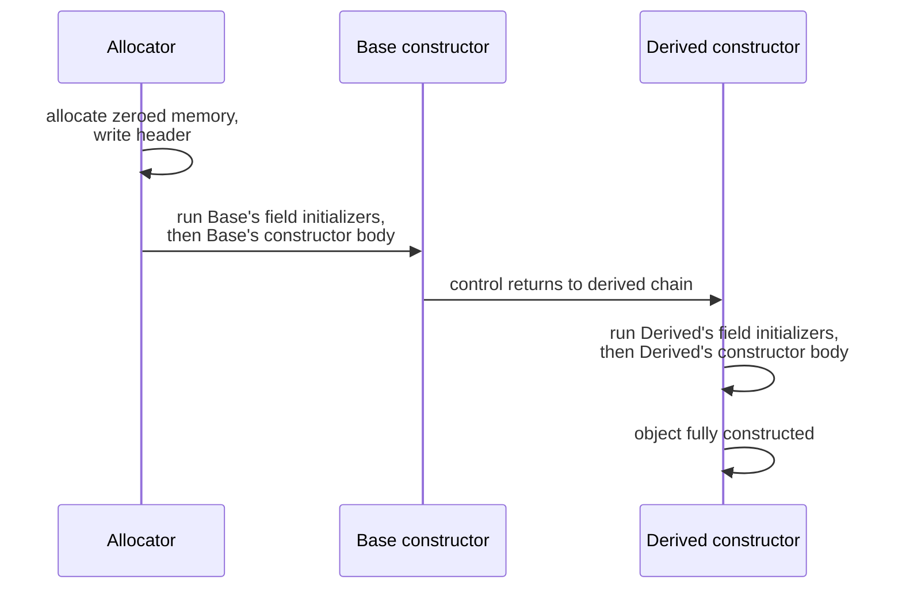
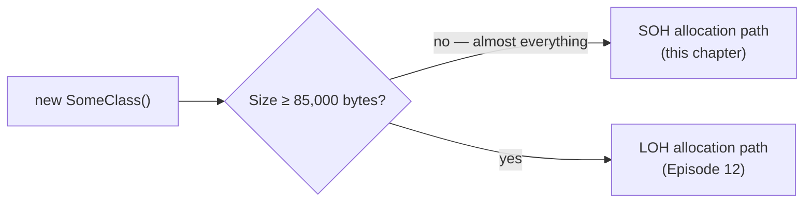
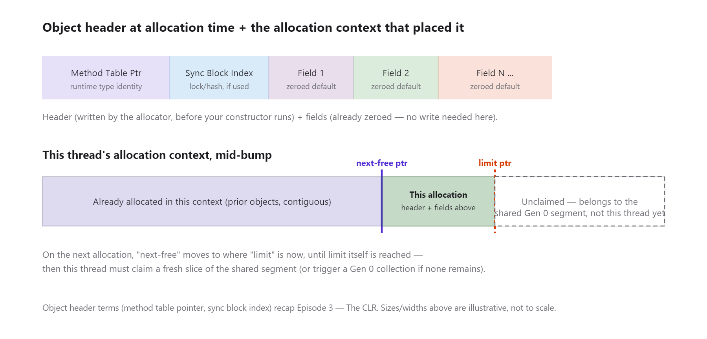
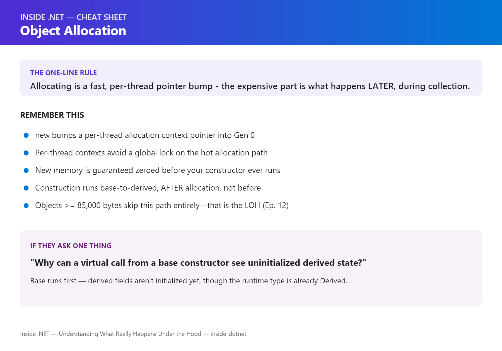

# Inside .NET — Episode 8
## Object Allocation

> *Part II — Memory*

---

### Chapter cover




---

### Learning objectives

By the end of this chapter, you will be able to:

- Trace, mechanically, everything that happens between writing `new SomeClass()` and getting back a usable reference — allocation, header initialization, zeroing, and construction.
- Explain why heap allocation in the common case is a bump-pointer operation, not a search through free memory, and connect that back to Episode 6's claim that "heap allocation is also just a pointer bump."
- Explain what a per-thread allocation context is and why it lets most allocations skip a global lock entirely.
- State precisely why .NET guarantees new objects start zeroed, and what that guarantee costs.
- Predict the field values a base-class constructor sees when it calls a virtual method overridden by a not-yet-fully-constructed derived class.

### Real-world analogy

A payments gateway processes 40,000 transactions a second at peak. Every transaction spins up a handful of short-lived objects — a request DTO, a validation result, an audit record — that exist for microseconds and then are discarded. At that rate, if allocating each one meant scanning a free list, taking a process-wide lock, or asking the OS for a fresh page, the gateway's throughput ceiling wouldn't be set by its business logic at all — it would be set by its allocator. It isn't, and the reason it isn't is the entire subject of this chapter: `new` in .NET is deliberately, aggressively cheap, engineered to stay cheap under exactly this kind of concurrent, high-frequency load.

Picture a bakery's par-baked dough line, not a made-to-order kitchen.

Each baker works from their own **tray of pre-portioned dough** at their station (**a per-thread allocation context** — a private slice already carved out of the shared supply). Grabbing the next portion is nothing more than sliding to the next spot on the tray (**bump-pointer allocation**: check if there's room, hand out the next address, move the pointer forward) — no walking to the shared flour bin, no waiting for anyone else's station to clear, no supervisor sign-off. Every portion arrives on a **clean, unmarked sheet of parchment** (**the CLR guarantees new memory is zeroed** before you ever see it) — nobody hands you a used sheet with yesterday's crumbs and expects you to notice; that would be a food-safety incident, and an uninitialized object field is the software equivalent. Stamped into the corner of every tray is a **station tag** identifying which recipe and which shift it belongs to (**the object header** — a method table pointer and a sync block index, written before you get the object back). And when a baker's tray finally runs empty, they don't personally go source more flour — they raise a hand, the head baker restocks every tray still in use and clears out the ones nobody needs anymore, on a schedule the individual baker never has to think about (**allocation-context exhaustion triggers a Gen 0 collection** — the mechanics of *that* event belong to the GC chapters ahead, not this one).

That's the whole fast path: your own private, pre-allocated space, a guarantee that what you're handed is clean, and a label that's already on it before you touch it.

### Problem statement

Every reference type instance needs somewhere to live, some way to be found as the type it actually is, and some starting state a program can safely read before it's written anything. Left unsolved, each of those becomes a real bug class:

- **Where does it live, and how fast can that decision be made?** A general-purpose native allocator (think `malloc`) has to consider fragmentation, coalescing free blocks of varying sizes, and thread contention over a shared heap — none of which .NET wants on the hot path of the single most common operation in a managed program. `new` runs on every request, every loop iteration, every LINQ projection; if it were as expensive as a general-purpose allocator call, allocation-heavy code (which is most C# code) would be *structurally* slow, not just occasionally slow.
- **How does the runtime know what type this block of bytes actually is?** A raw allocation is just an address and a size. Virtual dispatch, `GetType()`, safe casts, and the garbage collector's own tracing all need to know, unambiguously, what type occupies that memory — and they need that answer without walking back through the code that allocated it.
- **What's in the memory before your constructor runs?** If a freshly allocated object could contain leftover bytes from whatever used that memory previously, every field would need explicit initialization before first read just to be safe — and a single missed field would silently expose stale data from an unrelated object. That's a security and correctness problem most native languages leave to the programmer; .NET closes it at the allocator level instead.

Without a fast, safe answer to all three, allocation-heavy managed code couldn't compete with hand-tuned native code on throughput, and "uninitialized memory" bugs — a staple of C/C++ — would exist in C# too. The mechanism that answers all three simultaneously is the subject of this chapter: bump-pointer allocation into a per-thread context, a header written as part of the same operation, and zeroed memory as a runtime guarantee rather than a per-field responsibility.

### Visual explanation



#### 1. The allocation fast path, step by step



The branch that matters for throughput is the top one — refilling a context is comparatively rare, and even that path doesn't necessarily mean a full collection (see "Under the Hood" below).

#### 2. Per-thread allocation contexts carved from a shared Gen 0 segment



Claiming a *new* context (or extending one) from the shared free space does require coordination — that's the rare, comparatively expensive path. Allocating *within* a context you already own requires none, which is why two threads allocating heavily at the same time don't serialize on a shared lock in the common case.

#### 3. What actually gets written, in order



Step 4 isn't "the runtime writes zeros here" — it's that the memory handed out was already zeroed before allocation, so there's nothing to write. That distinction is the whole point of the next diagram.

#### 4. Object construction order — base before derived



Notice what's *not* on this diagram: at the point `Base`'s constructor body runs, `Derived`'s fields have not been touched yet — they hold whatever the zeroed allocation gave them. If `Base`'s constructor calls a virtual method that `Derived` overrides, that override runs against a partially-constructed object.

#### 5. Small object vs. Large Object Heap — routing decision only



*(Standalone Mermaid sources for all five diagrams live under [`diagrams/mermaid/`](diagrams/mermaid/), numbered to match the order above, per [IMAGE_GUIDE.md](../../IMAGE_GUIDE.md).)*

### Under the hood



1. **The fast path is a bump-pointer allocation, exactly as promised in Episode 6.** Each thread that's been allocating recently owns an *allocation context* — a small, private record of two pointers into the shared Gen 0 segment: a "next free byte" pointer and a "limit" pointer marking the end of the space that thread currently owns. `new SomeClass()` on the fast path is, mechanically: compute the object's size (known at JIT time for a non-generic, non-array type), check whether `next-free + size <= limit`, and if so, hand back the current `next-free` address and advance it by `size`. No search, no free list, no lock. This is the "heap allocation is also just a pointer bump" claim from Episode 6, made concrete: the *cost profile* is nearly identical to a stack pointer move, even though the *lifetime* and *reclamation* model are completely different.

2. **Per-thread allocation contexts exist specifically to avoid a global lock on that fast path.** If every thread bumped the same shared pointer, every allocation anywhere in the process would need to synchronize against every other thread's allocations — a single global lock taken millions of times a second, which would make allocation the worst point of contention in any multithreaded .NET program. Instead, each thread gets its own small context (carved out from the shared Gen 0 segment) and bumps *its own* pointers with no coordination required. Coordination only happens when a thread's context runs out and it needs a *new* slice of the shared segment — a comparatively rare event, cheap enough in aggregate that the common case (allocating within an already-owned context) stays lock-free.

3. **The object header goes on before your constructor ever runs, and it's small.** As covered in [Episode 3 — The CLR](../002-clr/article.md), every object on the heap carries a method table pointer (identifying its exact runtime type — this is what `GetType()`, virtual dispatch, and safe casts all resolve through) and a sync block index (historically the indirection point for `lock`/`Monitor`, and for the default `GetHashCode()` on types that don't override it). The allocator writes both as part of producing the object — by the time your constructor's first line executes, the object already *is* a fully-typed, identifiable heap object; it just hasn't run any of your initialization code yet.

4. **Zeroing is a guarantee, not a step this allocation performs.** .NET specifies that all new objects start with every field at its default value — `0`, `null`, `false`, or the equivalent default for a struct field laid out inline. The CLR doesn't achieve this by zeroing memory at the moment of each `new` (that would cost real time on every allocation); it achieves it because the OS hands the CLR *already-zeroed* pages when a Gen 0 segment is first committed, and the GC re-zeroes swept/compacted regions before they're handed back out for reuse, off the allocation hot path. The guarantee is real and unconditional — you will never read a stale, previously-live-object's byte through an uninitialized field — but the *work* of zeroing happens elsewhere, which is precisely why the fast path can stay a bump and a header write.

5. **Why this guarantee exists at all: it closes a whole bug and security class by construction.** In a language without it, forgetting to initialize a field means reading whatever bytes happened to occupy that memory before — potentially another object's private data, reused after that object was collected. .NET's zeroing guarantee makes "I forgot to initialize this field" produce a predictable default value instead of an information leak or nondeterministic bug. The cost of that guarantee is real (it's not free CPU work, it's shifted work, mostly paid during collection/segment-commit rather than allocation) — but it's a cost the runtime absorbs so every allocation site in every program doesn't have to reason about it individually.

6. **When the current context is exhausted, allocation stops being free — but it doesn't necessarily mean a full pause.** If bumping the pointer would exceed the context's limit, the thread needs a refill: either the Gen 0 segment still has unclaimed space (a cheap claim, no collection needed) or it doesn't, in which case allocation triggers a Gen 0 collection to reclaim space before continuing. This is the boundary where this chapter deliberately stops: *what* the GC actually does during that collection — generational promotion, the mark/sweep/compact mechanics, why Gen 0 collections are cheap relative to Gen 2 — is [Episode 10 and Episode 11]'s job. What matters here is the trigger: allocation-context exhaustion, not a timer, not a memory-pressure heuristic checked on every allocation.

7. **Objects ≥ 85,000 bytes skip this path entirely.** Large objects don't get bump-allocated into a Gen 0 segment shared with everything else — the runtime routes them to the **Large Object Heap**, a separate allocation and collection strategy with its own trade-offs (less frequent collection, more fragmentation risk, no generational promotion in the same sense). This chapter deliberately doesn't cover *how* the LOH works — that's [Episode 12 — GC Generations & LOH](../011-gc-generations-loh/article.md). The one fact worth carrying forward from here is the size threshold and the fact that it's a genuinely different code path, not a bigger version of the same bump allocator.

8. **Boxing is just one more caller of this exact mechanism, not a separate allocator.** When a value type gets boxed, the CLR allocates a new heap block through the same fast path described above — bump the pointer, write a header, the value's fields get copied in — the only thing distinguishing a boxing allocation from a plain `new` is *what* gets copied into the freshly allocated block afterward. [Episode 9 — Boxing & Unboxing](../008-boxing-unboxing/article.md) covers boxing's specific triggers and costs in depth; this chapter's job was to make sure you understand the allocation *mechanism* boxing rides on top of.

9. **Construction runs after allocation, base-to-derived, against memory the allocator already zeroed.** Once the allocator hands back a zeroed, headered block, the CLR runs field initializers and constructor bodies in a fixed order: the base class's field initializers and constructor body run *first*, then control returns down the chain to the derived class's field initializers and constructor body. This isn't a stylistic convention — the C# compiler enforces it by implicitly inserting a call to the base constructor as the first thing a derived constructor does (unless you explicitly chain to a different overload with `: base(...)` or `: this(...)`). The consequence: at the moment the base constructor's body is executing, every derived-class field is still at its zeroed default — the derived constructor hasn't run yet. If the base constructor calls a `virtual` method that the derived class overrides, that override executes now, against an object whose derived-specific fields haven't been initialized — see Common Mistakes for exactly why this is a recurring, hard-to-spot bug.

10. **This is how the runtime itself implements `new` — there's no separate "user code" allocator.** The JIT compiles `newobj` (the IL instruction behind `new`) into a call into the GC's allocation helper (`JIT_New`/`GCHeap::Alloc` and the fast inline-allocation helpers that avoid even that call in the hottest cases), which is the exact bump-pointer-into-allocation-context logic described above. You can read the actual implementation in [`dotnet/runtime`](https://github.com/dotnet/runtime)'s `gc.cpp` and the JIT's allocation helper stubs — this isn't a simplified teaching model, it's a description of the real fast path Microsoft ships.

### Code example

*Tier: Example + Advanced.*

```csharp
// Program.cs — .NET 10 console app
// Demonstrates: (1) measuring the allocation fast path's throughput via
// GC.GetAllocatedBytesForCurrentThread(); (2) base-before-derived construction
// order, observed directly; (3) the classic "virtual call from a base
// constructor sees uninitialized derived state" gotcha, made concrete instead
// of just described.

Console.WriteLine("=== Inside .NET: Episode 8 — Object Allocation demo ===");

// ---------------------------------------------------------------------------
// Part 1: measure the allocation fast path.
// GC.GetAllocatedBytesForCurrentThread() reads the *current thread's*
// allocation counter directly — no forced collection, no snapshot of the
// whole heap, just "how many bytes has this thread bumped its allocation
// pointer past." That makes it a faithful way to observe the fast path
// itself, not the GC's behavior around it.
// ---------------------------------------------------------------------------
const int iterations = 5_000_000;

long before = GC.GetAllocatedBytesForCurrentThread();
var sw = System.Diagnostics.Stopwatch.StartNew();

long sink = 0;
for (int i = 0; i < iterations; i++)
{
    var record = new AuditRecord(i, DateTime.UtcNow.Ticks);
    sink += record.Id; // touch it so the JIT can't optimize the allocation away
}

sw.Stop();
long after = GC.GetAllocatedBytesForCurrentThread();

long totalBytes = after - before;
double bytesPerAlloc = (double)totalBytes / iterations;
double nsPerAlloc = sw.Elapsed.TotalMilliseconds * 1_000_000 / iterations;

Console.WriteLine($"\n--- 1. Allocation fast-path throughput ---");
Console.WriteLine($"Allocated {iterations:N0} AuditRecord instances in {sw.Elapsed.TotalMilliseconds:N1} ms");
Console.WriteLine($"Bytes allocated (this thread): {totalBytes:N0}  ({bytesPerAlloc:N1} bytes/instance)");
Console.WriteLine($"Approx. time per allocation:   {nsPerAlloc:N1} ns  (sink={sink})");

// ---------------------------------------------------------------------------
// Part 2: construction order — base runs before derived, always.
// ---------------------------------------------------------------------------
Console.WriteLine("\n--- 2. Construction order: base before derived ---");
_ = new DerivedWithLogging();

// ---------------------------------------------------------------------------
// Part 3: the gotcha, made concrete — a virtual call from a base constructor
// observes the DERIVED class's fields at their zeroed default, because the
// derived constructor hasn't run yet when the base constructor's body does.
// ---------------------------------------------------------------------------
Console.WriteLine("\n--- 3. Virtual call from base constructor sees uninitialized derived state ---");
var risky = new RiskyDerived(label: "ready");
Console.WriteLine($"After full construction, risky.Describe() = \"{risky.Describe()}\"");

Console.WriteLine("\n=== Done ===");

// A small, deliberately plain reference type — no inheritance, no interfaces —
// so Part 1's measurement reflects the allocation mechanism itself, not any
// virtual-dispatch or interface overhead layered on top of it.
sealed class AuditRecord
{
    public int Id { get; }
    public long TimestampTicks { get; }

    public AuditRecord(int id, long timestampTicks)
    {
        Id = id;
        TimestampTicks = timestampTicks;
    }
}

// Demonstrates the ORDER of construction: base's constructor body runs to
// completion before derived's constructor body starts.
class BaseWithLogging
{
    public BaseWithLogging()
    {
        Console.WriteLine("  BaseWithLogging: constructor running");
    }
}

sealed class DerivedWithLogging : BaseWithLogging
{
    public DerivedWithLogging()
    {
        Console.WriteLine("  DerivedWithLogging: constructor running");
    }
}

// The gotcha: RiskyBase's constructor calls a virtual method. At that point,
// RiskyDerived's '_label' field is still at its zeroed default (null) — the
// derived constructor's field initializer and body haven't run yet.
abstract class RiskyBase
{
    protected RiskyBase()
    {
        // Calling a virtual method from a constructor, on 'this', is legal —
        // and dangerous, because 'this' is not fully constructed yet.
        Console.WriteLine($"  RiskyBase ctor sees Describe() = \"{Describe()}\"");
    }

    public abstract string Describe();
}

sealed class RiskyDerived : RiskyBase
{
    private readonly string _label;

    public RiskyDerived(string label)
    {
        // By the time THIS line runs, RiskyBase's constructor (and its call
        // to Describe(), above) has already completed. '_label' was still
        // null/default during that call — this assignment happens after.
        _label = label;
    }

    // Overrides the base's virtual method. When called from RiskyBase's
    // constructor, '_label' has not been assigned yet — it reads as its
    // zeroed default (null for a string), not "ready".
    public override string Describe() => _label ?? "(uninitialized)";
}
```

Run it with `dotnet run` in [`code/Chapter07.Demo/`](code/Chapter07.Demo/). Part 1 gives you a real, measured bytes-per-allocation and time-per-allocation figure on your own machine — expect single-digit-to-low-double-digit nanoseconds per allocation for a small object with no contention, which is the concrete payoff of the bump-pointer path described in "Under the Hood." Part 3's output line from inside `RiskyBase`'s constructor prints `"(uninitialized)"`, not `"ready"` — proof, not just a claim, that the virtual call executed against a derived object whose own field hadn't been set yet. This chapter's demo stays at the Example/Advanced tier deliberately — [Episode 9 — Boxing & Unboxing](../008-boxing-unboxing/article.md) and the GC chapters build Performance-tier `BenchmarkDotNet` measurements directly on top of the mechanics established here.

### Performance notes

- **In the common case, allocation cost is close to constant and small** — a size check, a pointer bump, and a header write, independent of how many other live objects exist on the heap. This is why "allocations are always slow" is wrong as a blanket statement: the *allocation* is cheap; what's expensive is what happens *later*, when the GC has to trace and reclaim.
- **Allocation rate, not allocation count, is the metric that predicts GC pressure.** A program that allocates 10 million tiny, short-lived objects a second can be perfectly healthy if most of them die before the next Gen 0 collection (cheap to collect, nothing to promote) — the cost that actually shows up in profiling is proportional to live-object graph size at collection time, not raw allocation count. `dotnet-counters`' `Allocation Rate` and `# of Gen 0 Collections` are the honest signals here, not a single before/after byte count from a teaching demo.
- **Per-thread allocation contexts mean allocation-heavy multithreaded code doesn't serialize on a global lock in the common case** — but a context refill (claiming more space from the shared Gen 0 segment) does require coordination, so workloads that allocate at extreme rates across many threads simultaneously can still see contention at the refill boundary, just far less often than if every single allocation needed it.
- **Object size directly determines allocation-context churn.** Larger objects consume a context's remaining space faster, meaning more frequent refills (and, eventually, more frequent Gen 0 collections) for the same allocation *rate* in bytes/second. This is one more reason "allocate fewer, larger objects instead of many small ones" is situational advice, not universal — it trades refill frequency for per-object cost, and the right answer depends on measured allocation rate, not intuition.
- **The zeroing guarantee is not "free" CPU time, it's *relocated* CPU time.** Freshly committed OS pages arrive zeroed already; pages reused after a collection get re-zeroed by the GC as part of collection/compaction work, off the allocation hot path. If you're profiling allocation cost in isolation and it looks suspiciously cheap, that's not a measurement error — the zeroing cost genuinely isn't there to find, because it was paid elsewhere.
- **Measuring construction cost separately from allocation cost matters.** `GC.GetAllocatedBytesForCurrentThread()` (used in this chapter's demo) isolates the allocator's contribution; if you want the full cost of `new SomeClass()` including constructor work, wrap the whole expression in a `Stopwatch` instead — conflating the two when a constructor does real work (validation, computed properties, nested allocations) will make the allocator look more expensive than it is.

### Common mistakes / anti-patterns

- **Calling a virtual method from a constructor and trusting derived state to be initialized.** This is the mistake this chapter's demo makes concrete: if a base constructor calls a `virtual`/`abstract` method that a derived class overrides, that override runs *before* the derived class's own field initializers and constructor body have executed — because construction proceeds strictly base-to-derived, and the base constructor's body is, by definition, still running. Any derived field the override reads will be at its zeroed default, not whatever the derived constructor was going to set it to. The fix: don't call virtual members from a constructor if the override could plausibly depend on derived-only state — call a private, non-virtual, sealed helper instead, or move the logic to run after construction completes (a factory method, an `Init` step, or simply not making the method virtual in the first place).
- **Assuming "the object is zeroed" means "the object is valid."** Zeroing guarantees predictable defaults (`0`, `null`, `false`) — it does not guarantee your invariants hold. A class with a non-nullable reference field that's only assigned partway through a multi-step constructor is, for that window, holding a `null` in a field the rest of the type assumes is never `null` — the zeroing guarantee protects you from *undefined* memory, not from your own not-yet-complete initialization.
- **Believing allocation count alone predicts GC cost.** As covered in Performance Notes, what matters is the live set at collection time, not raw allocation count — "we allocate a lot" is not, by itself, evidence of a performance problem, and "we allocate rarely" is not, by itself, evidence there isn't one (a rare allocation of something huge, long-lived, and referenced from a static field can be far worse than millions of tiny, quickly-dead ones).
- **Treating the Large Object Heap threshold as a hard rule to design around prematurely.** Knowing the ~85,000-byte cutoff exists is useful context (this chapter mentions it deliberately); restructuring data models specifically to dodge it before you've measured that LOH allocation is actually a problem in your workload is solving a problem you haven't confirmed you have — that analysis belongs in [Episode 12](../011-gc-generations-loh/article.md), with real data, not as a reflexive constraint applied everywhere.
- **Confusing "allocation is a pointer bump" with "allocation has no cost at all."** The bump itself is cheap, but every allocation still contributes to allocation-context churn and eventual Gen 0 collection pressure. "Cheap" and "free" aren't the same claim — this chapter argues the former, not the latter.

### Architect's perspective

**Developer Perspective**
*"Is my constructor doing anything a not-fully-constructed object shouldn't be trusted with?"*

Day to day, this chapter reduces to a habit: never call a `virtual` or `abstract` member from a constructor unless you're certain no override could ever depend on derived-only state — and if you're not certain, you're not certain enough. Prefer non-virtual, `sealed`, or `private` helpers for logic that has to run during construction. Trust the zeroing guarantee for what it actually promises (no garbage bytes, no leaked prior-object data) and nothing more — it doesn't make a half-initialized object correct, only predictable.

**Senior Perspective**
*"Would this allocation pattern still be cheap if this code path ran ten times more often?"*

This is where code review earns its keep on this topic: a single `new` in a rarely-hit code path is almost never worth discussing, but the same allocation inside a loop, a hot request handler, or a per-message parsing routine deserves a second look — not because allocation is inherently slow, but because allocation *rate* compounds in ways a single call site review can't see. The trade-off that actually matters at this altitude: reducing allocations (object pooling, `struct`-based DTOs, reusing buffers) trades allocation pressure for added complexity and, often, correctness risk (pooled-object reset bugs, accidental shared mutable state) — and that trade is only worth making where a profiler or `dotnet-counters` has shown allocation rate is a real bottleneck, not where it merely looks like one. A base-constructor-calls-virtual pattern surviving code review because "it works in testing" is a second, sharper thing to flag here — it works until someone adds a derived class whose override actually needs its own state, and then it fails in a way unit tests on the base type alone will never catch.

**Architect Perspective**
*"Does this system's allocation profile match its actual throughput and latency requirements, or is it inherited folklore?"*

At system scale, allocation strategy is a genuine architectural decision, not a micro-optimization: a high-throughput ingestion pipeline or a real-time trading path justifies deliberate allocation minimization (object pooling via `ArrayPool<T>`/`ObjectPool<T>`, struct-based message types, reusable buffers) precisely because allocation-context churn and Gen 0 collection frequency become first-order latency contributors at that volume — this is exactly why the BCL itself ships `ArrayPool<T>`, `RecyclableMemoryStream`-style patterns, and `Span<T>`-based parsing APIs, because Microsoft made the identical trade-off for the identical reason in `System.Text.Json` and Kestrel's own request pipeline. But applying that same discipline to a typical internal API processing tens of requests a second adds real complexity (pool lifecycle bugs, harder-to-reason-about object lifetimes) for a GC cost that was never the bottleneck. The architect's job is distinguishing which of those two systems you're actually building — via measured allocation rate and collection frequency in production telemetry, not by assuming every hot loop deserves pooling — and confining the added complexity to the boundary where it's earned. The construction-order rule from this chapter also scales into a team convention worth enforcing explicitly: a documented "constructors don't call virtual members" rule (backed by a Roslyn analyzer — `CA2214` flags exactly this) is cheaper than relying on every reviewer remembering base-before-derived ordering on every PR, especially once a codebase is large enough that the base and derived classes of a hierarchy are rarely reviewed side by side.

### Interview questions

**Q1: Walk through exactly what happens, mechanically, when `new SomeClass()` executes on the fast path.**
A: The JIT-compiled code checks whether the current thread's allocation context has enough remaining space for the object's size. If so, it takes the context's current "next free" address, advances that pointer by the object's size, writes the object header (a method table pointer identifying the exact runtime type, plus a sync block index) into the reserved block, and returns that address as the new reference. The memory was already zeroed before this operation, so no field-by-field zeroing happens here. Constructors then run against that address, base class first, then derived.

**Q2: Why does each thread get its own allocation context instead of every thread bumping one shared pointer?**
A: A single shared pointer would require every allocation on every thread to synchronize against every other thread's allocations — effectively a global lock taken on the single most frequent operation in a managed program. Per-thread allocation contexts let each thread bump its own private pointers with no coordination, so contention only happens on the comparatively rare event of a context running out and needing to claim more space from the shared Gen 0 segment.

**Q3: .NET guarantees new objects start zeroed. Where does that zeroing actually happen, and why does that matter for allocation performance?**
A: It's not performed at the moment of each `new`. Freshly committed OS pages arrive already zeroed, and pages reclaimed by a collection are re-zeroed by the GC as part of collection/compaction work — off the allocation hot path. This matters because it means the fast path (bump the pointer, write the header) doesn't pay a per-field zeroing cost; the guarantee is real, but the work backing it is relocated to a less frequent, less latency-sensitive point in time.

**Q4: What happens when a thread's allocation context is exhausted?**
A: The thread needs a refill: either the shared Gen 0 segment still has unclaimed space, in which case the thread claims a new slice (cheap, no collection required), or it doesn't, in which case the allocation triggers a Gen 0 collection to reclaim space before the allocation can proceed. This is the trigger condition for the GC's involvement — allocation-context exhaustion, not a background timer or a periodic check on every allocation.

**Q5: If a base class constructor calls a virtual method that a derived class overrides, what does that override see, and why?**
A: It sees the derived class's fields at their zeroed defaults, not whatever the derived constructor would eventually set them to. Construction proceeds strictly base-to-derived — the base constructor's body runs to completion (including any virtual calls it makes) before the derived constructor's field initializers and body run at all. The object already exists (allocated, headered, zeroed) and is already the derived runtime type when the virtual call resolves, which is exactly why the override runs — but the derived-specific initialization hasn't happened yet.

**Q6: Why do objects at or above roughly 85,000 bytes take a different allocation path than everything else?**
A: They're routed to the Large Object Heap instead of being bump-allocated into a Gen 0 segment shared with small, short-lived objects — a separate strategy with different collection frequency and fragmentation characteristics, because collecting and compacting very large objects on the same schedule as small ones would be wasteful. The mechanics of the LOH itself are outside this chapter's scope by design — see [Episode 12 — GC Generations & LOH](../011-gc-generations-loh/article.md).

### Quiz

1. What two things does the CLR write into an object's header at allocation time, and where were those concepts first introduced in this series?
2. Why doesn't allocating heavily from two threads at once serialize on a shared lock in the common case?
3. Is memory zeroed at the moment of each `new`? If not, when and where does the zeroing actually happen?
4. In what order do field initializers and constructor bodies run across a base/derived class chain?
5. What size threshold routes an allocation to the Large Object Heap instead of the normal path, and which chapter covers what happens after that routing decision?

<details>
<summary>Answers</summary>

1. A method table pointer (identifying the object's exact runtime type) and a sync block index (historically the indirection point for `lock`/`Monitor` and default hashing) — both introduced in [Episode 3 — The CLR](../002-clr/article.md) and recapped here as the payload the allocator writes.
2. Because each thread allocates from its own private allocation context (a small slice of the shared Gen 0 segment) — bumping that context's own pointer requires no coordination with any other thread. Coordination is only needed when a context is exhausted and a thread needs to claim more shared space.
3. No — freshly committed OS pages arrive already zeroed, and pages reclaimed by a collection are re-zeroed by the GC during collection/compaction, not at the moment of allocation. The guarantee is real; the work is relocated off the allocation hot path.
4. Base class first — its field initializers, then its constructor body — followed by the derived class's field initializers, then its constructor body. This is enforced by the compiler implicitly chaining to the base constructor unless you explicitly chain elsewhere with `: base(...)` or `: this(...)`.
5. Roughly 85,000 bytes. What happens on the Large Object Heap side of that decision is [Episode 12 — GC Generations & LOH](../011-gc-generations-loh/article.md), deliberately not this chapter.

</details>

### Summary & next chapter



**Key takeaways:**

- `new SomeClass()`'s fast path is a bump-pointer allocation into the current thread's allocation context, followed by writing the object header (method table pointer + sync block index) — the exact mechanism behind Episode 6's "heap allocation is also just a pointer bump" claim.
- **Per-thread allocation contexts** exist so that allocation, the single most frequent operation in a managed program, doesn't serialize on a global lock in the common case — coordination only happens when a context needs refilling.
- **Zeroing is a guarantee, not a per-allocation step.** New objects always start at their default field values, but the zeroing work happens when pages are committed or reclaimed, not at the moment of `new` — which is why the fast path stays cheap.
- **Allocation-context exhaustion, not a timer, is what triggers a Gen 0 collection** — this chapter stops at the trigger; the collection mechanics themselves belong to the GC chapters ahead.
- **Objects ≥ 85,000 bytes and boxed values both ride a different or additional path** — the LOH and boxing are each covered in their own dedicated chapters, deliberately not duplicated here.
- **Construction runs base-to-derived, against already-zeroed, already-headered memory** — and a virtual call from a base constructor will see the derived class's fields at their zeroed defaults, because the derived constructor hasn't run yet. This is a real, recurring bug source, not a trivia detail.
- This chapter is the mechanism underneath nearly everything else in Part II: boxing (Episode 9) is one more caller of this same allocator; GC generations (Episode 12) is what happens after allocation-context exhaustion; and every allocation-avoidance technique in the performance chapters ahead (pooling, `Span<T>`, `stackalloc`) is ultimately about *not* invoking this path at all.

**What's next:** [Episode 9 — Boxing & Unboxing](../008-boxing-unboxing/article.md) takes the allocation mechanism established here and applies it to one specific, extremely common trigger: what happens, exactly, when a value type needs to be treated as `object`.

---

**Where you are in the journey:**

```
    Episode 7 — Value Types vs Reference Types
              ↓
  ▶ Episode 8 — Object Allocation   ◀ you are here   (Part II — Memory)
              ↓
    Episode 9 — Boxing & Unboxing
```

**Related:** [Episode 6 — Stack vs Heap](../005-stack-vs-heap/article.md) (the pointer-bump claim this chapter makes concrete) · [Episode 9 — Boxing & Unboxing](../008-boxing-unboxing/article.md) · [Episode 12 — GC Generations & LOH](../011-gc-generations-loh/article.md)
