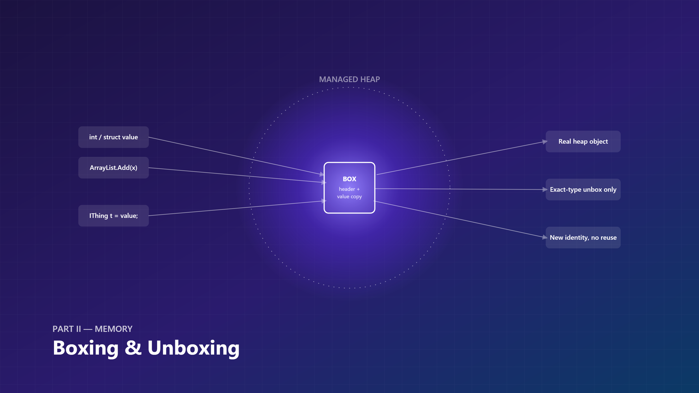
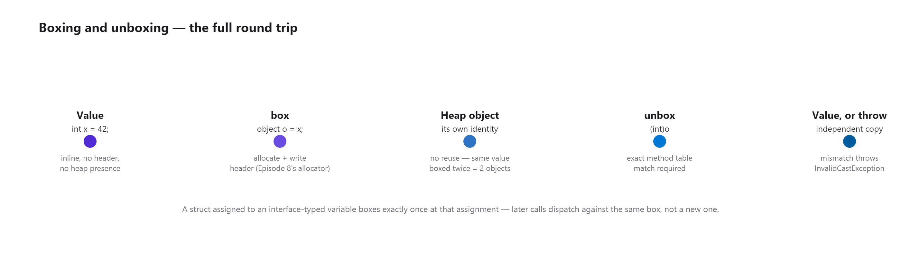
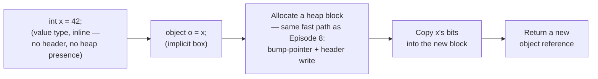
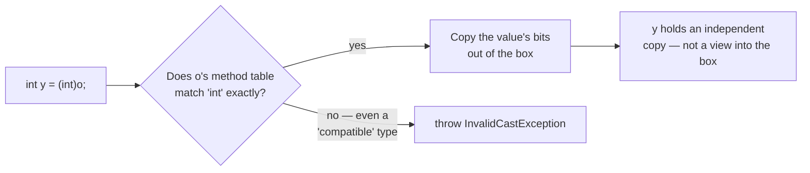
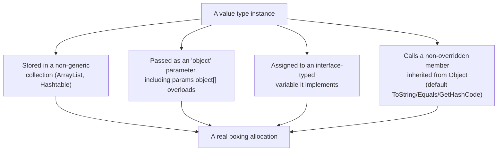
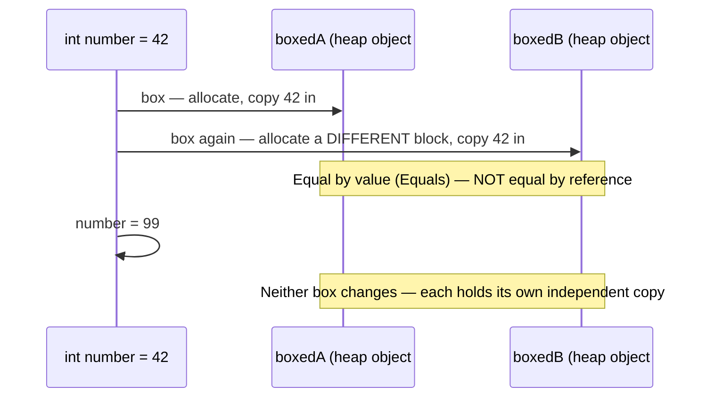
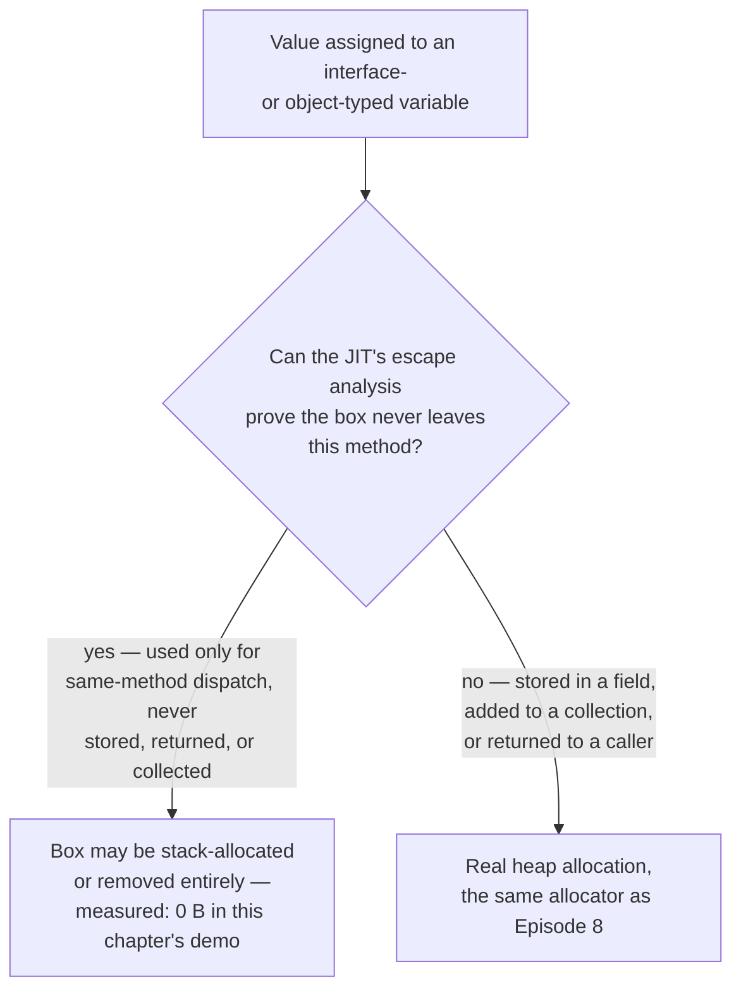
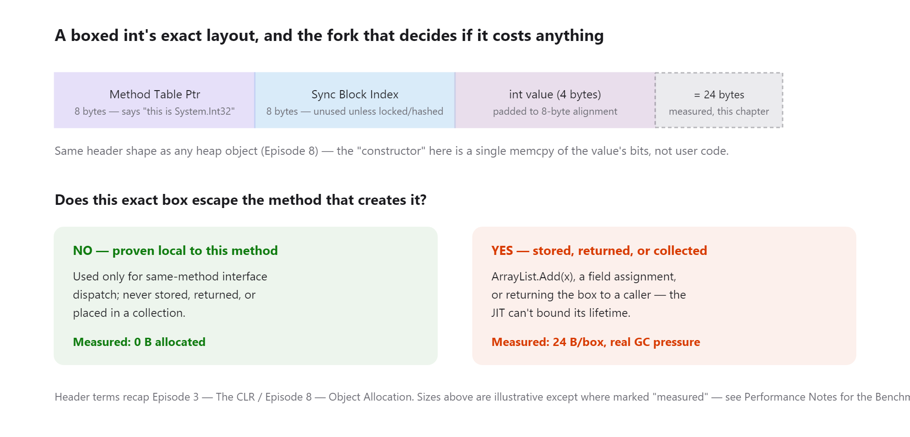
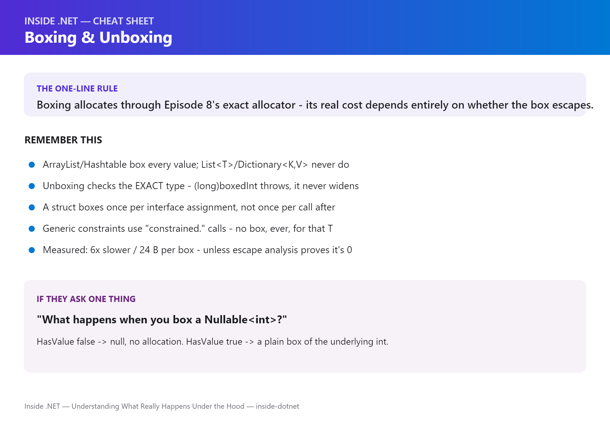

# Inside .NET — Episode 9
## Boxing & Unboxing

> *Part II — Memory*

---

### Chapter cover




---

### Learning objectives

By the end of this chapter, you will be able to:

- Trace, mechanically, what happens when a value type is boxed — which allocator handles it, what gets written where, and how it relates to the allocation mechanism from Episode 8.
- Explain why unboxing demands the *exact* original type, not merely a compatible one, and what CLR check enforces that.
- Identify the "invisible" boxing trigger sites that don't have the word `box` anywhere near them in the source: non-generic collections, `object`/`params object[]` parameters, and interface dispatch on a struct.
- Predict, correctly, whether a given call through an interface reference on a struct boxes it — and explain why a generic constraint on the same struct doesn't.
- Measure boxing's real cost with `BenchmarkDotNet` rather than repeat the "boxing is slow" claim unmeasured — including the case where a modern JIT eliminates the allocation entirely.

### Real-world analogy

A regional parcel-sorting hub processes two million loose items a day — batteries, phone cases, cable ties — arriving from a thousand different sellers. The hub's entire automated system, the conveyors, the barcode scanners, the robotic arms, was built to handle exactly one physical shape: a standardized tote, barcoded and manifested, that any machine on the line can pick up, route, and read without knowing or caring what's inside it. A loose battery can't ride that conveyor. Before it enters the automated system at all, it goes through induction: it's dropped into a *brand-new* tote, a barcode is printed and affixed identifying exactly what's inside, and only then does it join the flow. Two identical batteries from the same seller still each get their own tote — the induction station has no concept of "reuse the tote from an identical item five minutes ago." And when an item finally needs to leave the automated system and go back into loose inventory, the receiving process is strict: the barcode has to declare *exactly* the item type the receiving station expects, not "something roughly compatible" — a battery labeled as a battery comes out fine; try to pull it out as if the barcode said "cable tie" and the station rejects it outright.

That's boxing and unboxing. A value type (**the loose battery**) can't, by itself, live in a system built around uniform object references (**the tote-based conveyor system**) — so the CLR performs **induction**: it allocates a new heap block (**a fresh tote**, using the exact same allocation mechanism from [Episode 8](../007-object-allocation/article.md)), writes an object header identifying the value's exact type (**the barcode**), and copies the value's bits in. Every single box is a new heap object — there's no reuse, no interning, even for the same value boxed twice in a row. Pulling the value back out (**unboxing**) checks that barcode against exactly what's expected; anything less than an exact type match is rejected, not coerced. And just as the parcel hub's entire reason for existing is to let a fixed, generic set of machines handle an unbounded variety of physical goods, boxing exists so a fixed, generic set of APIs — `object` parameters, non-generic collections, interface dispatch — can handle an unbounded variety of value types without knowing their shape in advance.

### Problem statement

The CLR's type system has a hard split, covered in [Episode 7 — Value Types vs Reference Types](../006-value-vs-reference-types/article.md): value types live wherever they're declared (stack, inline in another object, inline in an array) with no header and no independent identity, while reference types live on the heap behind a uniform object reference with a method table pointer and a sync block index. That split is exactly what makes value types cheap — but it creates a real problem the moment a value type needs to participate in anything built around object references:

- **Pre-generics APIs only know how to hold `object`.** `ArrayList`, `Hashtable`, and every `object`-typed parameter predate .NET generics (introduced in .NET 2.0) and have no other vocabulary for "a value of some type I don't know yet" — they can only express that as `object`. A `struct` or primitive has no object header to be referenced through; without some mechanism to give it one on demand, it simply couldn't go into these APIs at all.
- **Interface dispatch needs something to dispatch *through*.** A `struct` can implement an interface, but calling a member through the *interface type* (not the concrete struct type) requires a uniform calling mechanism — the same one every reference type already uses via its method table. A bare value type sitting on the stack has no method table pointer to look that dispatch up through.
- **`GetType()`, casting to `object`, and reflection all expect an object reference.** Anything that needs to inspect a value polymorphically — "what type is this, actually?" — needs an answer that works the same way for a `string` and an `int`, and an `int` on its own doesn't carry that answer anywhere.

Without an answer, value types would be a second-class citizen shut out of huge parts of the BCL, or the language would need two parallel versions of every API — one for value types, one for reference types. **Boxing is the CLR's answer**: allocate a real heap object on demand, with a real header, that wraps a copy of the value — at which point every mechanism built for reference types works on it unmodified. **Unboxing is the reverse**, and it's deliberately strict (exact type match, not compatible-type match) because the alternative — silently coercing types on the way out of a box — would turn a category of real bugs into "the value's a bit off" mysteries instead of a hard, immediate exception.

### Visual explanation



#### 1. Boxing — a value type's round trip onto the heap



#### 2. Unboxing — the exact-type check that guards the reverse trip



#### 3. Where boxing happens without the word "box" anywhere nearby



#### 4. Box identity — two boxes of the same value are never the same object



#### 5. Whether a box actually costs a heap allocation now depends on escape analysis



*(Standalone Mermaid sources for all five diagrams live under [`diagrams/mermaid/`](diagrams/mermaid/), numbered to match the order above, per [IMAGE_GUIDE.md](../../IMAGE_GUIDE.md).)*

### Under the hood



1. **Boxing is one more caller of the exact allocation mechanism from Episode 8 — not a separate allocator.** The `box` IL instruction computes the size needed (the value's own size plus the standard object header), asks the allocator for that many bytes on the fast path (bump the current thread's allocation-context pointer, no lock, no search), writes the object header — a method table pointer for the value's *exact* runtime type, plus a sync block index — and then copies the value's bits into the space right after the header. The only thing distinguishing a boxing allocation from a plain `new SomeClass()` is what happens after the header is written: a full-value `memcpy` instead of running a constructor body.

2. **Unboxing is a type check, not a conversion.** The `unbox` IL instruction takes an object reference and a type token and compares the object's method table pointer against that exact token. If they match, `unbox` produces a *controlled-mutability managed pointer* directly into the box's payload — an interior pointer, not a copy. The C# compiler then typically follows it with a copy of the value out to wherever it's being unboxed into (the `ldobj`/`unbox.any` sequence for a plain `(int)o` cast). This is why the check is exact-type, not assignable-type: `unbox` isn't asking "can a `long` be constructed from what's in this box," it's asking "is the box literally holding an `int`," because the interior pointer it hands back is typed as whatever the box actually contains. `(long)boxedInt` isn't a widening conversion that happens to be denied — there's no conversion path being consulted at all; the type token simply doesn't match, and `InvalidCastException` is the result, every time.

3. **Interface dispatch on a struct forces a box precisely when a real object reference is required.** Assigning a struct to a variable of an interface type it implements (`IIncrementable boxedCounter = counter;`) requires the CLR to hand back something with a method table — because that variable is a genuine reference that could be stored, returned, or compared by identity, none of which a bare value type supports. The box happens exactly once, at that assignment. Every subsequent call through the interface reference (`boxedCounter.Increment()`) is an ordinary virtual dispatch against that one box's method table — it does not re-box on every call.

4. **Generic constraints avoid the box via a distinct IL mechanism: constrained calls.** When a generic method calls an interface member on a type parameter (`incrementable.Increment()` where `T : IIncrementable`), the compiler emits a `constrained.` prefix before the `callvirt`. At the call site, the JIT already knows (per generic instantiation) whether `T` is a reference type or a value type. If `T` is a value type that implements the interface method itself (not one inherited unmodified from `object`), the `constrained.` prefix lets the JIT call that implementation directly against the value's address — no box, ever, for that instantiation. This is the exact mechanism behind `DescribeWithoutBoxing<T>` in this chapter's code sample staying allocation-free while `IIncrementable boxedCounter = counter` does not.

5. **Boxes are ordinary heap objects once they exist — same GC rules as everything else.** A box isn't a special, lightweight, or short-lived-by-construction kind of object; it's allocated the same way, lives in the same generations, and gets collected under the exact same rules covered in Episode 8 and the GC chapters ahead. A box that outlives Gen 0 gets promoted like anything else. This is precisely why "boxing in a hot loop" is a real performance concern and not folklore — every iteration that boxes is an allocation-rate contributor exactly as described in Episode 8's Performance Notes, not a special exemption.

6. **`Nullable<T>` gets special-cased boxing rules, and they're worth knowing precisely.** Boxing a `Nullable<T>` doesn't produce a box of `Nullable<T>` — if `HasValue` is `false`, boxing produces a plain `null` reference (no allocation at all); if `HasValue` is `true`, boxing produces an ordinary box of the *underlying* `T`, with no trace that it ever passed through a `Nullable<T>`. This is deliberate: it means `((object)someNullableInt)` round-trips through `object` exactly the way a plain `int?` user expects — `is int` succeeds on a boxed non-null `int?`, and a boxed null `int?` really is `null`, not a box containing "no value."

7. **Modern RyuJIT can eliminate a boxing allocation entirely when it can prove the box never escapes.** Escape-analysis-driven stack allocation of provably non-escaping objects — including certain boxing patterns — is a real, active JIT optimization in current .NET, not a hypothetical. This chapter's own benchmark (see Performance Notes) measured *zero bytes allocated* for 100,000 interface-dispatch calls against a boxed struct, because the box is a local that's never stored, returned, or placed in a collection — the JIT proved it can't outlive the method and removed the heap allocation. The moment that same box is stored somewhere the JIT can't prove is bounded (a field, a collection, a return value), the optimization doesn't apply and the allocation is real — exactly what the `ArrayList` benchmark in the same run shows.

8. **`params object[]` boxes; modern interpolated strings usually don't.** Calling an overload that accepts `params object[]` (classic `string.Format("{0}", someInt)`, or `Console.WriteLine("{0}", someInt)` via its `params object[]` overload) boxes every value-typed argument to build that array. Since C# 10, an interpolated string (`$"{someInt}"`) compiles against `DefaultInterpolatedStringHandler` when the target accepts it (including a direct `Console.WriteLine(string)` call, since the interpolated-string-to-`string` conversion itself goes through the handler) — the handler has a generic `AppendFormatted<T>(T value)` path that formats the value directly, with no box in between. Same visible output, measurably different allocation profile, depending on which overload and which C# feature you reached for.

9. **This is how the runtime itself implements boxing — there's no separate, simplified "teaching model" version.** The JIT compiles the `box` IL instruction into a call against the same GC allocation helpers behind every `new` (`JIT_Box` layering on top of the `JIT_New`/`GCHeap::Alloc` machinery from Episode 8), and `unbox`/`unbox.any` into the CLR's exact-type-match helper. The `constrained.` call-site handling that lets generic code skip boxing is implemented directly in the JIT's call-site lowering, not bolted on afterward. You can read all of this in [`dotnet/runtime`](https://github.com/dotnet/runtime) — the same box/unbox helpers and constrained-call lowering Microsoft ships in every .NET release, not a simplified stand-in for it.

### Code example

*Tier: Example + Advanced + Performance.*

```csharp
// Program.cs — .NET 10 console app
// Demonstrates: (1) boxing identity — every box is its own heap object, even for
// the same value; (2) unboxing's exact-type requirement, made concrete via the
// exception it throws when violated; (3) the ArrayList-vs-List<int> boxing gap,
// measured directly with GC.GetAllocatedBytesForCurrentThread(); (4) boxing
// triggered by interface dispatch on a struct, and how a generic constraint
// avoids it; (5) the classic "mutating a boxed struct through an interface
// doesn't mutate your original variable" gotcha, made concrete instead of just
// described.

Console.WriteLine("=== Inside .NET: Episode 9 — Boxing & Unboxing demo ===");

int number = 42;
object boxedA = number;
object boxedB = number;

Console.WriteLine($"  boxedA equals boxedB (value)?     {boxedA.Equals(boxedB)}");
Console.WriteLine($"  boxedA is boxedB (reference)?     {ReferenceEquals(boxedA, boxedB)}");

object boxedInt = 7;
int okUnbox = (int)boxedInt; // exact match: int -> object -> int. Fine.

try
{
    long mismatched = (long)boxedInt; // int and long are different types; no widening during unboxing.
}
catch (InvalidCastException ex)
{
    Console.WriteLine($"  Unboxing to 'long' threw: {ex.Message}");
}

var counter = new Counter(5);
IIncrementable boxedCounter = counter; // <- this assignment is where the box happens.

var original = new Counter(0);
IIncrementable boxed = original; // boxes 'original' into a new heap object right here.
boxed.Increment(); // mutates the fields INSIDE THE BOX. 'original' is untouched.

interface IIncrementable
{
    int Value { get; }
    void Increment();
}

struct Counter(int startingValue) : IIncrementable
{
    private int _value = startingValue;
    public int Value => _value;
    public void Increment() => _value++;
}
```

Run the full version with `dotnet run` in [`code/Chapter08.Demo/`](code/Chapter08.Demo/) — it also covers the `ArrayList`-vs-`List<int>` allocation measurement and the generic-constraint comparison omitted above for length. See [`code/README.md`](code/README.md) for the complete listing and expected output.

The Performance tier lives in [`code/Chapter08.Benchmarks/`](code/Chapter08.Benchmarks/) — three real `BenchmarkDotNet` classes backing every number in the next section: a plain box/unbox round trip, `ArrayList` vs `List<int>`, and the struct/interface/generic dispatch comparison that turns up the escape-analysis result described in "Under the Hood."

### Performance notes

Every number below is a measured `BenchmarkDotNet` result from this chapter's own `Chapter08.Benchmarks` project (`.NET 10.0.8, X64 RyuJIT AVX2, Concurrent Workstation GC`), not an estimate — re-run it yourself with `dotnet run -c Release` and expect the same shape, if not the exact figures, on your hardware.

**1. A plain box + unbox round trip, 100,000 iterations:**

| Method | Mean | Ratio | Allocated |
|---|---|---|---|
| `SumUnboxed` (baseline) | 30.82 µs | 1.00 | – |
| `SumBoxedRoundTrip` | 182.98 µs | **5.94×** | 2,400,000 B (24 B/box) |

Boxing and unboxing a value on every iteration is roughly **6× slower** than staying unboxed, and it isn't a CPU-only cost — it's 24 bytes of real heap allocation per box (an 8-byte method table pointer + 8-byte sync block index header, plus the `int`'s 4 bytes rounded up to 8-byte alignment), on every single iteration.

**2. `ArrayList` vs `List<int>`, Add + sum, 100,000 items:**

| Method | Mean | Ratio | Allocated | Alloc Ratio |
|---|---|---|---|---|
| `ListOfIntAddAndSum` (baseline) | 177.4 µs | 1.00 | 390.72 KB | 1.00 |
| `ArrayListAddAndSum` | 777.0 µs | **4.38×** | 3,125.18 KB | **8.00×** |

The 8× allocation ratio here matches this chapter's own `Chapter08.Demo` measurement of the same comparison almost exactly (also 8.0×, using `GC.GetAllocatedBytesForCurrentThread()` instead of `BenchmarkDotNet`) — two different measurement techniques agreeing is a stronger claim than either one alone.

**3. Struct dispatch: direct call, generic constraint, and interface reference, 100,000 calls each:**

| Method | Mean | Ratio | Allocated |
|---|---|---|---|
| `DirectStructCalls` (baseline) | 21.57 µs | 1.00 | – |
| `GenericConstraintCalls` | 21.62 µs | 1.00 | – |
| `InterfaceReferenceCalls` | 21.13 µs | 0.98 | – |

This result is deliberately included *because* it's surprising: `InterfaceReferenceCalls` boxes the struct (`IIncrementable counter = new Counter(0);`) and then dispatches through the interface 100,000 times — and shows **zero measured allocation**, statistically indistinguishable in both time and memory from the boxing-free alternatives. This is the escape-analysis behavior from "Under the Hood" #7, measured directly: the box is a local never stored, returned, or placed in a collection, so the JIT proved it doesn't escape this method and removed the allocation. Change the code so the box escapes — store it in a field, add it to a list, return it — and the allocation reappears, exactly as it does in benchmark 2's `ArrayList` case.

- **The lesson from all three tables together isn't "boxing is always 6× slower" or "boxing is sometimes free" — it's that boxing's cost depends entirely on whether the box escapes the method it's created in**, and that's a JIT-proven fact about your specific code shape, not a property of boxing as a concept. Don't restructure code to *chase* the escape-analysis-eliminated case; write the clearest code, and reach for allocation-avoidance (generics, `List<T>` over `ArrayList`, avoiding `params object[]` overloads on value types in hot paths) when a profiler shows boxing is a real, escaping-allocation cost in your workload — not preemptively.
- **`dotnet-counters`' `Allocation Rate` is the honest way to confirm a suspected boxing hotspot in a running process**, the same way it was for raw allocation rate in Episode 8 — a `BenchmarkDotNet` `[MemoryDiagnoser]` table like the ones above is the right tool in isolation; production allocation pressure is a live-measurement problem, not a microbenchmark one.

### Common mistakes / anti-patterns

- **Reaching for `ArrayList`/`Hashtable` in new code.** These predate generics and box every value type they store — `List<T>`, `Dictionary<TKey, TValue>`, and the rest of `System.Collections.Generic` exist specifically so this isn't a trade-off you have to make anymore. There's no scenario in modern .NET where a non-generic collection over value types is the right default choice.
- **Assuming a boxed value's identity is meaningful.** Two boxes of the same value are equal by `Equals` but never by reference (`ReferenceEquals`) — code that boxes a value and later expects `==`/`ReferenceEquals` semantics on it (for caching, deduplication, or as a dictionary key relying on identity rather than value equality) will silently misbehave, because every box is unconditionally a new object.
- **Mutating a boxed struct through an interface and expecting the original variable to change.** As this chapter's demo shows directly: `IIncrementable boxed = original; boxed.Increment();` mutates the box, not `original`. The moment a struct is boxed, it and the variable it came from are two completely independent copies — this is the same "value types copy" rule from Episode 7, just easy to lose track of because the boxed copy still *looks* like it's being manipulated through a reference.
- **Using `params object[]` overloads (`string.Format`, `Console.WriteLine("{0}", x)`) on value types in a hot path** and being surprised by allocation pressure a profiler flags. The fix is almost always available without changing behavior: prefer an interpolated string (`$"{x}"`) targeting a direct `string` overload, which — since C# 10 — routes through `DefaultInterpolatedStringHandler` and avoids the box entirely, as covered in "Under the Hood" #8.
- **Treating escape-analysis-eliminated boxing as a guarantee to design around.** The zero-allocation result in this chapter's third benchmark is real and reproducible for that *exact* code shape — but it depends on the JIT proving non-escape, which is sensitive to how the value is used, not a documented contract. Don't restructure working code purely to try to hit this optimization; write for correctness and clarity, and let a profiler tell you if a genuinely escaping box is worth eliminating.

### Architect's perspective

**Developer Perspective**
*"Is this specific line boxing, and would I have noticed if I hadn't looked for it?"*

Day to day, this chapter reduces to pattern recognition: assigning a value type to `object` or to an interface-typed variable, storing it in a non-generic collection, or passing it to a `params object[]` overload all box, whether or not the word "box" appears anywhere near the code. None of these are wrong to use occasionally — a one-off `object` parameter in rarely-hit code is not worth a second thought. The habit worth building is noticing when one of these shapes appears *inside a loop or a hot call path*, because that's where an invisible per-call allocation compounds into something a profiler will eventually flag.

**Senior Perspective**
*"Does this boxing site escape, and did anyone check, or is 'boxing is slow' being repeated from a decade-old blog post?"*

This is where code review earns its keep: a boxed value used only for immediate, same-method dispatch is a fundamentally different cost than one stored in a field, added to a collection, or handed to another method — and this chapter's own benchmark proves the first case can cost *nothing* on a modern JIT while the second is a real, measured allocation every time. The trade-off that actually matters at this altitude is not "avoid boxing" as a blanket rule — it's confirming, via `BenchmarkDotNet` or `dotnet-counters`, that a suspected boxing hotspot is actually escaping before spending review time or added complexity (generic rewrites, `Span<T>`-based alternatives) eliminating something that might already cost nothing.

**Architect Perspective**
*"Where in this system does a value type cross a boundary it wasn't designed to cross, and is that boundary itself the thing to fix?"*

At system scale, chronic boxing is usually a symptom of an API boundary designed before generics were idiomatic, or one that still accepts `object` for flexibility it doesn't actually need — a logging interface taking `params object[]`, a plugin contract built around non-generic collections, a legacy interop layer. The architectural fix is rarely "optimize the boxing call site" and usually "redesign the boundary to be generic," which is exactly the migration path Microsoft itself took with `System.Collections.Generic` replacing `System.Collections`, and with modern BCL APIs (`Span<T>`-based parsing, generic math via `INumber<T>`) that are explicitly designed to never require a box for value-typed data on a hot path. The architect's job is recognizing which boxing sites in a codebase are a one-line fix (swap `ArrayList` for `List<T>`) versus which ones are evidence that a public or cross-team API contract needs to be redesigned — and that a documented convention ("no non-generic collections in new code," backed by a Roslyn analyzer where one exists) is cheaper long-term than relying on every reviewer to independently notice an interface-dispatch box in a PR.

### Interview questions

**Q1: What actually happens, mechanically, when a value type is boxed?**
A: The `box` IL instruction computes the size needed (the value's size plus a standard object header), allocates that many bytes through the exact same fast-path allocator described in Episode 8 (a per-thread allocation-context bump, no lock), writes an object header — a method table pointer identifying the value's exact runtime type, plus a sync block index — and copies the value's bits into the space after the header. It returns a new object reference. The only thing distinguishing this from a plain `new SomeClass()` is that the "constructor" is a full-value memory copy instead of user code.

**Q2: Why does unboxing to a "compatible" type — say, unboxing an `int` box as a `long` — throw, instead of just converting?**
A: Unboxing isn't a conversion; it's a type check followed by a copy. The `unbox` IL instruction compares the box's method table pointer against the *exact* type token requested and produces an interior pointer into the box only on an exact match. There's no implicit-numeric-conversion step being consulted — the CLR isn't asking "can a `long` be built from this," it's asking "is this box literally holding an `int`," and a `long` request against an `int` box fails that check immediately, producing `InvalidCastException`.

**Q3: Does calling a member through an interface-typed variable holding a struct box on every call?**
A: No — only once, at the point the struct is assigned to the interface-typed variable (that assignment is where the actual `box` happens). Every subsequent call through that same variable is an ordinary virtual dispatch against the one box's method table; it doesn't create a new box per call.

**Q4: Why doesn't a generic method with an interface constraint (`where T : ISomeInterface`) box `T` when `T` is a value type?**
A: The compiler emits a `constrained.` prefix before the interface call. Since the JIT specializes per generic instantiation, it knows at that call site whether `T` is a value type, and if that value type implements the interface member itself (rather than inheriting an unmodified implementation from `object`), the `constrained.` prefix lets the JIT call it directly against the value's address — no box is created for that instantiation.

**Q5: What happens when you box a `Nullable<T>`?**
A: It's special-cased. If `HasValue` is `false`, boxing produces a plain `null` reference — no allocation, and no trace of `Nullable<T>` at all. If `HasValue` is `true`, boxing produces an ordinary box of the *underlying* `T`, again with no `Nullable<T>` wrapper visible in the box. This is why `((object)someNullableInt) is int` succeeds for a non-null `int?`, and why a boxed null `int?` really does compare equal to `null`.

**Q6: This chapter measured a boxing scenario with zero allocated bytes. How is that possible, and is it something to rely on?**
A: Modern RyuJIT performs escape analysis and can stack-allocate — or eliminate entirely — an object (including a box) it can prove never escapes the method that creates it. In the measured case, a boxed struct was used only for same-method interface dispatch, never stored, returned, or placed in a collection, so the JIT removed the heap allocation. It's real and reproducible for that exact code shape, but it depends on the JIT's ability to prove non-escape, which is sensitive to how the value is used — not a documented guarantee to design code around.

### Quiz

1. What IL instruction performs boxing, and what does it write into the newly allocated block, in what order?
2. Why does unboxing an `int` box as a `long` throw `InvalidCastException` instead of performing a widening conversion?
3. Does assigning a struct to an interface-typed variable box it once per assignment, or once per subsequent call through that variable?
4. What IL mechanism lets a generic method with an interface constraint avoid boxing a value-typed `T`?
5. What does boxing a `Nullable<int>` actually produce when `HasValue` is `true`, versus when it's `false`?

<details>
<summary>Answers</summary>

1. The `box` instruction. It allocates a block sized for the object header plus the value's own size (through the same fast-path allocator as Episode 8), writes the object header first (method table pointer, then sync block index), then copies the value's bits into the remaining space.
2. Because unboxing is a type check against the box's *exact* method table, not a conversion — `unbox` never consults C#'s implicit numeric conversion rules. An `int` box's method table simply doesn't match a `long` type token, so the check fails and `InvalidCastException` is thrown immediately.
3. Once per assignment. The box happens exactly at the point a struct is stored into an interface- or object-typed variable; every subsequent call through that same variable dispatches against the one existing box.
4. The `constrained.` IL prefix before the interface `callvirt`. Because the JIT specializes generic code per instantiation, it knows at that call site whether the type argument is a value type, and if so, can call the value type's own interface implementation directly against its address instead of boxing it first.
5. When `HasValue` is `true`, boxing produces an ordinary box of the underlying `int` — no trace of `Nullable<T>` remains. When `HasValue` is `false`, boxing produces a plain `null` reference, with no allocation at all.

</details>

### Summary & next chapter



**Key takeaways:**

- **Boxing allocates through the exact same fast path as Episode 8** — a header write plus a full-value copy is the only thing distinguishing it from a plain `new`. It exists so value types can participate in APIs — non-generic collections, `object` parameters, interface dispatch — built around a uniform object reference.
- **Unboxing is an exact-type check that produces an interior pointer, not a conversion.** A "compatible" type is not good enough — `(long)someBoxedInt` throws `InvalidCastException` every time, because the check compares method table pointers, not numeric convertibility.
- **Boxing shows up without the word "box" nearby**: `ArrayList`/`Hashtable`, `object`/`params object[]` parameters, and assigning a struct to an interface-typed variable are the three sites worth recognizing on sight.
- **A generic constraint on a value type avoids boxing via `constrained.` calls, not by coincidence** — the JIT specializes per instantiation and can call a value type's own interface implementation directly.
- **Measured, not assumed: a plain box/unbox round trip is ~6× slower and allocates 24 bytes per box; `ArrayList` vs `List<int>` is ~4.4× slower and allocates 8× more** — and a boxed struct used only for same-method dispatch can measure at **zero allocated bytes**, because modern RyuJIT's escape analysis proves the box never leaves the method and removes it. Boxing's cost is a property of whether it escapes, not a fixed tax.
- **`Nullable<T>` boxing is special-cased** — `HasValue == false` boxes to `null`, `HasValue == true` boxes to a plain box of the underlying type — worth knowing precisely, not approximately, since it's a frequent interview question and a real source of `is`/`as` surprises.

**What's next:** [Episode 10 — Strings & Interning](../009-strings-interning/article.md) turns to a reference type with its own special-cased allocation rules — where string literals live, when two different-looking string variables turn out to be the exact same object, and why `string.Intern` exists at all.

---

**Where you are in the journey:**

```
    Episode 8 — Object Allocation
              ↓
  ▶ Episode 9 — Boxing & Unboxing   ◀ you are here   (Part II — Memory)
              ↓
    Episode 10 — Strings & Interning
```

**Related:** [Episode 7 — Value Types vs Reference Types](../006-value-vs-reference-types/article.md) (the container split that makes boxing necessary) · [Episode 8 — Object Allocation](../007-object-allocation/article.md) (the allocator boxing rides on top of) · [Episode 17 — Generics](../016-generics/article.md) (the `constrained.` call mechanism, covered in full)
