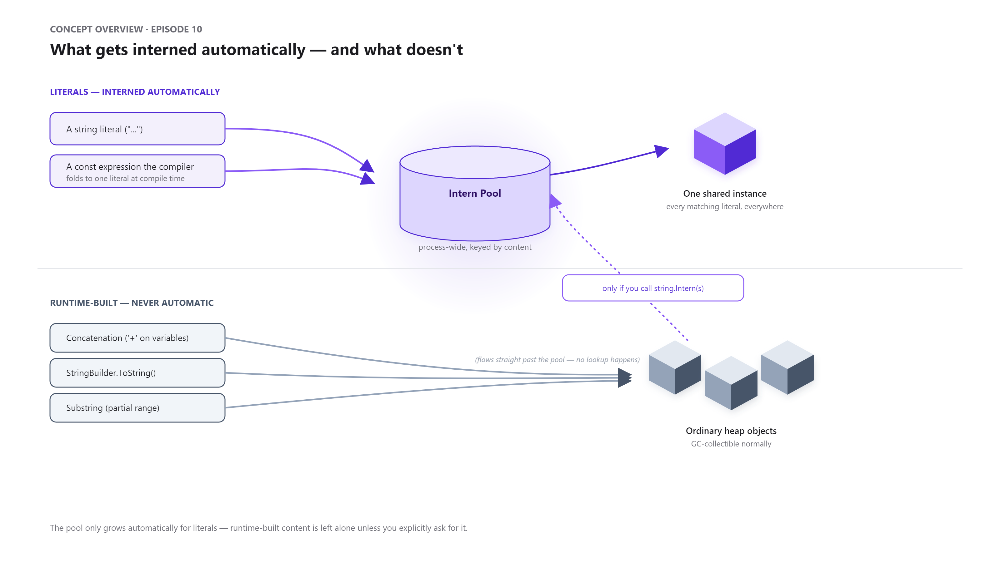
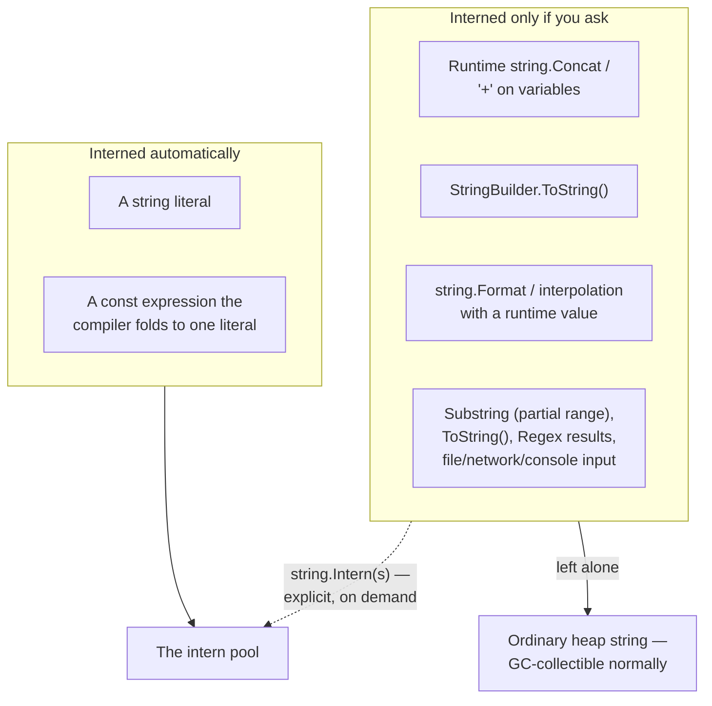
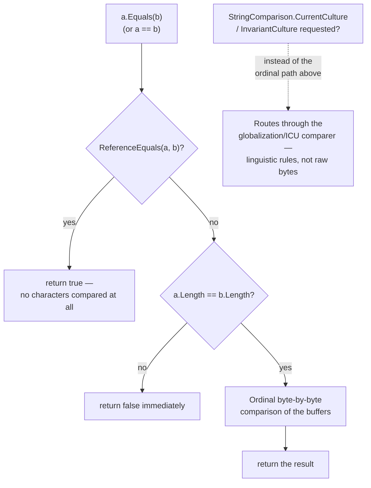
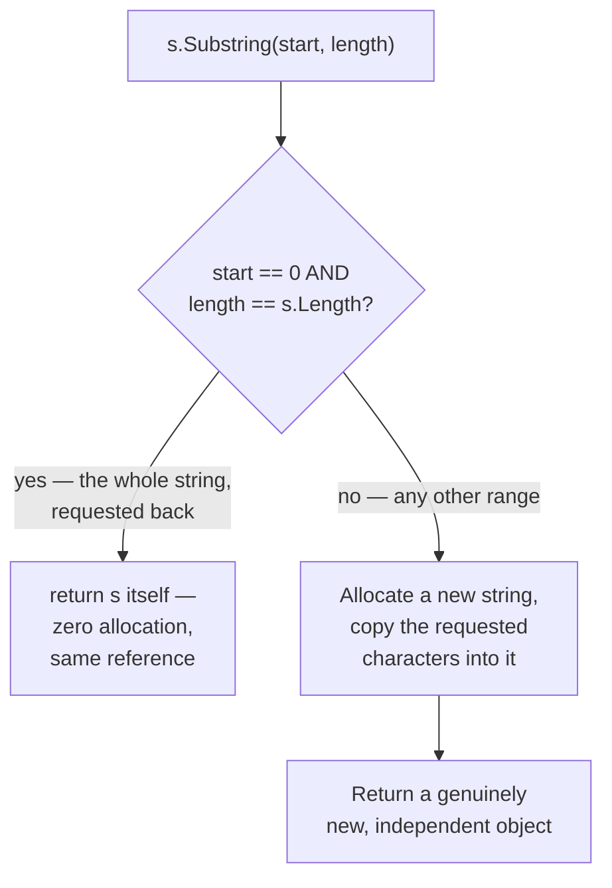
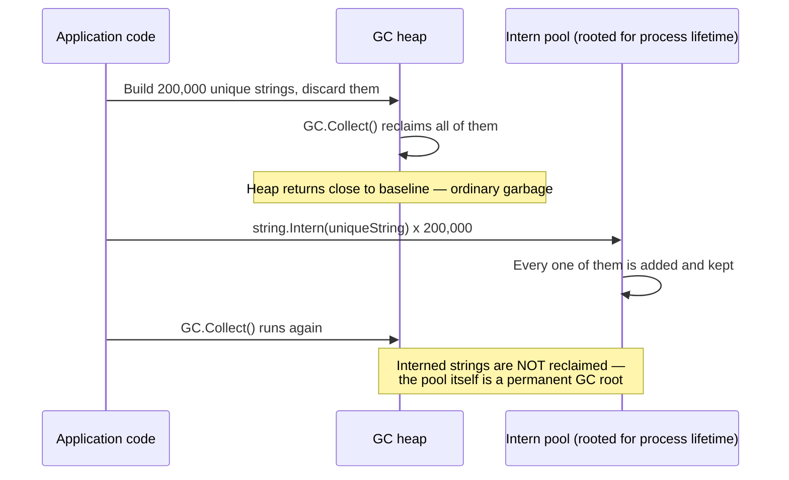
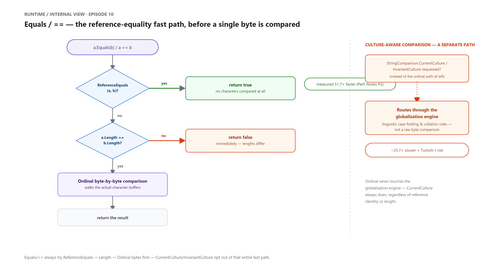
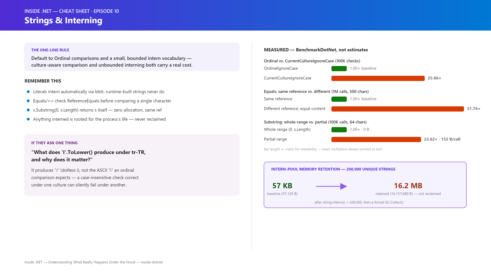

# Inside .NET — Episode 10
## Strings & Interning

> *Part II — Memory*

---

### Chapter cover


---

### Learning objectives

By the end of this chapter, you will be able to:

- Explain precisely which strings the CLR interns automatically (literals and compiler-folded `const` expressions) and which it never touches unless you ask (anything built at runtime — concatenation, `StringBuilder`, `string.Format`, `Substring`, I/O).
- Predict, correctly, whether two string expressions will be `ReferenceEquals` for a given construction path — and explain why `Equals`/`==` says `true` regardless, because string equality is value-based by design.
- Use `string.Intern` and `string.IsInterned` correctly, and state precisely what each returns when the content is and isn't already pooled.
- Explain why `Substring` sometimes allocates nothing at all, and reproduce the exact condition under which that happens.
- Identify why culture-aware string comparison is both a measurable performance cost and a real correctness bug class — the "Turkish I problem" — and know which `StringComparison` to reach for by default.
- Recognize chronic interning of unbounded runtime content (user input, request IDs, arbitrary external data) as a genuine, measurable memory-growth risk — not a theoretical one.

### Real-world analogy

A certified legal-translation agency is working around the clock on filings for an international arbitration case, against a deadline that, if missed, forfeits the client's right to appeal. Certain phrases recur constantly across hundreds of documents — "IN WITNESS WHEREOF," "this Agreement is governed by the laws of England and Wales" — and the typesetting department keeps a locked reference shelf of pre-approved printing plates for exactly this recurring boilerplate. The first time a document needs one of these phrases, a typesetter checks the shelf; if that exact wording is already sitting there, they mount the *existing* plate rather than engraving a new one for text that's going to reappear tomorrow and the day after. But a client's own custom paragraph — a hand-typed clause naming a specific witness and a specific date, unique to one filing — gets typeset fresh, as a one-off block that's never added to the shelf, because nobody thinks to check the shelf for text that was never expected to recur. If two unrelated filings, weeks apart, happen to need that exact same custom wording, each still gets its own freshly typeset block — the shelf was never told to remember that particular text, so it has nothing to reuse. And critically: nothing that ever makes it onto that reference shelf is discarded, even after the case closes. It's kept in a fireproof vault indefinitely, on the theory that identical boilerplate might be needed again for the next case that comes through the door.

That's the CLR's string intern pool. **The reference shelf** holds one canonical printed plate per distinct piece of boilerplate — **string literals**, which the compiler and runtime automatically add to (or look up in) **the intern pool** the moment they're used, so identical literal text across an entire program shares one heap object instead of paying for a duplicate every time it appears. **The client's custom paragraph** is a **runtime-constructed string** — built by concatenation, `StringBuilder`, formatting, or read from outside the program — and it never touches the shelf automatically, even if its content happens to exactly match something already sitting there. Two custom paragraphs with identical wording, typeset independently, are physically different objects (`ReferenceEquals` is `false`), the same way two runtime-built strings with equal content are two different heap allocations, even though `Equals`/`==` correctly reports them as equal by value. And the vault that never empties is exactly why interning is a trade-off, not a free optimization: anything explicitly added via `string.Intern` stays rooted for the life of the process, which is fine for a small, bounded set of recurring boilerplate — and a real memory-growth risk if what gets interned is unbounded, arbitrary runtime content.

### Problem statement

Strings sit in an odd spot in the CLR's type system. They're a reference type — heap-allocated, accessed through a reference, covered by every rule from [Episode 7 — Value Types vs Reference Types](../006-value-vs-reference-types/article.md) — yet `==` and `Equals` compare their *content*, not their identity, which is the opposite of `object`'s default behavior and a detail [Episode 9 — Boxing & Unboxing](../008-boxing-unboxing/article.md) leaned on heavily when distinguishing `ReferenceEquals` from value equality. Strings are also **immutable**: once created, a `string`'s content never changes — every operation that looks like a mutation (`ToUpper`, `Substring`, `Replace`, `+`) returns a *new* string and leaves the original untouched. Immutability is what makes strings safe to share freely (no defensive copying, no risk that some other piece of code silently mutates a string you're holding a reference to) — but it also means a typical .NET program's constant firehose of string literals (log format strings, route paths, JSON property names, exception messages, namespace and type names) would otherwise mean thousands of duplicate heap objects holding byte-for-byte identical content, forever, for the life of the process.

The CLR's answer is the **intern pool**: a process-wide table, keyed by content, that automatically holds exactly one instance of every distinct string *literal* your program uses. This solves the duplication problem for the case that matters most — compile-time-known text — cheaply and transparently. But it creates two things worth understanding precisely, not approximately:

- **The pool only ever grows automatically for literals.** Anything built at runtime — concatenating variables, `StringBuilder.ToString()`, `string.Format`, reading a file, a `Substring` that isn't the whole string — produces a genuinely new heap object every time, with no automatic check against the pool, even when its content is identical to something already interned. Assuming otherwise is exactly the kind of `ReferenceEquals` mistake [Episode 9](../008-boxing-unboxing/article.md) warned about with boxed values, just showing up in a reference type this time.
- **Nothing ever leaves the pool.** An interned string — whether interned automatically as a literal or explicitly via `string.Intern` — is rooted for the life of the process, immune to ordinary garbage collection. That's exactly right for a small, fixed vocabulary of recurring literals. It's exactly wrong if the content being interned is unbounded and comes from outside the program — at which point "interning for a small perf win" quietly becomes "a permanent, unbounded memory leak," measured concretely later in this chapter.

### Visual explanation



#### 1. A literal's path into the intern pool

```mermaid
flowchart LR
    A["string s = \"inside-dotnet\";\n(a compile-time literal)"] --> B["Compiler emits\nldstr \"inside-dotnet\""]
    B --> C{"Is this exact text\nalready in the\nintern pool?"}
    C -->|"no — first time\nthis text is seen"| D["Add it to the pool,\nreturn that reference"]
    C -->|"yes — another ldstr\nof the same text ran\nearlier, anywhere"| E["Return the EXISTING\npooled reference"]
    D --> F["s points at the\npooled instance"]
    E --> F
```

#### 2. What gets interned automatically vs. only on request



#### 3. `Equals`/`==` — the reference-equality fast path, before any content is compared



#### 4. `Substring`'s self-reference fast path



#### 5. Why the intern pool is a memory trade-off, not a free win



*(Standalone Mermaid sources for all five diagrams live under [`diagrams/mermaid/`](diagrams/mermaid/), numbered to match the order above, per [IMAGE_GUIDE.md](../../IMAGE_GUIDE.md).)*

### Under the hood



1. **A literal's journey is `ldstr`, not a runtime allocation on every use.** Every string literal in your source compiles to an `ldstr` IL instruction referencing an entry in the assembly's metadata (the `#US`, "User Strings," heap). When `ldstr` executes, the CLR checks the process-wide intern pool for a string with that *exact* content; if one already exists — from this same literal executing before, or from any other literal anywhere in the process with identical text — `ldstr` returns that existing reference. Only the very first occurrence of a given literal text actually allocates; every subsequent occurrence, anywhere, is a pool lookup that returns the same object. This is precisely why `literalA` and `literalB` in this chapter's demo, both `"inside-dotnet"`, are `ReferenceEquals` — not because the compiler special-cased two locals with the same value, but because both `ldstr` instructions resolved to the same pooled instance.

2. **`const` string expressions are folded by the compiler before `ldstr` ever runs.** A `const string x = "Hello, " + "World";` isn't runtime concatenation — the C# compiler evaluates constant expressions at compile time and emits a single `ldstr "Hello, World"` for it, indistinguishable from having written the literal directly. That's why this chapter's demo shows `constGreeting` is `ReferenceEquals` to the literal `"Hello, World"` written elsewhere in the same file — both compile down to the exact same `ldstr` token.

3. **Runtime construction is a hard boundary the pool doesn't cross automatically.** `string.Concat`, the `+` operator on non-constant operands, `StringBuilder.ToString()`, `string.Format`, interpolated strings with a runtime value, `Regex` results, and anything read from a file, the console, or the network all allocate a brand-new string object through the ordinary heap allocator from [Episode 8 — Object Allocation](../007-object-allocation/article.md) — full stop, no intern-pool lookup happens. This isn't an oversight; checking a hash table against the pool on every single runtime string operation would be a real, constant tax paid by code that will never need it. The pool stays cheap specifically because it's automatic only where the cost is paid once, at compile time.
4. **`string.Intern` and `string.IsInterned` do exactly what their names say, and no more.** `string.Intern(s)` checks the pool for content equal to `s`; if found, it returns the *existing* pooled reference (not `s` itself); if not found, it adds `s` — the exact instance you passed in — to the pool and returns that same reference back. `string.IsInterned(s)` is a read-only lookup: it returns the pooled instance if `s`'s content is already interned, or `null` if it isn't — it never adds anything. This chapter's demo verifies both halves directly: interning a never-seen string returns that same object and roots it; interning a second, separately-constructed string with equal content afterward returns the *first* string's reference, not the second one's.
5. **`Equals`/`==` check `ReferenceEquals` first, before comparing a single character.** The BCL's `string.Equals(string, string)` — which both `==` and the instance `.Equals()` route through — starts with a reference-equality check. Only if that fails does it compare lengths, and only if those match does it walk the actual character buffers. This is why two interned (or otherwise identical-reference) strings compare as equal almost instantly regardless of length, while two equal-content-but-different-object strings pay the full cost of a byte-by-byte scan — measured directly in this chapter's Performance Notes at a **51.7× difference** for 500-character strings.
6. **`Substring` has a documented self-reference fast path.** `s.Substring(0, s.Length)` — the whole string, requested back — returns `s` itself, with no allocation at all; the CLR wouldn't gain anything by copying a string's entire content into an identical new object. Any other range — even `s.Substring(0, s.Length - 1)` — allocates a genuinely new string and copies the requested characters into it. There's no partial sharing, no "view into a buffer" the way a `Span<char>` provides — every partial `Substring` is a full, independent copy, same as it's always been in .NET.
7. **Culture-aware comparison isn't just slower — it can produce a different, wrong answer.** `StringComparison.CurrentCulture`/`InvariantCulture` route through the globalization engine's linguistic case-folding and collation rules, not a raw byte comparison — and those rules are genuinely different across cultures for the same input. The canonical example, verified directly in this chapter's demo: under the `tr-TR` (Turkish) culture, `"I".ToLower()` produces `"ı"` (dotless i), not the ASCII `"i"` an ordinal comparison would expect — so a case-insensitive check that's correct under one culture can silently fail under another. This is exactly why Microsoft's own guidance is to default to `StringComparison.Ordinal`/`OrdinalIgnoreCase` for anything that isn't user-facing linguistic text — identifiers, protocol tokens, file paths, dictionary keys, security-relevant comparisons — and reserve culture-aware comparison for text a human actually reads.
8. **`GetHashCode()` on a string is content-based *and* randomized per process.** Since .NET Core, string hash codes use a randomized seed generated once per process start (a mitigation against hash-flooding denial-of-service attacks against hash-table-based APIs) — meaning the same string's hash code is stable for the life of one process run, but **will differ across separate runs**, including on the same machine. This is a real, documented behavior, not an implementation detail to be surprised by: never persist a string's `GetHashCode()` result to a file, cache, or database and expect it to mean anything in a later process run.
9. **This is where Microsoft itself leans on the exact same interning pattern, deliberately re-implemented rather than reusing the CLR's global pool.** `System.Xml.NameTable` (used internally by `XmlReader`) maintains its own atomization table for element and attribute names as a document is parsed — a purpose-built, per-reader table, not the CLR's process-wide intern pool — specifically so that repeated tag names across a large XML document can be compared by reference instead of by content during validation and lookup. It's the identical trade-off this chapter describes (bounded, recurring vocabulary → one canonical instance → cheap reference comparisons), applied deliberately inside the BCL for a case where the *global* pool would be the wrong scope: XML tag names are only worth deduplicating for the lifetime of one document/reader, not forever.

### Code example

*Tier: Example + Advanced + Performance.*

```csharp
// Program.cs — .NET 10 console app
// Demonstrates: (1) literal interning — identical literals are the same
// object; (2) const-expression folding also interns; (3) runtime-constructed
// strings are never auto-interned, even with matching content; (4)
// string.Intern / string.IsInterned's exact semantics; (5) Substring's
// self-reference fast path; (6) the culture-aware comparison gotcha (the
// "Turkish I" problem); (7) a measured proof that interning unbounded
// runtime content is a real, non-collectible memory-growth risk.

Console.WriteLine("=== Inside .NET: Episode 10 — Strings & Interning demo ===");

string literalA = "inside-dotnet";
string literalB = "inside-dotnet";
Console.WriteLine($"  literalA is literalB (reference)?     {ReferenceEquals(literalA, literalB)}");

const string constGreeting = "Hello, " + "World"; // folded by the compiler into one literal
Console.WriteLine($"  constGreeting is \"Hello, World\" (reference)? {ReferenceEquals(constGreeting, "Hello, World")}");

string name = "Quokka7Xk";
string runtimeConcat = BuildGreeting(name); // built at runtime — never a compile-time literal
string runtimeLiteralEquivalent = "Hello, Quokka7Xk";
Console.WriteLine($"  runtimeConcat is the equal literal (ref)? {ReferenceEquals(runtimeConcat, runtimeLiteralEquivalent)}");

string neverSeenBefore = new string(['Q', 'x', '9', '-', 'r', 'u', 'n', 't', 'i', 'm', 'e']);
Console.WriteLine($"  IsInterned before interning: {(string.IsInterned(neverSeenBefore) is null ? "null" : "found")}");
string internedResult = string.Intern(neverSeenBefore);
Console.WriteLine($"  internedResult is neverSeenBefore (ref)? {ReferenceEquals(internedResult, neverSeenBefore)}");

string original = "The quick brown fox";
string wholeRangeSubstring = original.Substring(0, original.Length);
Console.WriteLine($"  original.Substring(0, original.Length) is original (ref)? {ReferenceEquals(original, wholeRangeSubstring)}");

var turkish = System.Globalization.CultureInfo.GetCultureInfo("tr-TR");
Console.WriteLine($"  \"I\".ToLower(tr-TR) = \"{"I".ToLower(turkish)}\" (not ASCII 'i')");

static string BuildGreeting(string who) => "Hello, " + who;
```

Run the full version with `dotnet run` in [`code/Chapter09.Demo/`](code/Chapter09.Demo/) — it also covers `StringBuilder`, `new string(char[])`, and the measured intern-pool memory-retention proof omitted above for length. See [`code/README.md`](code/README.md) for the complete listing and expected output.

The Performance tier lives in [`code/Chapter09.Benchmarks/`](code/Chapter09.Benchmarks/) — three real `BenchmarkDotNet` classes backing every number in the next section: ordinal vs. culture-aware comparison cost, the `Equals` reference-equality fast path, and `Substring`'s self-reference case.

### Performance notes

Every number below is a measured `BenchmarkDotNet` result from this chapter's own `Chapter09.Benchmarks` project (`.NET 10.0.8, X64 RyuJIT AVX2, Concurrent Workstation GC`), not an estimate — re-run it yourself with `dotnet run -c Release` and expect the same shape on your hardware.

**1. Ordinal vs. culture-aware comparison, 100,000 case-insensitive equality checks on a 55-character identifier-like string:**

| Method | Mean | Ratio | Allocated |
|---|---|---|---|
| `OrdinalIgnoreCase` (baseline) | 999.0 µs | 1.00 | – |
| `CurrentCultureIgnoreCase` | 25,451.4 µs | **25.66×** | – |
| `InvariantCultureIgnoreCase` | 24,293.9 µs | **24.50×** | – |

Culture-aware comparison isn't a marginal cost here — it's roughly **25× slower** than ordinal for this identifier-shaped input, on top of the correctness risk from "Under the Hood" #7. There is no scenario where an identifier, token, or key should be compared with anything other than `Ordinal`/`OrdinalIgnoreCase`.

**2. The `Equals` reference-equality fast path, 1,000,000 comparisons of a 500-character string:**

| Method | Mean | Ratio | Allocated |
|---|---|---|---|
| `EqualsAgainstSameReference` (baseline) | 309.7 µs | 1.00 | – |
| `EqualsAgainstEqualButDifferentReference` | 15,985.4 µs | **51.74×** | – |

Same content, same result (`true`), but comparing a string to *itself* is over **51× faster** than comparing it to a different object holding identical text — direct, measured confirmation that `Equals` checks `ReferenceEquals` before touching a single character. This is also the concrete performance argument, beyond memory savings, for interning a small set of frequently-compared, frequently-repeated strings.

**3. `Substring`'s self-reference fast path, 100,000 calls on a 64-character string:**

| Method | Mean | Ratio | Allocated |
|---|---|---|---|
| `WholeRangeSubstring` (baseline) | 36.95 µs | 1.00 | – |
| `PartialSubstring` | 870.81 µs | **23.62×** | 15,200,000 B (152 B/call) |

Requesting the entire string back via `Substring(0, s.Length)` costs nothing — zero measured allocation, matching the demo's `ReferenceEquals` result directly. Requesting anything less allocates a real object every time: 152 bytes per call here (24-byte object header + 64 UTF-16 characters at 2 bytes each + a trailing null terminator, rounded to 8-byte alignment) — the same header math from [Episode 8](../007-object-allocation/article.md), just applied to a `string` instead of a generic object.

**4. Interning unbounded runtime content, measured with `GC.GetTotalMemory(true)` after a forced full collection (200,000 unique strings):**

| Scenario | Heap after collection |
|---|---|
| Baseline | 57,120 B |
| Build + discard 200,000 unique strings, then collect | 56,544 B (back near baseline — ordinary garbage) |
| Intern 200,000 unique strings, then collect | **16,157,680 B** (not reclaimed at all) |

This is the chapter's central production warning, made concrete instead of asserted: discarding unique strings lets the GC reclaim them normally, but interning the same unique content leaves **all 200,000 of them** permanently rooted — roughly 16 MB that a full collection cannot touch, from a single pass over content that will likely never repeat.

- **The lesson across all four tables: interning and reference-equality checks are a real, measurable win for a small, bounded, frequently-repeated vocabulary — and a real, measurable liability the moment the content is unbounded or comes from outside the program.** Don't intern user input, request IDs, or any other externally-sourced text "to speed up comparisons" without first confirming the actual vocabulary is small and finite.
- **`dotnet-counters`' `Gen 2 Size` / `GC Heap Size` counters are the honest way to confirm a suspected interning-driven memory leak in a running process** — a steadily climbing Gen 2 size with no corresponding growth in live application data is the signature to look for, the same live-measurement discipline recommended in Episodes 8 and 9.

### Common mistakes / anti-patterns

- **Interning arbitrary runtime content — user input, GUIDs, request identifiers, anything unbounded — "to make comparisons faster."** As measured directly above, every interned string is permanently rooted for the process's lifetime. This is a genuine, slow-building memory leak, not a performance optimization, the moment the interned vocabulary isn't small and finite.
- **Using `ReferenceEquals` (or accidentally relying on it via a caching/deduplication scheme) on strings that weren't deliberately interned.** Two runtime-built strings with identical content are two different objects unless something explicitly interned one of them — code that assumes otherwise (e.g., using a string as a lock object, or deduplicating by reference instead of by `Equals`/a proper key) will intermittently and confusingly fail.
- **Defaulting to `StringComparison.CurrentCulture` (or no `StringComparison` at all, which for `string.Compare` defaults to culture-aware) for identifiers, tokens, file paths, or security-relevant checks.** Beyond the ~25× measured cost, this is a correctness bug waiting for the right culture to trigger it — the Turkish-I problem is the canonical example, but any culture with non-ASCII case-folding rules is a candidate.
- **Assuming `Substring` ever shares a buffer with its source (or, conversely, assuming it always allocates).** Neither assumption is safe: the whole-range case is genuinely free (same reference), but every other range is a full, independent copy — there is no partial view semantics the way `ReadOnlySpan<char>`/`AsSpan()` provides for callers that actually want zero-copy slicing.
- **Persisting a string's `GetHashCode()` result across process runs** (to a file, a database column, a distributed cache key) and expecting it to be stable. Since .NET Core, string hashing is randomized per process for DoS mitigation — the same string will hash differently the next time the process starts.

### Architect's perspective

**Developer Perspective**
*"Did I just assume two equal-looking strings are the same object — and would `Equals` have told me otherwise?"*

Day to day, this chapter is mostly about not confusing value equality with reference identity for a type that looks like it should behave consistently either way. Two string literals with the same text being `ReferenceEquals` is a CLR implementation detail, not a language guarantee to write logic against — use `Equals`/`==` (which is what almost every reasonable comparison should use anyway) and reserve `ReferenceEquals` for the rare case where object identity, not content, is genuinely what you're checking.

**Senior Perspective**
*"Is this `StringComparison` choice deliberate, and does this interning call have a bounded vocabulary behind it?"*

This is where code review earns its keep on two fronts covered in this chapter: flagging a bare `string.Compare`/`.ToUpper()`/`.ToLower()` call with no explicit `StringComparison` (or `Ordinal` variant) on anything that isn't user-facing text, and flagging `string.Intern` calls whose input isn't obviously drawn from a small, fixed set. The trade-off that actually matters at this altitude isn't "interning is good" or "culture-aware comparison is bad" as blanket rules — it's confirming, the same way [Episode 9](../008-boxing-unboxing/article.md) argued for boxing, that the specific usage pattern matches the case the mechanism was actually designed for.

**Architect Perspective**
*"Where in this system does string equality carry security or correctness weight, and is the comparison strategy documented, or does every team member have to independently rediscover it?"*

At system scale, string-comparison choices are rarely isolated — they're a convention that either gets applied consistently across a codebase or silently drifts, and the failure mode (a culture-dependent comparison bug, or a slow memory leak from over-eager interning) tends to surface far from the code that caused it, in production, under a locale or workload the original author never tested against. The architectural fix is the same pattern Microsoft applies internally with `XmlNameTable` and its own guidance docs: pick `Ordinal`/`OrdinalIgnoreCase` as the default for anything non-linguistic, document the exception (genuine user-facing text needing locale-aware sorting/casing), and back it with a Roslyn analyzer (`CA1309`/`CA1310` flag exactly this) rather than relying on every reviewer to remember it. The same discipline applies to interning: a documented, bounded allowlist of what's safe to intern is cheap; discovering an unbounded interning leak in a production heap dump is not.

### Interview questions

**Q1: What makes two string literals with identical text `ReferenceEquals` to each other?**
A: The compiler emits an `ldstr` IL instruction for each literal. When `ldstr` executes, the CLR checks the process-wide intern pool for a string with that exact content — if one already exists (from this literal or any other with the same text), it returns the existing reference instead of allocating a new one. Only the first occurrence of a given literal text actually allocates.

**Q2: Does concatenating two string variables at runtime produce an interned string?**
A: No. Runtime construction — `string.Concat`, `+` on non-constant operands, `StringBuilder.ToString()`, `string.Format`, interpolation with a runtime value — always allocates a genuinely new string through the ordinary heap allocator, with no automatic check against the intern pool, even if the resulting content exactly matches something already interned.

**Q3: What exactly does `string.Intern` return if the string's content is already in the pool, versus if it isn't?**
A: If the content is already interned, it returns the *existing* pooled reference — not the instance you passed in. If it isn't yet interned, it adds the exact instance you passed in to the pool and returns that same reference back. `string.IsInterned` is the read-only version: it returns the pooled instance if present, or `null`, and never adds anything.

**Q4: When does `Substring` allocate nothing at all?**
A: When the requested range is the entire string — `s.Substring(0, s.Length)` — which returns `s` itself. Any other range, even one character short of the full length, allocates a new string and copies the requested characters into it; there's no partial buffer sharing.

**Q5: Why is `StringComparison.Ordinal` the recommended default over `CurrentCulture` for things like identifiers or file paths?**
A: Two reasons, both measurable: performance (culture-aware comparison routes through the globalization engine's linguistic rules and measured roughly 25× slower in this chapter's benchmark) and correctness — culture-aware case folding genuinely differs by culture for the same input. Under `tr-TR`, `"I".ToLower()` produces `"ı"`, not the ASCII `"i"` an ordinal comparison expects, so a case-insensitive check correct under one culture can silently fail under another.

**Q6: Why is interning arbitrary user input a bad idea, even though interning itself is a real performance optimization?**
A: Because every interned string is rooted for the life of the process — the pool never releases anything, by design, since it's meant for a small, fixed vocabulary of recurring literals. Interning content that's unbounded (user input, request IDs, arbitrary external data) turns each unique value into a permanent, non-collectible allocation — measured in this chapter at roughly 16 MB retained for 200,000 unique interned strings that a full garbage collection could not reclaim, versus the same 200,000 strings returning to near-baseline memory when simply discarded instead.

### Quiz

1. What IL instruction do string literals compile to, and what does the CLR check when that instruction executes?
2. Does `string.Concat` on two runtime variables produce a string that's automatically added to the intern pool?
3. If `string.IsInterned(s)` returns `null`, what does that tell you — and does calling it change anything?
4. Under what exact condition does `Substring` return the original string instance instead of allocating a new one?
5. Name two distinct reasons `StringComparison.Ordinal` is preferred over `CurrentCulture` for comparing identifiers.

<details>
<summary>Answers</summary>

1. `ldstr`. When it executes, the CLR checks the process-wide intern pool for a string with the exact same content, returning the existing reference if one is found, or adding this one and returning it if not.
2. No. Runtime construction — including `string.Concat`, `+` on variables, `StringBuilder.ToString()`, and `string.Format` — always allocates a new string with no automatic intern-pool check, regardless of whether the content matches something already interned.
3. It tells you `s`'s content is not currently in the intern pool. Calling `IsInterned` is read-only — it never adds anything to the pool itself.
4. When the requested range is the entire string: `startIndex == 0` and `length == s.Length`. Any other range always allocates a new string.
5. Performance (ordinal comparison is roughly 25× faster in this chapter's measured benchmark, since it skips the globalization engine entirely) and correctness (culture-aware case folding genuinely differs by culture, e.g. the Turkish-I problem, so an ordinal comparison gives a locale-independent, predictable answer for non-linguistic text).

</details>

### Summary & next chapter



**Key takeaways:**

- **The intern pool automatically holds one instance of every distinct string literal** — via `ldstr` — but never automatically touches anything built at runtime. `const` expressions get folded to literals at compile time, so they intern too; ordinary runtime concatenation, `StringBuilder`, and `string.Format` never do.
- **`string.Intern` and `string.IsInterned` have precise, distinct semantics**: `Intern` returns the pool's existing reference if present, or adds and returns your instance if not; `IsInterned` is a read-only lookup that returns `null` rather than adding anything.
- **`Equals`/`==` check `ReferenceEquals` before comparing a single character** — measured at a **51.7× speed difference** between comparing a string to itself versus to an equal-but-different-object string of the same length.
- **`Substring` has a genuine, measured zero-allocation fast path** for the whole-string case (`s.Substring(0, s.Length)` returns `s` itself) — any other range always allocates and copies, with no partial buffer sharing.
- **Culture-aware comparison is both ~25× slower and a real correctness risk** (the Turkish-I problem) — default to `Ordinal`/`OrdinalIgnoreCase` for anything that isn't user-facing linguistic text.
- **Interning is a genuine trade-off, not a free win**: measured directly, interning 200,000 unique runtime strings left ~16 MB permanently unreclaimable, while discarding the same 200,000 strings let the GC reclaim them back to near-baseline. Intern a small, bounded, recurring vocabulary — never unbounded external content.

**What's next:** [Episode 11 — Garbage Collection Fundamentals](../010-garbage-collection/article.md) turns from a special-cased allocation rule to the mechanism that reclaims everything this Part has been allocating — generations, collection triggers, and what actually happens during a collection.

---

**Where you are in the journey:**

```
    Episode 9 — Boxing & Unboxing
              ↓
  ▶ Episode 10 — Strings & Interning   ◀ you are here   (Part II — Memory)
              ↓
    Episode 11 — Garbage Collection Fundamentals
```

**Related:** [Episode 9 — Boxing & Unboxing](../008-boxing-unboxing/article.md) (the `ReferenceEquals`-vs-value-equality distinction this chapter applies to a reference type) · [Episode 8 — Object Allocation](../007-object-allocation/article.md) (the allocator every uninterned string still allocates through) · [Episode 14 — Memory Leaks](../013-memory-leaks/article.md) (chronic interning as a real-world instance of the non-collectible-root leak pattern introduced here)
