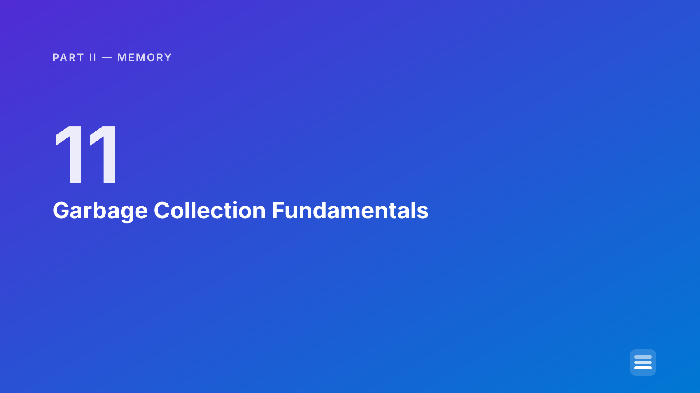
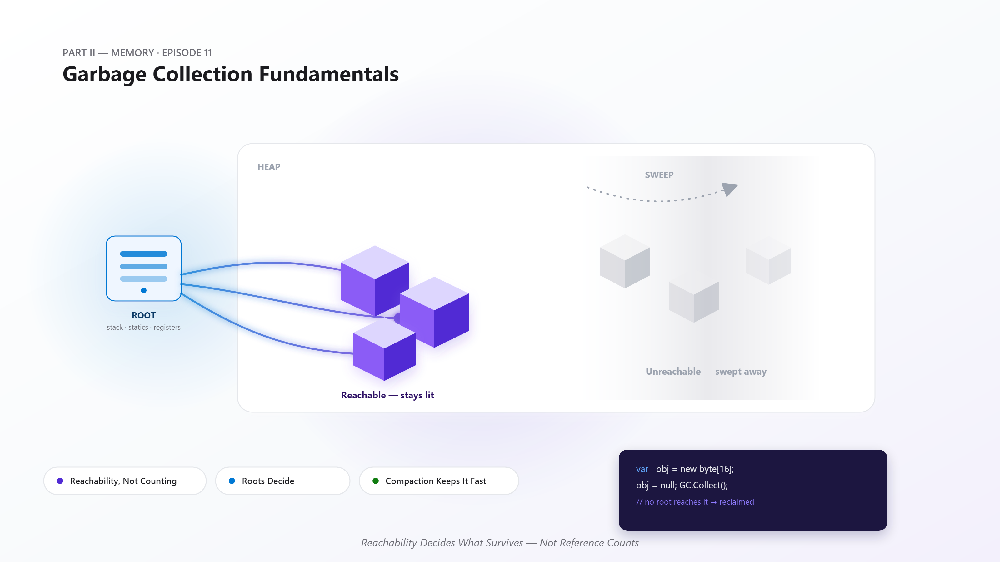
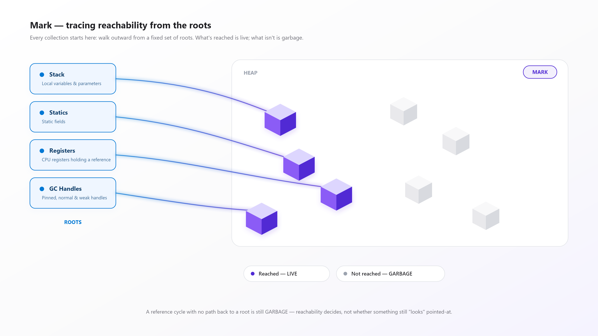
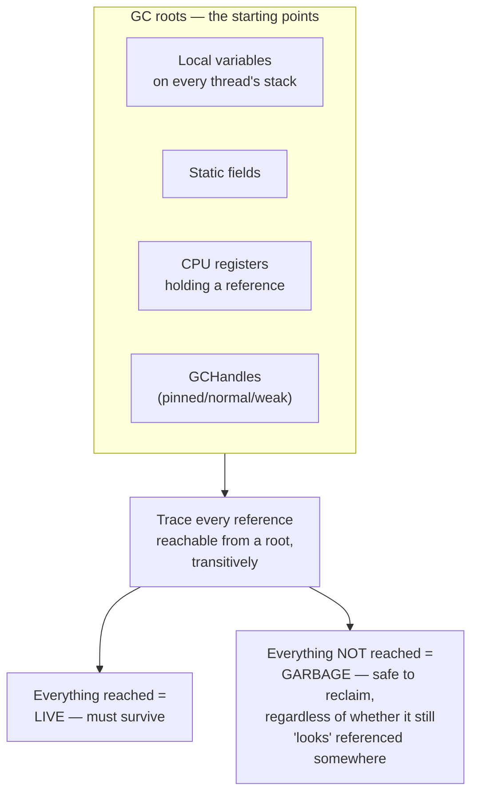
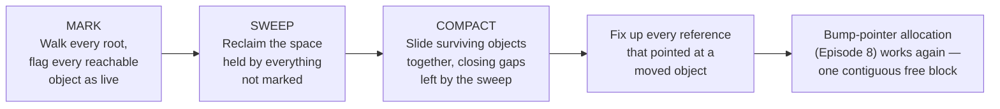
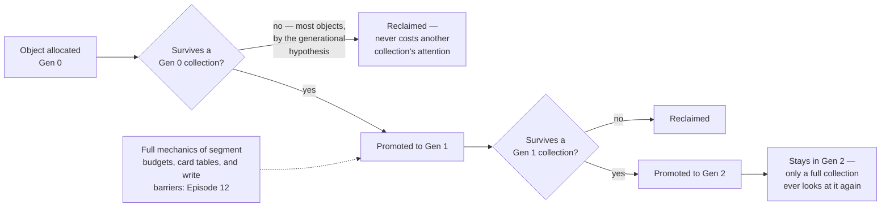
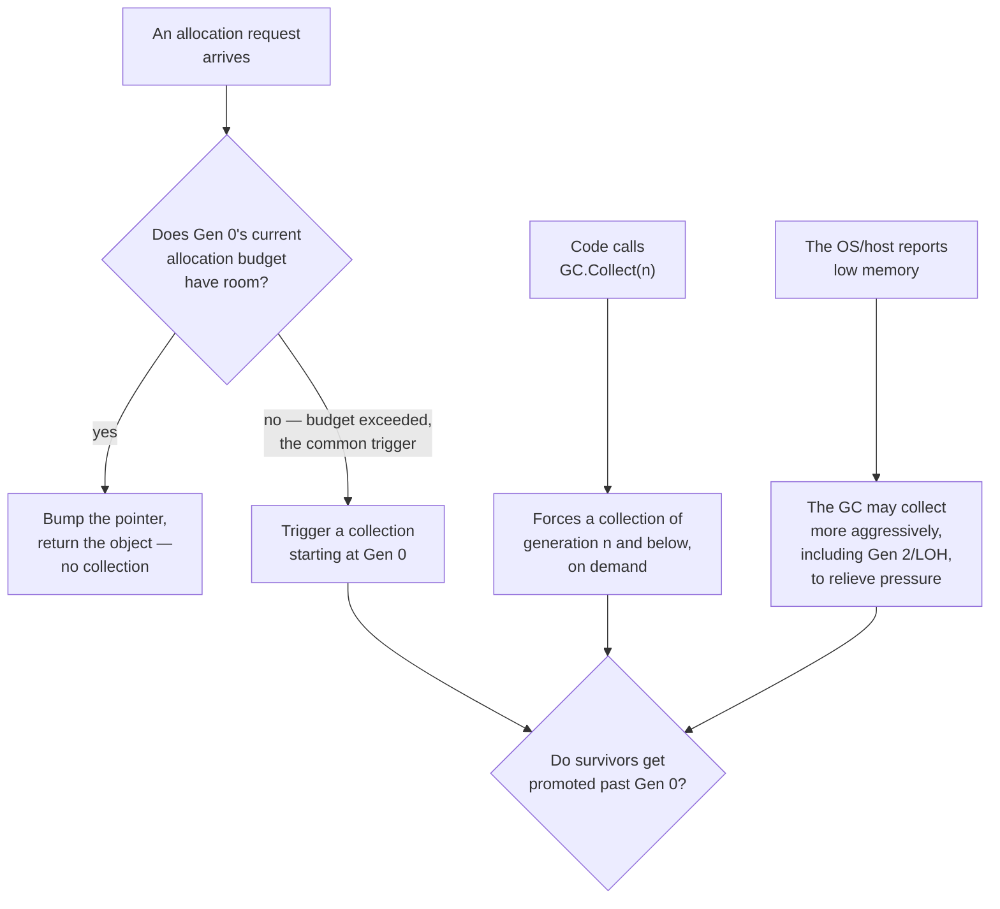
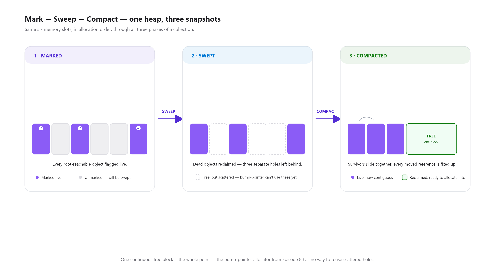
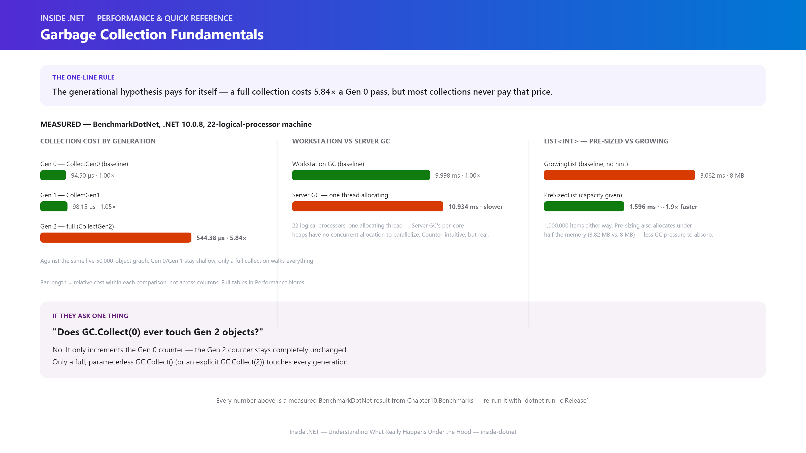

# Inside .NET — Episode 11
## Garbage Collection Fundamentals

> *Part II — Memory*

---

### Chapter cover





---

### Learning objectives

By the end of this chapter, you will be able to:

- Explain precisely what makes an object eligible for collection — reachability from a fixed set of roots, not reference counting — and name the four kinds of roots the CLR actually traces from.
- Walk through the GC's three phases (mark, sweep, compact) and explain why .NET's collector compacts the heap instead of just leaving holes behind.
- Explain the generational hypothesis at a fundamentals level — why most collections only ever look at a small, recently-allocated slice of the heap — without needing the deeper segment/budget mechanics reserved for the next chapter.
- Predict the difference between `GC.Collect(0)` and a full `GC.Collect()`, and state which generations each one actually touches.
- Explain why a finalizable object needs two collections to actually disappear, and reproduce that two-step lifecycle with a `WeakReference`.
- State, with a measured result rather than a guess, when Server GC actually helps — and when it doesn't.

### Real-world analogy

During a high-tempo combat flight cycle, an aircraft carrier's flight deck crew has seconds, not minutes, to clear space for the next wave of aircraft coming in to land or launch. Nobody has time to ask every pilot and mission planner to personally report back the instant a parked aircraft is no longer needed — that would be far too slow, and far too easy to get wrong. Instead, the deck crew works outward from a single source of truth: the active mission board. Any aircraft still tied to a live mission, still fueled for a pending sortie, or on standby for an in-progress recovery stays exactly where it is — full stop, no exceptions, no matter how long it's been sitting there. Anything that *isn't* reachable from that board — a plane that finished its sortie and was never rolled into a new assignment — gets towed off, and its patch of deck gets reclaimed and folded back into open space, not left as a scattering of unusable gaps between still-parked aircraft. And critically, the crew doesn't treat every aircraft the same: a plane that just landed goes straight into a fast-turnaround holding area right next to the recovery point, because experience says most aircraft in that spot will be relaunched or towed again within the very next cycle. Only the rare aircraft that's still sitting there cycle after cycle eventually gets moved deeper into long-term parking, which the crew only reorganizes occasionally, not every single cycle.

That's a tracing garbage collector, mechanically. **The active mission board** is the CLR's set of **roots** — stack references, static fields, CPU registers, GC handles — the only starting points the GC trusts. **Tracing outward from the board to every aircraft still tied to a mission** is the **mark** phase: reachability, not bookkeeping, decides what survives. **Towing off unneeded aircraft** is the **sweep** phase, and **folding the reclaimed space back into one open area instead of leaving gaps** is **compaction** — exactly what keeps the bump-pointer allocator from [Episode 8](../007-object-allocation/article.md) fast, since a fragmented heap of small holes would break it. And **the fast-turnaround holding area versus long-term parking** is the **generational hypothesis** in miniature: most objects die young, so most collections only ever need to look at the smallest, newest slice of the heap — a full, deep-parking reorganization is the rare, expensive exception, not the common case.

### Problem statement

[Episode 8](../007-object-allocation/article.md) and [Episode 9](../008-boxing-unboxing/article.md) covered how the CLR hands out memory — a fast, bump-pointer allocation path that assumes there's always room at the end of the current segment. That assumption only holds if *something* reclaims the space held by objects nobody needs anymore. Two classic alternatives exist, and .NET deliberately uses neither in its default form:

- **Manual memory management** (explicit `free`/`delete`) puts the burden on the developer to know, precisely, the exact moment nothing else could possibly still be using a piece of memory — get it wrong in one direction and you get a use-after-free or double-free; get it wrong in the other and you leak memory forever. This is exactly the class of bug the CLR's managed memory model exists to eliminate.
- **Reference counting** (the model behind Python's primary GC and classic COM) reclaims an object the instant its count hits zero, but it has a well-known structural hole: two objects that reference each other (a cycle) can each hold a count of one from the other forever, even when nothing outside the cycle can reach either of them — a leak reference counting cannot detect on its own without extra cycle-detection machinery bolted on.

The CLR's answer is a **tracing garbage collector**: instead of counting references or trusting a developer's manual bookkeeping, it periodically starts from a small, well-defined set of **roots** and traces every reference reachable from them, transitively. Anything reached is live, full stop; anything not reached is garbage, regardless of whether some stale reference somewhere still technically "points" at it — a cycle with no path back to a root is reclaimed cleanly, the exact case reference counting can't handle by itself. This is what makes the allocation-heavy patterns from Episodes 8 and 9 viable in the first place: the CLR can keep bump-pointer-allocating quickly precisely because a periodic, automatic reclaim-and-compact pass keeps the heap from just growing forever, and keeps it defragmented enough for that fast path to keep working.

### Visual explanation



#### 1. Roots and reachability



#### 2. Mark, sweep, compact



#### 3. Generational promotion



#### 4. What triggers a collection



#### 5. Workstation vs. Server GC

```mermaid
sequenceDiagram
    participant T1 as App thread 1
    participant T2 as App thread 2
    participant WGC as Workstation GC (one heap)
    participant SGC as Server GC (one heap per core)

    Note over T1,WGC: Workstation GC — single-threaded allocation is the common case
    T1->>WGC: Allocates — one shared heap, one GC thread does the work

    Note over T1,T2,SGC: Server GC — built for many threads allocating concurrently
    T1->>SGC: Allocates on its own per-core heap
    T2->>SGC: Allocates on ITS own per-core heap, in parallel
    SGC->>SGC: Collections run in parallel across cores

    Note over T1,SGC: One thread allocating alone gains nothing from extra heaps —<br/>measured directly in this chapter's benchmark
```

*(Standalone Mermaid sources for all five diagrams live under [`diagrams/mermaid/`](diagrams/mermaid/), numbered to match the order above, per [IMAGE_GUIDE.md](../../IMAGE_GUIDE.md).)*

### Under the hood



1. **Roots are a small, fixed, enumerable set — not "anything that looks reachable."** The CLR traces from exactly four kinds of roots: local variables and parameters currently live on any thread's stack, static fields, CPU registers holding a reference at the moment of collection, and `GCHandle`s (used for pinning and for interop). A collection walks outward from these, transitively, through every field and array element it finds — anything not reached this way is garbage, full stop, regardless of what a developer might assume is "still in use somewhere."
2. **A genuinely surprising, verified nuance: nulling a local doesn't reliably free it within the same still-executing method.** This chapter's demo proves it directly: a method creates an object, assigns its local variable to `null`, and calls `GC.Collect()` — and a `WeakReference` to that object still reports `IsAlive == true`, in the *same* frame. Only after that method *returns*, with a fresh collection triggered from the caller, does the object actually become collectible. The CLR's real guarantee is "unreachable once the frame that held the last root has gone away" — not "unreachable the instant you reassign the variable." The JIT is not obligated to shrink a root's reported lifetime below the enclosing frame in every case; don't write code (or reason about memory) as if nulling a local mid-method is itself a signal the GC immediately acts on.
3. **Sweep reclaims; compact is what keeps allocation fast.** Sweeping alone would leave the heap full of small holes exactly where dead objects used to be — and the bump-pointer allocator from [Episode 8](../007-object-allocation/article.md) has nothing to do with a hole; it only knows how to extend a single contiguous pointer forward. Compaction slides every surviving object together, closing every gap, and fixes up every reference that pointed at something that moved — which is also why arbitrary pointers into the middle of the managed heap aren't stable across a collection unless a `GCHandle` explicitly pins the object in place.
4. **The generational hypothesis, at the level this chapter needs it.** Empirically, the overwhelming majority of objects die shortly after allocation — a request-scoped DTO, a LINQ intermediate, a formatted string. Acting on that, the GC allocates everything into Gen 0 first, and a Gen 0 collection only examines Gen 0 — it's fast precisely because it ignores the rest of the heap entirely. An object that survives a Gen 0 collection is promoted to Gen 1; surviving a Gen 1 collection promotes it to Gen 2, where it stays until a full collection runs. The exact segment sizing, budget growth, card tables, and write barriers that make cross-generational references safe to track cheaply are covered in full in [Episode 12 — GC Generations & the Large Object Heap](../011-gc-generations-loh/article.md) — this chapter only needs the promotion path itself, verified directly in the demo (`GC.GetGeneration` reporting 0, then 1, then 2 for the same surviving object across successive collections).
5. **`GC.Collect(n)` collects generation `n` and everything younger than it — never anything older.** This chapter's demo confirms it directly: calling `GC.Collect(0)` bumps the Gen 0 collection counter but leaves the Gen 2 counter completely unchanged; only a full, parameterless `GC.Collect()` touches every generation, Gen 2 included. This is exactly why a Gen 0 collection is cheap and a full collection isn't — a full collection is the one case where the GC is obligated to walk the entire live object graph, not just the newest slice of it.
6. **A finalizable object needs two collections, and the distinction hinges on which kind of `WeakReference` you ask.** The default (*short*) `WeakReference` clears the moment an object is determined unreachable — even before its finalizer has run. A *long* `WeakReference` (`trackResurrection: true`) stays alive through the entire finalization step, which is what makes it possible to observe the real lifecycle directly: after the **first** `GC.Collect()`, a finalizable object is unreachable but *not yet reclaimed* — it's queued onto the finalization queue instead. Only after `GC.WaitForPendingFinalizers()` lets its finalizer actually run, followed by a **second** collection, is the memory genuinely freed. The full mechanics of writing a correct finalizer (and why you almost never should, in favor of `IDisposable`) are covered in [Episode 13 — IDisposable & Finalizers](../012-idisposable-finalizers/article.md); this chapter only needs the two-collection shape of the lifecycle itself.
7. **Workstation vs. Server GC is a question about concurrent allocating threads, not raw core count.** Workstation GC (the default for console and desktop apps) uses a single heap. Server GC (the default for ASP.NET Core) creates one heap *per logical core* specifically so multiple threads allocating at the same time can do so in parallel, each against its own heap, with collections that run in parallel across cores too. That parallelism has to come from somewhere: this chapter's benchmark, run on a 22-logical-processor machine, measured **Server GC as slightly slower than Workstation GC** for a workload where only one thread ever allocates — there's no concurrent allocation for the extra heaps to parallelize, so their overhead shows up with nothing to offset it. Server GC's advantage is real, but it's earned by concurrently allocating threads, not granted automatically by having more cores available.
8. **Background (concurrent) GC lets most collections avoid a full stop-the-world pause.** Modern .NET runs Gen 0/Gen 1 collections as brief, blocking pauses (they're fast enough that this is the right trade), while a full Gen 2 collection can run its mark phase concurrently with the application's own threads still executing, only pausing them briefly for the parts of the cycle that genuinely require it. This is on by default (`<ConcurrentGarbageCollection>true</ConcurrentGarbageCollection>`) and is exactly why the full-collection cost measured in this chapter (**5.84× a Gen 0 collection**) isn't as disruptive in a running production process as a naive "walks the whole heap" description would suggest.
9. **This is exactly how Microsoft implements and configures it — not a simplified teaching model.** The GC mode is a real, documented, per-app configuration knob: `<ServerGarbageCollection>` / `<ConcurrentGarbageCollection>` in the project file (or `DOTNET_gcServer=1` as an environment-variable override, which is how this chapter's benchmark switched modes without recompiling), and .NET's GC has been container/cgroup-aware since .NET Core 3.0, sizing its per-core heap count to the CPU quota actually granted to the container rather than the host machine's full core count. The mark/sweep/compact cycle, the generational promotion path, and the background-GC concurrent mark phase are implemented in `dotnet/runtime`'s GC (`src/coreclr/gc/`) — the identical mechanism this chapter describes, not a stand-in for it.

### Code example

*Tier: Example + Advanced + Performance.*

```csharp
// Program.cs — .NET 10 console app
// Demonstrates: (1) reachability — an unrooted object becomes collectible;
// (2) roots — a static field keeps an object alive until explicitly removed;
// (3) the surprising, verified frame-lifetime nuance; (4) generational
// promotion via GC.GetGeneration; (5) GC.CollectionCount and GC.Collect(0)
// vs. a full GC.Collect(); (6) a finalizable object's two-collection lifecycle.

Console.WriteLine("=== Inside .NET: Episode 11 — Garbage Collection Fundamentals demo ===");

var noRootWeakRef = CreateUnrootedObjectAndWeakReference();
GC.Collect();
GC.WaitForPendingFinalizers();
Console.WriteLine($"Alive after GC.Collect() with no root? {noRootWeakRef.IsAlive}");

var survivor = new byte[16];
Console.WriteLine($"Generation right after allocation:  {GC.GetGeneration(survivor)}");
GC.Collect(0);
Console.WriteLine($"Generation after one Gen 0 collect: {GC.GetGeneration(survivor)}");
GC.Collect(1);
Console.WriteLine($"Generation after one Gen 1 collect: {GC.GetGeneration(survivor)}");

var finalizableWeakRef = CreateFinalizableObjectAndWeakReference();
GC.Collect();
Console.WriteLine($"Alive right after the FIRST collect? {finalizableWeakRef.IsAlive} (queued for finalization)");
GC.WaitForPendingFinalizers();
GC.Collect();
Console.WriteLine($"Alive after a SECOND collect? {finalizableWeakRef.IsAlive}");

static WeakReference CreateUnrootedObjectAndWeakReference()
{
    var obj = new byte[16];
    return new WeakReference(obj); // never returned — no root survives this method
}

static WeakReference CreateFinalizableObjectAndWeakReference()
{
    var obj = new FinalizableThing();
    return new WeakReference(obj, trackResurrection: true);
}

sealed class FinalizableThing
{
    ~FinalizableThing() { } // the lifecycle is the point here, not finalizer content — see Episode 13
}
```

Run the full version with `dotnet run -c Release` in [`code/Chapter10.Demo/`](code/Chapter10.Demo/) — it also covers the static-root-removal case and the frame-lifetime nuance's full A/B comparison, omitted above for length. See [`code/README.md`](code/README.md) for the complete listing and expected output.

The Performance tier lives in [`code/Chapter10.Benchmarks/`](code/Chapter10.Benchmarks/) — three real `BenchmarkDotNet` classes backing every number in the next section: Workstation vs. Server GC throughput, the cost of collecting each generation, and pre-sized vs. growing collections.

### Performance notes

Every number below is a measured `BenchmarkDotNet` result from this chapter's own `Chapter10.Benchmarks` project (`.NET 10.0.8, X64 RyuJIT AVX2`, run on a 22-logical-processor machine), not an estimate — re-run it yourself with `dotnet run -c Release` and expect the same shape on your hardware.

**1. Workstation vs. Server GC, a single thread allocating 2,000,000 small objects:**

| Job | Mean | Allocated |
|---|---|---|
| Workstation | 9.998 ms | 167.85 MB |
| Server | 10.934 ms | 167.85 MB |

Same allocation total, same Gen 0 collection behavior — and Server GC was measurably **slower**, not faster, on a machine with 22 logical processors available. This isn't a contradiction; it's the direct consequence of "Under the Hood" #7: Server GC's per-core-heap design pays off when multiple threads allocate concurrently, and this workload only ever uses one. The extra heaps' overhead shows up with no parallelism to offset it.

**2. Forced collection cost by generation, against a live 50,000-object graph promoted to each generation first:**

| Method | Mean | Ratio | Allocated |
|---|---|---|---|
| `CollectGen0` (baseline) | 94.50 µs | 1.00 | – |
| `CollectGen1` | 98.15 µs | 1.05 | – |
| `CollectGen2` (full) | 544.38 µs | **5.84×** | – |

Collecting Gen 0 and Gen 1 cost roughly the same — both are still shallow, bounded passes. A full collection is nearly **6× more expensive**, because it's the one case obligated to walk the entire live object graph rather than the newest slice of it. This is the measured payoff of the generational hypothesis from "Under the Hood" #4: most of the time, the GC never has to pay this price at all.

**3. Pre-sized vs. growing `List<int>`, 1,000,000 items added either way:**

| Method | Mean | Ratio | Allocated | Alloc Ratio |
|---|---|---|---|---|
| `GrowingList` (baseline) | 3.062 ms | 1.00 | 8 MB | 1.00 |
| `PreSizedList` | 1.596 ms | **0.53** (≈1.9× faster) | 3.82 MB | **0.48** |

Passing a known capacity up front (`new List<int>(N)`) is roughly **1.9× faster** and allocates **less than half** the memory of letting the list grow from empty — every doubling-and-copying reallocation the growing list performs is itself GC pressure this chapter's whole "generational hypothesis" story exists to absorb, but absorbing pressure isn't the same as pressure being free.

- **The throughline across all three tables: the GC is fast by default because most collections are cheap, shallow, and automatic — the moments where it gets expensive are exactly the moments where a developer's choices (forcing a full collection, choosing Server GC without concurrent allocation to justify it, growing a collection one item at a time) manufacture extra work the generational design was built to avoid.**
- **`dotnet-counters`' `% Time in GC` and `Gen 2 Size` are the honest way to confirm whether a running process's GC behavior matches what this chapter measured** — the same live-measurement discipline recommended in every Memory-part chapter so far.

### Common mistakes / anti-patterns

- **Calling `GC.Collect()` in application code "to help."** Outside of narrow, deliberate scenarios (a benchmark's own measurement harness, a genuine post-large-batch cleanup point with data to justify it), this almost always forces a full, ~6×-more-expensive collection the generational design was specifically built to avoid needing. Let the GC decide when to collect — it has far better information about actual memory pressure than a guess embedded in application code.
- **Assuming nulling a local variable frees memory immediately, mid-method.** As this chapter's demo proves directly, the CLR's real guarantee is "collectible once the frame that held the root returns" — not "collectible the instant you reassign the variable." Code that reasons about memory timing based on where a `= null` appears in the same still-executing method is reasoning about a guarantee the CLR doesn't make.
- **Growing a `List<T>`/`Dictionary<TKey,TValue>`/`StringBuilder` one item at a time with no capacity hint**, when the eventual size is already known or cheaply estimable. Measured directly: pre-sizing was ~1.9× faster and allocated less than half the memory for a million-item list — pure, avoidable GC pressure.
- **Turning on Server GC because it "sounds like the faster one," without a workload that actually allocates from multiple threads concurrently.** Measured directly: on a 22-logical-processor machine, Server GC was *slower* than Workstation GC for a single-threaded allocation workload. Server GC's real advantage requires genuine concurrent allocation to exploit its per-core heaps — it isn't a free win from flipping a switch.
- **Writing a finalizer without understanding its two-collection cost**, or reaching for one at all when `IDisposable` alone would do. A finalizable object survives at least one extra collection cycle just to be queued for finalization — a cost every instance of that type pays, whether or not it actually needed cleanup. The full guidance on when a finalizer is (rarely) warranted is [Episode 13](../012-idisposable-finalizers/article.md); for now, treat "this class has a finalizer" as a decision that needs a specific justification, not a defensive default.

### Architect's perspective

**Developer Perspective**
*"Am I fighting the GC — calling `Collect()` myself, or growing a collection one item at a time — instead of just letting the generational design do its job?"*

Day to day, this chapter is mostly about not second-guessing a system that's already tuned for the common case. Most allocations are short-lived and Gen 0 collections are cheap by design — the habit worth building is noticing the handful of patterns that manufacture unnecessary GC work (forced full collections, unsized growing collections) rather than reaching for manual memory-management instincts that don't apply to a tracing collector.

**Senior Perspective**
*"Is this workload's actual allocation-and-survival shape — how much dies young versus how much genuinely lives long, and how many threads allocate concurrently — actually driving the GC configuration, or did someone copy a default from a different kind of app?"*

This is where code review earns its keep: a service under real load with multiple threads handling requests concurrently is a legitimate case for Server GC (which is why ASP.NET Core defaults to it); a single-threaded batch tool or desktop app usually isn't, and this chapter measured exactly that gap directly. The same scrutiny applies to `GC.Collect()` calls sitting in application code, and to collections initialized without a capacity hint when the final size was knowable — each is a small, local decision that's cheap to get right and easy to get wrong by copying a pattern from the wrong context.

**Architect Perspective**
*"Does this system's GC configuration match its actual deployment topology — container CPU quotas, request concurrency, and expected object lifetime shape — and is that decision documented, or does every engineer have to rediscover it under load?"*

At system scale, GC configuration is an architectural decision with real, measurable consequences that this chapter quantified directly: the wrong GC mode measurably underperforms, and it's rarely revisited after initial setup. Since .NET Core 3.0, the GC is container/cgroup-aware by default — it sizes Server GC's per-core heaps to the CPU quota actually granted to a container, not the host's full core count, which matters enormously in Kubernetes deployments where a pod's CPU limit is far below the node's total cores. The architect's job is making sure the GC mode, the container's CPU/memory limits, and the workload's real concurrency profile were chosen together, deliberately, and documented — rather than left as whatever the project template defaulted to.

### Interview questions

**Q1: What makes an object eligible for garbage collection — a reference count reaching zero, or something else?**
A: Reachability from a root, not reference counting. The CLR traces from a fixed set of roots (stack references, static fields, CPU registers, GC handles) through every reachable reference, transitively. Anything not reached this way is garbage — including two objects that only reference each other in a cycle with no path back to a root, a case reference counting cannot reclaim on its own without extra cycle-detection machinery.

**Q2: Why does .NET's garbage collector compact the heap instead of just sweeping and leaving holes?**
A: Because the bump-pointer allocator covered in Episode 8 only knows how to extend a single contiguous pointer forward — it has no mechanism for reusing a scattered hole left by a swept object. Compaction slides every surviving object together, closing every gap, so the fast allocation path keeps working exactly as it did before any garbage existed.

**Q3: Does `GC.Collect(0)` ever touch Gen 2 objects?**
A: No. This chapter's demo confirms it directly: calling `GC.Collect(0)` increments the Gen 0 collection counter while leaving the Gen 2 counter completely unchanged. Only a full, parameterless `GC.Collect()` — or an explicit `GC.Collect(2)` — touches every generation.

**Q4: Why does a finalizable object need two collections before it's actually reclaimed?**
A: The first collection determines the object is unreachable and queues it for finalization rather than reclaiming it immediately — its finalizer hasn't run yet. Only after `GC.WaitForPendingFinalizers()` lets the finalizer execute, followed by a second collection, is the memory actually freed. A *long* `WeakReference` (`trackResurrection: true`) is what lets you observe this directly — the default *short* `WeakReference` clears as soon as the object is unreachable, before its finalizer even runs.

**Q5: Should every application enable Server GC because it sounds like the higher-performance option?**
A: No — measured directly in this chapter, on a 22-logical-processor machine, Server GC was slightly *slower* than Workstation GC for a workload where only one thread allocates. Server GC creates one heap per logical core specifically to let multiple concurrently-allocating threads parallelize — with only one allocating thread, that parallelism has nothing to apply to, and the extra heaps' overhead isn't offset by anything.

**Q6: If nulling a local variable and calling `GC.Collect()` doesn't reliably free an object in the same method, what does actually guarantee it becomes collectible?**
A: The frame that holds the last root to that object has to return. This chapter's demo shows a `WeakReference` still reporting `IsAlive == true` immediately after nulling a local and collecting from within the same still-executing method — and reporting `false` only after that method returns and a fresh collection runs from the caller. The CLR guarantees "unreachable once the holding frame is gone," not "unreachable the instant a variable is reassigned."

### Quiz

1. Name the four kinds of GC roots the CLR traces from.
2. Why does .NET's collector compact the heap rather than just sweeping and leaving holes?
3. Does a `GC.Collect(1)` collect Gen 2 objects?
4. What's the difference between a short and a long `WeakReference`, and why does it matter for observing a finalizable object's lifecycle?
5. On a 22-logical-processor machine, this chapter measured Server GC as slower than Workstation GC for one specific kind of workload. What kind, and why?

<details>
<summary>Answers</summary>

1. Local variables/parameters live on a thread's stack, static fields, CPU registers holding a reference, and `GCHandle`s.
2. Because the bump-pointer allocator from Episode 8 can only extend a single contiguous pointer forward — it can't reuse scattered holes left by sweeping alone. Compaction keeps that fast path working by closing every gap.
3. No. `GC.Collect(1)` collects Gen 1 and Gen 0 (everything younger than or equal to generation 1) but leaves Gen 2 completely untouched — only a full collection touches Gen 2.
4. A short `WeakReference` (the default) clears the moment an object is determined unreachable, even before its finalizer runs. A long `WeakReference` (`trackResurrection: true`) stays alive through finalization, which is what lets you observe the real two-collection lifecycle: alive-but-queued after the first collect, gone only after the finalizer runs and a second collect happens.
5. A single-threaded allocation workload — one thread allocating 2,000,000 small objects with nothing else running concurrently. Server GC's per-core-heap parallelism only pays off when multiple threads allocate at the same time; with just one, the extra heaps add overhead with nothing to offset it.

</details>

### Summary & next chapter



**Key takeaways:**

- **The CLR uses a tracing garbage collector, not reference counting** — reachability from a fixed set of roots (stack, statics, registers, GC handles) decides what survives, which correctly reclaims reference cycles that reference counting can't handle on its own.
- **Mark, sweep, compact** is the whole cycle: mark finds what's live, sweep reclaims what isn't, and compaction closes the resulting gaps so the bump-pointer allocator from Episode 8 keeps working.
- **A genuinely surprising, verified fact: nulling a local mid-method doesn't reliably free it in that same still-executing frame** — the CLR's real guarantee is "collectible once the holding frame returns," proven directly with a `WeakReference` in this chapter's demo.
- **The generational hypothesis means most collections are cheap** — measured directly, a full (Gen 2) collection cost **5.84× a Gen 0 collection** against the same live object graph; `GC.Collect(0)` never touches Gen 2, only a full collection does.
- **A finalizable object needs two collections** — queued for finalization on the first, reclaimed after `WaitForPendingFinalizers` and a second collection — observable with a *long* `WeakReference`, since the default *short* one clears before the finalizer even runs.
- **Server GC's advantage requires concurrent allocating threads, not just available cores** — measured directly on a 22-logical-processor machine, Server GC was *slower* than Workstation GC for a single-threaded allocation workload. Pre-sizing a growing collection, meanwhile, measured **~1.9× faster with under half the allocation** — a genuinely free, always-available win.

**What's next:** [Episode 12 — GC Generations & the Large Object Heap](../011-gc-generations-loh/article.md) goes past the fundamentals covered here into the actual segment/budget mechanics, card tables, and write barriers that make cross-generational references cheap to track — plus the Large Object Heap's own, separate set of rules for anything too big to live in the generational scheme at all.

---

**Where you are in the journey:**

```
    Episode 10 — Strings & Interning
              ↓
  ▶ Episode 11 — Garbage Collection Fundamentals   ◀ you are here   (Part II — Memory)
              ↓
    Episode 12 — GC Generations & the Large Object Heap
```

**Related:** [Episode 8 — Object Allocation](../007-object-allocation/article.md) (the bump-pointer allocator this chapter's compaction phase keeps viable) · [Episode 9 — Boxing & Unboxing](../008-boxing-unboxing/article.md) (the escape-analysis-avoided allocations this chapter's GC never has to reclaim at all) · [Episode 13 — IDisposable & Finalizers](../012-idisposable-finalizers/article.md) (the full treatment of the two-collection finalization lifecycle introduced here)
