# Inside .NET — Episode 12
## GC Generations & the Large Object Heap

> *Part II — Memory*

---

### Chapter cover

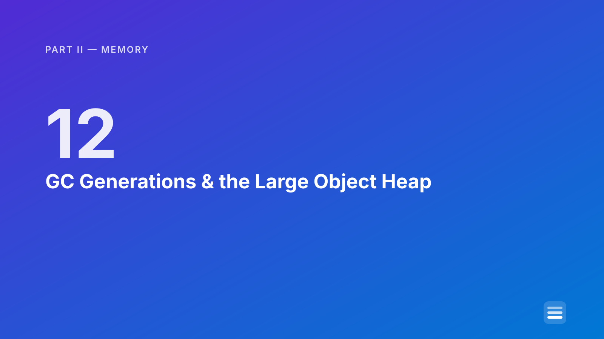

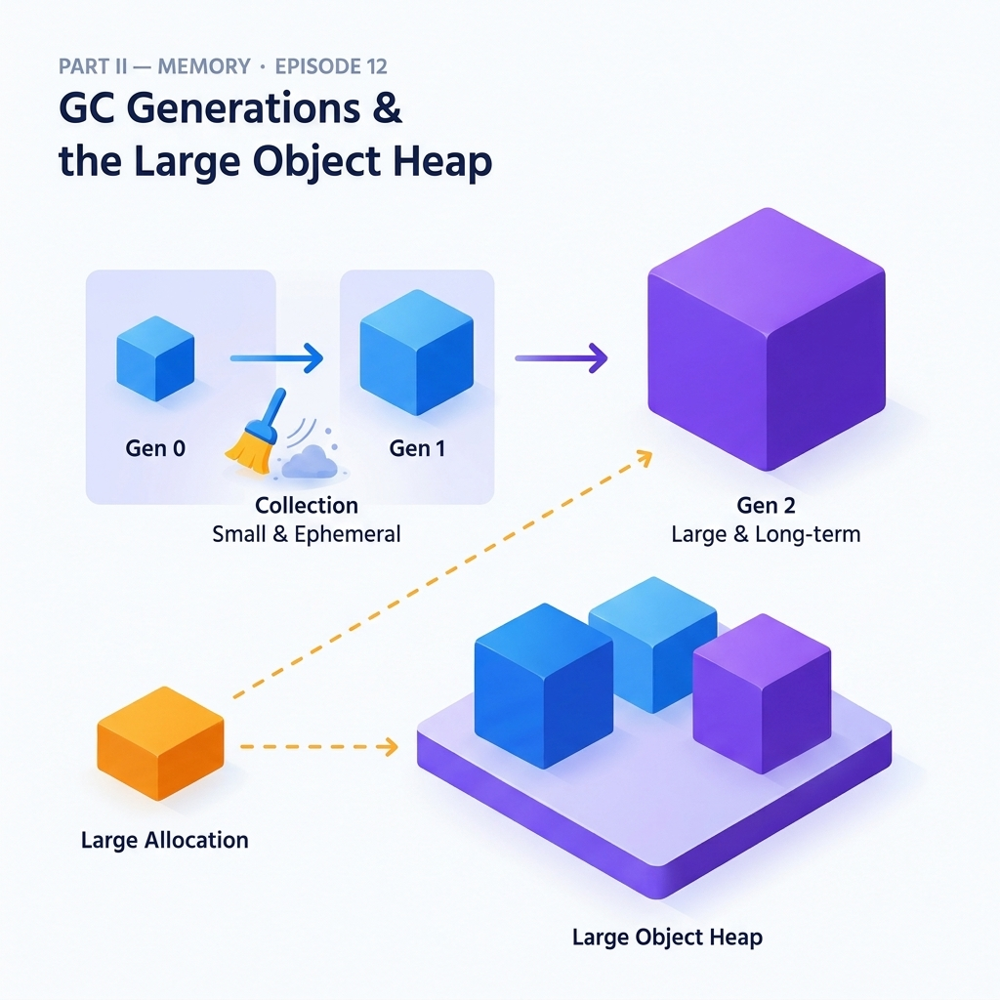

---

### Learning objectives

By the end of this chapter, you will be able to:

- Explain how the ephemeral segment's Gen 0 and Gen 1 allocation budgets adapt at runtime — growing and shrinking based on survival rate and collection cost — instead of treating "the budget's full" as an unexplained black box.
- Describe the card table and write barrier mechanism precisely enough to explain why a Gen 0 collection stays cheap even when Gen 2 holds millions of live objects.
- State the Large Object Heap's exact size threshold, why it exists, and why the LOH is not compacted by default — and use `GCSettings.LargeObjectHeapCompactionMode` correctly when a one-time compaction is actually warranted.
- Predict, for a given allocation, whether it lands in the generational heap or the LOH — and explain the one detail (object header overhead) that catches most people off guard about exactly where that line falls.
- Recognize the Pinned Object Heap's purpose well enough to know when a pinned buffer belongs there instead of fighting compaction in the regular heap.

### Real-world analogy

During a mass-casualty response, a level-one trauma center's central supply department can't treat every item passing through the building the same way. Small, disposable items — gauze, syringes, saline bags — get restocked from a fast-turnover cart parked right at each nursing station; nobody wants a runner walking to the main warehouse every time a nurse needs a bandage, so that cart is resupplied from a slightly larger buffer room down the hall the moment it runs low, and that buffer room's own reorder point grows automatically once a busy shift's usage teaches the system it's being drawn down faster than the old reorder point assumed. But heavy, awkward equipment — a portable X-ray unit, a bariatric hospital bed, an MRI-compatible ventilator — never lives on that fast-turnover cart at all; it's staged in its own equipment bay from the moment it arrives, because wheeling something that size through the same tight corridors every time the small cart gets reorganized would slow the whole department down for no benefit, so it just sits there, unmoved, until someone deliberately schedules a reorganization of that bay specifically. And when a long-term patient's chart in the step-down ward gets updated to reference a piece of new, short-term equipment just brought in for them, nobody re-audits every chart in the ward to notice it — a clerk simply clips a colored tab onto that one folder the moment the update happens, so the nightly audit only has to re-check flagged folders instead of the entire ward.

That's the machinery [Episode 11](../010-garbage-collection/article.md) deliberately left as a black box. **The fast-turnover cart, resupplied from a buffer room whose own reorder point grows with demand,** is the ephemeral segment's Gen 0 and Gen 1 **budgets** — adaptive thresholds, not fixed constants, recomputed after every collection from what that collection actually observed. **The equipment bay that's staged separately and never reorganized during a routine cart restock** is the **Large Object Heap** — objects too large to move cheaply get routed there at allocation time and, by default, stay exactly where they land until someone deliberately requests a compaction. **The colored tab clipped onto one folder the instant its reference changes, so the nightly audit only re-checks flagged folders** is the **card table and write barrier** — the mechanism that lets a cheap Gen 0 collection notice "this one Gen 2 object now points at something new" without re-auditing the entire long-term ward every single time.

### Problem statement

[Episode 11](../010-garbage-collection/article.md) established the generational hypothesis at a fundamentals level: most objects die young, so a Gen 0 collection only looks at Gen 0, and survivors get promoted one generation deeper each time they outlive a collection. That chapter deliberately stopped there and deferred three specific questions to this one:

- **How does "the budget's full" actually work?** Episode 11's diagrams described a Gen 0 collection triggering "when Gen 0's allocation budget doesn't have room" — but where does that budget number come from, and why doesn't it stay fixed forever?
- **If Gen 2 can hold millions of live objects, how does a Gen 0 collection avoid having to check every single one of them for a reference into Gen 0?** A tracing collector's whole safety guarantee rests on finding every root — and a Gen 2 object holding a live reference to a Gen 0 object *is* a root for that Gen 0 object, every bit as real as a stack variable. Naively, that means every Gen 0 collection would need to rescan all of Gen 2 "just in case" — which would erase the entire performance premise the generational hypothesis is built on.
- **What happens to an object too big to move around cheaply?** Compaction — sliding survivors together to close gaps — is what keeps the bump-pointer allocator fast, as Episode 11 explained. But sliding a 50 MB object during every collection that touches it is not free; the copy cost scales with the object's size, and a heap that compacts indiscriminately would pay that cost on every single full collection, for every large object, whether or not that particular collection actually needed the space.

This chapter answers all three, plus rounds out the "specialized heap segments" picture with the Pinned Object Heap — introduced in .NET 5 for exactly the objects that used to sit as immovable obstacles in the middle of an otherwise-compactable segment.

### Visual explanation

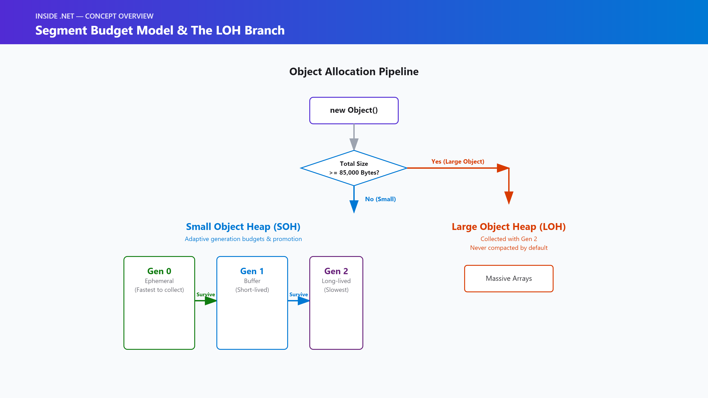

#### 1. Segment/budget growth and the size-threshold branch

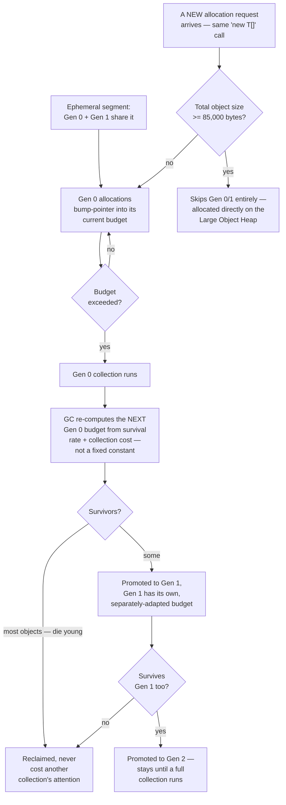

#### 2. Card table and write barrier

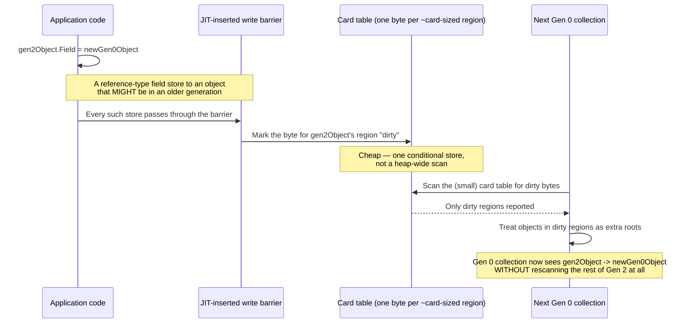

#### 3. The LOH size threshold

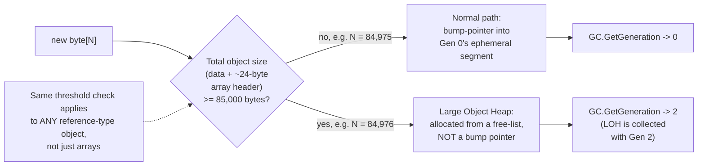

#### 4. LOH compaction modes

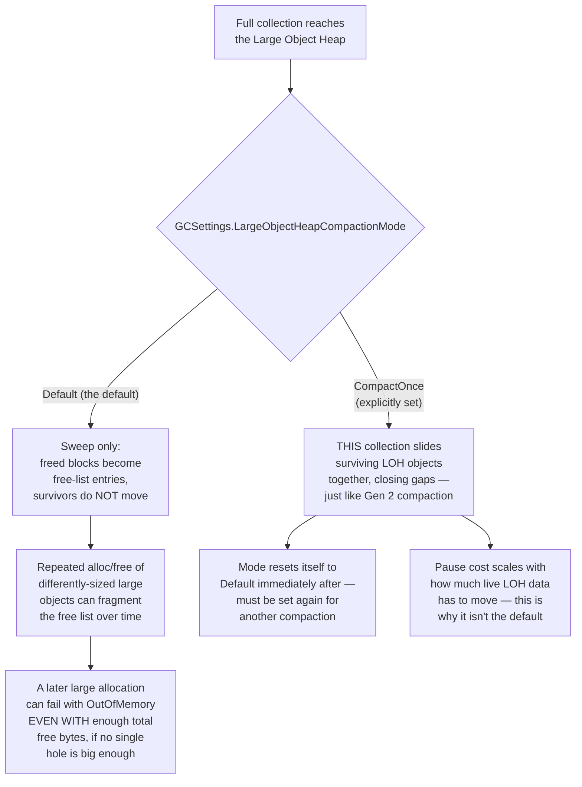

#### 5. Specialized heap segments, side by side

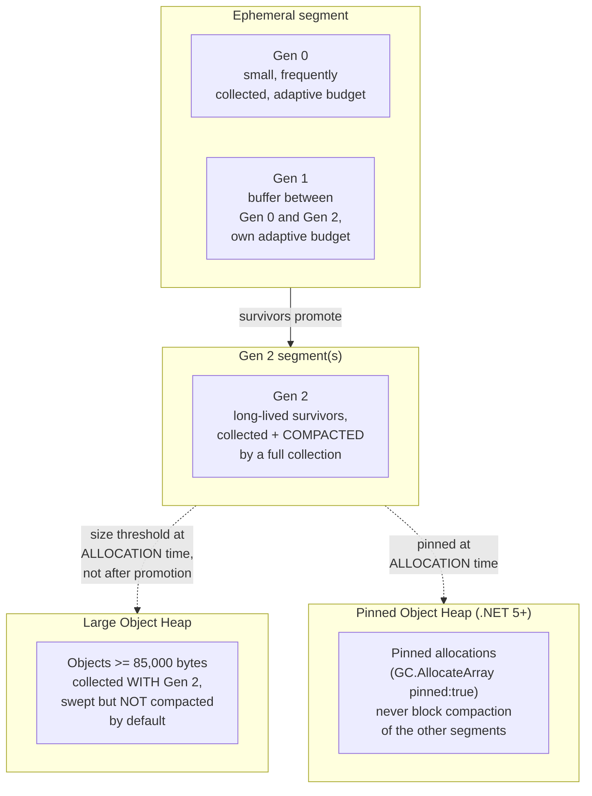

*(Standalone Mermaid sources for all five diagrams live under [`diagrams/mermaid/`](diagrams/mermaid/), numbered to match the order above, per [IMAGE_GUIDE.md](../../IMAGE_GUIDE.md).)*

### Under the hood

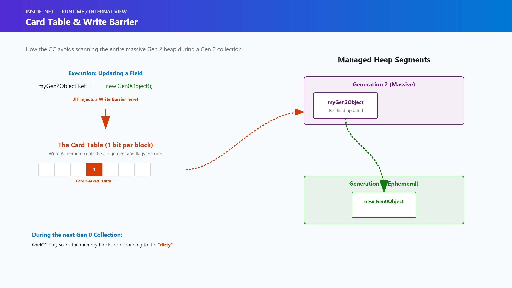

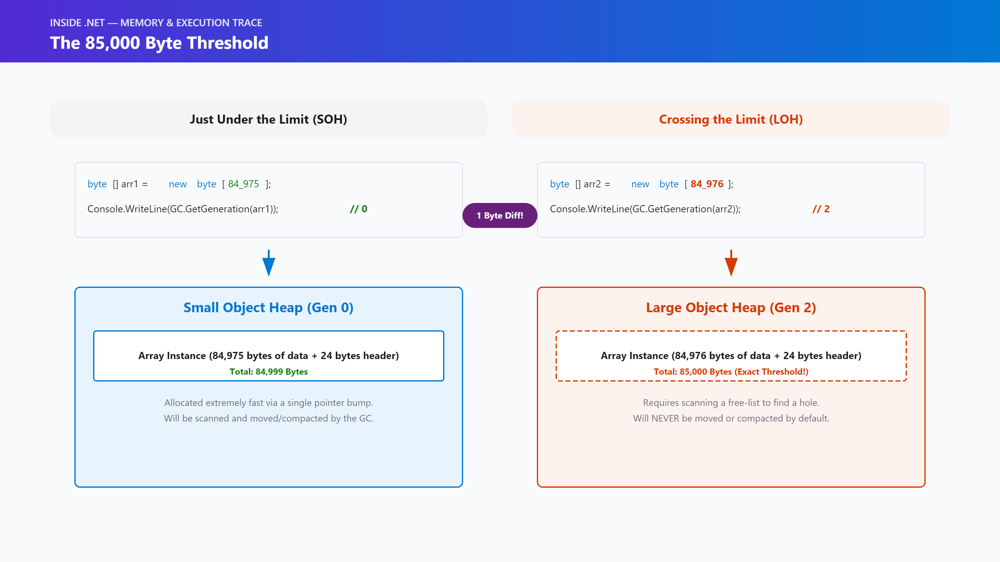

1. **Gen 0/Gen 1 budgets are adaptive, not fixed constants.** After every collection, the GC re-computes that generation's next allocation budget from what it just observed — how much of the generation survived, and how expensive the collection itself was relative to how fast the application is allocating. A collection that finds low survival and was cheap to run tends to grow the next budget, so the next collection happens later against a larger pool; high survival tends to hold growth back, since a bigger Gen 0 budget just means promoting more objects into Gen 1/Gen 2 before the next collection gets a chance to reclaim them. This chapter's demo observes the *consequence* of this directly, not the private internal formula: `GC.GetGCMemoryInfo().TotalCommittedBytes` grows sharply in response to a burst of allocation pressure, then plateaus at a stable size once the CLR has sized the segment for the workload's actual behavior — repeating the same allocation pattern afterward doesn't force it to keep growing. The initial Gen 0 budget can also be influenced directly via the `GCgen0size` runtime configuration knob (or `DOTNET_GCgen0size` as an environment-variable override) — a real, documented tuning lever, not something this chapter is inferring.
2. **Modern .NET allocates heap space in regions, not one monolithic segment per generation.** Starting with .NET 8, the GC's heap layout moved to a region-based design — fixed-size blocks that get assigned to whichever generation needs them, rather than one large contiguous segment per generation that can only grow as a whole. Budget growth in a region-based heap shows up as the GC acquiring additional regions for a generation rather than extending one segment's boundary — but the budget/survival logic in point 1 above is conceptually unchanged; this is an implementation detail of *where* the grown budget's memory comes from, not a different policy for *when* it grows.
3. **The card table is what makes point 2 of the Problem Statement possible — a Gen 0 collection does not need to rescan Gen 2 to find a Gen2→Gen0 reference.** Every store of a reference-type value into a field or array element that could plausibly create a reference from an older generation into a younger one passes through a **write barrier** the JIT inserts automatically — code you never write yourself. That barrier's entire job is cheap: mark one byte "dirty" in the **card table**, a small side-structure covering the heap in fixed-size regions. A Gen 0 (or Gen 1) collection then only needs to scan the card table itself — tiny relative to the heap — and treat objects in *dirty* regions as extra roots, ignoring every clean region of Gen 2 entirely. For very large heaps, CoreCLR adds a second, coarser level (**card bundles**) so that scanning the card table itself doesn't become the bottleneck once the table itself gets large. No public managed API exposes a card's dirty bit directly, so this chapter's demo measures the closest honest proxy instead: forcing a Gen 0 collection against a live, half-million-object Gen 2 graph, before and after mutating every object in that graph to reference a brand-new Gen 0 object. `Chapter11.Benchmarks`' `CardTableProxyBenchmarks` goes further and makes this rigorous — see Performance Notes.
4. **The Large Object Heap threshold is 85,000 bytes of total object size — not 85,000 elements, and not "just the data."** An array's total size includes its header (a method table pointer and a length field, ~24 bytes on a 64-bit runtime) in addition to its element data. This chapter's demo confirms the exact crossover directly: `new byte[84_975]` reports `GC.GetGeneration() == 0` (the normal ephemeral path), while `new byte[84_976]` — one byte more — reports `GC.GetGeneration() == 2`, because its total object size (84,976 + 24 = 85,000) crosses the threshold. LOH objects report generation 2 because the LOH is logically collected together with a full (Gen 2) collection — there's no separate "generation 3" from a collection-counting perspective, even though it's a physically distinct segment.
5. **The LOH exists because compacting a huge object is expensive in direct proportion to its size, and that cost doesn't buy anything a smaller object's compaction doesn't already buy more cheaply.** Sliding a surviving object during compaction means copying every byte of it to its new location and fixing up every reference that pointed at the old one. For a small object that's negligible; for a 50 MB object it's a real, measurable copy cost paid on every collection that reaches it — and unlike Gen 2's other survivors, a huge object is disproportionately likely to still be alive next time, so that cost would recur repeatedly for no fragmentation benefit most of the time. The CLR's answer is to give large objects their own segment and, **by default, sweep it without compacting it**: freed blocks become free-list entries that a future large allocation can reuse if one is big enough, but survivors never move.
6. **`GCSettings.LargeObjectHeapCompactionMode = GCLargeObjectHeapCompactionMode.CompactOnce` is a one-shot switch, not a persistent setting.** Setting it doesn't compact anything immediately — it takes effect on the *next* collection that reaches the LOH, and the mode resets itself back to `Default` right after that collection consumes it. This chapter's demo shows the effect concretely: after fragmenting the LOH (allocating 200 large objects and freeing every other one), `GC.GetGCMemoryInfo().GenerationInfo[...].FragmentationAfterBytes` reports real, nonzero fragmentation; setting `CompactOnce` and forcing one more collection drives that same number down to a few thousand bytes. `Chapter11.Benchmarks`' `LohFragmentationCompactionBenchmarks` measures the actual time cost of that compacting collection versus a plain sweep — see Performance Notes.
7. **Never compacting by default has a real consequence: LOH fragmentation can produce an `OutOfMemoryException` even when the total free LOH space would seem more than sufficient.** A free list built from many small, differently-sized holes can simply have no single hole large enough for the next large allocation, regardless of how much free space exists in total across all of them. This is the specific, concrete failure mode "Common Mistakes" below is built around — and it's the reason `CompactOnce` exists at all, as a deliberate, occasional remedy rather than a default behavior.
8. **The Pinned Object Heap (POH), introduced in .NET 5, exists because a pinned object used to be an obstacle sitting in the middle of an otherwise-movable segment.** Before POH, pinning an object (via a `fixed` statement or `GCHandle.Alloc(obj, GCHandleType.Pinned)`) for any meaningful length of time — a native interop buffer held across several calls, for instance — meant the GC had to work *around* it during every compaction of the segment it happened to land in, fragmenting the space near it rather than sliding freely through. `GC.AllocateArray<T>(count, pinned: true)` allocates directly on the POH instead, a segment collected alongside Gen 2/LOH that the rest of the heap's compaction never has to route around. This chapter's demo confirms it directly — a POH allocation reports `GC.GetGeneration() == 2`, consistent with being collected on the same cadence as Gen 2 and the LOH, and needs no `fixed` statement to stay in place.
9. **This is exactly how Microsoft implements it — not a simplified teaching model.** The 85,000-byte LOH threshold, the card table and card-bundle implementation, and the region-based heap layout introduced in .NET 8 all live in `dotnet/runtime`'s GC source (`src/coreclr/gc/gc.cpp`, with accompanying design documentation elsewhere in that repository) — the identical mechanism this chapter describes and measures, not a stand-in for it. `GCSettings.LargeObjectHeapCompactionMode`, `GC.GetGCMemoryInfo()`, and `GC.AllocateArray<T>(pinned:)` are the same public, documented APIs a production service would reach for to observe or influence any of this.

### Code example

*Tier: Example + Advanced + Performance.*

```csharp
// Program.cs — .NET 10 console app
// Demonstrates: (1) heap/segment growth under allocation pressure, observed
// via GC.GetGCMemoryInfo(); (2) the size-threshold branch — a small array
// stays on the Gen 0 path, a >=85,000-byte array is routed to the LOH,
// both confirmed via GC.GetGeneration(); (3) an honestly-labeled proxy for
// the card table's payoff; (4) LOH fragmentation appearing and then being
// cleared by GCSettings.LargeObjectHeapCompactionMode.CompactOnce; (5) the
// Pinned Object Heap via GC.AllocateArray<T>(pinned: true).

const int LohThresholdBytes = 85_000;

Console.WriteLine("=== Inside .NET: Episode 12 — GC Generations & the Large Object Heap demo ===");

var smallArray = new byte[1_000];
var largeArray = new byte[100_000]; // >= 85,000 bytes -> routed straight to the LOH
Console.WriteLine($"new byte[1,000]   -> GC.GetGeneration = {GC.GetGeneration(smallArray)} (Gen 0 — the normal ephemeral path)");
Console.WriteLine($"new byte[100,000] -> GC.GetGeneration = {GC.GetGeneration(largeArray)} (LOH objects report as Gen 2)");

// The exact crossover: an array's total object size includes its ~24-byte
// header, so the visible element count that first crosses 85,000 bytes is
// NOT 85,000.
var justUnderThreshold = new byte[84_975]; // total object size = 84,999 bytes
var justAtThreshold = new byte[84_976];    // total object size = 85,000 bytes
Console.WriteLine($"new byte[84,975] -> GC.GetGeneration = {GC.GetGeneration(justUnderThreshold)}");
Console.WriteLine($"new byte[84,976] -> GC.GetGeneration = {GC.GetGeneration(justAtThreshold)}");

var pinnedBuffer = GC.AllocateArray<byte>(4_096, pinned: true);
Console.WriteLine($"GC.AllocateArray<byte>(4096, pinned: true) -> GC.GetGeneration = {GC.GetGeneration(pinnedBuffer)}");
```

Run the full version with `dotnet run -c Release` in [`code/Chapter11.Demo/`](code/Chapter11.Demo/) — it also covers heap/segment growth under sustained allocation pressure, the card table proxy measurement, and the full LOH-fragmentation-then-compaction walkthrough, omitted above for length. See [`code/README.md`](code/README.md) for the complete listing and expected output.

The Performance tier lives in [`code/Chapter11.Benchmarks/`](code/Chapter11.Benchmarks/) — three real `BenchmarkDotNet` classes backing every number in the next section: LOH allocation cost vs. an equivalent-total-size run of small allocations, the cost of a compacting collection against a fragmented LOH vs. a plain sweep, and the card-table proxy measured across three Gen 2 graph sizes.

### Performance notes

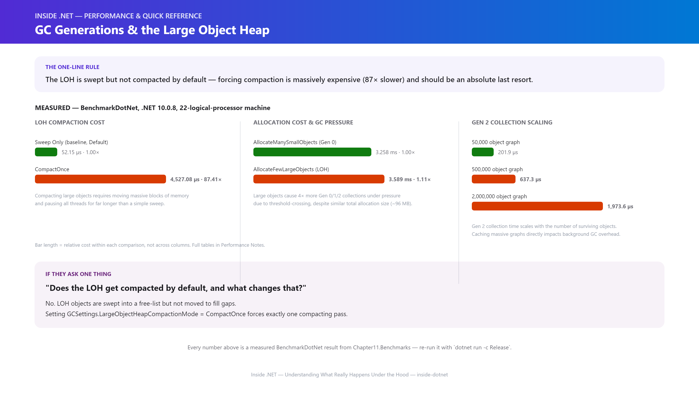

Every number below is a measured `BenchmarkDotNet` result from this chapter's own `Chapter11.Benchmarks` project (`.NET 10.0.8, X64 RyuJIT AVX2`, single run — see the note on variance after table 1), not an estimate — re-run it yourself with `dotnet run -c Release` and expect the same shape on your hardware.

**1. The same ~100 MB total, allocated as ~62,500 small (1,600-byte, Gen 0-path) objects vs. 1,000 large (100,000-byte, LOH-path) objects:**

| Method | Mean | Ratio | Gen0/1K ops | Gen1/1K ops | Gen2/1K ops | Allocated |
|---|---|---|---|---|---|---|
| `AllocateManySmallObjects` (baseline) | 3.258 ms | 1.00 | 8,086 | – | – | 96.8 MB |
| `AllocateFewLargeObjects` | 3.589 ms | 1.11 | 31,246 | 31,246 | 31,246 | 95.4 MB |

Wall-clock time was close enough between the two that it isn't the headline finding here — a repeat run of this same benchmark had the ratio flip direction entirely, which is itself worth internalizing: at this size, system noise can outweigh the real difference, and a single ratio without checking the error margins is easy to over-trust. **The collection-count columns are the stable, repeatable story.** Allocating as 1,000 large objects triggered roughly **31 full (Gen 0 + Gen 1 + Gen 2) collections** per 1,000 invocations of the benchmarked method, against roughly **8 Gen-0-only collections, zero Gen 1, zero Gen 2** for the equivalent bytes spread across small objects. That's the direct, measurable consequence of "Under the Hood" #4-#5: every allocation that pushes the LOH over its own budget triggers a collection that reaches Gen 2 (since the LOH is collected together with Gen 2), while small, Gen 0-path allocations mostly only ever pay for cheap, Gen-0-only collections. Two workloads with nearly identical wall-clock time and total bytes allocated can still have completely different GC *pause profiles* — which matters far more than raw throughput once you're reasoning about tail latency in a live service.

**2. The cost of a full `GC.Collect()` against a fragmented LOH vs. the same collection forced to compact via `CompactOnce` (400 large objects allocated, every other one freed first):**

| Method | Mean | Ratio |
|---|---|---|
| `FullCollectWithFragmentation` (baseline, sweep only) | 52.15 μs | 1.00 |
| `FullCollectWithCompactOnce` | 4,527.08 μs | **87.41×** |

This is the measured cost of "Under the Hood" #5-#6's trade-off, made concrete: a plain sweep of a fragmented LOH is fast — it just links freed blocks into a free list. Forcing that same collection to *compact* — sliding roughly 30 MB of live LOH data together and fixing up every reference to it — cost **87× more**. That gap is exactly why the LOH isn't compacted by default: paying this cost on every collection that touches the LOH, for every service, whether or not it actually needed the space back, would be a bad trade almost all of the time.

**3. `GC.Collect(0)` forced against Gen 2 graphs of increasing size, with the *dirtied* (cross-gen-referencing) subset held fixed at 2,000 objects regardless of total graph size:**

| Gen2GraphSize | Mean | Median |
|---|---|---|
| 50,000 | 201.9 μs | 233.3 μs |
| 500,000 | 637.3 μs | 821.4 μs |
| 2,000,000 | 1,973.6 μs | 1,796.9 μs |

The Gen 2 graph grew **40×** (50,000 → 2,000,000 objects) while the dirtied subset stayed fixed at exactly 2,000 objects throughout — and the Gen 0 collection cost grew under **10×**, not 40×. That's meaningfully sub-linear, consistent with the card table sparing the untouched majority of Gen 2 from a full rescan — but it is *not* perfectly flat, and this table's own spread between Mean and Median (and the wide error margins in the raw `BenchmarkDotNet` output) signal real measurement noise from rebuilding and promoting a multi-million-object graph fresh on every iteration. Treat the *sub-linear shape* as the reliable finding, not the precise ratio — a live Gen 0 pause's length also depends on the ephemeral generation's own size, not card-table scanning alone, and that's very likely contributing to the residual growth here too.

- **The throughline: none of these costs are hidden or unpredictable — every one of them is a direct, measurable consequence of a design trade-off this chapter named explicitly**, and none of them is a single clean number you should quote without also checking how much it moved between runs.
- **`dotnet-counters`' `Gen 2 Size` and `LOH Size` counters are the honest way to confirm whether a running production process's LOH behavior matches what this chapter measured** — the same live-measurement discipline recommended in every Memory-part chapter so far.

### Common mistakes / anti-patterns

- **Growing a buffer (or a `StringBuilder`, or a `List<T>`'s backing array) up past 85,000 bytes without realizing it silently moved from the generational heap to the LOH.** The threshold in this chapter's demo — `new byte[84_976]` already lands on the LOH — is easy to cross by accident with an innocuous-looking capacity calculation. Once it's on the LOH, that object stops being compacted by default, changes which collections it's swept by, and starts contributing to LOH fragmentation risk if it's allocated and dropped repeatedly.
- **Repeatedly allocating and discarding large, similarly-but-not-identically-sized buffers** (a common shape in image/video processing, large batch-file parsing, or per-request buffer allocation for big payloads) **without pooling them.** This is precisely the pattern that fragments the LOH's free list — measured directly in this chapter, freeing every other large object out of 200 leaves real, nonzero fragmentation behind. `ArrayPool<T>.Shared` exists specifically to avoid this churn for exactly this size class.
- **Calling `GCSettings.LargeObjectHeapCompactionMode = CompactOnce` routinely, or on a hot path**, instead of as a deliberate, occasional maintenance action. It's a real, effective tool — but the very next full collection after setting it pays a compaction cost proportional to how much live LOH data has to move, which is not something you want happening on a request thread.
- **Pinning a buffer with `fixed` or `GCHandle.Alloc(..., GCHandleType.Pinned)` and holding that pin for a long time**, instead of allocating it on the Pinned Object Heap up front with `GC.AllocateArray<T>(pinned: true)` when the buffer's lifetime is genuinely long-lived and pin-for-life by design. A long-held pin anywhere in the regular heap blocks compaction around it for as long as it's held.
- **Assuming the GC "should" just compact everything, always** — not accounting for the actual cost trade-off (copy cost scales with object size) that motivated leaving the LOH uncompacted by default in the first place. The right response to LOH fragmentation is pooling or a deliberate, occasional `CompactOnce` — not treating the default behavior as a bug.

### Architect's perspective

**Developer Perspective**
*"Is this allocation about to cross the 85,000-byte LOH threshold without me realizing it — and if it is, does that actually matter for what I'm building?"*

Day to day, this chapter is mostly about recognizing the size class you're working in. Most application code never gets near 85,000 bytes in a single object and doesn't need to think about any of this. The habit worth building is noticing the specific patterns that do — buffers sized from user input, batch payloads, image/media data — and reaching for `ArrayPool<T>` rather than raw `new byte[N]` once an allocation is reliably in LOH territory and happens more than once.

**Senior Perspective**
*"Does this service's actual large-object allocation pattern over its real running lifetime fragment the LOH — and did we validate that with a real measurement, or assume it away because 'we have enough memory'?"*

This is where code review earns its keep: a service that processes large payloads on every request (image resizing, big JSON/CSV ingestion, streaming buffers) has a legitimate, ongoing LOH fragmentation risk that "enough total free memory" doesn't actually rule out — this chapter measured that risk directly, not as a hypothetical. The same scrutiny applies to a `CompactOnce` call sitting on a request path, and to a long-held pin outside the POH where a POH-backed pool would do. Each is a small, local decision that's cheap to get right in review and easy to get wrong by copying a pattern from a context where it didn't matter.

**Architect Perspective**
*"Does this system's memory strategy treat LOH fragmentation as its own, distinct failure mode from 'ran out of total memory' — with a monitored signal for it — or will it surface for the first time as a confusing production `OutOfMemoryException` under a memory graph that still looks fine?"*

At system scale, LOH fragmentation is a classic slow-burn failure: a long-running service's memory usage looks stable or even healthy in aggregate right up until a large allocation fails because no single free block was big enough, which reads as a mystery to whoever's paged in without this chapter's model of why. The architect's job is making sure `dotnet-counters`' `LOH Size` and fragmentation-adjacent signals (or `GC.GetGCMemoryInfo()` wired into the service's own telemetry) are part of production observability for any service with a genuine large-object workload, and that the choice between pooling, an occasional deliberate `CompactOnce` at a safe idle point, and POH-backed pinned buffers was made once, deliberately, and documented — not left as whatever the first engineer to hit an `OutOfMemoryException` happened to try.

### Interview questions

**Q1: What exactly decides whether an allocation lands on the generational heap or the Large Object Heap?**
A: Total object size, not element count — an object (commonly, but not only, an array) whose total size, including its header, is 85,000 bytes or more is allocated directly on the LOH instead of entering Gen 0. This chapter verified the exact crossover directly: `new byte[84_975]` reports `GC.GetGeneration() == 0`, while `new byte[84_976]` — one byte more, once the ~24-byte array header is included — reports `GC.GetGeneration() == 2`.

**Q2: Why does `GC.GetGeneration()` report `2` for a Large Object Heap object instead of some separate "generation 3"?**
A: Because the LOH is logically collected together with a full (Gen 2) collection — it's a physically distinct segment, but not a separate generation from a collection-counting perspective. The same is true of Pinned Object Heap allocations, which also report generation 2.

**Q3: How does the CLR avoid rescanning the entire Gen 2 heap every time it needs to run a cheap Gen 0 collection?**
A: The card table and write barrier. Every store of a reference-type value that could create a reference from an older generation into a younger one passes through a JIT-inserted write barrier, which marks one byte "dirty" in a small side-structure (the card table) covering that region of the heap. A Gen 0 (or Gen 1) collection scans the (tiny, relative to the heap) card table and only treats objects in dirty regions as extra roots — clean regions of Gen 2 are never touched.

**Q4: Is the Large Object Heap compacted the same way Gen 2 is?**
A: No — not by default. Because moving a large object during compaction costs proportionally to its size, the LOH is swept (freed blocks become reusable free-list entries) but survivors are not moved, by default. `GCSettings.LargeObjectHeapCompactionMode = GCLargeObjectHeapCompactionMode.CompactOnce` forces exactly one compacting pass on the next collection that reaches the LOH, then resets itself back to `Default` — it's a deliberate, one-shot request, not a persistent setting.

**Q5: Why can a service hit an `OutOfMemoryException` on a large allocation even when its total free memory looks more than sufficient?**
A: LOH fragmentation. Because the LOH isn't compacted by default, repeated allocation and freeing of differently-sized large objects can leave a free list made up of many holes, none of which is individually large enough for the next large request — even though the sum of all the holes would be. This chapter measured that fragmentation directly by freeing every other object out of 200 large allocations and observing real, nonzero `FragmentationAfterBytes`.

**Q6: What is the Pinned Object Heap, and what problem does it solve that existed before .NET 5?**
A: Before POH, a long-held pinned object (via `fixed` or `GCHandle.Alloc(..., GCHandleType.Pinned)`) sat as an immovable obstacle inside whatever segment it happened to land in, forcing the GC to work around it during every compaction of that segment. `GC.AllocateArray<T>(count, pinned: true)`, introduced in .NET 5, allocates directly onto a separate Pinned Object Heap instead, so pinned data no longer blocks compaction of the regular generational segments or the LOH.

### Quiz

1. What's the exact size threshold that routes an allocation to the Large Object Heap instead of Gen 0 — and is it measured in element count or total object size?
2. What does `GC.GetGeneration()` report for an object living on the LOH, and why that number specifically?
3. What mechanism lets a Gen 0 collection find a live reference from a Gen 2 object without rescanning all of Gen 2 — and what part of it does application code never write directly?
4. Is the LOH compacted by every full collection by default? If not, what forces a one-time compaction, and what happens to that setting immediately afterward?
5. Why does POH exist, and what used to happen to a long-held pinned object before .NET 5 introduced it?

<details>
<summary>Answers</summary>

1. 85,000 bytes of total object size (including the object's header, not just its element data) — not element count and not "just the data."
2. `2` — because the LOH is collected together with a full (Gen 2) collection; it's a physically separate segment but not a distinct generation from a collection-counting perspective.
3. The card table and write barrier. The write barrier — inserted automatically by the JIT on every reference-type store that could create a cross-generational reference — is the part application code never writes; it just marks a card-table byte dirty.
4. No, not by default — the LOH is swept but not compacted unless `GCSettings.LargeObjectHeapCompactionMode` is explicitly set to `CompactOnce`, which forces exactly one compacting pass on the next collection that reaches the LOH and then resets itself back to `Default` immediately afterward.
5. POH (Pinned Object Heap, .NET 5+) exists so a long-held pinned allocation has its own segment instead of sitting as an immovable obstacle inside a regular generational segment. Before POH, a long-held pin (via `fixed` or a pinned `GCHandle`) forced the GC to work around it during every compaction of whatever segment it landed in.

</details>

### Summary & next chapter


**Key takeaways:**

- **Gen 0/Gen 1 budgets are adaptive, not fixed** — recomputed after every collection from survival rate and collection cost, observable indirectly via `GC.GetGCMemoryInfo()`'s committed-bytes growth-then-plateau under sustained allocation pressure.
- **The card table and write barrier are why a Gen 0 collection stays cheap even against a huge Gen 2 heap** — a JIT-inserted write barrier marks one card-table byte dirty on any store that could create a cross-generational reference, so a Gen 0 collection only needs to check dirty regions, never the whole of Gen 2.
- **The LOH threshold is 85,000 bytes of total object size, verified down to the exact byte** — `new byte[84_975]` is Gen 0, `new byte[84_976]` is already on the LOH (reporting `GC.GetGeneration() == 2`, since the LOH is collected with Gen 2).
- **The LOH is swept but not compacted by default**, because moving a large object costs proportionally to its size — `GCSettings.LargeObjectHeapCompactionMode = CompactOnce` forces exactly one compacting pass and then resets itself, a deliberate tool, not a default behavior.
- **LOH fragmentation is a real, measured failure mode distinct from "out of total memory"** — this chapter reproduced it directly, and the fix is pooling (`ArrayPool<T>`), a deliberate occasional `CompactOnce`, or both.
- **The Pinned Object Heap (.NET 5+) exists so a long-held pinned allocation doesn't block compaction elsewhere** — `GC.AllocateArray<T>(pinned: true)` allocates directly onto it.

**What's next:** [Episode 13 — IDisposable & Finalizers](../012-idisposable-finalizers/article.md) moves from *when the GC decides to reclaim memory* to *what happens when reclaiming an object isn't enough on its own* — unmanaged handles, file descriptors, and native resources that need deterministic cleanup the generational model alone can't provide, plus the full treatment of the two-collection finalization lifecycle this chapter's predecessor only introduced.

---

**Where you are in the journey:**

```
    Episode 11 — Garbage Collection Fundamentals
              ↓
  ▶ Episode 12 — GC Generations & the Large Object Heap   ◀ you are here   (Part II — Memory)
              ↓
    Episode 13 — IDisposable & Finalizers
```

**Related:** [Episode 11 — Garbage Collection Fundamentals](../010-garbage-collection/article.md) (the roots/mark-sweep-compact/generational-hypothesis fundamentals this chapter deepens) · [Episode 8 — Object Allocation](../007-object-allocation/article.md) (the bump-pointer allocation fast path whose budget this chapter explains, and the allocation-context mechanics the size-threshold branch overrides) · [Episode 13 — IDisposable & Finalizers](../012-idisposable-finalizers/article.md) (what happens when GC reclamation alone isn't enough)
