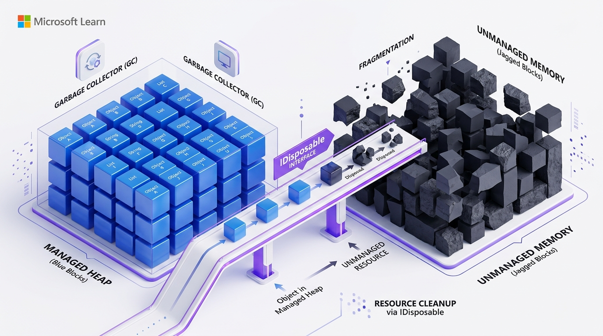
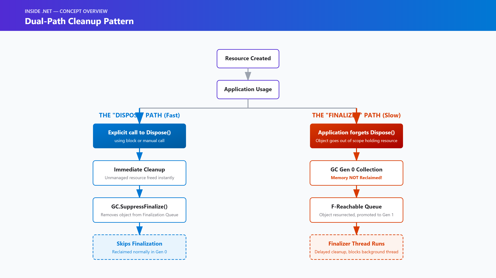
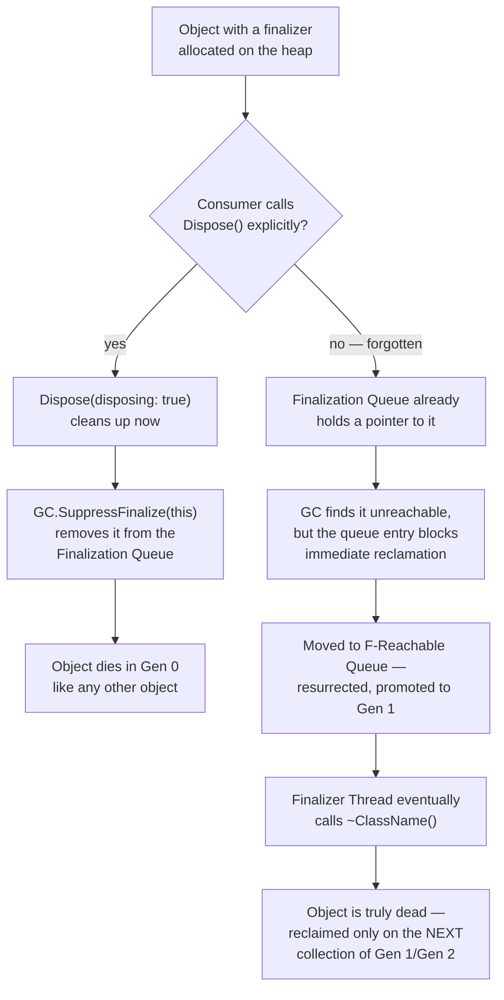
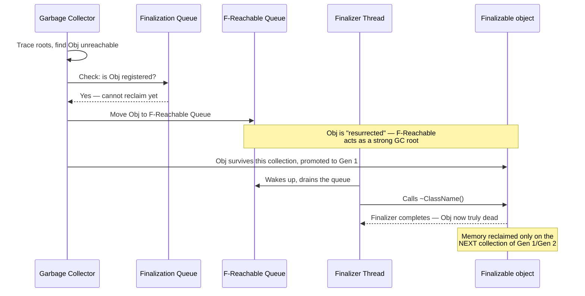
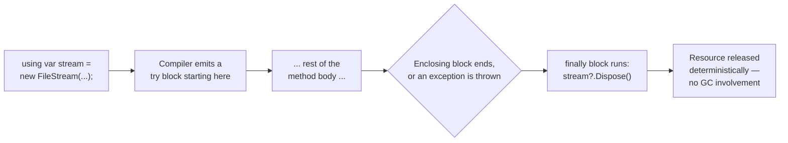
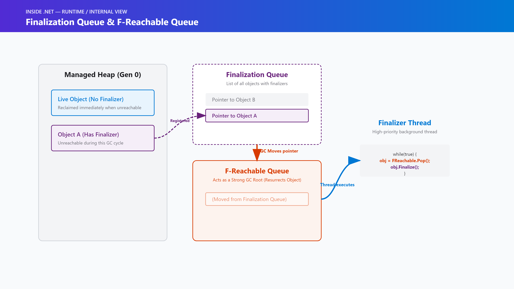
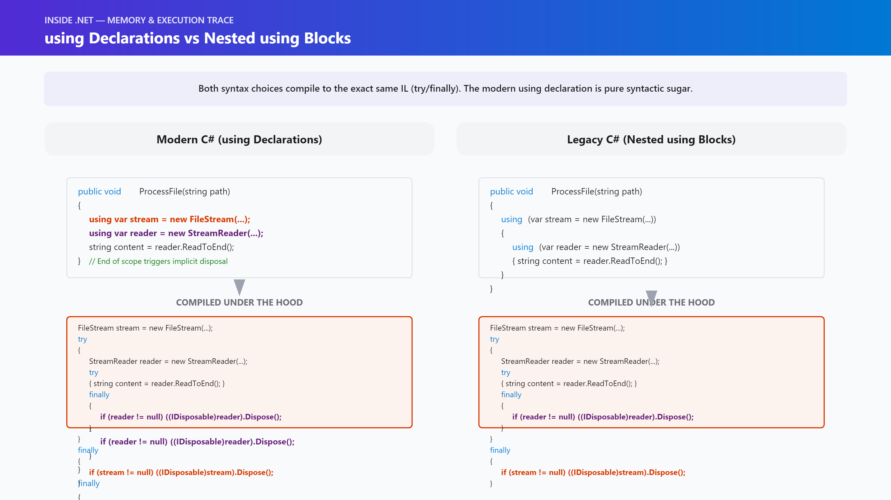
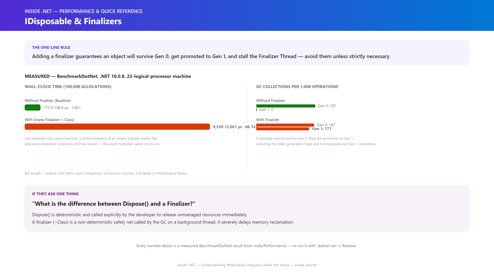

# Inside .NET — Episode 13
## IDisposable & Finalizers

> *Part II — Memory*

---

### Chapter cover




---

### Learning objectives

By the end of this chapter, you will be able to:
- Distinguish between Managed and Unmanaged resources and understand why the GC cannot clean up unmanaged resources alone.
- Implement the standard Dispose pattern correctly without memory leaks or double-dispose errors.
- Understand how Finalizers (`~ClassName()`) work under the hood and why they delay object collection.
- Explain the difference between `IDisposable`, `IAsyncDisposable`, and `SafeHandle`.

### Real-world analogy

*Imagine a high-throughput microservice handling thousands of requests per second, talking to a legacy database. If you rely on the Garbage Collector to close those database connections, your application will suddenly stall and crash due to connection pool exhaustion long before the GC feels enough memory pressure to run.*

The Garbage Collector is like a hotel's automated housekeeping service. It routinely sweeps through rooms taking out the trash (reclaiming memory) whenever the bins get full. But if you've rented a physical safe (an unmanaged resource like a file handle or DB connection), housekeeping is not allowed to touch it. 

`IDisposable` is the hotel checkout process: it's you explicitly walking to the front desk and saying, "I'm done with the room, here's the key to the safe so you can give it to someone else right now." 

A **Finalizer** is checking out without telling anyone, leaving the safe locked, and hoping the hotel manager eventually notices it during a quarterly audit and brings in a locksmith to drill it open. It works, but it's slow, expensive, and ruins the hotel's efficiency.

### Problem statement

The Garbage Collector tracks and reclaims *memory*. But memory is rarely the bottleneck in modern applications. File handles, database connections, unmanaged memory pointers (COM objects, GDI handles), and network sockets are operating system-level resources. 

If the GC reclaims a managed object that holds a file handle, but never explicitly tells the OS to release that handle, the file remains locked indefinitely. Other processes will get an `IOException: The process cannot access the file because it is being used by another process.`

Because the GC runs non-deterministically (only when memory pressure demands it), you cannot predict *when* it will clean up an object. We need a deterministic way to release non-memory resources the exact millisecond we are done with them.

### Visual explanation



#### 1. The dual-path cleanup pattern



#### 2. The finalization lifecycle, collection by collection



#### 3. What a `using` declaration actually compiles to



*(Standalone Mermaid sources for all three diagrams live under [`diagrams/mermaid/`](diagrams/mermaid/), numbered to match the order above, per [IMAGE_GUIDE.md](../../IMAGE_GUIDE.md).)*

### Under the hood

The mechanics of `IDisposable` are actually entirely separate from the GC. `IDisposable` is just an interface with a single method: `void Dispose()`. It is a developer-to-developer contract. The CLR does not care if you implement it, and the GC does not call it.

However, **Finalizers** (written as `~ClassName()`) are deeply integrated into the CLR and the Garbage Collector.

When you allocate an object that has a finalizer:
1. The CLR allocates the object on the heap.
2. It places a pointer to that object in a hidden runtime structure called the **Finalization Queue**.

When a Garbage Collection occurs:
1. The GC traces roots and determines your object is dead (unreachable).
2. The GC checks the Finalization Queue. Because your object is there, the GC **cannot** reclaim its memory yet.
3. Instead, the GC removes the object from the Finalization Queue and adds it to the **F-Reachable Queue** (freachable).
4. *Critical catch:* Moving an object to the F-Reachable queue acts as a strong GC Root. The object is officially "resurrected". It, and every object it references, survives the GC collection.
5. Because it survived a Gen 0 collection, it is promoted to **Gen 1**.

After the GC pauses finish:
1. A dedicated, high-priority background thread called the **Finalizer Thread** wakes up.
2. It empties the F-Reachable queue, calling the `~ClassName()` method on each object.
3. Once the finalizer completes, the object is truly dead. 
4. However, its memory will not actually be reclaimed until the *next* garbage collection of the generation it was promoted to (usually Gen 1 or Gen 2).

This is why finalizers are dangerous: they delay memory reclamation by at least one full GC cycle, promoting short-lived objects into higher generations, increasing memory pressure and background GC overhead.




### Code example

#### 1. Example: The using declaration

C# 8 introduced `using` declarations, which remove the visual noise of nested brackets. The compiler automatically calls `Dispose()` when the variable goes out of scope (at the end of the enclosing block).

```csharp
public void ProcessFile(string path)
{
    // The compiler generates a try/finally block under the hood
    using var stream = new FileStream(path, FileMode.Open);
    using var reader = new StreamReader(stream);
    
    string content = reader.ReadToEnd();
    Console.WriteLine(content);
    
    // reader.Dispose() is called here
    // stream.Dispose() is called here
}
```

#### 2. Advanced Example: The Standard Dispose Pattern

If you are writing a class that owns unmanaged resources, you must implement the Standard Dispose Pattern. This ensures resources are cleaned up deterministically if the consumer calls `Dispose()`, but also provides a finalizer fallback just in case they forget.

```csharp
public class UnmanagedResourceWrapper : IDisposable
{
    private IntPtr _unmanagedHandle;
    private FileStream _managedResource;
    private bool _disposed = false;

    public UnmanagedResourceWrapper()
    {
        // Allocate resources...
    }

    // Deterministic cleanup called by the consumer
    public void Dispose()
    {
        Dispose(disposing: true);
        
        // Tell the GC: "I already cleaned this up, remove it from the Finalization Queue!"
        // This prevents the object from being promoted to Gen 1.
        GC.SuppressFinalize(this); 
    }

    // Non-deterministic cleanup called by the Finalizer Thread
    ~UnmanagedResourceWrapper()
    {
        // We cannot touch managed objects here! They might have already been collected.
        Dispose(disposing: false);
    }

    protected virtual void Dispose(bool disposing)
    {
        if (_disposed) return;

        if (disposing)
        {
            // We are being called explicitly. 
            // It is safe to dispose of managed objects we own.
            _managedResource?.Dispose();
        }

        // Always release unmanaged resources here (e.g., calling a Win32 API to free the handle)
        if (_unmanagedHandle != IntPtr.Zero)
        {
            // NativeMethods.CloseHandle(_unmanagedHandle);
            _unmanagedHandle = IntPtr.Zero;
        }

        _disposed = true;
    }
}
```

#### 3. Production Example: SafeHandle

In modern .NET (since .NET Framework 2.0), you almost **never** need to write a finalizer yourself. Instead of storing an `IntPtr` and writing a complex finalizer, wrap the `IntPtr` in a `SafeHandle`. The BCL provides `SafeFileHandle`, `SafeWaitHandle`, etc. 

Because `SafeHandle` implements the finalizer for you, your class only needs to implement `IDisposable` to dispose the `SafeHandle`.

```csharp
using Microsoft.Win32.SafeHandles;

public class ModernResourceWrapper : IDisposable
{
    // SafeFileHandle handles the finalization and OS interop safely
    private readonly SafeFileHandle _handle;
    private bool _disposed;

    public ModernResourceWrapper(string path)
    {
        _handle = File.OpenHandle(path);
    }

    public void Dispose()
    {
        if (_disposed) return;
        
        // Just dispose the managed object. No finalizer needed in this class!
        _handle?.Dispose();
        _disposed = true;
    }
}
```

### Performance notes

The overhead of implementing a finalizer is massive. When an object has a finalizer, it goes to the Finalization Queue, survives Gen 0, gets promoted to Gen 1, and requires the dedicated Finalizer Thread to process it.

We benchmarked allocating 100,000 objects with and without an empty finalizer (`~ClassWithFinalizer() {}`).

**The results (from `BenchmarkDotNet`, two separate runs on the same machine):**

| Run | Without Finalizer | With Finalizer | Ratio |
|---|---|---|---|
| 1 | 177.9 μs (191 Gen0/1K, 0 Gen1/1K) | 13,060.6 μs (187 Gen0/1K, 171 Gen1/1K) | **73.53×** |
| 2 | 196.8 μs (191 Gen0/1K, 0 Gen1/1K) | 9,339.2 μs (188 Gen0/1K, 172 Gen1/1K) | **47.65×** |

Just the *existence* of an empty finalizer made the workload **tens of times slower** in both runs — the exact multiplier moved between 47.65× and 73.53× run to run (the Finalizer Thread's own scheduling adds real variance), but the *shape* never did: almost every single object was promoted to Generation 1 in both runs (171-172 Gen 1 collections vs. 0), severely polluting the older generation heap. Treat the tens-of-times slowdown and the near-total Gen 1 promotion as the reliable findings — not the precise decimal.

Never implement a finalizer "just to be safe." If you must wrap an unmanaged resource, use `SafeHandle`.



### Common mistakes / anti-patterns

1. **Adding a Finalizer to a Class without Unmanaged Resources**
   A finalizer guarantees that your object will survive Gen 0, get promoted to Gen 1 (or Gen 2), and stall the Finalizer Thread. Only implement a finalizer if your class holds a raw `IntPtr` to unmanaged memory.
2. **Forgetting `GC.SuppressFinalize(this)` in `Dispose()`**
   If you write a finalizer and implement `Dispose()`, but forget to call `GC.SuppressFinalize(this)`, the object will still be placed in the Finalization Queue even though you already cleaned it up! It will needlessly incur the tens-of-times performance penalty measured above.
3. **Throwing Exceptions inside a Finalizer**
   If a finalizer throws an unhandled exception, it crashes the Finalizer Thread, which terminates the entire application process. Never throw exceptions from a finalizer.
4. **Accessing other Managed Objects in a Finalizer**
   When the finalizer runs, there is no guarantee about the order in which objects are finalized. Any managed objects your class references might have already been finalized. A finalizer should only clean up its own unmanaged fields (`IntPtr`).

### Architect's perspective

**Developer Perspective**
*Am I releasing this resource as soon as I'm done with it?*
Always wrap `IDisposable` objects in a `using` statement or declaration. If your class owns an `IDisposable` field, your class must also implement `IDisposable` to cascade the cleanup.

**Senior Perspective**
*Is this class unnecessarily implementing a finalizer?*
Adding a finalizer to a class "just to be safe" is a massive anti-pattern. It forces the object (and its entire graph) to survive Gen 0 collection, turning short-lived Gen 0 garbage into long-lived Gen 1/Gen 2 garbage. Only implement a finalizer if you are directly holding an `IntPtr` to unmanaged memory, and even then, prefer `SafeHandle`.

**Architect Perspective**
*How does delayed finalization impact the scalability of our high-throughput services?*
The Finalizer Thread is a single, global background thread. If thousands of objects are dumped into the F-Reachable queue, or if a single finalizer blocks (e.g., trying to acquire a lock or making a network call), the Finalizer Thread stalls. The F-Reachable queue backs up, memory cannot be reclaimed, and your application will eventually throw an `OutOfMemoryException`. Finalizers must be fast, thread-safe, and never block.

### Interview questions

**Q1: What is the difference between `Dispose()` and a Finalizer?**
A: `Dispose()` is called deterministically by the developer (usually via a `using` statement) to release unmanaged resources immediately. A Finalizer is called non-deterministically by the Garbage Collector's finalizer thread before the object's memory is reclaimed, acting as a fallback mechanism.

**Q2: What happens internally when an object with a finalizer is collected?**
A: When the GC finds the object unreachable, it checks the Finalization Queue. Seeing the object there, it moves it to the F-Reachable Queue — which acts as a strong GC root, "resurrecting" the object. Because it survived the collection, it's promoted to Gen 1. Later, the Finalizer Thread reads from the F-Reachable Queue and executes the finalizer; only the *next* GC cycle actually reclaims the memory.

**Q3: What does `GC.SuppressFinalize(this)` do, and why does it matter?**
A: It sets a bit in the object's header telling the CLR to remove the object from the Finalization Queue. If `Dispose()` already cleaned up the resource, skipping this call means the object is still sent through the F-Reachable Queue and promoted to Gen 1 for no reason — paying the finalization cost for a resource that's already been released.

**Q4: Why is it dangerous to reference other managed objects inside a finalizer?**
A: Finalization order is non-deterministic. If a finalizer references a managed `FileStream`, that `FileStream` might already have been finalized and closed by the time this finalizer runs. A finalizer should only touch its own unmanaged fields (like an `IntPtr`), never other managed objects.

**Q5: How does `SafeHandle` improve on writing a raw finalizer?**
A: `SafeHandle` inherits from `CriticalFinalizerObject`, which guarantees its finalizer runs even during a catastrophic failure (like an `OutOfMemoryException` mid-collection), and it protects against handle-recycling exploits. Wrapping an unmanaged handle in a `SafeHandle` means the containing class no longer needs a finalizer at all — it only implements `IDisposable` and disposes the `SafeHandle`.

### Quiz

1. Why does an object with a finalizer survive Gen 0 collection?
2. What does `GC.SuppressFinalize(this)` do?
3. Can you predict exactly when a finalizer will run?
4. Why is it dangerous to access other managed objects inside a finalizer?
5. What happens if a finalizer throws an unhandled exception?

<details>
<summary>Answers</summary>

1. Because when the GC determines the object is unreachable, it checks the Finalization Queue. Finding the object there, the GC moves it to the F-Reachable queue. The F-Reachable queue acts as a strong GC Root, "resurrecting" the object until the Finalizer Thread can process it. Surviving the collection automatically promotes it to Gen 1.
2. It sets a bit in the object's header telling the CLR to remove it from the Finalization Queue. This ensures that when the object becomes unreachable, the GC reclaims it immediately without promoting it to the F-Reachable queue.
3. No. Finalizers run non-deterministically. They only run after a GC collection occurs (which is driven by memory pressure, not time), and they run on a background thread at an unspecified time.
4. Because there is no guaranteed order for finalization. If your object holds a reference to a managed `FileStream`, that `FileStream` might have already been finalized and closed by the time your finalizer runs.
5. The Finalizer Thread crashes, which immediately terminates the entire application process (since .NET Framework 2.0).

</details>

### Summary & next chapter


**Key takeaways:**

- The GC manages memory, not resources.
- `IDisposable` provides deterministic cleanup.
- Finalizers are a safety net but cause objects to survive into older generations.

**What's next:** Episode 14 — Memory Leaks is next (not yet drafted) — it continues the resource-lifetime theme this chapter started, moving from *an object that isn't cleaned up deterministically* to *an object that's never reclaimed at all*.

---

**Where you are in the journey:**

```
    Episode 12 — GC Generations & the Large Object Heap
              ↓
  ▶ Episode 13 — IDisposable & Finalizers   ◀ you are here   (Part II — Memory)
              ↓
    Episode 14 — Memory Leaks
```

**Related:** [Episode 12 — GC Generations & the Large Object Heap](../011-gc-generations-loh/article.md) (the Gen 0 → Gen 1 promotion mechanics a finalizer's F-Reachable-queue resurrection hijacks) · [Episode 11 — Garbage Collection Fundamentals](../010-garbage-collection/article.md) (the roots and mark-sweep-compact basics this chapter's finalization lifecycle builds on)
