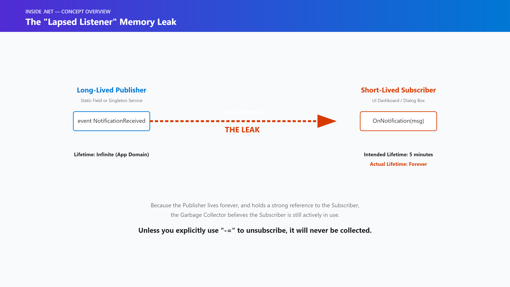
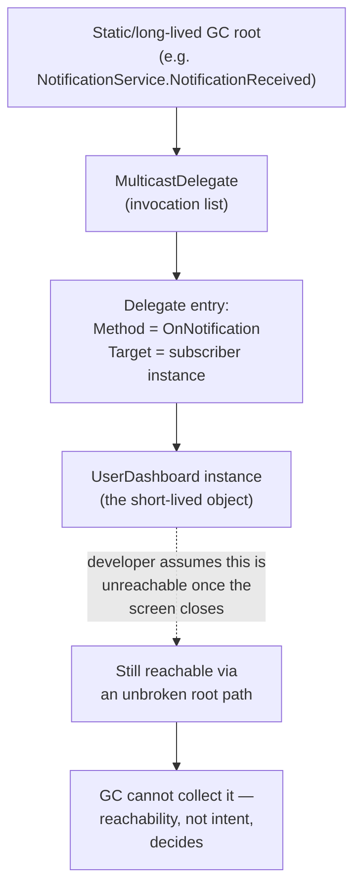
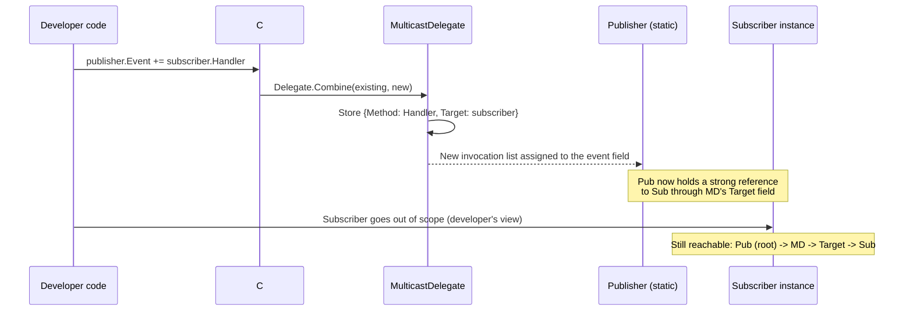
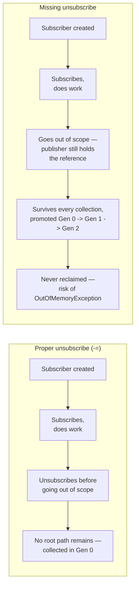
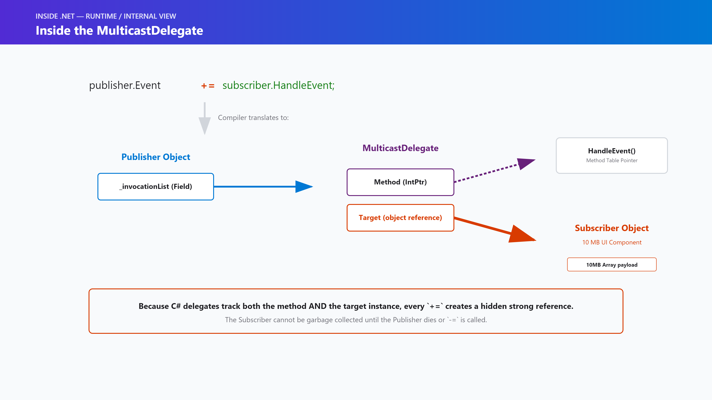
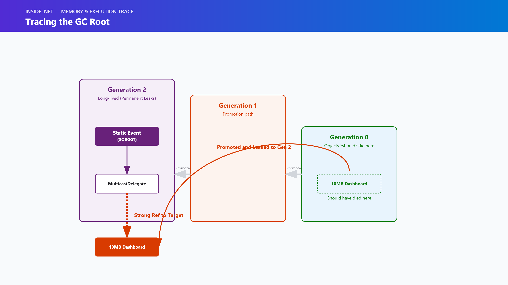
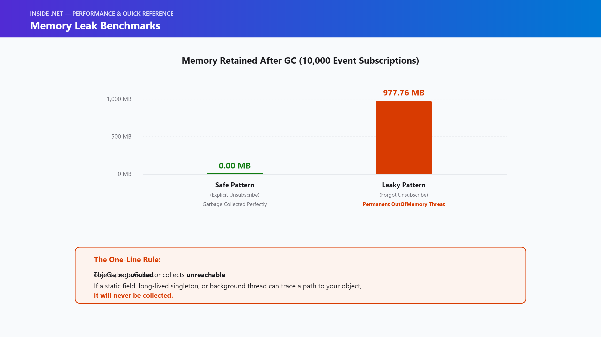

# Inside .NET — Episode 14
## Memory Leaks in a Managed World

> *Part II — Memory*

---

### Chapter cover


---

### Learning objectives

By the end of this chapter, you will be able to:
- Understand how memory leaks are possible in a runtime with a Garbage Collector.
- Identify the most common culprits of managed memory leaks, including the "Lapsed Listener" (event handler) problem.
- Trace reference chains to discover why the GC is refusing to collect a specific object.
- Implement strategies to break strong reference cycles using Weak References.

### Real-world analogy

Imagine a busy hospital ward with a central nursing station. When a patient is admitted, they are hooked up to a heart monitor, and the monitor sends an alert subscription to the central desk. When the patient is discharged, they leave the hospital, and their bed is given to someone else.

However, if the nurse forgets to *cancel the alert subscription* at the central desk, the hospital's central system still believes the patient is active. It holds onto their record indefinitely, waiting for heart rate data that will never come. Over months, thousands of discharged patients remain tracked by the central desk. Eventually, the central system runs out of memory and crashes, taking down the monitoring for the entire ward.

This is exactly how managed memory leaks occur in .NET. The Garbage Collector is perfectly capable of clearing out patients (objects), but it absolutely refuses to delete anyone who is still listed on the central desk's active subscription list (the root reference).

### Problem statement

A fundamental misconception about .NET is that the Garbage Collector prevents memory leaks. It doesn't.

The Garbage Collector prevents *unmanaged* memory leaks (forgetting to free allocated memory pointers), but it cannot prevent **managed memory leaks**. A managed memory leak happens when you hold a strong reference to an object that you no longer need. Because the GC relies entirely on "reachability" from application roots to determine what is alive, any object that is still technically reachable — even if you never intend to use it again — will stay in memory forever.

### Visual explanation



In a managed language, memory leaks almost always take the shape of an **unintended strong reference chain**.

If a short-lived object (like a UI screen or a temporary data processor) subscribes to a long-lived object (like a static event, a background timer, or an application-scoped singleton), the long-lived object stores a reference to the short-lived one in its invocation list.

When the user navigates away from the UI screen, the screen goes out of scope from the developer's perspective. But from the Garbage Collector's perspective, the static event still points to the screen. The screen is reachable, so it cannot be collected.

#### 1. The reference chain that pins a "dead" object alive



#### 2. Subscribing is what creates the strong reference



#### 3. Safe vs. leaky subscriber, generation by generation



*(Standalone Mermaid sources for all three diagrams live under [`diagrams/mermaid/`](diagrams/mermaid/), numbered to match the order above, per [IMAGE_GUIDE.md](../../IMAGE_GUIDE.md).)*

### Under the hood



When you write `publisher.SomethingHappened += subscriber.HandleEvent;`, the C# compiler generates a call to `Delegate.Combine`.

Under the hood, a `MulticastDelegate` is created. This delegate contains an internal array of `Delegate` objects. Each `Delegate` holds two critical pieces of data:
1. `Method`: A pointer to the actual method to execute (`HandleEvent`).
2. `Target`: A strong reference to the instance of the object that owns the method (`subscriber`).

Because the `publisher` holds the `MulticastDelegate`, and the delegate holds the `Target`, the publisher implicitly holds a strong reference to the `subscriber`.



If the `publisher` is a static class, it is considered a **GC Root**. A GC Root is always reachable. Therefore, anything the GC Root points to is reachable. The Garbage Collector will trace the path: `Static Event -> MulticastDelegate -> Target Field -> Subscriber Object`. Because the path is unbroken, the subscriber is pinned in memory, surviving Gen 0, Gen 1, and eventually living permanently in Gen 2.

### Code example

#### 1. Example: The Lapsed Listener leak

```csharp
public class NotificationService
{
    // Long-lived publisher (Singleton/Static)
    public static event EventHandler<string> NotificationReceived;
}

public class UserDashboard
{
    private byte[] _heavyUiData = new byte[10 * 1024 * 1024]; // 10 MB

    public UserDashboard()
    {
        // LEAK: The static service now holds a strong reference to this dashboard!
        NotificationService.NotificationReceived += OnNotification;
    }

    private void OnNotification(object sender, string message) { /* Update UI */ }
}
```

If the application repeatedly creates and discards `UserDashboard` instances without unsubscribing, the `NotificationService` will hold 10 MB in memory for every single dashboard ever created.

#### 2. Advanced Example: IDisposable to the rescue

The correct pattern is to implement `IDisposable` on the subscriber to explicitly break the reference chain when the object is no longer needed.

```csharp
public class UserDashboard : IDisposable
{
    public UserDashboard()
    {
        NotificationService.NotificationReceived += OnNotification;
    }

    private void OnNotification(object sender, string message) { }

    public void Dispose()
    {
        // Break the strong reference chain
        NotificationService.NotificationReceived -= OnNotification;
    }
}
```

#### 3. Production Example: the Weak Event pattern

In complex UI frameworks (like WPF or MAUI), it is sometimes impossible to guarantee `Dispose` will be called. In these cases, production code often uses a **Weak Event Pattern**.

A Weak Event uses the `WeakReference<T>` class. A weak reference points to an object, but *does not prevent the GC from collecting it*.

```csharp
public class WeakEventManager
{
    private List<WeakReference<Action>> _listeners = new();

    public void Subscribe(Action listener)
    {
        _listeners.Add(new WeakReference<Action>(listener));
    }

    public void Fire()
    {
        // Clean up dead references while firing
        _listeners.RemoveAll(weakRef =>
        {
            if (weakRef.TryGetTarget(out var action))
            {
                action();
                return false; // Keep
            }
            return true; // Target was garbage collected, remove from list
        });
    }
}
```

### Performance notes



How fast does a managed memory leak kill an application? This chapter's [`code/Performance/`](code/Performance/) project measures it directly: a tight loop creating 10,000 objects (each holding a 100 KB payload) that subscribe to a long-lived publisher, once with a proper `-=` unsubscribe and once without, checking `GC.GetTotalMemory(true)` (a forced, blocking collection) before and after.

**Measured on .NET 10, `dotnet run -c Release`:**

| Scenario | Objects Created | Payload Size | Memory Retained After GC |
| :--- | :--- | :--- | :--- |
| **Safe (Proper Unsubscribe)** | 10,000 | ~976 MB | **0.00 MB** |
| **Leaky (Missing Unsubscribe)** | 10,000 | ~976 MB | **977.76 MB** |

By simply forgetting to include `-=` (unsubscribe), the GC was forced to promote nearly a gigabyte of short-lived objects directly into Generation 2 — a forced, blocking `GC.GetTotalMemory(true)` collection still couldn't reclaim any of it, because every object remained reachable through the static publisher's invocation list. Left running, this pattern ends in an `OutOfMemoryException`.

> **The One-Line Rule:** The GC collects unreachable objects, not unused objects. If a static field, long-lived singleton, or background thread can trace a path to your object, it will never be collected.

### Common mistakes / anti-patterns

1. **Static Collections:** Using a `static Dictionary<string, UserCache>` and never removing items from it. The dictionary grows infinitely.
2. **Captured Variables in Lambdas:**
   ```csharp
   Action delayedWork = () => Console.WriteLine(this.HeavyData);
   ```
   The compiler generates a hidden closure class that captures `this`. If `delayedWork` is passed to a long-lived service, `this` is leaked along with it.
3. **Timer Callbacks:** Passing a method to `System.Threading.Timer`. The timer queue is a GC Root. If you don't dispose the timer, the callback target lives forever.

### Architect's perspective

**Developer Perspective**
*Am I unsubscribing from every event I subscribe to?*
Whenever you type `+=`, immediately ask yourself where the corresponding `-=` belongs. Implement `IDisposable` on classes that subscribe to external events, and ensure the consumers of your class call `Dispose()`.

**Senior Perspective**
*Is the publisher's lifetime longer than the subscriber's?*
An event subscription is only a leak if the publisher outlives the subscriber. If a `Button` subscribes to a `Form`'s event, and both are destroyed at the exact same time, there is no leak. But if a `Form` subscribes to a static `ThemeManager` event, the form will leak.

**Architect Perspective**
*Can we eliminate the subscription entirely through architecture?*
Instead of direct C# events, consider a decoupled Event Aggregator (like `MediatR` or an Rx.NET stream) where subscriptions can be managed, scoped to DI lifetimes, or implemented with Weak References by default. Memory leaks are systemic failures; if developers constantly forget to unsubscribe, the architectural pattern itself is too fragile.

### Interview questions

**Q1: Can a managed application in .NET actually leak memory?**
A: Yes. While the Garbage Collector prevents *unmanaged* leaks (forgetting to free pointers), it cannot prevent *managed* leaks. A managed leak occurs when an object is functionally unused by the application, but is still reachable by the GC through a strong reference chain. Because it is reachable, the GC will never collect it.

**Q2: What is the most common cause of a managed memory leak?**
A: The Lapsed Listener (or Event Handler) problem. If a short-lived subscriber object (like a UI view) attaches an event handler to a long-lived publisher (like a static service or singleton) using `+=`, the publisher holds a strong reference to the subscriber via the underlying `MulticastDelegate`. If the subscriber does not call `-=` before it goes out of scope, it remains pinned in memory forever.

**Q3: How do you fix a Lapsed Listener leak?**
A: The standard fix is for the subscriber to implement `IDisposable`. In the `Dispose()` method, the subscriber should call `-=` on the event. The creator of the subscriber is then responsible for calling `Dispose()` (often via a `using` block) when the object is no longer needed. Alternatively, for complex UI architectures, you can use a Weak Event pattern (via `WeakReference<T>`).

**Q4: What is a `WeakReference`, and when should you use it?**
A: A `WeakReference` holds a pointer to an object, but it does *not* prevent the Garbage Collector from collecting that object. When you try to access the object via `TryGetTarget`, it will return the object if it is still alive, or `false` if it has been collected. It is used heavily in caching and event aggregators to prevent memory leaks when subscribers forget to unsubscribe.

**Q5: If a `Button` subscribes to an event on the `Form` it belongs to, is that a memory leak?**
A: No. If the Publisher (the Form) and the Subscriber (the Button) have the exact same lifetime, they will go out of scope together. The GC is smart enough to collect isolated "islands" of objects that reference each other, as long as neither object is reachable from a static GC root.

### Quiz

1. What determines if an object can be garbage collected?
2. Why does an event subscription create a strong reference?
3. Does setting an object to `null` guarantee it gets collected?
4. What happens to objects that are leaked?
5. What does `WeakReference<T>.TryGetTarget()` do?

<details>
<summary>Answers</summary>

1. Reachability. If the GC can trace a path from a GC root (like a static variable or active stack frame) to the object, it is considered reachable and cannot be collected.
2. Because C# events are backed by delegates. A delegate instance holds both a `Method` pointer and a `Target` pointer. The `Target` pointer is a strong reference to the instance of the object that owns the method.
3. No. Setting a variable to `null` only severs that specific reference. If the object subscribed to a static event, the static event still holds a reference to it.
4. Because they survive Gen 0 and Gen 1 collections, they are eventually promoted to Generation 2. They will sit in Gen 2 permanently, consuming memory until the application crashes with an `OutOfMemoryException`.
5. It attempts to retrieve the referenced object. If the GC has already collected the object, it returns `false` and sets the `out` parameter to `null`. If the object is still alive, it returns `true` and provides a strong reference to it.

</details>

### Summary & next chapter


**Key takeaways:**

- Managed memory leaks occur when long-lived objects hold strong references to short-lived objects, typically via event handlers or static collections.
- The Garbage Collector only frees *unreachable* memory, so it is powerless to clean up objects that are still registered in an active subscription list.
- Breaking these reference chains via explicit unsubscription (`-=`) or using `WeakReference` is critical for application stability.
- Two objects that reference each other are still collectible together as long as neither is reachable from a live root — a reference cycle alone is never the problem; an unbroken *path from a root* is.

**What's next:** Episode 15 — OOP Fundamentals is next (not yet drafted). It closes out Part II — Memory and opens Part III — C#, shifting focus from *how the runtime manages memory* to *how the language itself is designed* — the mechanics this and every earlier Memory chapter have been building toward using.

---

**Where you are in the journey:**

```
    Episode 13 — IDisposable & Finalizers
              ↓
  ▶ Episode 14 — Memory Leaks in a Managed World   ◀ you are here   (Part II — Memory)
              ↓
    Episode 15 — OOP Fundamentals   (Part III — C#)
```

**Related:** [Episode 13 — IDisposable & Finalizers](../012-idisposable-finalizers/article.md) (deterministic cleanup — the discipline that prevents most of this chapter's leaks in the first place) · [Episode 11 — Garbage Collection Fundamentals](../010-garbage-collection/article.md) (the roots and reachability rules this entire chapter is a direct consequence of)
