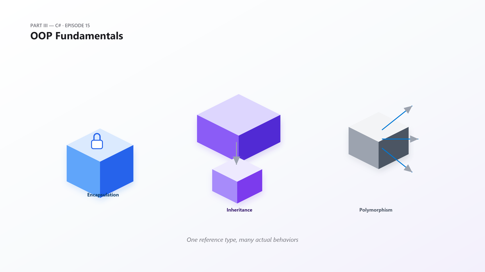
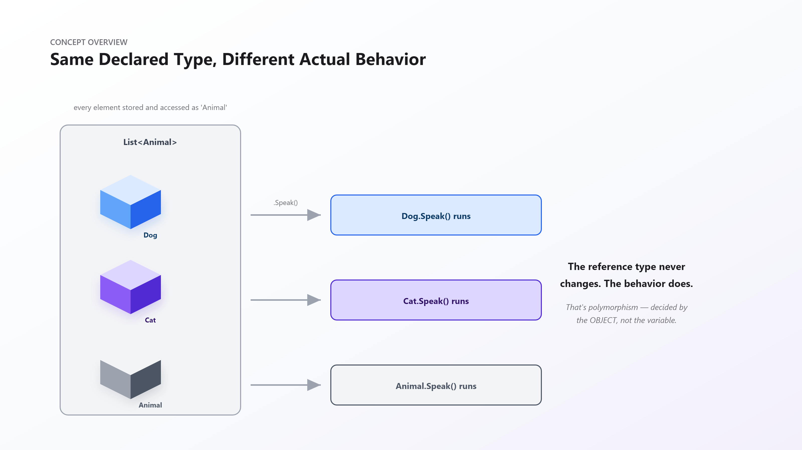
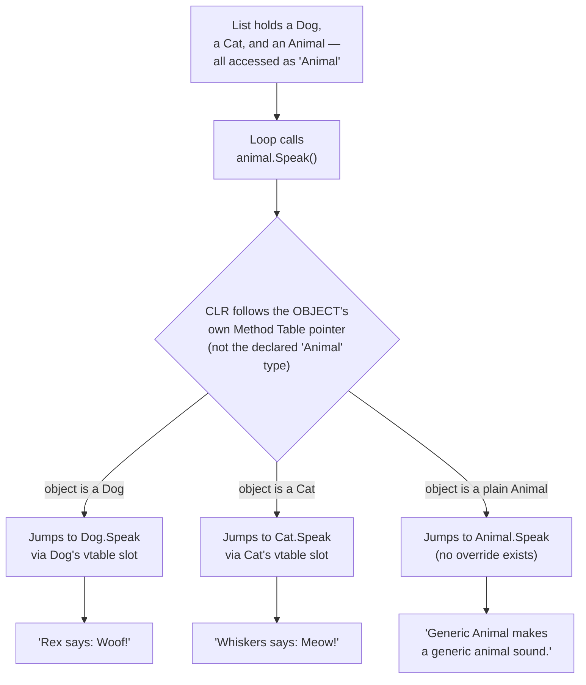
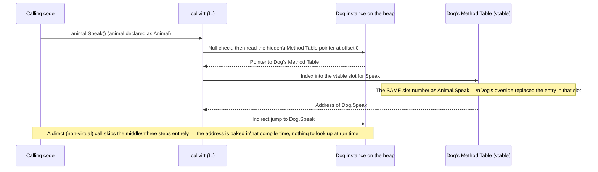
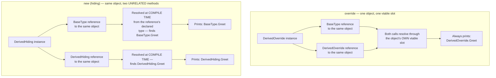
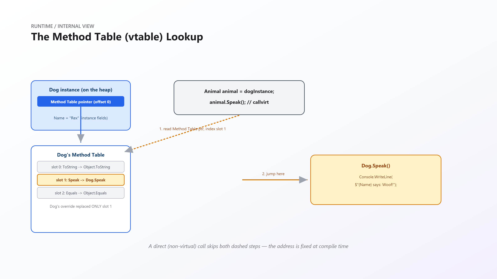
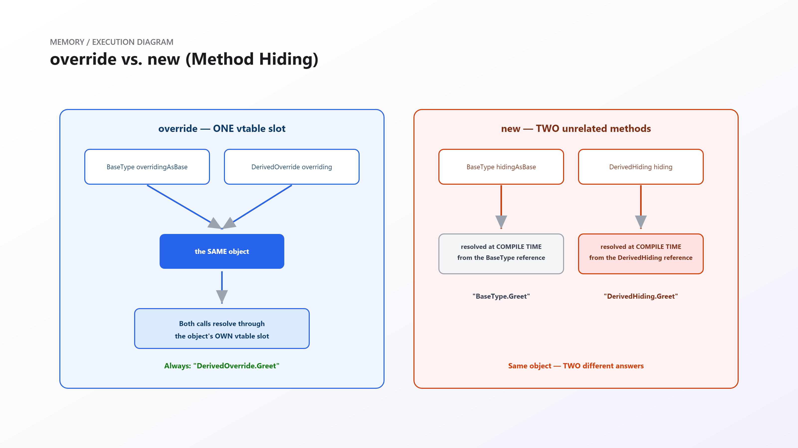
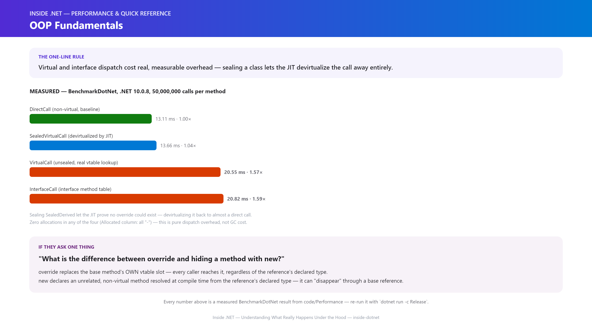

# Inside .NET — Episode 15
## OOP Fundamentals

> *Part III — C#*

---

### Chapter cover




---

### Learning objectives

By the end of this chapter, you will be able to:

- Explain how encapsulation, inheritance, and polymorphism map to concrete CLR mechanisms — not just language keywords — building directly on the object header and Method Table machinery introduced in [Episode 8](../007-object-allocation/article.md).
- Predict, for any given call site, whether `override` or method hiding (`new`) will run — and explain precisely why the *same object* can produce two different answers depending only on which keyword its declaration used.
- Describe exactly what happens inside the CLR during a virtual method call (`callvirt`): the Method Table pointer, the vtable slot lookup, and the indirect jump — and contrast it with a direct, non-virtual call.
- Explain why an interface method call typically costs a little more than a class virtual call, and identify when the JIT can devirtualize a call back to near-direct-call speed.
- Recognize the classic "virtual call in a constructor" hazard and explain, mechanically, why it's dangerous.

### Real-world analogy

It's 2 a.m. and a nurse pages "on-call physician to the ICU." The hospital switchboard doesn't dial a specific doctor's personal number — it looks up whoever is on the on-call roster *right now* and routes the page there. Tonight that's Dr. Patel; tomorrow the roster changes to Dr. Osei, and the exact same page, sent the exact same way, now reaches an entirely different physician — without a single wire at the switchboard being touched.

That's virtual dispatch. The nurse's page is a call through a *reference type* (`OnCallPhysician`), but which actual person answers is decided by whoever's *object* is currently on duty, looked up at the moment of the call — not baked into the page itself.

Contrast that with calling Dr. Smith directly on her personal cell phone. That's a **direct call**: no roster lookup, no indirection, just a fixed number that rings exactly one phone, decided the moment you dialed it, forever. It's faster precisely because there's nothing to look up.

And if a particular operating room is credentialed for exactly one surgeon and no one else will ever be scheduled there, the switchboard operator eventually stops checking the roster for that room at all — they just connect the call directly, because there's only ever been one possible answer. That's **devirtualization**: when the runtime can *prove* no lookup was ever going to change the outcome, it skips the lookup entirely.

### Problem statement

Code that has to know every concrete type it might ever work with, up front, doesn't scale. A billing system that hard-codes `if (type == "CreditCard") ... else if (type == "PayPal") ...` has to be edited, recompiled, and redeployed every time the business adds a new payment provider — even though the actual *logic that places an order* never changed.

Polymorphism solves this: write code against an abstraction (`IPaymentProcessor`, `Animal`), and let each concrete implementation decide what actually happens when that abstraction's method runs. New payment providers become new classes, not new `if` branches in old, already-tested code.

That flexibility isn't free, though. If the compiler can't know in advance which concrete method a call will reach, *something* has to decide at run time — and that something costs real, measurable CPU cycles, every single call. This chapter is about exactly what that "something" is, precisely how much it costs, and precisely when the CLR can avoid paying it at all.

### Visual explanation



A `List<Animal>` can hold a `Dog`, a `Cat`, and a plain `Animal` side by side. Every element is stored and accessed through the exact same declared type — `Animal` — and the loop that calls `.Speak()` on each one never changes. Yet the output is different for every element. The declared type of the *reference* never changes; what changes is the *actual type of the object* the reference happens to point at right now — and that's what decides which method runs.

#### 1. Virtual dispatch, end to end



#### 2. What a `callvirt` actually does



#### 3. `override` vs. `new` (hiding) — same object, different resolution rules



*(Standalone Mermaid sources for all three diagrams live under [`diagrams/mermaid/`](diagrams/mermaid/), numbered to match the order above, per [IMAGE_GUIDE.md](../../IMAGE_GUIDE.md).)*

### Under the hood





1. **Every object carries a hidden Method Table pointer at the very start of its memory layout** — established back in [Episode 8](../007-object-allocation/article.md) when we first looked at what a `new` allocation actually writes to the heap. A virtual call follows *that* pointer, not the compile-time (declared) type of the reference used to make the call. This is the entire mechanical reason polymorphism works at all: the lookup is anchored to the object, never to the variable.
2. **The Method Table contains a vtable — one function-pointer slot per virtual method.** A derived class's vtable starts as a copy of its base class's vtable; `override` **replaces the value already sitting in an existing slot** — it never adds a new one. That's why this chapter's Example demo shows `Dog.Speak` and `Cat.Speak` both running through code that only ever calls `Animal.Speak` by name: both overrides live in the same slot Animal defined, just with different addresses in it.
3. **`new` (method hiding) does not touch the base vtable slot at all.** It declares an entirely separate, non-virtual method, resolved by the *compiler*, at *compile time*, from whatever type the reference is *declared* as. This chapter's Advanced demo proves it directly: the identical object, called through a `DerivedHiding`-typed reference, prints `"DerivedHiding.Greet"`; called through a `BaseType`-typed reference to that *same object*, it prints `"BaseType.Greet"` instead — because the hiding method was never in the running for that second call at all.
4. **A `callvirt` does measurably more work than a plain `call`.** The steps are: null-check the reference, read the object's Method Table pointer, index into the correct vtable slot, then make an indirect jump to whatever address is sitting there. Each step is small, but none of them are free, and this chapter's `DispatchBenchmarks` measures the sum of all of them directly against a baseline with none of them — see Performance Notes.
5. **Interfaces use a separate structure from a class vtable, which is why interface calls aren't simply "the same as virtual calls."** A class has exactly one (single-inheritance) vtable, but it can implement any number of interfaces — so interface method resolution goes through its own Interface Method Table indirection rather than a plain vtable slot index. This chapter's benchmark measured `InterfaceCall` essentially tied with `VirtualCall` (in fact a hair slower) — consistent with "one more layer of indirection," not a dramatically different cost class.
6. **Sealing a class lets the JIT *prove* no override could possibly exist, enabling devirtualization.** When a call's target type is provably sealed (or the method itself is `sealed override`), there is only one implementation that could ever run — so the JIT can replace the indirect vtable jump with a direct call, and in some cases inline it outright. This chapter's `SealedVirtualCall` benchmark measured within **~4% of a genuinely non-virtual call** — not a theoretical claim, an observed one.
7. **Calling a virtual member from inside a constructor is dangerous because the Method Table pointer is set to the *most-derived* type before any constructor body runs — but exactly *which* derived state exists yet is a genuinely surprising, verified nuance, not the simple story it's usually told as.** If a base class's constructor calls a virtual method that a derived class overrides, the *derived* override runs — that much is intuitive. What isn't intuitive: this chapter verified directly that a derived class's field **initializers** (`private string _name = "Derived";`, written on the declaration itself) already ran and ARE visible by that point — it's specifically anything the derived constructor's own **body** was going to set up that hasn't happened yet, because that body only starts executing after the base constructor returns. A field assigned only inside the derived constructor's body is still at its default value (`null`, `0`, etc.) during that virtual call; a field assigned via an inline initializer is not. Don't repeat "derived state isn't initialized yet" as a blanket rule — verify which specific piece of state you're relying on.
8. **This is exactly how Microsoft implements it — not a simplified teaching model.** The Method Table / vtable object model described above is CoreCLR's actual runtime type representation (`src/coreclr/vm/methodtable.h` and related sources in `dotnet/runtime`); a debugger extension like SOS's `!DumpMT` inspects this exact structure on a live, running process, not a conceptual stand-in for it.

### Code example

*Tier: Example + Advanced + Performance + Production.*

#### 1. Example: encapsulation and polymorphism together

```csharp
// SavingsAccount: the private _balance field can only ever change through
// Deposit/Withdraw — the class protects its own invariant. Animal/Dog/Cat
// show virtual dispatch: every element of the List<Animal> is called
// through the SAME declared type, but each one runs its OWN override.

var account = new SavingsAccount(100m, interestRate: 0.02m);
account.Deposit(50m);
account.Withdraw(30m);
Console.WriteLine($"Account balance: {account.Balance:C}");

List<Animal> zoo = [new Dog("Rex"), new Cat("Whiskers"), new Animal("Generic Animal")];
foreach (var animal in zoo)
{
    animal.Speak(); // Same call site. Three different outcomes.
}

abstract class BankAccount
{
    private decimal _balance;
    protected BankAccount(decimal openingBalance) => _balance = openingBalance;
    public decimal Balance => _balance;

    public void Deposit(decimal amount) => _balance += amount;

    public virtual void Withdraw(decimal amount)
    {
        if (amount > _balance) throw new InvalidOperationException("Insufficient funds.");
        _balance -= amount;
    }
}

class SavingsAccount(decimal openingBalance, decimal interestRate) : BankAccount(openingBalance)
{
    public override void Withdraw(decimal amount)
    {
        var fee = amount * 0.001m; // savings-account-specific withdrawal fee
        base.Withdraw(amount + fee);
    }
}

class Animal(string name)
{
    protected string Name { get; } = name;
    public virtual void Speak() => Console.WriteLine($"{Name} makes a generic animal sound.");
}

class Dog(string name) : Animal(name)
{
    public override void Speak() => Console.WriteLine($"{Name} says: Woof!");
}

class Cat(string name) : Animal(name)
{
    public override void Speak() => Console.WriteLine($"{Name} says: Meow!");
}
```

Run it with `dotnet run -c Release` in [`code/Example/`](code/Example/).

#### 2. Advanced Example: `override` vs. `new` (the classic gotcha)

```csharp
DerivedOverride overriding = new();
BaseType overridingAsBase = overriding;
overriding.Greet();          // DerivedOverride.Greet
overridingAsBase.Greet();    // DerivedOverride.Greet — SAME, because override is virtual

DerivedHiding hiding = new();
BaseType hidingAsBase = hiding;
hiding.Greet();              // DerivedHiding.Greet
hidingAsBase.Greet();        // BaseType.Greet — DIFFERENT, because new is resolved
                              // at compile time from the reference's declared type

class BaseType
{
    public virtual void Greet() => Console.WriteLine("BaseType.Greet (virtual)");
}

class DerivedOverride : BaseType
{
    public override void Greet() => Console.WriteLine("DerivedOverride.Greet (override)");
}

class DerivedHiding : BaseType
{
    public new void Greet() => Console.WriteLine("DerivedHiding.Greet (new / hiding)");
}
```

Same underlying object in both blocks. `override` is dispatched through the object's own Method Table, so it can never be "un-overridden" by whatever reference type happens to call it. `new` declares a completely separate, non-virtual method that the compiler resolves at compile time from the reference's declared type — hence the different output. Full runnable version in [`code/Advanced/`](code/Advanced/).

#### 3. Performance: measuring the dispatch cost directly

The performance tier lives in [`code/Performance/`](code/Performance/) — a real `BenchmarkDotNet` project (`DispatchBenchmarks`) comparing a direct call, a virtual call, a devirtualized sealed-class virtual call, and an interface call, 50,000,000 iterations each. See Performance Notes below for the measured results.

#### 4. Production Example: interface-based polymorphism as an architecture tool

```csharp
// OrderService depends ONLY on the IPaymentProcessor abstraction. Which
// concrete processor actually runs is decided once, at composition time —
// OrderService's own code never changes no matter how many providers
// get added later. This is the entire architectural payoff of
// interface-based polymorphism.

interface IPaymentProcessor
{
    bool Charge(decimal amount);
}

class CreditCardProcessor : IPaymentProcessor
{
    public bool Charge(decimal amount)
    {
        Console.WriteLine($"[CreditCard] Charging {amount:C}...");
        return true;
    }
}

class PayPalProcessor : IPaymentProcessor
{
    public bool Charge(decimal amount)
    {
        Console.WriteLine($"[PayPal] Redirecting {amount:C} through PayPal...");
        return true;
    }
}

class OrderService(IPaymentProcessor paymentProcessor)
{
    public void PlaceOrder(string orderId, decimal amount)
    {
        if (paymentProcessor.Charge(amount))
            Console.WriteLine($"Order {orderId} confirmed.");
    }
}
```

Swapping `CreditCardProcessor` for `PayPalProcessor` — or adding a third provider entirely — requires zero changes to `OrderService`. Full version, including a command-line switch between processors, in [`code/Production/`](code/Production/).

### Performance notes



Every number below is a measured `BenchmarkDotNet` result from this chapter's own `code/Performance` project (`.NET 10.0.8, X64 RyuJIT`, 50,000,000 calls per benchmarked method), not an estimate — re-run it yourself with `dotnet run -c Release`.

| Method | Mean | Ratio | Allocated |
|---|---|---|---|
| `DirectCall` (non-virtual, baseline) | 13.11 ms | 1.00 | – |
| `SealedVirtualCall` (devirtualized by JIT) | 13.66 ms | **1.04×** | – |
| `VirtualCall` (unsealed, real vtable lookup) | 20.55 ms | **1.57×** | – |
| `InterfaceCall` (interface method table) | 20.82 ms | **1.59×** | – |

A real, unsealed virtual call costs **57% more** than a direct call here — that's the measured price of the null-check, Method Table read, vtable-slot index, and indirect jump described in "Under the Hood." An interface call costs almost exactly the same as a virtual call, slightly more (**59%**), consistent with the extra Interface Method Table indirection on top of a class vtable lookup.

The standout result is `SealedVirtualCall`: sealing the class let the JIT *prove* no override could exist for it, and it devirtualized the call — the measured cost came back within **4% of a genuinely non-virtual call**, not the ~57-59% overhead the other two virtual paths paid. None of the four benchmarks allocated any managed memory (`Allocated` is `-` across the board), so every millisecond of difference here is pure dispatch overhead, not GC cost — a clean, isolated measurement of exactly the mechanism this chapter describes.

**The takeaway isn't "never use virtual/interfaces"** — it's that the flexibility they buy has a real, measurable, and usually perfectly acceptable price, and `sealed` is a genuine, verifiable performance lever on a hot path where you know for certain no further override will ever exist.

### Common mistakes / anti-patterns

- **Using `new` and thinking you've "overridden" a method.** This chapter's Advanced demo shows the exact failure mode: code that calls the method through a base-typed reference (a very common shape — a `List<BaseType>`, a method parameter typed as the base class) silently runs the *base* implementation, not the one you just wrote, with no compiler warning beyond a hidden-member notice that's easy to miss.
- **Calling a virtual member from a constructor.** As "Under the Hood" #7 verified, this reaches a derived override before that derived instance's own constructor *body* has run — field initializers have already run by then, but anything the constructor body was going to set up hasn't. A bug that often doesn't show up until someone actually derives from your class and relies on constructor-body logic, not a field initializer.
- **Public, mutable fields instead of properties.** A `public decimal Balance;` field can be set to anything, by anyone, bypassing every invariant the class was supposed to protect — the entire point of encapsulation. `SavingsAccount`'s `Balance` above is only ever *readable* from outside and only ever *changeable* through methods that enforce the rules.
- **Deep inheritance hierarchies built for "code reuse."** Every additional level is another vtable slot chain another maintainer has to trace to find which override actually runs — the "fragile base class" problem, where a change to a base class ripples unpredictably through derived classes written years later by someone else. Episode 22 — Composition vs. Inheritance (not yet drafted) will cover when to reach for composition instead.
- **Marking members `virtual` "just in case," with nothing ever overriding them.** Every one of those call sites pays the measured ~57% dispatch tax in this chapter's Performance Notes for a flexibility that's never actually used. If a type is genuinely never meant to be extended, `sealed` isn't defensive paranoia — it's an honest, verifiable statement of intent that also happens to let the JIT devirtualize every call to it.

### Architect's perspective

**Developer Perspective**
*Am I marking this member virtual because something genuinely needs to override it, or just out of habit?*
Default to non-virtual, non-inheritable (`sealed class`) unless you have an actual, present reason for a type to be extended. Adding `virtual` later is a source-compatible change; removing it out from under existing overriders is not.

**Senior Perspective**
*Is this inheritance hierarchy modeling a real "is-a" relationship, or reaching for inheritance where composition would age better?*
A `Dog` genuinely *is an* `Animal` — the relationship is stable and unlikely to need renegotiating. Far more code review time is lost to hierarchies built for convenience ("`ReportGeneratorBase`" with six increasingly-special-cased subclasses) that composition, or a plain interface plus a couple of injected strategies, would have kept flat and independently testable.

**Architect Perspective**
*Where in this system does polymorphism buy real architectural flexibility — a plugin point, a DI-swappable strategy — and where is it just adding vtable indirection to a hot path that will never see a second implementation?*
Interface-based design is what makes dependency injection, plugin architectures, and mockable tests possible at all — that's a real, load-bearing use of the mechanism this chapter measured. But the same mechanism, applied reflexively inside a tight, latency-sensitive inner loop that will only ever have one implementation, is pure cost with no corresponding benefit. Knowing the measured price from this chapter is what turns that into a deliberate trade-off instead of a guess.

### Interview questions

**Q1: What's the difference between `override` and hiding a method with `new`?**
A: `override` replaces the base method's own vtable slot — every caller reaches the derived implementation, regardless of the reference's declared type, because dispatch is resolved from the *object* at run time. `new` declares an entirely separate, non-virtual method resolved by the *compiler*, at compile time, from the reference's *declared* type — the same object can produce two different answers depending only on which type of reference calls it.

**Q2: What actually happens inside the CLR during a virtual method call?**
A: The `callvirt` IL instruction null-checks the reference, reads the object's Method Table pointer (a hidden field at the start of every object), indexes into the correct vtable slot for that method, and makes an indirect jump to whatever address is stored there. A direct (non-virtual) call skips all of that — its target address is fixed at compile time.

**Q3: Why can an interface method call cost slightly more than a class virtual call?**
A: A class has exactly one vtable (single inheritance), but it can implement any number of interfaces, so interface dispatch goes through a separate Interface Method Table rather than a straightforward vtable-slot index — one additional layer of indirection on top of what a class virtual call already does.

**Q4: What is devirtualization, and when can the JIT do it?**
A: Devirtualization is the JIT proving that a particular call site can only ever reach one possible method implementation, and replacing the indirect vtable jump with a direct call (sometimes inlining it outright). It's guaranteed when the target type is `sealed` (or the method is `sealed override`) — there is provably no further override that could exist.

**Q5: Why is calling a virtual member from a constructor dangerous?**
A: An object's Method Table pointer is set to its most-derived type *before* any constructor body runs. If a base constructor calls a virtual method, a derived override runs — but the derived constructor's own *body* hasn't executed yet, so anything it was responsible for setting up isn't there yet. Field **initializers** (assigned inline on the declaration) already ran by this point and are safe to rely on; it's specifically constructor-body logic that isn't.

**Q6: What's the difference between `abstract` and `virtual`?**
A: `virtual` provides a default implementation that a derived class *may* override. `abstract` provides no implementation at all and *forces* every concrete derived class to supply one — and a class containing any abstract member must itself be declared `abstract`, meaning it can never be instantiated directly.

### Quiz

1. Why can the same `List<Animal>`, iterated with the exact same loop, print three different things for three different elements?
2. If `DerivedHiding hiding = new(); BaseType asBase = hiding;`, does `asBase.Greet()` run `DerivedHiding`'s or `BaseType`'s version — and why?
3. What extra step does an interface method call perform that a class virtual call doesn't?
4. What has to be true about a type for the JIT to devirtualize a call to it?
5. Why does calling a virtual method from inside a constructor risk operating on uninitialized state?

<details>
<summary>Answers</summary>

1. Because a virtual call is dispatched through the *object's own* Method Table pointer, not the declared type of the list/reference. Each element's actual (run-time) type determines which override runs, even though every element is stored and accessed as `Animal`.
2. `BaseType`'s version (`"BaseType.Greet"`). `new` is resolved at compile time from the reference's *declared* type — `asBase` is declared as `BaseType`, so the compiler binds that call to `BaseType.Greet`, never reaching the hiding method at all.
3. It goes through a separate Interface Method Table rather than a class's single vtable, because one class can implement many interfaces but has only one (single-inheritance) vtable — that's one more layer of indirection than a class virtual call.
4. The target type (or the specific method) must be provably `sealed` — no further override can exist, so the JIT can replace the indirect vtable jump with a direct call.
5. Because the object's Method Table pointer is already set to the most-derived type before any constructor body runs. A virtual call from a base constructor reaches a derived override, but the derived class's own constructor body — which would initialize its fields — hasn't executed yet.

</details>

### Summary & next chapter


**Key takeaways:**

- **Every object carries a hidden Method Table pointer, and virtual dispatch follows that pointer — never the declared type of the reference used to call it.** That's the entire mechanical basis of polymorphism.
- **`override` replaces one vtable slot; `new` (hiding) creates an unrelated, non-virtual method resolved at compile time from the reference's declared type** — the same object can produce two different answers to the same-looking call depending only on which one was used.
- **A real, measured cost: a virtual call cost 57% more than a direct call, and an interface call 59% more, in this chapter's benchmark** — the price of the null-check, Method Table lookup, vtable-slot index, and indirect jump.
- **Sealing a class lets the JIT devirtualize the call — measured within 4% of a direct call** — a genuine, verifiable performance lever, not a superstition.
- **Calling a virtual member from a constructor reaches a derived override before that derived instance's own constructor body has run** — a real, reproducible hazard, verified directly, and more precise than the usual folklore: field initializers have already run by then; constructor-body logic hasn't.

**What's next:** [Episode 16 — Delegates & Events](../015-delegates-events/article.md) moves from *dispatching to one, statically-known implementation among several* to *dispatching to a dynamically-built list of them* — the `MulticastDelegate` machinery this chapter's Method Table model sits alongside, and the exact mechanism [Episode 14](../013-memory-leaks/article.md) already leaned on to explain the Lapsed Listener leak.

---

**Where you are in the journey:**

```
    Episode 14 — Memory Leaks in a Managed World   (Part II — Memory)
              ↓
  ▶ Episode 15 — OOP Fundamentals   ◀ you are here   (Part III — C#)
              ↓
    Episode 16 — Delegates & Events
```

**Related:** [Episode 14 — Memory Leaks in a Managed World](../013-memory-leaks/article.md) (the `MulticastDelegate`/`Target` mechanics that chapter used to explain the Lapsed Listener leak are the same dispatch machinery this chapter formalizes) · [Episode 8 — Object Allocation](../007-object-allocation/article.md) (the object header and Method Table pointer this entire chapter's dispatch model is built on)
