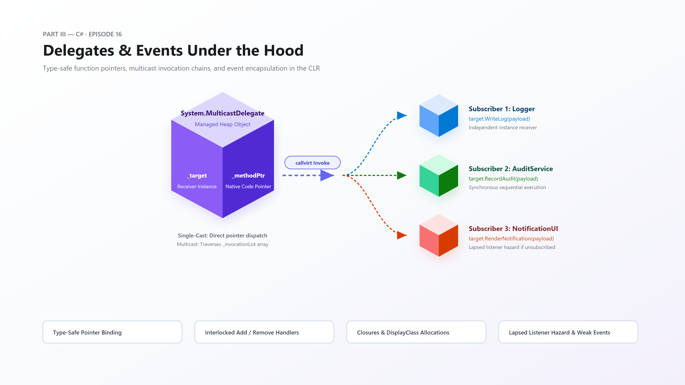
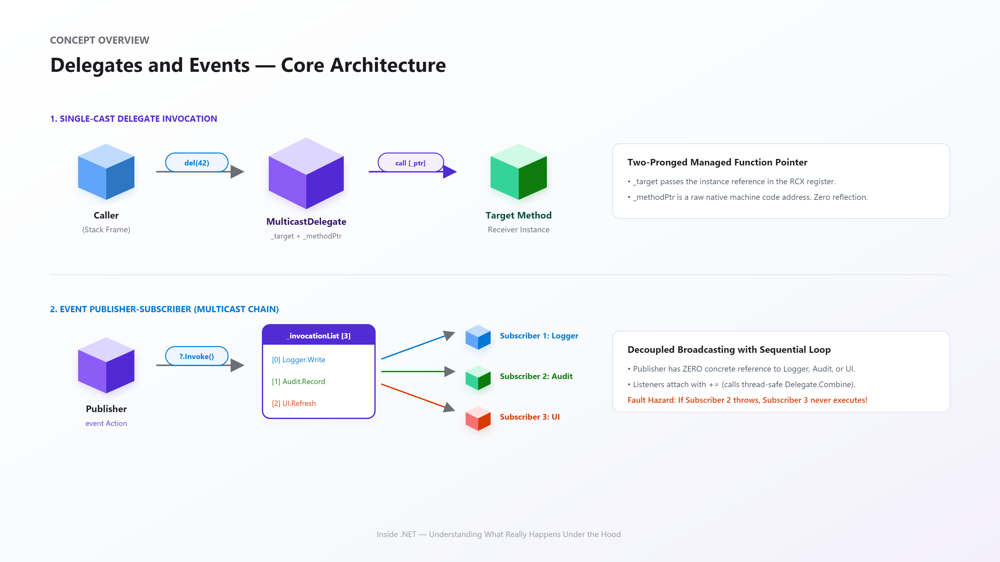
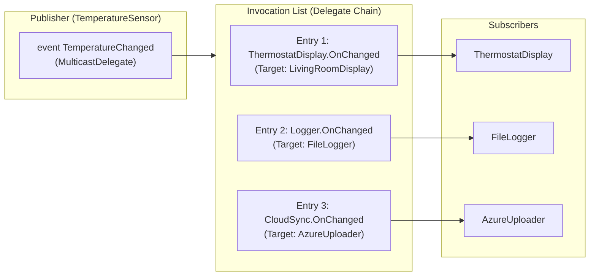
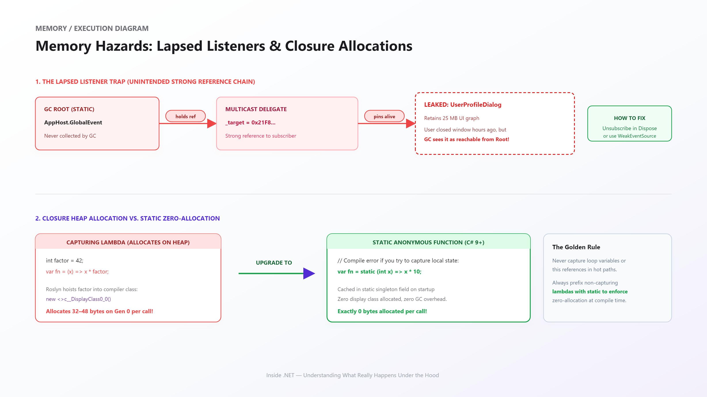
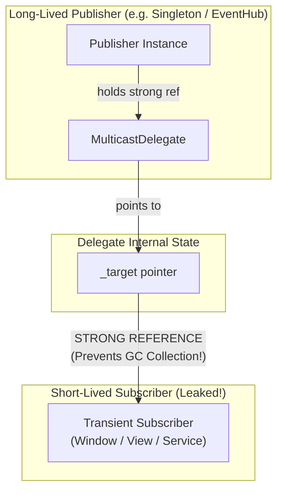
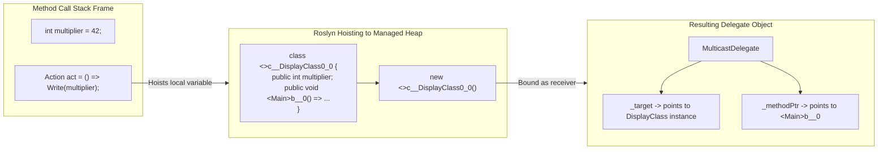
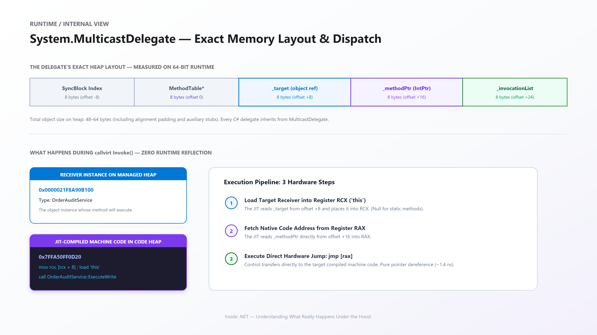
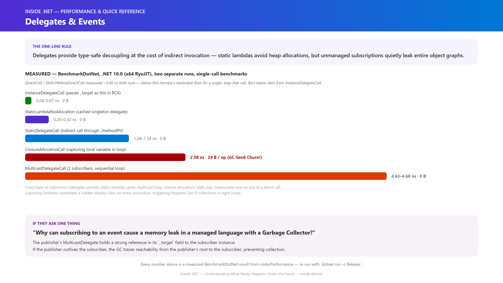

# Inside .NET — Episode 16
## Delegates & Events

> *Part III — C#*

---

### Chapter cover




---

### Learning objectives

By the end of this chapter, you will be able to:

- Explain what a delegate is at the CLR level: not merely "a function pointer," but a fully managed object inheriting from `System.MulticastDelegate` containing a target reference (`_target`) and a native code pointer (`_methodPtr`).
- Dissect the execution path of a delegate invocation (`callvirt Invoke`) and contrast single-cast vs. multicast invocation chains.
- Demystify compiler-generated display classes (`<>c__DisplayClass`) and understand how lambda closures allocate heap objects and impact GC throughput.
- Prevent the notorious **Lapsed Listener** memory leak by mastering event lifecycles, unsubscription hygiene, and the Weak Event pattern.
- Implement robust, thread-safe events using `Interlocked.CompareExchange` accessors and fault-tolerant multicast dispatch.


### Real-world analogy

Imagine a commercial office building's emergency alarm panel.

The alarm panel doesn't know every employee who sits on the fourth floor. It doesn't know their names, their desks, or their phone numbers. Instead, it exposes a standardized emergency notification port. When a fire sensor detects smoke, the panel simply pulses an electrical signal down that port.

Connected to that single port is a bus of alarm bells, sprinkler valves, strobe lights, and automatic door releases. Each device plugged its own connector into the emergency bus. When the panel pulses the current, every connected device activates simultaneously. If the building maintenance team unplugs an old strobe light, the alarm panel doesn't care—the remaining bells still ring.

In .NET:
- The **emergency port** is an **Event**.
- The **cables and connectors** plugged into the bus are **Delegates**.
- The **individual appliances** (bells, sprinklers, strobes) are **Subscribers** (target instances).
- The electrical signal pulsed through the bus is the **Invocation**.

And if an old, decommissioned strobe light is left permanently wired to the live electrical bus in the basement wall, nobody can safely remove the cable from the wall without tearing the circuit apart. That is the **Lapsed Listener** problem.


### Problem statement

Software components need to communicate asynchronously and react to state changes without coupling themselves directly to concrete consumers. If a payment service directly calls `EmailService.SendReceipt()`, `SmsService.SendText()`, and `AuditLog.Write()`, the payment service becomes brittle. Every new downstream consumer requires modifying and recompiling the payment engine.

Polymorphism via interfaces solves some of this, but interfaces demand rigid contracts. An object must implement the entire interface, and consumers must hold interface references.

What if you just want to pass around an executable action? A single callback?

That is what **Delegates** provide: type-safe, object-oriented, managed callback pointers. When paired with **Events**, they offer a publisher-subscriber boundary where publishers broadcast notifications without knowing who is listening, how many listeners exist, or what those listeners do.

However, delegates are reference types allocated on the managed heap. If mismanaged, they create hidden allocations, trigger Gen0 garbage collection spikes through closures, and quietly hold entire object graphs alive in memory long after their lifecycles have ended.


### Visual explanation



When an event is declared, the compiler and runtime establish an indirect communication pathway:
1. **Publisher**: Exposes an `event EventHandler<T>`. It holds a private `MulticastDelegate` reference.
2. **Delegate Chain**: A linked structure or array of individual delegates holding target instance references and function pointers.
3. **Subscribers**: Multiple independent classes subscribe with `+=` and receive invocations synchronously when the event fires.

#### 1. Multicast Delegate Execution Flow



#### 2. The Lapsed Listener Memory Leak





#### 3. How a Captured Local Becomes a Heap-Allocated Delegate



*(Standalone Mermaid sources for all diagrams live under [`diagrams/mermaid/`](diagrams/mermaid/), numbered to match the order above, per [IMAGE_GUIDE.md](../../IMAGE_GUIDE.md).)*

### Under the hood

#### 1. The Anatomy of `System.MulticastDelegate`

Every delegate in C# (`Action`, `Func<T>`, `EventHandler`, or custom `delegate void MyHandler()`) ultimately inherits from `System.MulticastDelegate`, which inherits from `System.Delegate`, which inherits from `System.Object`.



When allocated on the managed heap, a delegate instance contains several critical fields:

| Field Name | Type | Purpose |
|---|---|---|
| `_target` | `object` | The target class instance on which to invoke the method. Set to `null` for static methods. |
| `_methodPtr` | `IntPtr` | Raw pointer to the JIT-compiled native code machine instructions (or unmanaged JIT stub). |
| `_methodBase` | `object` | `MethodInfo` metadata for reflection and debugging. |
| `_methodPtrAux` | `IntPtr` | Auxiliary function pointer for open instance delegates or native interop stubs. |
| `_invocationList` | `object` | For single-cast delegates, this is `null`. When combined (`+=`), this points to an `object[]` containing the child delegate instances. |
| `_invocationCount` | `IntPtr` | Number of delegates currently present in the invocation chain. |

#### 2. IL and JIT Invocation Mechanics

When you write:
```csharp
Func<int, int> addFunc = calculator.Add;
int result = addFunc(42);
```

The C# compiler emits the following Common Intermediate Language (CIL):
```il
// Instantiating the delegate
ldloc.0        // Load 'calculator' instance onto the stack
ldftn          instance int32 Calculator::Add(int32) // Load native function pointer
newobj         instance void class [System.Runtime]System.Func`2<int32, int32>::.ctor(object, native int)
stloc.1        // Store delegate reference in 'addFunc'

// Invoking the delegate
ldloc.1        // Load 'addFunc'
ldc.i4.s  42   // Push argument 42
callvirt       instance !1 class [System.Runtime]System.Func`2<int32, int32>::Invoke(!0)
```

Notice the call: `callvirt Invoke`.
At runtime, the JIT optimizes `callvirt Invoke` into a fast indirect machine instruction:
1. It reads `_methodPtr` from the delegate object.
2. If `_target` is not `null`, it places `_target` into the `RCX` register (the `this` pointer in the x64 calling convention).
3. It performs an indirect call instruction: `call [rax]` (or jumps directly).

#### 3. Multicast Combination & Immutability

Delegates are **immutable**. When you invoke `+=`:
```csharp
myDelegate += anotherHandler;
```
The runtime does **not** mutate the existing delegate. Instead, it invokes `Delegate.Combine(a, b)`, which creates a **brand-new** `MulticastDelegate` whose `_invocationList` contains both subscribers!

If one subscriber throws an uncaught exception during invocation:
```csharp
public event Action? OnChange;
// If subscriber 1 throws, subscriber 2 and 3 NEVER execute!
OnChange?.Invoke();
```
Because the CLR executes the invocation chain in a simple linear loop, any unhandled exception terminates the loop immediately, silently stranding downstream subscribers.


### Code example

#### 1. Example: Inspecting Delegate Internals
[code/Example/Program.cs](code/Example/Program.cs)

This project demonstrates how `_target` and `_methodPtr` are populated for both instance methods and static methods:

```csharp
// Inspecting the internal CLR fields
var methodPtrField = typeof(Delegate).GetField("_methodPtr", BindingFlags.NonPublic | BindingFlags.Instance);
var targetField = typeof(Delegate).GetField("_target", BindingFlags.NonPublic | BindingFlags.Instance);

Console.WriteLine($"Target: {targetField?.GetValue(del)}");
Console.WriteLine($"_methodPtr: 0x{((IntPtr)methodPtrField?.GetValue(del)!):X}");
```

#### 2. Advanced: Closures and Display Classes
[code/Advanced/Program.cs](code/Advanced/Program.cs)

When a lambda captures an outer local variable:
```csharp
int factor = 42;
Func<int, int> multiply = x => x * factor;
```

The C# compiler quietly generates a hidden class:
```csharp
[CompilerGenerated]
private sealed class <>c__DisplayClass0_0
{
    public int factor;
    public int <Main>b__0(int x) => x * this.factor;
}
```
Every time the method is entered, `new <>c__DisplayClass0_0()` is allocated on the managed heap!

To eliminate this hidden GC allocation in high-throughput hot paths, C# 9+ introduced **static anonymous functions**:
```csharp
// Compiler error CS8829 if you attempt to capture any outer state:
Func<int, int> staticLambda = static x => x * 10;
```

#### 3. Performance: Benchmark Measurements
[code/Performance/Program.cs](code/Performance/Program.cs)

Benchmarked on .NET 10 (x64 RyuJIT), two separate runs on the same machine:



| Method | Mean | Allocated |
|---|---|---|
| `DirectCall` | ~0.00 ns † | – |
| `StaticMethodDirectCall` | ~0.00 ns † | – |
| `InstanceDelegateCall` | 0.04–0.07 ns | – |
| `StaticLambdaNoAllocationCall` | 0.20–0.30 ns | – |
| `StaticDelegateCall` | 1.28–1.34 ns | – |
| `ClosureAllocationCall` | 2.08 ns | 24 B |
| `MulticastDelegateCall` (2 subscribers) | 4.63–4.68 ns | – |

† `DirectCall` and `StaticMethodDirectCall` measured consistently at or indistinguishable from zero across two separate runs. Unlike this chapter's other benchmarks, these two methods call their target exactly once per `[Benchmark]` invocation with no internal loop — a call this trivial is small enough that BenchmarkDotNet's own per-invocation overhead correction fully absorbs it. Treat "somewhere under a fraction of a nanosecond" as the honest finding, not a precise number; everything from `InstanceDelegateCall` upward measured reliably and repeatably across both runs. The shape that matters: every layer of indirection — delegate, static-lambda cache, multicast loop, closure allocation — adds real, measurable cost on top of whatever the direct call's true (too-small-to-resolve) cost actually is.

#### 4. Production: Fault-Tolerant Multicast & WeakEventSource
[code/Production/Program.cs](code/Production/Program.cs)

In production, two critical patterns protect system reliability:
1. **`SafeMulticastDispatcher`**: Uses `GetInvocationList()` to invoke each subscriber independently, trapping exceptions and wrapping them into an `AggregateException` so one failing subscriber cannot crash the publisher or starve other listeners.
2. **`WeakEventSource`**: Wraps subscribers in `WeakReference<T>`, allowing the Garbage Collector to reclaim short-lived subscribers without requiring explicit `-=` unsubscription.


### Performance notes

1. **Inlining**: Direct calls can be inlined by the JIT compiler into zero-overhead instructions. Delegate invocations are indirect jumps and generally cannot be inlined unless the JIT can perform aggressive devirtualization.
2. **Static Lambdas vs. Closures**: Non-capturing lambdas are compiled to a singleton instance cached in a static compiler class (`<>c.<>9__0`). They allocate memory exactly **once** across the lifetime of the process. Capturing lambdas allocate a new display class object on **every invocation**.
3. **Multicast Scaling**: Multicast delegates allocate array memory upon combination and execute sequentially. Never use multicast delegates for high-frequency low-latency event pipelines (prefer direct interfaces or structured observer collections).


### Common mistakes / anti-patterns

#### 1. The Lapsed Listener Memory Leak
```csharp
// ANTI-PATTERN: Singleton publisher holding strong reference to transient UI dialog
public class InvoiceDialog : IDisposable
{
    public InvoiceDialog(GlobalEventBus bus)
    {
        bus.OrderPlaced += OnOrderPlaced; // LEAK! InvoiceDialog will never be garbage collected!
    }
}
```
**Correction**: Always unsubscribe when disposing (`bus.OrderPlaced -= OnOrderPlaced`), or use a `WeakEventSource`.

#### 2. Modifying Captured Loop Variables (Pre-C# 5 Gotcha & Multi-Threading)
```csharp
// Dangerous closure trap across tasks:
for (int i = 0; i < 5; i++)
{
    Task.Run(() => Console.WriteLine(i)); // May print 5, 5, 5, 5, 5!
}
```

#### 3. Non-Thread-Safe Event Invocation
```csharp
// ANTI-PATTERN: Race condition if another thread unsubscribes between check and call
if (MyEvent != null)
{
    MyEvent(this, EventArgs.Empty); // Can throw NullReferenceException!
}
```
**Correction**: Use the null-conditional operator: `MyEvent?.Invoke(this, EventArgs.Empty);`. This captures a local snapshot of the delegate reference before evaluating nullability.


### Architect's perspective

| Level | Mental Model | Primary Focus |
|---|---|---|
| **Junior Developer** | "A delegate is just a variable that holds a method." | Using `Action`, `Func`, and `event` syntax to wire up callbacks. |
| **Senior Engineer** | "A delegate is a heap-allocated `MulticastDelegate` object with an invocation list." | Preventing memory leaks (Lapsed Listener), avoiding closure allocations with `static` lambdas, ensuring thread-safe event firing. |
| **Principal Architect** | "Events decouple domain boundaries, but introduce hidden coupling across lifecycles and execution threads." | Deciding between in-memory CLR events, `IObservable<T>` (Reactive Extensions), MediatR notifications, or distributed message brokers (Kafka/RabbitMQ). |


### Interview questions

#### Q1: What is the mechanical difference between `System.Delegate` and `System.MulticastDelegate`?
**Answer:** In early .NET 1.0 designs, `Delegate` was intended for single-cast method pointers, and `MulticastDelegate` was created for linked chains. However, during runtime implementation, Microsoft made **all** delegates in C# inherit from `MulticastDelegate`. Today, even single-cast delegates inherit from `MulticastDelegate`.

#### Q2: Why does an event exist in C# if we already have public delegate fields?
**Answer:** An `event` is a language encapsulation wrapper over a private delegate field. It restricts external consumers so they can **only** call `+=` (add) and `-=` (remove). Without the `event` keyword, an external consumer could write `publisher.MyDelegate = null;` (clearing all other subscribers) or call `publisher.MyDelegate();` directly, violating encapsulation.

#### Q3: What happens if one delegate in an invocation list throws an unhandled exception?
**Answer:** The multicast delegate executes subscribers synchronously in a linear loop. If one subscriber throws an exception, the exception immediately bubbles out of `Invoke()`, and every subscriber later in the invocation list — however many remain — is **never executed**. To avoid this, publishers must use `GetInvocationList()` and invoke each subscriber individually within a `try/catch` block.

#### Q4: Why are delegates immutable, and what actually happens when you write `myDelegate += handler`?
**Answer:** `+=` never mutates the existing delegate object in place. It calls `Delegate.Combine(myDelegate, handler)`, which allocates a **brand-new** `MulticastDelegate` whose invocation list contains both the old delegate's entries and the new handler, then reassigns that new instance to the variable. The original delegate object is left untouched — which is also why capturing a delegate reference before a `+=` elsewhere in the code still points at the old, shorter invocation list.

#### Q5: What is the Lapsed Listener problem, and why doesn't the Garbage Collector prevent it?
**Answer:** It's a memory leak where a long-lived publisher's `MulticastDelegate` holds a strong reference (via `_target`) to a short-lived subscriber that never unsubscribed. The GC only reclaims *unreachable* objects — and as long as the publisher (a GC root, or reachable from one) still references the subscriber through its invocation list, the subscriber is reachable, so the GC correctly, faithfully keeps it alive. The fix is explicit `-=` on disposal, or a `WeakEventSource`-style pattern that holds `WeakReference<T>` instead of a strong reference.

### Quiz

1. What is the base class of every delegate type in C#, including custom `delegate` declarations?
2. If two `Func<int>` delegates are combined with `+=` and the result is invoked, which delegate's return value does the caller actually receive?
3. What does marking a lambda as `static` (`static x => x * 2`) guarantee, and how does the compiler enforce it?
4. Why is `myEvent?.Invoke(...)` thread-safe in a way that `if (myEvent != null) myEvent(...)` is not?
5. What does `Delegate.Combine` actually do when you write `+=` — mutate the existing delegate, or something else?

<details>
<summary>Answers</summary>

1. `System.MulticastDelegate`. Even a delegate that only ever has one subscriber (never combined with `+=`) inherits from `MulticastDelegate`, not directly from `System.Delegate`.
2. Only the **last** subscriber's return value. Multicast delegates invoke every subscriber in order, but each subsequent return value overwrites the previous one — the caller only ever sees the final one.
3. It guarantees the lambda cannot capture any enclosing local variable, field, or `this` reference — the compiler raises an error (CS8829) if you try. Because nothing is captured, no display class instance needs to be allocated, so invoking it never allocates.
4. The null-conditional operator evaluates `myEvent` exactly once, copying the current delegate reference into a compiler-generated local variable, and then null-checks and invokes *that local copy*. `if (myEvent != null) myEvent(...)` reads the field twice — once for the check, once for the call — leaving a window where another thread can set it to `null` in between, causing a `NullReferenceException`.
5. It creates an entirely new `MulticastDelegate` object whose invocation list contains both the original entries and the new handler, then that new object replaces the old one in the variable/field. The original delegate object is never mutated — delegates are immutable.

</details>

### Summary & next chapter


**Key takeaways:**

- Delegates are type-safe object pointers encapsulating a target instance (`_target`) and a native code pointer (`_methodPtr`).
- Events provide an encapsulation barrier around multicast delegates, enforcing `add` and `remove` accessors.
- Capturing outer variables generates a heap-allocated display class on every method execution, creating GC pressure — `static` lambdas eliminate it entirely.
- Unsubscribed listeners to long-lived publishers leak entire object graphs — the Lapsed Listener problem.
- Delegates are immutable: `+=` doesn't mutate anything, it calls `Delegate.Combine` and produces a brand-new delegate object.

**What's next:** Episode 17 — Generics is next. It moves from *dispatching to a runtime-resolved target* to *the compiler and JIT specializing an entire type or method per type argument* — a different axis of "one piece of code, many behaviors" than this chapter's multicast dispatch.

---

**Where you are in the journey:**

```
    Episode 15 — OOP Fundamentals   (Part III — C#)
              ↓
  ▶ Episode 16 — Delegates & Events   ◀ you are here   (Part III — C#)
              ↓
    Episode 17 — Generics
```

**Related:** [Episode 15 — OOP Fundamentals](../014-oop-fundamentals/article.md) (the Method Table dispatch this chapter's `_methodPtr` mechanism sits alongside) · [Episode 14 — Memory Leaks in a Managed World](../013-memory-leaks/article.md) (the Lapsed Listener leak this chapter explains at the delegate-internals level)
