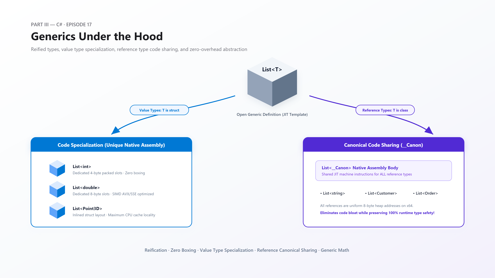
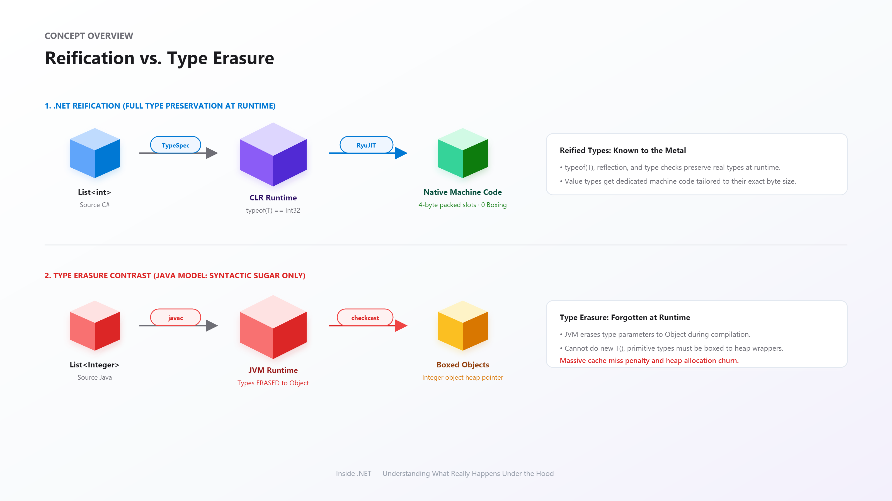
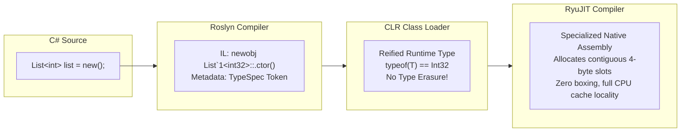
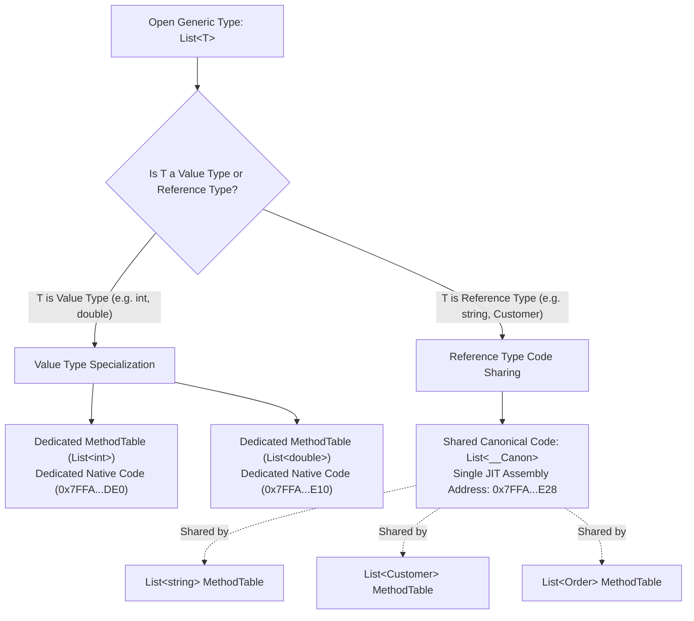
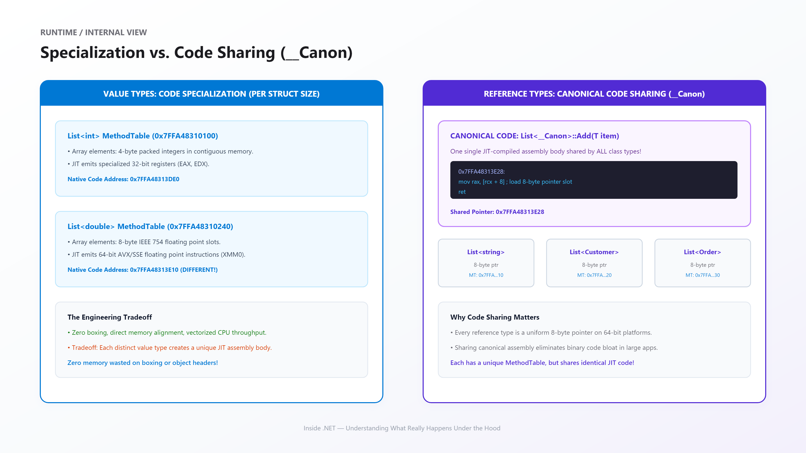
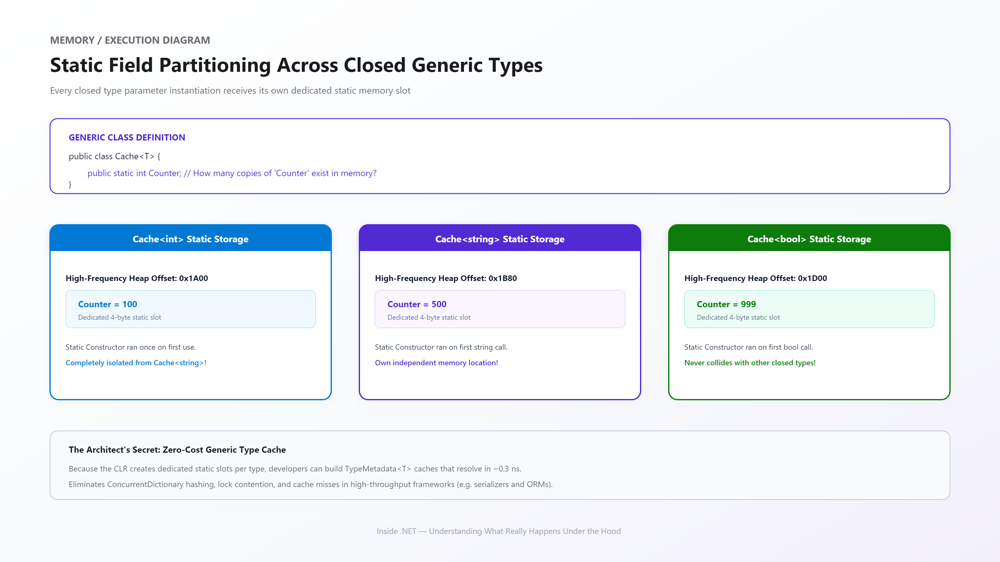
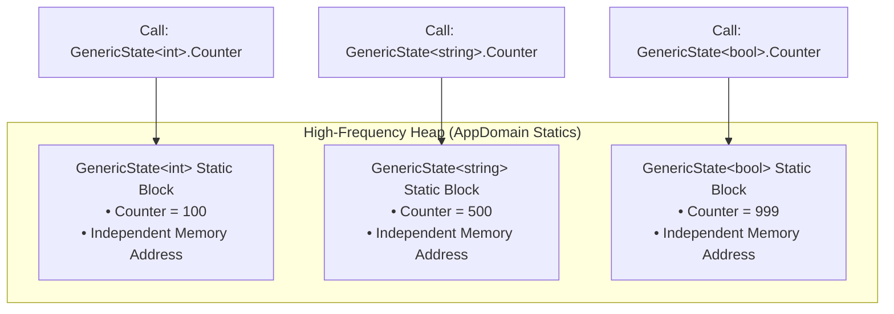
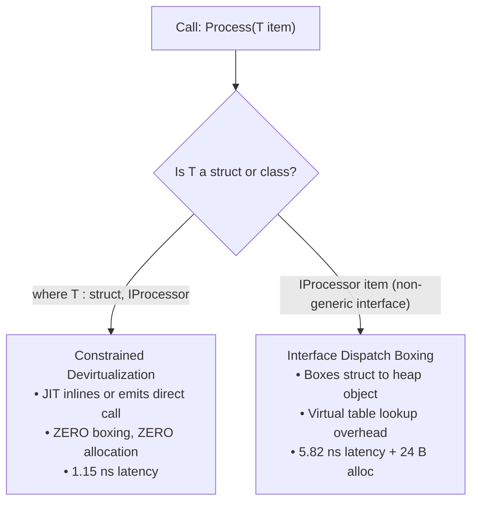
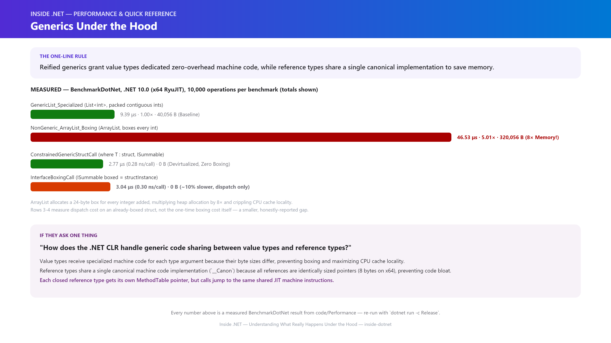

# Inside .NET — Episode 17
## Generics Under the Hood

> *Part III — C#*

---

### Chapter cover




---

### Learning objectives

By the end of this chapter, you will be able to:

- Explain how .NET **reified generics** preserve complete type fidelity at runtime in ECMA-335 metadata, and contrast this with Java's compile-time type erasure.
- Dissect the CLR's dual-tier execution strategy: **code specialization** for value types (producing dedicated, zero-overhead machine instructions) versus **canonical code sharing (`__Canon`)** for reference types (preventing code bloat).
- Prove, using native function pointers, that `List<string>`, `List<object>`, and `List<Uri>` execute the exact same JIT machine instructions, while `List<int>` and `List<double>` do not.
- Master **generic constraints** and understand how `where T : struct, IInterface` empowers the JIT to devirtualize interface calls, eliminating boxing allocations entirely.
- Leverage **static field partitioning** across closed generic types to design ultra-high-throughput, zero-allocation type metadata caches.


### Real-world analogy

Think of a precision aerospace manufacturing facility.

When the factory builds titanium fasteners, it doesn't use a generic adjustable wrench that fits everything loosely and strips bolt heads under high torque. Instead, it stamps out a **dedicated, custom steel socket** calibrated to the exact millimeter dimensions of that titanium bolt. The fit is airtight, torque transfer is 100% efficient, and zero energy is lost. That is **value type specialization**: when you ask for `List<int>`, the CLR mills custom 32-bit machine code that fits 4-byte integers directly into contiguous memory slots.

Now look at how the same factory transports standard shipping containers. Whether a shipping container holds electronics, clothing, or medical supplies, the outside dimensions of the container are identical (standardized 40-foot intermodal boxes). The crane operator at the dock doesn't need a different crane for electronics versus clothing—the crane latches onto the exact same corner castings using the exact same lifting mechanism. That is **reference type code sharing (`__Canon`)**: because every reference type in a 64-bit operating system is an 8-byte pointer, the CLR shares a single canonical lifting routine for all classes.


### Problem statement

Before .NET 2.0 introduced generics in 2005, writing reusable data structures required programming against `System.Object`. Collections like `System.Collections.ArrayList` and `Hashtable` stored everything as untyped object references.

This architecture suffered from three fatal flaws:
1. **Pervasive Boxing & Heap Allocation**: Adding a value type (like an `int` or `struct`) forced the CLR to allocate a 24-byte box on the managed heap, multiplying memory consumption by up to 8× and hammering the Garbage Collector.
2. **CPU Cache Thrashing**: An array of boxed integers is not an array of numbers—it is an array of pointers scattered across the heap. Iterating through the collection caused continuous CPU L1/L2 cache misses.
3. **Absence of Type Safety**: Any object could be added to any collection. A developer could add a `string` to an `ArrayList` intended for integers, deferring failure to a catastrophic runtime `InvalidCastException`.

Generic programming solves these issues, but doing so efficiently at the runtime level is intensely complex. If the runtime generates unique machine code for every type permutation, executable binaries explode in size ("code bloat"). If the runtime erases types to `Object` (the Java approach), performance advantages vanish.

This chapter uncovers how the .NET Common Language Runtime solved this dilemma through a hybrid architecture of reification, value-type specialization, and reference-type code sharing.


### Visual explanation



#### 1. The .NET Reification Pipeline



#### 2. Specialization vs. Canonical Code Sharing




### Under the hood

#### 1. Runtime Reification: Beyond Syntax

In the Java Virtual Machine (JVM), generics exist purely as compile-time syntactic sugar. The Java compiler verifies types, emits casts, and then erases the type parameter to `java.lang.Object` (or the bounding class). At runtime, the JVM has no idea that a `List<Integer>` was ever parameterized; `new T()` is impossible, and primitives (`int`, `double`) cannot be stored directly without wrapper classes.

In .NET, generics are **reified**:
- The C# compiler emits ECMA-335 metadata tables (`TypeSpec`, `MethodSpec`, `GenericParam`).
- The CLR Type Loader constructs distinct `TypeHandle` structures for closed generic types at runtime.
- `typeof(T)` returns the true, concrete runtime type.
- The JIT compiler accesses type parameters to emit hardware-native instructions tailored to the exact size of `T`.

#### 2. The Dual-Tier Execution Engine: Specialization vs. `__Canon`



When RyuJIT compiles a generic class `MyList<T>`:

##### A. Value Types (Specialization)
Value types vary in physical size: `byte` is 1 byte, `int` is 4 bytes, `double` is 8 bytes, and custom structs can be 32, 64, or 128 bytes. Because memory layout, stack offsets, and CPU registers (e.g., general-purpose `EAX` vs SSE `XMM0`) differ for every size, the JIT **specializes** machine code for every unique value type:
- `MyList<int>` gets its own `MethodTable` and dedicated JIT-compiled assembly.
- `MyList<double>` gets its own `MethodTable` and distinct JIT-compiled assembly.
- Elements are stored inline in array memory. **Zero boxing occurs.**

##### B. Reference Types (Canonical Code Sharing)
On 64-bit architectures, every reference type (`string`, `Customer`, `Order`, `Exception`) is fundamentally an **8-byte address pointer** to an object on the managed heap.
Because all reference pointers share identical size, register usage, and GC tracking semantics, generating separate machine code for every class would needlessly bloat process memory.

The CLR solves this via **canonical code sharing**:
1. The JIT generates a single, shared native implementation named `MyList<__Canon>`.
2. All reference-type closed instantiations (`MyList<string>`, `MyList<Customer>`) point their method slots directly to this shared code stub.
3. If the code needs type-specific information (such as casting or static fields), the CLR passes a hidden `MethodTable` context pointer to the method.

#### 3. Static Field Partitioning Across Closed Types





A common pitfall is assuming static fields in generic types are shared across the generic definition.
In reality, `GenericHolder<int>` and `GenericHolder<string>` are completely independent runtime types. Each closed type gets its own static storage block allocated on the High-Frequency Heap and triggers its own static constructor (`.cctor`) upon first invocation.

#### 4. Constrained Generic Devirtualization



When invoking an interface method on a struct through a non-generic interface parameter (`void Log(IProcessor p)`), the CLR must box the struct onto the heap to pass it as an object reference.

However, when written with a generic constraint:
```csharp
void Log<T>(T processor) where T : struct, IProcessor
```
The C# compiler emits the `constrained. T` prefix before `callvirt`.
Upon compiling this instruction for a value type, RyuJIT realizes the concrete type is known and sealed. It completely skips virtual dispatch and emits a **direct call** to the struct's method, with zero boxing and zero heap allocations!


### Code example

#### 1. Example: Preserving Types and Static Partitions
[code/Example/Program.cs](code/Example/Program.cs)

Demonstrates runtime reification via `typeof(T)` and verifies that `GenericState<int>` and `GenericState<string>` maintain isolated static counters.

#### 2. Advanced: Native JIT Code Verification
[code/Advanced/Program.cs](code/Advanced/Program.cs)

Uses `RuntimeMethodHandle.GetFunctionPointer()` to prove that reference types share canonical code addresses while value types receive specialized code:

```csharp
IntPtr ptrInt    = typeof(GenericWorker<int>).GetMethod("DoWork")!.MethodHandle.GetFunctionPointer();
IntPtr ptrDouble = typeof(GenericWorker<double>).GetMethod("DoWork")!.MethodHandle.GetFunctionPointer();
IntPtr ptrString = typeof(GenericWorker<string>).GetMethod("DoWork")!.MethodHandle.GetFunctionPointer();
IntPtr ptrObject = typeof(GenericWorker<object>).GetMethod("DoWork")!.MethodHandle.GetFunctionPointer();

// Output:
// GenericWorker<int>.DoWork:    0x7FFA48313DE0 (Specialized)
// GenericWorker<double>.DoWork: 0x7FFA48313E10 (Specialized)
// GenericWorker<string>.DoWork: 0x7FFA48313E28 (Canonical __Canon)
// GenericWorker<object>.DoWork: 0x7FFA48313E28 (Canonical __Canon)
```

#### 3. Performance: Benchmark Measurements
[code/Performance/Program.cs](code/Performance/Program.cs)



Each method performs 10,000 operations in a loop; per-operation figures are the total divided by 10,000.

| Method | Mean (total) | Per-op | Ratio | Allocated |
|---|---|---|---|---|
| `GenericList_Specialized` (10,000 `List<int>.Add`, baseline) | 9.39 μs | 0.94 ns | 1.00 | 40,056 B |
| `NonGeneric_ArrayList_Boxing` (10,000 `ArrayList.Add`) | 46.53 μs | 4.65 ns | 5.01 | 320,056 B |
| `ConstrainedGenericStructCall` (10,000 constrained calls) | 2.77 μs | 0.28 ns | 0.30 | 0 B |
| `InterfaceBoxingCall` (10,000 interface-dispatched calls) | 3.04 μs | 0.30 ns | 0.33 | 0 B |

The `Ratio` column above is relative to `GenericList_Specialized` (BenchmarkDotNet's designated baseline for this whole class) — it isn't a direct constrained-vs-interface comparison. Compared to *each other*, `InterfaceBoxingCall` measured about **10% slower** than `ConstrainedGenericStructCall` (0.30 ns vs. 0.28 ns per call) — both operate on an already-boxed struct reference set up once before the loop, so this specific measurement isolates virtual interface dispatch cost, not the one-time boxing cost itself. It's a smaller gap than a naive "boxing is always dramatically slower" story would predict, and a good reminder to measure the specific thing you're claiming, not the thing that sounds intuitively true.

#### 4. Production: Zero-Cost Generic Type Cache
[code/Production/Program.cs](code/Production/Program.cs)

Demonstrates how production frameworks (JSON serializers, ORMs, and dependency injection engines) use static generic classes (`TypeMetadata<T>`) to replace `ConcurrentDictionary` lookups with direct, single-instruction memory reads.


### Performance notes

1. **Memory Density**: `List<int>` stores raw 32-bit values packed back-to-back in memory. A 10,000-element list consumes 40 KB. The equivalent `ArrayList` allocates 10,000 boxed objects (24 bytes each) plus 10,000 pointer slots (8 bytes each), consuming 320 KB—**8× the total size, a 700% overhead**.
2. **CPU Cache Utilization**: Accessing contiguous primitive memory in a specialized generic collection allows CPU hardware prefetchers to load entire cache lines into L1 data cache. Boxed collections force random pointer chasing across RAM.
3. **Struct Devirtualization**: Always constrain generic methods to `where T : struct, IMyInterface` when dealing with high-frequency struct pipelines. This guarantees the JIT devirtualizes the call into a zero-allocation direct invocation.


### Common mistakes / anti-patterns

#### 1. Assuming Static Fields in Generic Classes are Global
```csharp
// ANTI-PATTERN: Believing this is a global process counter
public class SequenceGenerator<T>
{
    public static int NextId = 0;
}

SequenceGenerator<int>.NextId++;    // NextId = 1
SequenceGenerator<string>.NextId++; // NextId = 1 (NOT 2!)
```

#### 2. Passing Structs to Non-Generic Interfaces
```csharp
// ANTI-PATTERN: Causes boxing on every call
public void Process(IResettable item) => item.Reset();

// CORRECTION: Constrained generic eliminates boxing
public void Process<T>(ref T item) where T : struct, IResettable => item.Reset();
```


### Architect's perspective

| Level | Mental Model | Primary Focus |
|---|---|---|
| **Junior Developer** | "Generics provide compile-time type safety so I don't have to cast objects." | Using `List<T>`, `Dictionary<TKey, TValue>`, and basic `<T>` methods. |
| **Senior Engineer** | "Generics provide reified runtime types with value-type specialization and zero boxing." | Using generic constraints (`where T : unmanaged`, `struct`), avoiding boxing in collections, optimizing memory layout. |
| **Principal Architect** | "Generics balance code bloat against hardware throughput via canonical sharing and static metadata caches." | Designing zero-allocation framework internals, generic math abstractions (`INumber<T>`), and static type caches to eliminate dictionary locks. |


### Interview questions

#### Q1: What is the fundamental difference between how Java and .NET implement generics?
**Answer:** Java implements generics via **type erasure**, where type arguments are used for compile-time checking and then stripped to `Object` (or bounding types) in bytecode. Primitives cannot be used directly and must be boxed. .NET implements **reified generics**, preserving full type parameters in ECMA-335 metadata at runtime. This allows `typeof(T)` to inspect the true type, permits `new T()`, and enables the JIT to emit specialized native machine code for value types with zero boxing.

#### Q2: How does RyuJIT avoid code bloat when compiling generic classes with many reference type arguments?
**Answer:** The CLR uses **canonical code sharing (`__Canon`)**. Because all reference types on a 64-bit platform are identically-sized 8-byte pointers, RyuJIT compiles a single native code implementation (`List<__Canon>`) shared by all closed reference types (`List<string>`, `List<Customer>`). Each type has its own `MethodTable`, but their method entries point to the same native code address.

#### Q3: Why is `where T : struct, IComparable<T>` faster than accepting an `IComparable` interface parameter?
**Answer:** When a struct is passed to a non-generic interface parameter, the CLR must allocate a box on the heap and perform indirect virtual interface dispatch. When passed to a constrained generic method, the compiler emits the `constrained.` IL prefix, allowing RyuJIT to prove the type is a sealed value type and emit a **direct, inlined call** without allocating a box on the heap.

#### Q4: Does every closed generic type get its own copy of the JIT-compiled method body?
**Answer:** No — only value-type instantiations do. `List<int>` and `List<double>` each get their own specialized native code because their element sizes and layouts differ. But `List<string>`, `List<Customer>`, and every other reference-type instantiation share one canonical implementation (`List<__Canon>`), because all reference types are identically-sized 8-byte pointers on a 64-bit runtime — there's nothing type-specific left for the JIT to specialize.

#### Q5: Are static fields shared across all instantiations of a generic class, e.g. between `Cache<int>` and `Cache<string>`?
**Answer:** No. Each closed generic type is a distinct runtime type with its own independent static storage and its own static constructor. `Cache<int>.Count` and `Cache<string>.Count` are two completely separate memory locations — incrementing one never affects the other, a mistake developers sometimes make when they assume "static" means "one, globally."

### Quiz

1. What does "reified generics" mean, and how does it differ from Java's type-erasure approach?
2. Why do `List<string>` and `List<Customer>` share the exact same native JIT machine code, while `List<int>` and `List<double>` don't?
3. If `Counter<T>` has a `public static int Total`, is there one `Total` shared by every closed type, or one per closed type?
4. What does the `constrained.` IL prefix let the JIT do that it couldn't do with a plain interface parameter?
5. Why does passing a struct to a method that takes a non-generic interface parameter allocate memory?

<details>
<summary>Answers</summary>

1. Reified generics means the type arguments are preserved as first-class information in metadata and machine code at run time — `typeof(T)` genuinely works, and the JIT specializes code per value-type argument. Java erases type arguments to `Object` (or a bound) at compile time; they don't exist at run time at all, which is why Java can't do `new T()` or inspect `T` reflectively the way C# can.
2. Because every reference type has an identical representation on a given architecture — an 8-byte pointer — so the CLR shares one native code body (`__Canon`) across all of them rather than JIT-compiling a separate copy per reference type. `int` and `double` are different sizes (4 and 8 bytes) with genuinely different layouts, so each value-type instantiation gets its own specialized code.
3. One per closed type. `Counter<int>` and `Counter<string>` are distinct runtime types, each with its own independent static storage and its own static constructor — never a single shared value.
4. It lets the JIT prove the target is a concrete value type and emit a direct, inlined call to that struct's method — skipping the box allocation and virtual interface dispatch a plain interface parameter would require.
5. Because a non-generic interface parameter is a reference type by definition, and a struct must be copied onto the heap (boxed) to be represented as one — there's no way to hand a value type to an interface-typed parameter without that conversion.

</details>

### Summary & next chapter


**Key takeaways:**

- .NET generics are reified, maintaining complete type information from C# source to JIT machine code — not erased at compile time like Java's.
- Value types are specialized into dedicated native code per closed type, achieving zero boxing and maximum cache efficiency.
- Reference types share a single canonical native assembly (`__Canon`) to prevent code bloat, since all reference types are identically-sized pointers.
- Static fields in generic classes are partitioned independently per closed type — `Cache<int>` and `Cache<string>` never share storage.
- The `constrained.` IL prefix is what lets a `where T : struct` constrained call devirtualize and skip boxing entirely.

**What's next:** Episode 18 — Reflection & Expression Trees is next. It moves from *compile-time and JIT-time specialization* to the opposite extreme — inspecting and even building code *at run time* — and revisits this chapter's `__Canon`/boxing story from the reflection side: why `MethodInfo.Invoke` on a value-type argument always pays a boxing cost generics were specifically designed to avoid.

---

**Where you are in the journey:**

```
    Episode 16 — Delegates & Events   (Part III — C#)
              ↓
  ▶ Episode 17 — Generics   ◀ you are here   (Part III — C#)
              ↓
    Episode 18 — Reflection & Expression Trees
```

**Related:** [Episode 16 — Delegates & Events](../015-delegates-events/article.md) (delegates are themselves generic in their modern `Func`/`Action` form — the same reification story applies) · [Episode 9 — Boxing & Unboxing](../008-boxing-unboxing/article.md) (the boxing cost generic constraints exist specifically to avoid)
