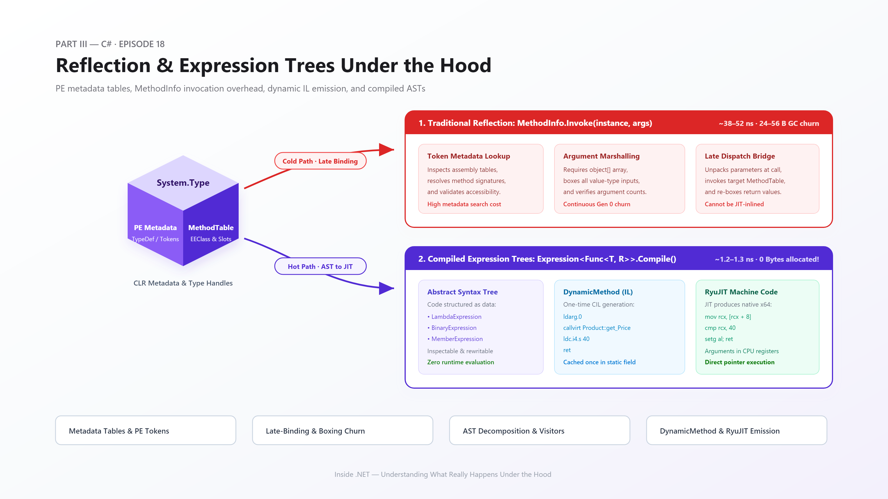

# Chapter 017: Reflection & Expression Trees Under the Hood

> **Part III: C# Language Internals** · *Episode 18*

## Overview

Welcome to Episode 18 of **Inside .NET**. In this chapter, we explore the runtime mechanics of .NET metaprogramming: how ECMA-335 metadata tables store type definitions, why traditional `MethodInfo.Invoke` incurs massive performance penalties, and how Abstract Syntax Trees (ASTs) in `System.Linq.Expressions` enable zero-overhead dynamic execution via `DynamicMethod` and RyuJIT compilation.

## Chapter Contents

- [Full Article](article.md) — 13-section comprehensive deep dive.
- [Executive Summary](summary.md) — Quick architectural review.
- [Quiz](quiz.md) — 10 rigorous technical questions with detailed explanations.
- [Frequently Asked Questions (FAQ)](faq.md) — Practical guidance and real-world gotchas.
- [Interview Preparation](interview.md) — Deep technical interview questions and answers.
- [Hands-on Exercises](exercises.md) — Practical code challenges.
- [Academic & Official References](references.md) — ECMA-335 specs, Roslyn source, and BenchmarkDotNet results.

## Code Demonstrations

All examples target **.NET 10.0** and build cleanly:
- [code/Example](code/Example/) — Core reflection inspection and manual AST construction.
- [code/Advanced](code/Advanced/) — High-speed property accessor generator and `ExpressionVisitor` rewriting.
- [code/Performance](code/Performance/) — BenchmarkDotNet comparison of invocation strategies.
- [code/Production](code/Production/) — Real-world compiled object mapper with static generic caching.

**Previous:** [Episode 17 — Generics Under the Hood](../016-generics/README.md)
**Next:** Episode 19 — Records & Pattern Matching *(not yet written)*
