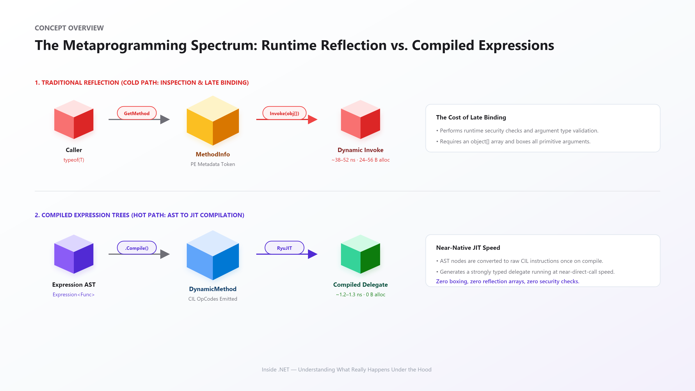
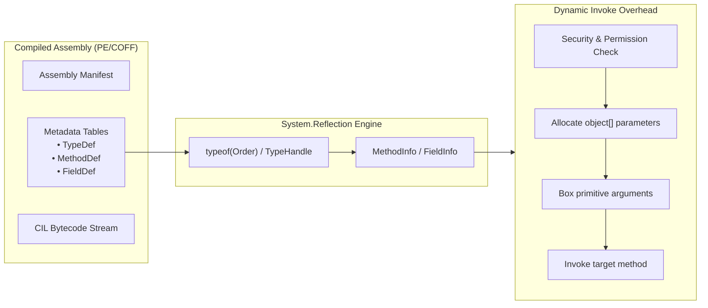
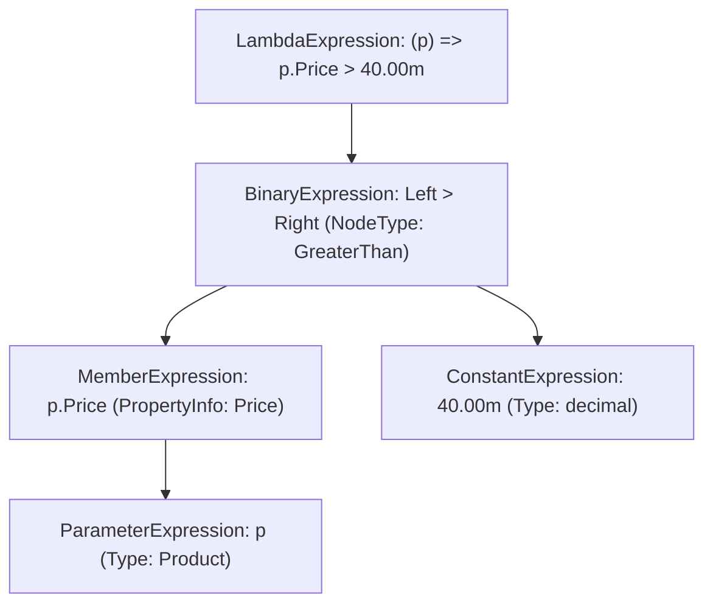
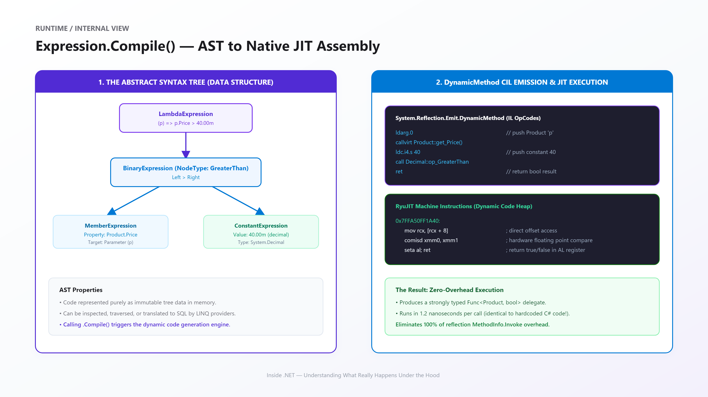
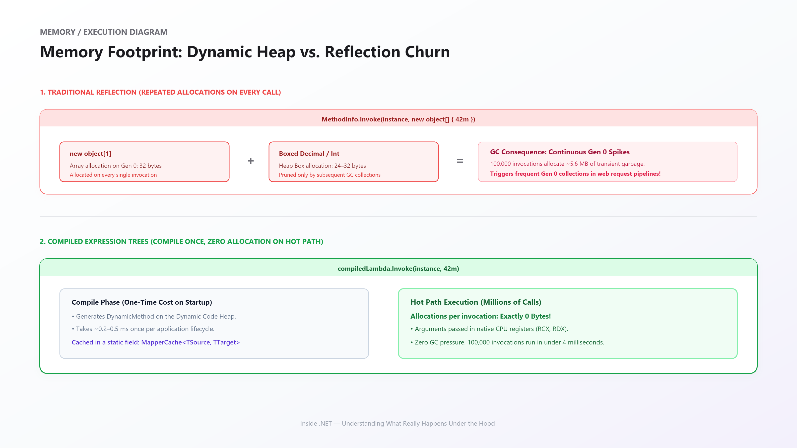
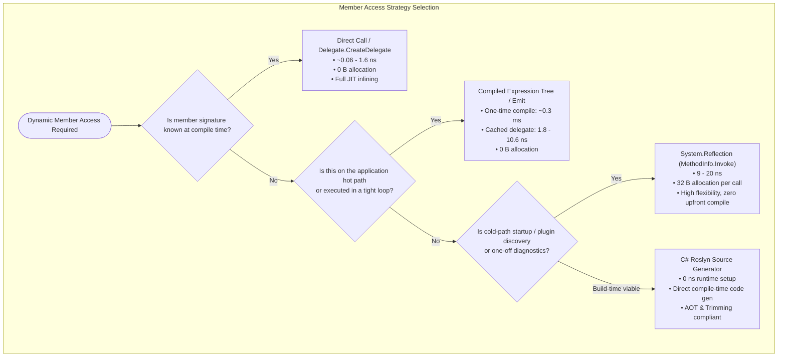

# Inside .NET — Episode 18
## Reflection & Expression Trees Under the Hood

> *Part III — C#*

---

### Chapter cover


---

### Learning objectives

By the end of this chapter, you will be able to:

- Dissect ECMA-335 metadata tables (`TypeDef`, `MethodDef`, `FieldDef`) and explain how `System.Type` navigates PE tokens at runtime.
- Measure and quantify the exact performance overhead of `MethodInfo.Invoke`—specifically runtime security/visibility checks, parameter array allocation (`object[]`), and value-type boxing.
- Understand the architecture of the **Expression Tree** Abstract Syntax Tree (AST) and how nodes (`LambdaExpression`, `BinaryExpression`, `MemberExpression`) model C# logic as immutable data.
- Master the compilation pipeline of `Expression<TDelegate>.Compile()` via `System.Reflection.Emit.DynamicMethod` to generate native RyuJIT machine instructions that execute within a small, measured multiple of a direct call — and nowhere near reflection's cost — allocating 0 bytes.
- Implement the high-performance dynamic accessor and compiled object-mapping patterns utilized by industry-standard frameworks (e.g., Entity Framework Core, Dapper, AutoMapper).


### Real-world analogy

Think of an international shipping cargo inspection at a deep-water seaport.

When an inspector conducts a **manual manifest audit** on an incoming shipping container, they must:
1. Walk to the port administration office and pull the paper declaration ledger (**metadata token lookup**).
2. Verify that the inspector has security clearance and that the customs seal is valid (**runtime visibility and security checks**).
3. Open the container, unbox the individual items, and place them into standardized inspection trays (**allocating `object[]` and boxing value types**).
4. Inspect the cargo, repack the boxes, reseal the container, and file the report (**dynamic late-bound dispatch**).
This manual audit is flexible and can examine any cargo on earth, but it takes hours and creates massive logistical overhead. That is **traditional reflection (`MethodInfo.Invoke`)**.

Now imagine that the port automates this route:
The first time a recurring cargo type arrives, an industrial engineer designs a **custom high-speed automated conveyor belt** tailored to the exact dimensions of that cargo box. Constructing the conveyor takes a few hours upfront (**Expression compilation cost**). But once built, millions of boxes glide along the conveyor at full factory speed with zero human intervention, zero manual unpacking, and zero paperwork (**cached compiled delegate execution**). That is **Compiled Expression Trees**.


### Problem statement

Modern enterprise software demands dynamism. Frameworks must:
1. Serialize arbitrary domain models to JSON and XML without hardcoding every property name.
2. Translate LINQ queries written in C# directly into optimized SQL dialects for relational databases.
3. Automatically map incoming HTTP request bodies and database records to Data Transfer Objects (DTOs).

Before modern compiler tooling, developers relied exclusively on `System.Reflection`. While reflection provides complete runtime discovery, using it on the application execution hot path introduces severe penalties:
- **Catastrophic Latency**: `PropertyInfo.GetValue` measured over 150× slower than a direct property read in this chapter's benchmark (see Performance Notes); `MethodInfo.Invoke` on a method that does real work is several times slower than calling it directly.
- **Continuous GC Allocation**: Passing arguments requires instantiating an `object[]` heap array and boxing every primitive argument (`int`, `decimal`, `struct`), generating megabytes of transient Gen 0 garbage that triggers frequent GC pauses.
- **Inability to JIT-Inline**: The RyuJIT compiler cannot inline or optimize late-bound reflection calls across metadata boundaries.

We need an architecture that preserves the dynamic flexibility of runtime metadata discovery while executing at the raw, zero-allocation speed of precompiled C# code.


### Visual explanation



#### 1. The PE Metadata & Late Binding Pipeline



#### 2. The Abstract Syntax Tree (AST) Hierarchy




### Under the hood

#### 1. PE Metadata Tables & Type Tokens

Every .NET assembly contains an ECMA-335 physical metadata header holding structured relational tables:
- `TypeDef` (0x02): Names, namespace offsets, and flags for all declared classes and structs.
- `MethodDef` (0x06): Signatures, RVA (Relative Virtual Address) offsets, and parameter references.
- `FieldDef` (0x04): Field types and offsets within the type's memory layout.

When you execute `typeof(Order).GetMethod("ApplyDiscount")`:
1. The CLR resolves the managed `RuntimeType` wrapper to its underlying native `MethodTable*`.
2. The runtime iterates the assembly's `#Strings` and `#Blob` metadata streams to find matching token signatures.
3. It constructs a `RuntimeMethodInfo` heap object encapsulating the method's metadata token (e.g., `0x0600001A`).

#### 2. Why MethodInfo.Invoke is Slow



When you execute `methodInfo.Invoke(instance, new object[] { 10m })`, the runtime executes extensive defensive logic:
1. **Security & Visibility Verification**: Checks caller accessibility (`public`, `internal`, `private`) against the target class.
2. **Argument Array Verification**: Checks that the passed array length matches the method's parameter count.
3. **Type Coercion & Verification**: Verifies each element in `object[]` is assignable to the parameter type.
4. **Boxing & Unboxing**: Primitives like `10m` (`decimal`) must be boxed into a heap object to fit in `object[]`, and then unboxed inside the invocation stub before reaching the CPU registers.
5. **Indirect Dispatch Stub**: The CLR routes through an un-inlinable native C++ helper (`InvokeMethodFast`) that sets up stack frames manually.

#### 3. Expression Trees: Code as an Abstract Syntax Tree

Introduced with LINQ in .NET 3.5, an `Expression<TDelegate>` represents code not as compiled executable CIL bytecode, but as an **immutable data structure** in heap memory.

When you assign a lambda to an `Expression<Func<Product, bool>>`, the Roslyn compiler does not emit instructions to evaluate the condition. Instead, it emits factory calls:
```csharp
// Compiler-generated construction:
ParameterExpression p = Expression.Parameter(typeof(Product), "p");
BinaryExpression body = Expression.GreaterThan(
    Expression.Property(p, "Price"),
    Expression.Constant(40.00m)
);
Expression<Func<Product, bool>> expr = Expression.Lambda<Func<Product, bool>>(body, p);
```

Because the code is a queryable tree:
- **LINQ to SQL / EF Core** traverses the tree via `ExpressionVisitor` and translates member accesses into SQL `SELECT ... WHERE Price > 40.00`.
- **Dynamic Compilers** compile the tree into raw native machine code at runtime.

#### 4. Compilation Pipeline: From AST to RyuJIT Machine Code

When you invoke `.Compile()` on a `LambdaExpression`:
1. The Expression Tree compiler creates a `System.Reflection.Emit.DynamicMethod` on the CLR Dynamic Code Heap.
2. An internal `Expression.Compiler.LambdaCompiler` traverses the tree and emits raw CIL opcodes (`ldarg.0`, `callvirt`, `ldc.i4`, `ret`).
3. RyuJIT compiles those CIL opcodes into native x64/ARM64 machine instructions.
4. A strongly typed delegate (e.g., `Func<Product, bool>`) is returned pointing directly to the compiled machine code.

#### 5. Memory Comparison: Heap Churn vs. Zero Allocation



In traditional reflection, every single invocation allocates an `object[]` array (32 bytes) plus boxed value types (24–32 bytes). In high-throughput microservices handling 100,000 requests per second, this generates over 5 MB/s of transient Gen 0 garbage.

In contrast, a compiled Expression Tree costs ~0.3 ms to compile **once**, after which subsequent invocations pass arguments directly via CPU registers (`RCX`, `RDX`), generating **exactly 0 bytes of heap garbage**.


#### 6. Member access strategy selection




### Code example

#### 1. Example: Reflection vs. Expression Tree Fundamentals
[code/Example/Program.cs](code/Example/Program.cs)

Demonstrates classical metadata inspection via `System.Type`, dynamic method invocation, manual construction of an arithmetic Expression AST, and compilation to a native delegate.

#### 2. Advanced: Fast Property Accessors and AST Visitors
[code/Advanced/Program.cs](code/Advanced/Program.cs)

Implements a generic compiled property getter factory (`CreateGetter<T, TProp>`), dynamically builds a LINQ predicate filter, and demonstrates how `ExpressionVisitor` inspects and rewrites binary expressions in memory.

#### 3. Performance: Benchmark Measurements
[code/Performance/Program.cs](code/Performance/Program.cs)


Benchmarked on .NET 10.0.8 (x64 RyuJIT). Property access and method calls are two separate comparison groups below — a bare property getter and a `decimal` multiplication are different amounts of underlying work, so each group is ratioed against its *own* direct-call baseline rather than one shared number.

**Group 1 — property access** (`_propInfo` is `BenchmarkModel.Value`):

| Method | Mean | Ratio | Allocated |
|---|---|---|---|
| `DirectPropertyAccess` (`_model.Value`, baseline) | 0.06 ns | 1.00 | 0 B |
| `DelegateCreateDelegateAccess` | 1.57 ns | 26.2× | 0 B |
| `CompiledExpressionPropertyAccess` | 1.80 ns | 30.0× | 0 B |
| `ReflectionPropertyGetValue` | 9.29 ns | 154.5× | 32 B |

**Group 2 — method call with an argument** (`_model.ComputeTax(rate)`, a `decimal` multiplication):

| Method | Mean | Ratio | Allocated |
|---|---|---|---|
| `DirectMethodCall` (baseline) | 4.10 ns | 1.00 | 0 B |
| `CompiledExpressionMethodCall` | 10.64 ns | 2.59× | 0 B |
| `ReflectionMethodInvoke` | 19.26 ns | 4.70× | 32 B |

Two things worth noticing: first, `DirectMethodCall` alone (4.10 ns) already costs far more than `DirectPropertyAccess` (0.06 ns) — a `decimal` multiplication is real work, a property getter is nearly free, so comparing *across* the two groups would overstate how expensive reflection/expression trees are for method calls specifically. Second, `CompiledExpressionPropertyAccess` and `DelegateCreateDelegateAccess` land within a few tenths of a nanosecond of each other in Group 1 — both are, for practical purposes, "as fast as a direct call," which is the real headline, not the precise multiplier.

#### 4. Production: High-Performance Compiled Object Mapper
[code/Production/Program.cs](code/Production/Program.cs)

Demonstrates the real-world pattern used by libraries like AutoMapper and Mapster: dynamically generating an unrolled assignment block `Expression.MemberInit` for matching properties and caching the compiled delegate in a static generic type (`MapperCache<TSource, TTarget>`).

```csharp
public static class FastMapper
{
    public static TTarget Map<TSource, TTarget>(TSource source)
        => MapperCache<TSource, TTarget>.MapFunc(source);

    private static class MapperCache<TSource, TTarget>
    {
        public static readonly Func<TSource, TTarget> MapFunc = BuildMapper();

        private static Func<TSource, TTarget> BuildMapper()
        {
            var sourceParam = Expression.Parameter(typeof(TSource), "src");
            var bindings = new List<MemberBinding>();

            var sourceProps = typeof(TSource).GetProperties();
            foreach (var targetProp in typeof(TTarget).GetProperties())
            {
                var srcProp = sourceProps.FirstOrDefault(p => p.Name == targetProp.Name && p.PropertyType == targetProp.PropertyType);
                if (srcProp != null && targetProp.CanWrite)
                {
                    bindings.Add(Expression.Bind(targetProp, Expression.Property(sourceParam, srcProp)));
                }
            }

            var body = Expression.MemberInit(Expression.New(typeof(TTarget)), bindings);
            return Expression.Lambda<Func<TSource, TTarget>>(body, sourceParam).Compile();
        }
    }
}
```


### Performance notes

1. **One-Time Compilation Overhead**: Compiling an Expression Tree via `.Compile()` takes between 0.2 ms and 1.5 ms depending on complexity. **Never call `.Compile()` inside a hot loop.** Always cache the resulting delegate in a static field or dictionary.
2. **`Delegate.CreateDelegate` Alternative**: If the property or method is known statically or resolved once and matches a known delegate signature, `Delegate.CreateDelegate(typeof(Func<T, R>), methodInfo)` avoids AST overhead entirely and runs at direct-call speed.
3. **AOT & Native Trimming Compatibility**: `Expression.Compile()` and `Reflection.Emit` are unsupported or restricted under Native AOT (`PublishAot=true`) because they generate JIT bytecode at runtime. Modern .NET applications targeting Native AOT should prefer **Roslyn C# Source Generators** to generate mapping code at build time.


### Common mistakes / anti-patterns

#### 1. Calling `.Compile()` on Every Iteration
```csharp
// ANTI-PATTERN: Re-compiling the AST on every request
public bool ValidateProduct(Product p, Expression<Func<Product, bool>> validator)
{
    return validator.Compile()(p); // Catastrophic: 0.5 ms and dozens of KB allocated per call!
}

// CORRECTION: Compile once, store delegate
private static readonly Func<Product, bool> CachedValidator = BuildValidator().Compile();
public bool ValidateProduct(Product p) => CachedValidator(p);
```

#### 2. Using Reflection to Populate Objects in Batches
```csharp
// ANTI-PATTERN: Using PropertyInfo.SetValue in a 100,000-row loop
foreach (var row in dataRows)
{
    foreach (var prop in properties)
    {
        prop.SetValue(entity, row[prop.Name]); // 100k * 10 = 1,000,000 reflection calls + boxing
    }
}

// CORRECTION: Use compiled expression setters or source-generated mappers
```


### Architect's perspective

| Level | Mental Model | Primary Focus |
|---|---|---|
| **Junior Developer** | "Reflection allows me to inspect properties and invoke methods by name." | Using `GetType()`, `GetProperties()`, and `GetValue()`. |
| **Senior Engineer** | "Reflection has high invocation overhead and causes heap allocations. Expression Trees compile dynamic logic into native delegates." | Implementing dynamic predicate builders, caching compiled delegates, using `Delegate.CreateDelegate`. |
| **Principal Architect** | "Metaprogramming requires balancing runtime JIT flexibility against Native AOT constraints and cold-start latency." | Architecting source generators for zero-cost build-time code generation, designing expression trees for cross-language query translation (LINQ to SQL), and isolating dynamic code heaps. |


### Interview questions

#### Q1: Why is `MethodInfo.Invoke` significantly slower than executing a compiled delegate?
**Answer:** `MethodInfo.Invoke` cannot be inlined by the JIT. On every call, it performs runtime security and accessibility checks, verifies parameter types, allocates an `object[]` array on the heap, and boxes all value-type arguments. A compiled delegate created via `Expression.Compile()` or `DynamicMethod` emits raw CIL opcodes once, allowing RyuJIT to generate optimized native machine code that passes arguments directly in CPU registers (`RCX`, `RDX`) with zero boxing and zero allocations.

#### Q2: How does Entity Framework Core use Expression Trees to execute queries on SQL Server?
**Answer:** EF Core does not execute LINQ lambda expressions directly in C#. Instead, it captures the query as an `Expression<Func<T, bool>>` AST data structure. It uses an internal `ExpressionVisitor` subclass to traverse the nodes, mapping `BinaryExpression.Equal` to SQL `=`, `MemberExpression` to database column names, and method calls like `.Contains()` to SQL `IN (...)` or `LIKE`. The AST is translated into a SQL string, and only the resulting database recordset is materialized back into C# objects.

#### Q3: What is the impact of Native AOT on Reflection and Expression Trees?
**Answer:** Native AOT compiles C# code directly to native machine code at build time and strips the JIT compiler from the runtime binary. Because `Expression.Compile()` relies on `System.Reflection.Emit` to generate new CIL opcodes and JIT-compile them dynamically at runtime, it fails or throws exceptions under full Native AOT. Architects building for Native AOT must replace runtime expression compilation with **Roslyn Source Generators**, which perform metaprogramming and code generation at build time.

#### Q4: Why does `MethodInfo.Invoke` allocate memory even when calling a method that takes no reference-type arguments?
**Answer:** `MethodInfo.Invoke(object? obj, object?[]? parameters)` requires its arguments packed into an `object[]` array — that array itself is a heap allocation regardless of what's in it. Any value-type argument (an `int`, a `decimal`) must additionally be boxed to fit into that `object[]`, adding a second allocation per value-type parameter. A compiled delegate or a direct call passes arguments through CPU registers and the stack — no array, no boxing, no allocation.

#### Q5: If you need to call the same method thousands of times, is `Expression.Compile()` free to call inside that loop?
**Answer:** No — compiling an Expression Tree is a relatively expensive, one-time factory operation (on the order of fractions of a millisecond), because it has to walk the AST and emit CIL via `DynamicMethod`. Calling `.Compile()` inside a hot loop pays that cost on every iteration, which is dramatically slower than reflection would have been. The correct pattern is to compile once, cache the resulting delegate (typically in a static field keyed by the closed generic type), and invoke the cached delegate on every subsequent call.

### Quiz

1. What is the CLR mechanism that lets `typeof(Order).GetMethod("ApplyDiscount")` find a method by name at run time?
2. Why does calling `MethodInfo.Invoke` allocate heap memory even for a method with no parameters that return `void`?
3. What kind of object is an `Expression<Func<T, bool>>` — executable code, or something else?
4. Why is compiling an Expression Tree inside a hot loop a performance mistake?
5. What does Native AOT's removal of the JIT mean for `Expression.Compile()`, and what's the recommended replacement?

<details>
<summary>Answers</summary>

1. PE metadata tables (`TypeDef`, `MethodDef`, `FieldDef`, defined by ECMA-335) embedded in the assembly. The CLR resolves the method name against these tables to build a `RuntimeMethodInfo` object carrying the method's metadata token.
2. Because `MethodInfo.Invoke` requires its arguments as an `object[]` array — that array is itself a heap allocation, and it's created on every call, whether or not the method being invoked actually needs any parameters (`Invoke(obj, args)` always takes an array reference, even if `args` is empty).
3. Something else: an immutable Abstract Syntax Tree — a data structure of nodes (`LambdaExpression`, `BinaryExpression`, `MemberExpression`, etc.) that represents the logic, not compiled instructions. It can be inspected, rewritten by an `ExpressionVisitor`, or turned into executable code by calling `.Compile()`.
4. Because `.Compile()` itself costs real, measurable time (walking the AST and emitting CIL via `DynamicMethod`) — paying that cost on every iteration of a loop is far slower than the reflection call it was meant to replace. Compile once, cache the resulting delegate, and reuse it.
5. Native AOT strips the JIT from the runtime, and `Expression.Compile()` depends on `System.Reflection.Emit` generating new CIL that needs a JIT to turn into native code at run time — so it's unsupported or restricted under full Native AOT. The recommended replacement is Roslyn Source Generators, which generate typed C# code at build time instead of emitting IL at run time.

</details>

### Summary & next chapter


**Key takeaways:**

- PE metadata tables store complete structural definitions of types, methods, and fields — that's what `System.Reflection` actually navigates.
- `MethodInfo.Invoke` is ideal for cold-path inspection and diagnostics, but the `object[]` argument array and value-type boxing it requires make it a poor fit for a hot path.
- Expression Trees represent executable logic as immutable data — inspectable, rewritable, and compilable into native machine code that runs at near-direct-call speed.
- Compiling an Expression Tree is a relatively expensive one-time operation — always cache the compiled delegate, never compile inside a loop.
- Native AOT removes the JIT that `Expression.Compile()` depends on — Roslyn Source Generators are the build-time replacement.

**What's next:** Episode 19 — Records & Pattern Matching is next (not yet drafted). It shifts from *runtime introspection of arbitrary types* to language features that make a type's shape and structure part of pattern-matching syntax itself — a more compile-time-checked way to express some of what this chapter's dynamic techniques handle at run time.

---

**Where you are in the journey:**

```
    Episode 17 — Generics   (Part III — C#)
              ↓
  ▶ Episode 18 — Reflection & Expression Trees   ◀ you are here   (Part III — C#)
              ↓
    Episode 19 — Records & Pattern Matching
```

**Related:** [Episode 17 — Generics](../016-generics/article.md) (this chapter's boxing-cost story for `MethodInfo.Invoke` is the exact cost generic constraints were designed to eliminate) · [Episode 9 — Boxing & Unboxing](../008-boxing-unboxing/article.md) (the boxing mechanics reflection's `object[]` argument array relies on)
