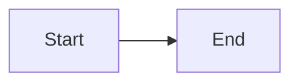

# Inside .NET — Episode NN
## Chapter Title Goes Here

> *Part N — Part Name*

---

<!-- Chapter cover: images/NNN-cover.png, source at diagrams/svg/NNN-cover.svg (duplicate assets/brand/chapter-cover-template.svg) -->

### Learning Objectives

By the end of this chapter, you will be able to:
- Objective one
- Objective two
- Objective three

### Real-world Analogy

<!-- A fresh analogy. Never reuse one from another chapter. It should survive being pushed on. -->

### Problem Statement

<!-- Why does this concept exist? What breaks or gets harder without it? -->

### Visual Explanation

<!-- 3-5 original diagrams. Author as Mermaid inline here AND save source under diagrams/mermaid/. -->

#### 1. Diagram title



### Under the Hood

<!-- The actual CLR/BCL/framework mechanics. Precise, correct, no folklore. -->

### Code Example

<!-- Four-tier progression: Example -> Advanced Example -> Performance Example -> Production Example. Not every chapter needs all four; at minimum Example + one deeper tier. -->

```csharp
// Example
```

### Performance Notes

<!-- Cost, measurement approach, benchmark data where relevant. -->

### Common Mistakes / Anti-Patterns

<!-- The ones that actually show up in code review. -->

### Architect's Perspective

**Developer Perspective**
<!-- How do I use this correctly, today. -->

**Senior Perspective**
<!-- When does this choice matter; what does it trade off against; what bites a team in review. -->

**Architect Perspective**
<!-- How this propagates across a system: scalability, maintainability, team conventions, migration cost, how Microsoft implements/recommends it. -->

### Interview Questions

**Q1: ...**
A: ...

### Quiz

1. Question one

<details>
<summary>Answers</summary>

1. Answer one

</details>

### Key Takeaways

- Takeaway one

### What's Next

[Episode NN+1 — Next Chapter Title](../NNN-next-slug/article.md)
